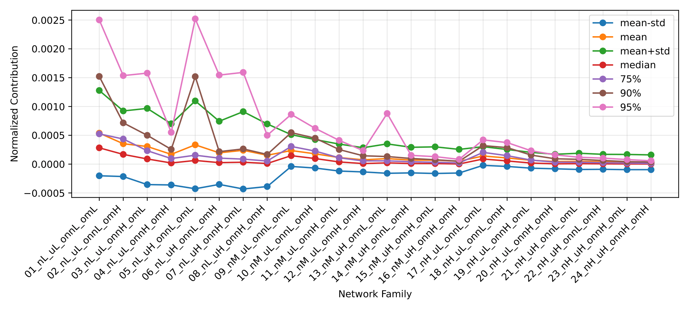
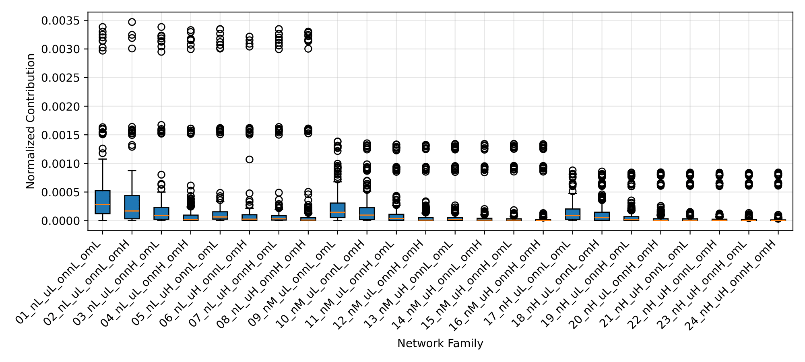
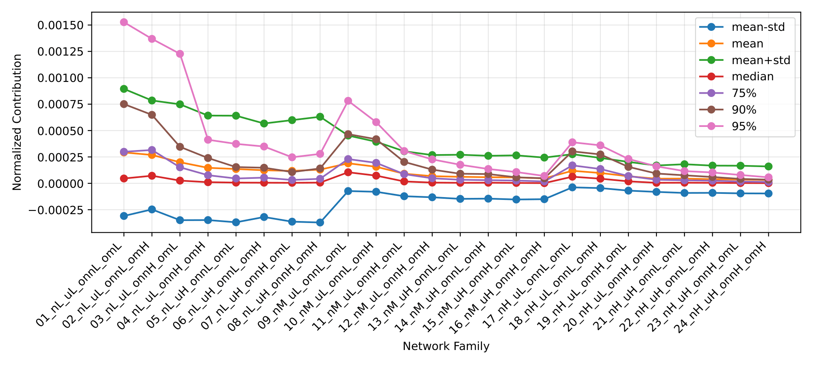
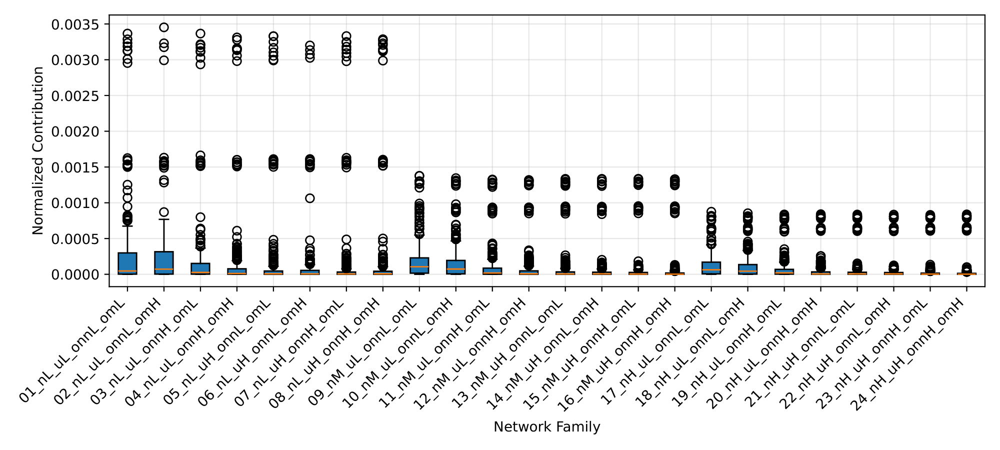
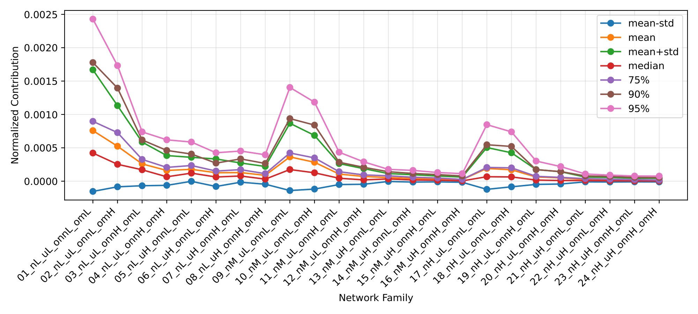
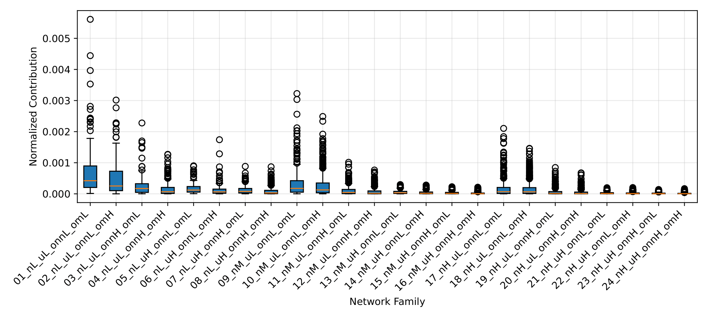
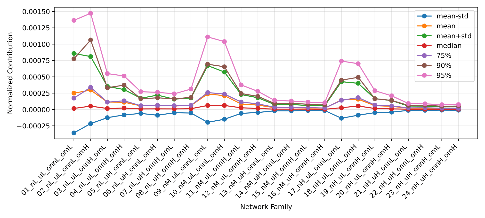
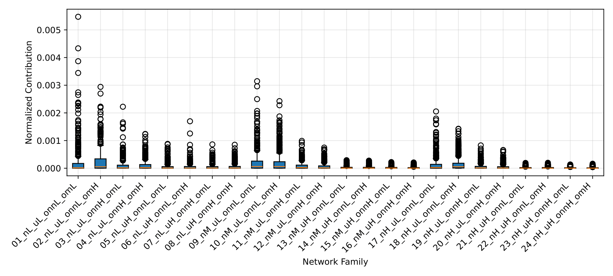

# Report 1 - Question: Does the relative contribution to data scatter provide a good hyperparameter for the definition of the stop rules under variations in the structure/architecture parameters of LFR synthetic networks?

---

## LFR Network Parameterization

- $\overline{d}$ = 20
- $d_{max}$ = 50
- $c_{min}$ = 20
- $c_{max}$ = 100
- $t1$ = -2
- $t2$ = -1
- $n$ (3 groups):
  - L: [200, 400] (*[1000, 3000])
  - M: [500, 700] (*[4000, 6000])
  - H: [800, 1000] (*[7000, 10000])
- $\mu$ (2 groups) (*3 groups):
  - L: [0.1, 0.4]
  - H: [0.5, 0.8]
- $o_{n}$ / $n$ (2 groups) (*3 groups):
  - L: [0.1, 0.3]
  - H: [0.4, 0.6]
- $o_{m}$ (2 groups) (*3 groups):
  - L: [2, 4]
  - H: [5, 8]

## Network Families

| Network Family    | $n$         | $\mu$      | $o_{n}$/$n$  | $o_{m}$  |
|-------------------|-------------|------------|--------------|----------|
| 01_nL_uL_onnL_omL | [200, 400]  | [0.1, 0.4] | [0.1, 0.3]   | [2, 4]   |
| 02_nL_uL_onnL_omH | [200, 400]  | [0.1, 0.4] | [0.1, 0.3]   | [5, 8]   |
| 03_nL_uL_onnH_omL | [200, 400]  | [0.1, 0.4] | [0.4, 0.6]   | [2, 4]   |
| 04_nL_uL_onnH_omH | [200, 400]  | [0.1, 0.4] | [0.4, 0.6]   | [5, 8]   |
| 05_nL_uH_onnL_omL | [200, 400]  | [0.5, 0.8] | [0.1, 0.3]   | [2, 4]   |
| 06_nL_uH_onnL_omH | [200, 400]  | [0.5, 0.8] | [0.1, 0.3]   | [5, 8]   |
| 07_nL_uH_onnH_omL | [200, 400]  | [0.5, 0.8] | [0.4, 0.6]   | [2, 4]   |
| 08_nL_uH_onnH_omH | [200, 400]  | [0.5, 0.8] | [0.4, 0.6]   | [5, 8]   |
| 09_nM_uL_onnL_omL | [500, 700]  | [0.1, 0.4] | [0.1, 0.3]   | [2, 4]   |
| 10_nM_uL_onnL_omH | [500, 700]  | [0.1, 0.4] | [0.1, 0.3]   | [5, 8]   |
| 11_nM_uL_onnH_omL | [500, 700]  | [0.1, 0.4] | [0.4, 0.6]   | [2, 4]   |
| 12_nM_uL_onnH_omH | [500, 700]  | [0.1, 0.4] | [0.4, 0.6]   | [5, 8]   |
| 13_nM_uH_onnL_omL | [500, 700]  | [0.5, 0.8] | [0.1, 0.3]   | [2, 4]   |
| 14_nM_uH_onnL_omH | [500, 700]  | [0.5, 0.8] | [0.1, 0.3]   | [5, 8]   |
| 15_nM_uH_onnH_omL | [500, 700]  | [0.5, 0.8] | [0.4, 0.6]   | [2, 4]   |
| 16_nM_uH_onnH_omH | [500, 700]  | [0.5, 0.8] | [0.4, 0.6]   | [5, 8]   |
| 17_nH_uL_onnL_omL | [800, 1000] | [0.1, 0.4] | [0.1, 0.3]   | [2, 4]   |
| 18_nH_uL_onnL_omH | [800, 1000] | [0.1, 0.4] | [0.1, 0.3]   | [5, 8]   |
| 19_nH_uL_onnH_omL | [800, 1000] | [0.1, 0.4] | [0.4, 0.6]   | [2, 4]   |
| 20_nH_uL_onnH_omH | [800, 1000] | [0.1, 0.4] | [0.4, 0.6]   | [5, 8]   |
| 21_nH_uH_onnL_omL | [800, 1000] | [0.5, 0.8] | [0.1, 0.3]   | [2, 4]   |
| 22_nH_uH_onnL_omH | [800, 1000] | [0.5, 0.8] | [0.1, 0.3]   | [5, 8]   |
| 23_nH_uH_onnH_omL | [800, 1000] | [0.5, 0.8] | [0.4, 0.6]   | [2, 4]   |
| 24_nH_uH_onnH_omH | [800, 1000] | [0.5, 0.8] | [0.4, 0.6]   | [5, 8]   |

## Networks for Each Network Family

- $\overline{d}$: fixed
- $d_{max}$: fixed
- $c_{min}$: fixed
- $c_{max}$: fixed
- $t1$: fixed
- $t2$: fixed
- $n$: step 200 (*100)
- $\mu$: step 0.3 (*0.1)
- $o_{n}$/$n$: step 0.2 (*0.1)
- $o_{m}$: step 2 or 3 (*1)
- Instances: 1 (*10)

---

## Scripts

### Script 1

- Stage 1 (obtain candidate thresholds)
  1. Choose the execution configuration: i) LAPIN-off or ii) LAPIN-on; and i) extraction of K desired clusters or ii) extraction of clusters until the end;
  2. For each network in each network family, execute FADDIS using the default input matrix and the selected configuration;
     Exceptionally, when the configuration is LAPIN-off and extraction of K desired clusters, the script extracts K + 1 clusters due to the conditional removal of the first extracted cluster, which may behave as a global/background component;
  3. Register the raw contribution values in the order in which they are extracted;
  4. Normalize the contributions by dividing each contribution value by the "universe", i.e., the sum of all contributions from all networks in all families. The normalized values are stored with 6 decimal places;
  5. Draw one line plot for each network, showing the normalized contribution by extraction number and highlighting the contribution at K;
  6. Create a table of statistics with statistical metrics for each network family, using 6 decimal places;
  7. Draw one histogram for each network family, showing the frequency distribution of the normalized contributions;
  8. Draw a line plot of the normalized contributions for each network family, with one line for each statistical metric;
  9. Draw a box plot of the normalized contributions for each network family;
  10. Create a table of candidate thresholds based on the statistical metrics;

- Stage 2 (Choose one of the candidate thresholds)
  11. Load the candidate thresholds obtained in Stage 1;
  12. For each network family, repeatedly generate bootstrap subsamples of networks by pseudo-random resampling with replacement;
  13. In each bootstrap repetition:
      - Gather the raw contributions of the sampled networks;
      - Normalize the sampled contributions by dividing each contribution value by the "universe", i.e., the sum of the contributions in that bootstrap subsample;
      - Compute the thresholds for the network family using the same statistical metrics adopted in Stage 1;
      - For each statistical metric, compare the candidate threshold with the threshold computed for the bootstrap subsample using the squared error;
  14. After the defined number of bootstrap repetitions, compute the mean squared error (MSE) of each metric;
  15. Create a table of bootstrap statistics;
  16. For each network family, select the threshold metric with the lowest MSE, that is, the one that shows the greatest stability and robustness under bootstrap resampling;
  17. Create a table with the selected threshold for each network family.

### Script 2

- Stage 1 (test thresholds)
  1. Adopt the same execution configuration used in Script 1: i) LAPIN-off or ii) LAPIN-on;
  2. Execute FADDIS on the same networks as in Script 1, using the threshold as `epsilon` (FADDIS's individual cluster contribution);
  3. Apply a defuzzification step with the default `gamma` of 0.5;
  4. Compute the extrinsic evaluation measures for each network;
  5. Draw line plots for each network family showing the evaluation metrics by network.

---

## Experience 1 (LAPIN-off + Extraction of K desired clusters)

### Contributions Line Plots

[Open Folder](../results/experience1_local/results_2026-03-18_11-18-43-453387)

### Statistics

| Network Family    | #Networks | Mean     | Std      | Median   | 75%      | 90%      | 95%      | Min   | Max      |
|-------------------|-----------|----------|----------|----------|----------|----------|----------|-------|----------|
| 01_nL_uL_onnL_omL | 16        | 0.000538 | 0.00074  | 0.000283 | 0.000525 | 0.001522 | 0.002502 | 1e-06 | 0.003384 |
| 02_nL_uL_onnL_omH | 12        | 0.000354 | 0.000569 | 0.000169 | 0.000436 | 0.000716 | 0.001536 | 0.0   | 0.003471 |
| 03_nL_uL_onnH_omL | 16        | 0.000306 | 0.000661 | 9e-05    | 0.000233 | 0.0005   | 0.001579 | 0.0   | 0.003384 |
| 04_nL_uL_onnH_omH | 16        | 0.00017  | 0.000531 | 2e-05    | 9.7e-05  | 0.000256 | 0.000551 | 0.0   | 0.00333  |
| 05_nL_uH_onnL_omL | 16        | 0.000335 | 0.000762 | 6.4e-05  | 0.000155 | 0.001519 | 0.002521 | 1e-06 | 0.003347 |
| 06_nL_uH_onnL_omH | 12        | 0.000196 | 0.000548 | 2.6e-05  | 0.000104 | 0.000217 | 0.001545 | 0.0   | 0.003216 |
| 07_nL_uH_onnH_omL | 16        | 0.00024  | 0.000671 | 3.3e-05  | 8.7e-05  | 0.000264 | 0.001592 | 0.0   | 0.003348 |
| 08_nL_uH_onnH_omH | 16        | 0.000154 | 0.000543 | 1.1e-05  | 5.4e-05  | 0.000168 | 0.0005   | 0.0   | 0.003304 |
| 09_nM_uL_onnL_omL | 16        | 0.000236 | 0.000276 | 0.000147 | 0.000307 | 0.000547 | 0.000863 | 0.0   | 0.001384 |
| 10_nM_uL_onnL_omH | 16        | 0.000179 | 0.000247 | 9.7e-05  | 0.000226 | 0.00045  | 0.000621 | 0.0   | 0.001352 |
| 11_nM_uL_onnH_omL | 16        | 0.000114 | 0.000234 | 3.8e-05  | 0.00011  | 0.000253 | 0.000412 | 0.0   | 0.001333 |
| 12_nM_uL_onnH_omH | 16        | 7.5e-05  | 0.00021  | 1e-05    | 5.6e-05  | 0.000145 | 0.000235 | 0.0   | 0.001326 |
| 13_nM_uH_onnL_omL | 16        | 9.6e-05  | 0.000255 | 2.2e-05  | 5.7e-05  | 0.000132 | 0.000879 | 0.0   | 0.001342 |
| 14_nM_uH_onnL_omH | 16        | 7e-05    | 0.000222 | 1e-05    | 4.1e-05  | 9.8e-05  | 0.000152 | 0.0   | 0.001342 |
| 15_nM_uH_onnH_omL | 16        | 6.9e-05  | 0.000231 | 1e-05    | 3.3e-05  | 7.6e-05  | 0.00013  | 0.0   | 0.001343 |
| 16_nM_uH_onnH_omH | 16        | 5.1e-05  | 0.000205 | 3e-06    | 2.1e-05  | 5e-05    | 8.3e-05  | 0.0   | 0.001337 |
| 17_nH_uL_onnL_omL | 16        | 0.000141 | 0.000162 | 8.9e-05  | 0.000204 | 0.000321 | 0.000421 | 0.0   | 0.000879 |
| 18_nH_uL_onnL_omH | 16        | 0.000107 | 0.000147 | 5.5e-05  | 0.000147 | 0.000287 | 0.000374 | 0.0   | 0.000859 |
| 19_nH_uL_onnH_omL | 16        | 6.7e-05  | 0.000137 | 1.9e-05  | 7e-05    | 0.000157 | 0.000232 | 0.0   | 0.000842 |
| 20_nH_uL_onnH_omH | 16        | 4.5e-05  | 0.000126 | 5e-06    | 3.4e-05  | 9.3e-05  | 0.000161 | 0.0   | 0.000845 |
| 21_nH_uH_onnL_omL | 16        | 4.8e-05  | 0.000141 | 8e-06    | 3.3e-05  | 8.3e-05  | 0.000119 | 0.0   | 0.000841 |
| 22_nH_uH_onnL_omH | 16        | 4e-05    | 0.00013  | 5e-06    | 2.5e-05  | 6.3e-05  | 0.000104 | 0.0   | 0.000839 |
| 23_nH_uH_onnH_omL | 16        | 3.6e-05  | 0.000132 | 3e-06    | 1.8e-05  | 4.3e-05  | 7.9e-05  | 0.0   | 0.000835 |
| 24_nH_uH_onnH_omH | 16        | 3.2e-05  | 0.000128 | 2e-06    | 1.3e-05  | 3.6e-05  | 5.8e-05  | 0.0   | 0.000842 |

- #Total Networks: 376

### Histograms

[Open Folder](../results/experience1_local/results_2026-03-18_11-18-43-453387)

### Line plot

### Box plot

### Candidate Thresholds

| Network Family    | Mean-Std  | Mean     | Mean+Std | Median   | 75%      | 90%      | 95%      |
|-------------------|-----------|----------|----------|----------|----------|----------|----------|
| 01_nL_uL_onnL_omL | -0.000202 | 0.000538 | 0.001278 | 0.000283 | 0.000525 | 0.001522 | 0.002502 |
| 02_nL_uL_onnL_omH | -0.000215 | 0.000354 | 0.000923 | 0.000169 | 0.000436 | 0.000716 | 0.001536 |
| 03_nL_uL_onnH_omL | -0.000355 | 0.000306 | 0.000967 | 9e-05    | 0.000233 | 0.0005   | 0.001579 |
| 04_nL_uL_onnH_omH | -0.000361 | 0.00017  | 0.000701 | 2e-05    | 9.7e-05  | 0.000256 | 0.000551 |
| 05_nL_uH_onnL_omL | -0.000427 | 0.000335 | 0.001097 | 6.4e-05  | 0.000155 | 0.001519 | 0.002521 |
| 06_nL_uH_onnL_omH | -0.000352 | 0.000196 | 0.000744 | 2.6e-05  | 0.000104 | 0.000217 | 0.001545 |
| 07_nL_uH_onnH_omL | -0.000431 | 0.00024  | 0.000911 | 3.3e-05  | 8.7e-05  | 0.000264 | 0.001592 |
| 08_nL_uH_onnH_omH | -0.000389 | 0.000154 | 0.000697 | 1.1e-05  | 5.4e-05  | 0.000168 | 0.0005   |
| 09_nM_uL_onnL_omL | -4e-05    | 0.000236 | 0.000512 | 0.000147 | 0.000307 | 0.000547 | 0.000863 |
| 10_nM_uL_onnL_omH | -6.8e-05  | 0.000179 | 0.000426 | 9.7e-05  | 0.000226 | 0.00045  | 0.000621 |
| 11_nM_uL_onnH_omL | -0.00012  | 0.000114 | 0.000348 | 3.8e-05  | 0.00011  | 0.000253 | 0.000412 |
| 12_nM_uL_onnH_omH | -0.000135 | 7.5e-05  | 0.000285 | 1e-05    | 5.6e-05  | 0.000145 | 0.000235 |
| 13_nM_uH_onnL_omL | -0.000159 | 9.6e-05  | 0.000351 | 2.2e-05  | 5.7e-05  | 0.000132 | 0.000879 |
| 14_nM_uH_onnL_omH | -0.000152 | 7e-05    | 0.000292 | 1e-05    | 4.1e-05  | 9.8e-05  | 0.000152 |
| 15_nM_uH_onnH_omL | -0.000162 | 6.9e-05  | 0.0003   | 1e-05    | 3.3e-05  | 7.6e-05  | 0.00013  |
| 16_nM_uH_onnH_omH | -0.000154 | 5.1e-05  | 0.000256 | 3e-06    | 2.1e-05  | 5e-05    | 8.3e-05  |
| 17_nH_uL_onnL_omL | -2.1e-05  | 0.000141 | 0.000303 | 8.9e-05  | 0.000204 | 0.000321 | 0.000421 |
| 18_nH_uL_onnL_omH | -4e-05    | 0.000107 | 0.000254 | 5.5e-05  | 0.000147 | 0.000287 | 0.000374 |
| 19_nH_uL_onnH_omL | -7e-05    | 6.7e-05  | 0.000204 | 1.9e-05  | 7e-05    | 0.000157 | 0.000232 |
| 20_nH_uL_onnH_omH | -8.1e-05  | 4.5e-05  | 0.000171 | 5e-06    | 3.4e-05  | 9.3e-05  | 0.000161 |
| 21_nH_uH_onnL_omL | -9.3e-05  | 4.8e-05  | 0.000189 | 8e-06    | 3.3e-05  | 8.3e-05  | 0.000119 |
| 22_nH_uH_onnL_omH | -9e-05    | 4e-05    | 0.00017  | 5e-06    | 2.5e-05  | 6.3e-05  | 0.000104 |
| 23_nH_uH_onnH_omL | -9.6e-05  | 3.6e-05  | 0.000168 | 3e-06    | 1.8e-05  | 4.3e-05  | 7.9e-05  |
| 24_nH_uH_onnH_omH | -9.6e-05  | 3.2e-05  | 0.00016  | 2e-06    | 1.3e-05  | 3.6e-05  | 5.8e-05  |

### Bootstrap Statistics

| Network Family    | #Networks | Subsample Size | #Bootstraps | Metric   | Candidate Threshold | MSE            |
|-------------------|-----------|----------------|-------------|----------|---------------------|----------------|
| 01_nL_uL_onnL_omL | 16        | 13             | 1000        | Mean-Std | -0.000202           | 9.775711e-06   |
| 01_nL_uL_onnL_omL | 16        | 13             | 1000        | Mean     | 0.000538            | 6.4315127e-05  |
| 01_nL_uL_onnL_omL | 16        | 13             | 1000        | Mean+Std | 0.001278            | 0.000358358568 |
| 01_nL_uL_onnL_omL | 16        | 13             | 1000        | Median   | 0.000283            | 1.8752611e-05  |
| 01_nL_uL_onnL_omL | 16        | 13             | 1000        | 75%      | 0.000525            | 6.8928912e-05  |
| 01_nL_uL_onnL_omL | 16        | 13             | 1000        | 90%      | 0.001522            | 0.000468856879 |
| 01_nL_uL_onnL_omL | 16        | 13             | 1000        | 95%      | 0.002502            | 0.001307093188 |
| 02_nL_uL_onnL_omH | 12        | 10             | 1000        | Mean-Std | -0.000215           | 1.6037575e-05  |
| 02_nL_uL_onnL_omH | 12        | 10             | 1000        | Mean     | 0.000354            | 4.1952181e-05  |
| 02_nL_uL_onnL_omH | 12        | 10             | 1000        | Mean+Std | 0.000923            | 0.00027808039  |
| 02_nL_uL_onnL_omH | 12        | 10             | 1000        | Median   | 0.000169            | 1.0850086e-05  |
| 02_nL_uL_onnL_omH | 12        | 10             | 1000        | 75%      | 0.000436            | 5.9720425e-05  |
| 02_nL_uL_onnL_omH | 12        | 10             | 1000        | 90%      | 0.000716            | 0.000195990444 |
| 02_nL_uL_onnL_omH | 12        | 10             | 1000        | 95%      | 0.001536            | 0.000804668216 |
| 03_nL_uL_onnH_omL | 16        | 13             | 1000        | Mean-Std | -0.000355           | 4.5842611e-05  |
| 03_nL_uL_onnH_omL | 16        | 13             | 1000        | Mean     | 0.000306            | 3.6069713e-05  |
| 03_nL_uL_onnH_omL | 16        | 13             | 1000        | Mean+Std | 0.000967            | 0.000349502871 |
| 03_nL_uL_onnH_omL | 16        | 13             | 1000        | Median   | 9e-05               | 4.099895e-06   |
| 03_nL_uL_onnH_omL | 16        | 13             | 1000        | 75%      | 0.000233            | 2.0722477e-05  |
| 03_nL_uL_onnH_omL | 16        | 13             | 1000        | 90%      | 0.0005              | 0.00012237456  |
| 03_nL_uL_onnH_omL | 16        | 13             | 1000        | 95%      | 0.001579            | 0.001427936824 |
| 04_nL_uL_onnH_omH | 16        | 13             | 1000        | Mean-Std | -0.000361           | 5.5467818e-05  |
| 04_nL_uL_onnH_omH | 16        | 13             | 1000        | Mean     | 0.00017             | 1.2736865e-05  |
| 04_nL_uL_onnH_omH | 16        | 13             | 1000        | Mean+Std | 0.000701            | 0.000212006853 |
| 04_nL_uL_onnH_omH | 16        | 13             | 1000        | Median   | 2e-05               | 2.2665e-07     |
| 04_nL_uL_onnH_omH | 16        | 13             | 1000        | 75%      | 9.7e-05             | 4.115031e-06   |
| 04_nL_uL_onnH_omH | 16        | 13             | 1000        | 90%      | 0.000256            | 2.8146394e-05  |
| 04_nL_uL_onnH_omH | 16        | 13             | 1000        | 95%      | 0.000551            | 0.000257527825 |
| 05_nL_uH_onnL_omL | 16        | 13             | 1000        | Mean-Std | -0.000427           | 0.000100798738 |
| 05_nL_uH_onnL_omL | 16        | 13             | 1000        | Mean     | 0.000335            | 6.7587683e-05  |
| 05_nL_uH_onnL_omL | 16        | 13             | 1000        | Mean+Std | 0.001097            | 0.0006982588   |
| 05_nL_uH_onnL_omL | 16        | 13             | 1000        | Median   | 6.4e-05             | 3.030631e-06   |
| 05_nL_uH_onnL_omL | 16        | 13             | 1000        | 75%      | 0.000155            | 1.6837218e-05  |
| 05_nL_uH_onnL_omL | 16        | 13             | 1000        | 90%      | 0.001519            | 0.00094653178  |
| 05_nL_uH_onnL_omL | 16        | 13             | 1000        | 95%      | 0.002521            | 0.003286539272 |
| 06_nL_uH_onnL_omH | 12        | 10             | 1000        | Mean-Std | -0.000352           | 0.000128921777 |
| 06_nL_uH_onnL_omH | 12        | 10             | 1000        | Mean     | 0.000196            | 4.3070728e-05  |
| 06_nL_uH_onnL_omH | 12        | 10             | 1000        | Mean+Std | 0.000744            | 0.000597031611 |
| 06_nL_uH_onnL_omH | 12        | 10             | 1000        | Median   | 2.6e-05             | 1.457274e-06   |
| 06_nL_uH_onnL_omH | 12        | 10             | 1000        | 75%      | 0.000104            | 1.2692554e-05  |
| 06_nL_uH_onnL_omH | 12        | 10             | 1000        | 90%      | 0.000217            | 7.0338414e-05  |
| 06_nL_uH_onnL_omH | 12        | 10             | 1000        | 95%      | 0.001545            | 0.002666576212 |
| 07_nL_uH_onnH_omL | 16        | 13             | 1000        | Mean-Std | -0.000431           | 0.000110927825 |
| 07_nL_uH_onnH_omL | 16        | 13             | 1000        | Mean     | 0.00024             | 3.685992e-05   |
| 07_nL_uH_onnH_omL | 16        | 13             | 1000        | Mean+Std | 0.000911            | 0.000512217562 |
| 07_nL_uH_onnH_omL | 16        | 13             | 1000        | Median   | 3.3e-05             | 7.93895e-07    |
| 07_nL_uH_onnH_omL | 16        | 13             | 1000        | 75%      | 8.7e-05             | 5.597256e-06   |
| 07_nL_uH_onnH_omL | 16        | 13             | 1000        | 90%      | 0.000264            | 8.7385373e-05  |
| 07_nL_uH_onnH_omL | 16        | 13             | 1000        | 95%      | 0.001592            | 0.002327644699 |
| 08_nL_uH_onnH_omH | 16        | 13             | 1000        | Mean-Std | -0.000389           | 8.45825e-05    |
| 08_nL_uH_onnH_omH | 16        | 13             | 1000        | Mean     | 0.000154            | 1.3812034e-05  |
| 08_nL_uH_onnH_omH | 16        | 13             | 1000        | Mean+Std | 0.000697            | 0.000276076053 |
| 08_nL_uH_onnH_omH | 16        | 13             | 1000        | Median   | 1.1e-05             | 8.5245e-08     |
| 08_nL_uH_onnH_omH | 16        | 13             | 1000        | 75%      | 5.4e-05             | 1.999962e-06   |
| 08_nL_uH_onnH_omH | 16        | 13             | 1000        | 90%      | 0.000168            | 1.5757206e-05  |
| 08_nL_uH_onnH_omH | 16        | 13             | 1000        | 95%      | 0.0005              | 0.000435267165 |
| 09_nM_uL_onnL_omL | 16        | 13             | 1000        | Mean-Std | -4e-05              | 7.30686e-07    |
| 09_nM_uL_onnL_omL | 16        | 13             | 1000        | Mean     | 0.000236            | 1.753096e-05   |
| 09_nM_uL_onnL_omL | 16        | 13             | 1000        | Mean+Std | 0.000512            | 8.2044657e-05  |
| 09_nM_uL_onnL_omL | 16        | 13             | 1000        | Median   | 0.000147            | 7.099092e-06   |
| 09_nM_uL_onnL_omL | 16        | 13             | 1000        | 75%      | 0.000307            | 2.7924301e-05  |
| 09_nM_uL_onnL_omL | 16        | 13             | 1000        | 90%      | 0.000547            | 9.2525432e-05  |
| 09_nM_uL_onnL_omL | 16        | 13             | 1000        | 95%      | 0.000863            | 0.000245449076 |
| 10_nM_uL_onnL_omH | 16        | 13             | 1000        | Mean-Std | -6.8e-05            | 1.662147e-06   |
| 10_nM_uL_onnL_omH | 16        | 13             | 1000        | Mean     | 0.000179            | 9.632508e-06   |
| 10_nM_uL_onnL_omH | 16        | 13             | 1000        | Mean+Std | 0.000426            | 5.4305713e-05  |
| 10_nM_uL_onnL_omH | 16        | 13             | 1000        | Median   | 9.7e-05             | 3.107284e-06   |
| 10_nM_uL_onnL_omH | 16        | 13             | 1000        | 75%      | 0.000226            | 1.5618575e-05  |
| 10_nM_uL_onnL_omH | 16        | 13             | 1000        | 90%      | 0.00045             | 5.3660713e-05  |
| 10_nM_uL_onnL_omH | 16        | 13             | 1000        | 95%      | 0.000621            | 0.000109861789 |
| 11_nM_uL_onnH_omL | 16        | 13             | 1000        | Mean-Std | -0.00012            | 1.3732752e-05  |
| 11_nM_uL_onnH_omL | 16        | 13             | 1000        | Mean     | 0.000114            | 1.1859846e-05  |
| 11_nM_uL_onnH_omL | 16        | 13             | 1000        | Mean+Std | 0.000348            | 0.00011116393  |
| 11_nM_uL_onnH_omL | 16        | 13             | 1000        | Median   | 3.8e-05             | 1.324561e-06   |
| 11_nM_uL_onnH_omL | 16        | 13             | 1000        | 75%      | 0.00011             | 1.193449e-05   |
| 11_nM_uL_onnH_omL | 16        | 13             | 1000        | 90%      | 0.000253            | 5.0668729e-05  |
| 11_nM_uL_onnH_omL | 16        | 13             | 1000        | 95%      | 0.000412            | 0.000154187408 |
| 12_nM_uL_onnH_omH | 16        | 13             | 1000        | Mean-Std | -0.000135           | 2.4809377e-05  |
| 12_nM_uL_onnH_omH | 16        | 13             | 1000        | Mean     | 7.5e-05             | 7.363548e-06   |
| 12_nM_uL_onnH_omH | 16        | 13             | 1000        | Mean+Std | 0.000285            | 0.000107877305 |
| 12_nM_uL_onnH_omH | 16        | 13             | 1000        | Median   | 1e-05               | 1.50318e-07    |
| 12_nM_uL_onnH_omH | 16        | 13             | 1000        | 75%      | 5.6e-05             | 4.161804e-06   |
| 12_nM_uL_onnH_omH | 16        | 13             | 1000        | 90%      | 0.000145            | 2.7553814e-05  |
| 12_nM_uL_onnH_omH | 16        | 13             | 1000        | 95%      | 0.000235            | 6.9340314e-05  |
| 13_nM_uH_onnL_omL | 16        | 13             | 1000        | Mean-Std | -0.000159           | 5.0277767e-05  |
| 13_nM_uH_onnL_omL | 16        | 13             | 1000        | Mean     | 9.6e-05             | 1.8828766e-05  |
| 13_nM_uH_onnL_omL | 16        | 13             | 1000        | Mean+Std | 0.000351            | 0.000247739307 |
| 13_nM_uH_onnL_omL | 16        | 13             | 1000        | Median   | 2.2e-05             | 1.06736e-06    |
| 13_nM_uH_onnL_omL | 16        | 13             | 1000        | 75%      | 5.7e-05             | 6.82962e-06    |
| 13_nM_uH_onnL_omL | 16        | 13             | 1000        | 90%      | 0.000132            | 3.6592206e-05  |
| 13_nM_uH_onnL_omL | 16        | 13             | 1000        | 95%      | 0.000879            | 0.001398419193 |
| 14_nM_uH_onnL_omH | 16        | 13             | 1000        | Mean-Std | -0.000152           | 4.7059686e-05  |
| 14_nM_uH_onnL_omH | 16        | 13             | 1000        | Mean     | 7e-05               | 1.0236802e-05  |
| 14_nM_uH_onnL_omH | 16        | 13             | 1000        | Mean+Std | 0.000292            | 0.000175155398 |
| 14_nM_uH_onnL_omH | 16        | 13             | 1000        | Median   | 1e-05               | 2.4583e-07     |
| 14_nM_uH_onnL_omH | 16        | 13             | 1000        | 75%      | 4.1e-05             | 3.734044e-06   |
| 14_nM_uH_onnL_omH | 16        | 13             | 1000        | 90%      | 9.8e-05             | 1.8790184e-05  |
| 14_nM_uH_onnL_omH | 16        | 13             | 1000        | 95%      | 0.000152            | 5.2770816e-05  |
| 15_nM_uH_onnH_omL | 16        | 13             | 1000        | Mean-Std | -0.000162           | 6.4232862e-05  |
| 15_nM_uH_onnH_omL | 16        | 13             | 1000        | Mean     | 6.9e-05             | 1.1903095e-05  |
| 15_nM_uH_onnH_omL | 16        | 13             | 1000        | Mean+Std | 0.0003              | 0.000222195057 |
| 15_nM_uH_onnH_omL | 16        | 13             | 1000        | Median   | 1e-05               | 2.47156e-07    |
| 15_nM_uH_onnH_omL | 16        | 13             | 1000        | 75%      | 3.3e-05             | 2.772646e-06   |
| 15_nM_uH_onnH_omL | 16        | 13             | 1000        | 90%      | 7.6e-05             | 1.3348665e-05  |
| 15_nM_uH_onnH_omL | 16        | 13             | 1000        | 95%      | 0.00013             | 9.2682377e-05  |
| 16_nM_uH_onnH_omH | 16        | 13             | 1000        | Mean-Std | -0.000154           | 6.2591759e-05  |
| 16_nM_uH_onnH_omH | 16        | 13             | 1000        | Mean     | 5.1e-05             | 7.00866e-06    |
| 16_nM_uH_onnH_omH | 16        | 13             | 1000        | Mean+Std | 0.000256            | 0.000174329454 |
| 16_nM_uH_onnH_omH | 16        | 13             | 1000        | Median   | 3e-06               | 2.7942e-08     |
| 16_nM_uH_onnH_omH | 16        | 13             | 1000        | 75%      | 2.1e-05             | 1.203319e-06   |
| 16_nM_uH_onnH_omH | 16        | 13             | 1000        | 90%      | 5e-05               | 6.715056e-06   |
| 16_nM_uH_onnH_omH | 16        | 13             | 1000        | 95%      | 8.3e-05             | 1.7969992e-05  |
| 17_nH_uL_onnL_omL | 16        | 13             | 1000        | Mean-Std | -2.1e-05            | 3.5254e-07     |
| 17_nH_uL_onnL_omL | 16        | 13             | 1000        | Mean     | 0.000141            | 7.850037e-06   |
| 17_nH_uL_onnL_omL | 16        | 13             | 1000        | Mean+Std | 0.000303            | 3.6465852e-05  |
| 17_nH_uL_onnL_omL | 16        | 13             | 1000        | Median   | 8.9e-05             | 3.413035e-06   |
| 17_nH_uL_onnL_omL | 16        | 13             | 1000        | 75%      | 0.000204            | 1.547893e-05   |
| 17_nH_uL_onnL_omL | 16        | 13             | 1000        | 90%      | 0.000321            | 4.1004645e-05  |
| 17_nH_uL_onnL_omL | 16        | 13             | 1000        | 95%      | 0.000421            | 7.0782808e-05  |
| 18_nH_uL_onnL_omH | 16        | 13             | 1000        | Mean-Std | -4e-05              | 7.46649e-07    |
| 18_nH_uL_onnL_omH | 16        | 13             | 1000        | Mean     | 0.000107            | 4.41818e-06    |
| 18_nH_uL_onnL_omH | 16        | 13             | 1000        | Mean+Std | 0.000254            | 2.4986057e-05  |
| 18_nH_uL_onnL_omH | 16        | 13             | 1000        | Median   | 5.5e-05             | 1.243195e-06   |
| 18_nH_uL_onnL_omH | 16        | 13             | 1000        | 75%      | 0.000147            | 8.439025e-06   |
| 18_nH_uL_onnL_omH | 16        | 13             | 1000        | 90%      | 0.000287            | 2.9085281e-05  |
| 18_nH_uL_onnL_omH | 16        | 13             | 1000        | 95%      | 0.000374            | 5.2517536e-05  |
| 19_nH_uL_onnH_omL | 16        | 13             | 1000        | Mean-Std | -7e-05              | 7.361608e-06   |
| 19_nH_uL_onnH_omL | 16        | 13             | 1000        | Mean     | 6.7e-05             | 6.528663e-06   |
| 19_nH_uL_onnH_omL | 16        | 13             | 1000        | Mean+Std | 0.000204            | 6.0697054e-05  |
| 19_nH_uL_onnH_omL | 16        | 13             | 1000        | Median   | 1.9e-05             | 5.43284e-07    |
| 19_nH_uL_onnH_omL | 16        | 13             | 1000        | 75%      | 7e-05               | 7.668873e-06   |
| 19_nH_uL_onnH_omL | 16        | 13             | 1000        | 90%      | 0.000157            | 3.6548555e-05  |
| 19_nH_uL_onnH_omL | 16        | 13             | 1000        | 95%      | 0.000232            | 7.6206357e-05  |
| 20_nH_uL_onnH_omH | 16        | 13             | 1000        | Mean-Std | -8.1e-05            | 1.7172431e-05  |
| 20_nH_uL_onnH_omH | 16        | 13             | 1000        | Mean     | 4.5e-05             | 4.968816e-06   |
| 20_nH_uL_onnH_omH | 16        | 13             | 1000        | Mean+Std | 0.000171            | 7.3700876e-05  |
| 20_nH_uL_onnH_omH | 16        | 13             | 1000        | Median   | 5e-06               | 7.836e-08      |
| 20_nH_uL_onnH_omH | 16        | 13             | 1000        | 75%      | 3.4e-05             | 2.888951e-06   |
| 20_nH_uL_onnH_omH | 16        | 13             | 1000        | 90%      | 9.3e-05             | 2.0887926e-05  |
| 20_nH_uL_onnH_omH | 16        | 13             | 1000        | 95%      | 0.000161            | 6.1195338e-05  |
| 21_nH_uH_onnL_omL | 16        | 13             | 1000        | Mean-Std | -9.3e-05            | 3.3617729e-05  |
| 21_nH_uH_onnL_omL | 16        | 13             | 1000        | Mean     | 4.8e-05             | 9.036639e-06   |
| 21_nH_uH_onnL_omL | 16        | 13             | 1000        | Mean+Std | 0.000189            | 0.000138943888 |
| 21_nH_uH_onnL_omL | 16        | 13             | 1000        | Median   | 8e-06               | 3.03515e-07    |
| 21_nH_uH_onnL_omL | 16        | 13             | 1000        | 75%      | 3.3e-05             | 4.323403e-06   |
| 21_nH_uH_onnL_omL | 16        | 13             | 1000        | 90%      | 8.3e-05             | 2.3417475e-05  |
| 21_nH_uH_onnL_omL | 16        | 13             | 1000        | 95%      | 0.000119            | 5.5008575e-05  |
| 22_nH_uH_onnL_omH | 16        | 13             | 1000        | Mean-Std | -9e-05              | 3.4509611e-05  |
| 22_nH_uH_onnL_omH | 16        | 13             | 1000        | Mean     | 4e-05               | 6.498487e-06   |
| 22_nH_uH_onnL_omH | 16        | 13             | 1000        | Mean+Std | 0.00017             | 0.000120069054 |
| 22_nH_uH_onnL_omH | 16        | 13             | 1000        | Median   | 5e-06               | 1.14884e-07    |
| 22_nH_uH_onnL_omH | 16        | 13             | 1000        | 75%      | 2.5e-05             | 2.824339e-06   |
| 22_nH_uH_onnL_omH | 16        | 13             | 1000        | 90%      | 6.3e-05             | 1.4457502e-05  |
| 22_nH_uH_onnL_omH | 16        | 13             | 1000        | 95%      | 0.000104            | 3.8476177e-05  |
| 23_nH_uH_onnH_omL | 16        | 13             | 1000        | Mean-Std | -9.6e-05            | 4.8245123e-05  |
| 23_nH_uH_onnH_omL | 16        | 13             | 1000        | Mean     | 3.6e-05             | 6.900367e-06   |
| 23_nH_uH_onnH_omL | 16        | 13             | 1000        | Mean+Std | 0.000168            | 0.000148683372 |
| 23_nH_uH_onnH_omL | 16        | 13             | 1000        | Median   | 3e-06               | 6.146e-08      |
| 23_nH_uH_onnH_omL | 16        | 13             | 1000        | 75%      | 1.8e-05             | 1.734117e-06   |
| 23_nH_uH_onnH_omL | 16        | 13             | 1000        | 90%      | 4.3e-05             | 1.0124618e-05  |
| 23_nH_uH_onnH_omL | 16        | 13             | 1000        | 95%      | 7.9e-05             | 3.1575125e-05  |
| 24_nH_uH_onnH_omH | 16        | 13             | 1000        | Mean-Std | -9.6e-05            | 5.3258146e-05  |
| 24_nH_uH_onnH_omH | 16        | 13             | 1000        | Mean     | 3.2e-05             | 5.987047e-06   |
| 24_nH_uH_onnH_omH | 16        | 13             | 1000        | Mean+Std | 0.00016             | 0.000148553159 |
| 24_nH_uH_onnH_omH | 16        | 13             | 1000        | Median   | 2e-06               | 3.0122e-08     |
| 24_nH_uH_onnH_omH | 16        | 13             | 1000        | 75%      | 1.3e-05             | 1.127581e-06   |
| 24_nH_uH_onnH_omH | 16        | 13             | 1000        | 90%      | 3.6e-05             | 7.384465e-06   |
| 24_nH_uH_onnH_omH | 16        | 13             | 1000        | 95%      | 5.8e-05             | 1.826925e-05   |

### Thresholds

| Network Family    | Selected Metric | Threshold |
|-------------------|-----------------|-----------|
| 01_nL_uL_onnL_omL | Mean-Std        | -0.000202 |
| 02_nL_uL_onnL_omH | Median          | 0.000169  |
| 03_nL_uL_onnH_omL | Median          | 9e-05     |
| 04_nL_uL_onnH_omH | Median          | 2e-05     |
| 05_nL_uH_onnL_omL | Median          | 6.4e-05   |
| 06_nL_uH_onnL_omH | Median          | 2.6e-05   |
| 07_nL_uH_onnH_omL | Median          | 3.3e-05   |
| 08_nL_uH_onnH_omH | Median          | 1.1e-05   |
| 09_nM_uL_onnL_omL | Mean-Std        | -4e-05    |
| 10_nM_uL_onnL_omH | Mean-Std        | -6.8e-05  |
| 11_nM_uL_onnH_omL | Median          | 3.8e-05   |
| 12_nM_uL_onnH_omH | Median          | 1e-05     |
| 13_nM_uH_onnL_omL | Median          | 2.2e-05   |
| 14_nM_uH_onnL_omH | Median          | 1e-05     |
| 15_nM_uH_onnH_omL | Median          | 1e-05     |
| 16_nM_uH_onnH_omH | Median          | 3e-06     |
| 17_nH_uL_onnL_omL | Mean-Std        | -2.1e-05  |
| 18_nH_uL_onnL_omH | Mean-Std        | -4e-05    |
| 19_nH_uL_onnH_omL | Median          | 1.9e-05   |
| 20_nH_uL_onnH_omH | Median          | 5e-06     |
| 21_nH_uH_onnL_omL | Median          | 8e-06     |
| 22_nH_uH_onnL_omH | Median          | 5e-06     |
| 23_nH_uH_onnH_omL | Median          | 3e-06     |
| 24_nH_uH_onnH_omH | Median          | 2e-06     |

### Extrinsic Metrics Results

[Open Folder](../results/experience1_local/results_2026-03-18_13-39-02-215419)

---

## Experience 2 (LAPIN-off + Extraction of clusters until the end)

### Contributions Line Plots

[Open Folder](../results/experience2_local/results_2026-03-18_20-00-43-562435)

### Statistics

| Network Family    | #Networks | Mean     | Std      | Median   | 75%      | 90%      | 95%      | Min | Max      |
|-------------------|-----------|----------|----------|----------|----------|----------|----------|-----|----------|
| 01_nL_uL_onnL_omL | 16        | 0.000293 | 0.000602 | 4.6e-05  | 0.000299 | 0.000751 | 0.001527 | 0.0 | 0.003366 |
| 02_nL_uL_onnL_omH | 12        | 0.000269 | 0.000516 | 7.2e-05  | 0.000316 | 0.000649 | 0.001369 | 0.0 | 0.003453 |
| 03_nL_uL_onnH_omL | 16        | 0.0002   | 0.000549 | 2.6e-05  | 0.000152 | 0.000346 | 0.001227 | 0.0 | 0.003366 |
| 04_nL_uL_onnH_omH | 16        | 0.000147 | 0.000495 | 1.1e-05  | 7.7e-05  | 0.00024  | 0.000413 | 0.0 | 0.003312 |
| 05_nL_uH_onnL_omL | 16        | 0.000136 | 0.000505 | 7e-06    | 4.6e-05  | 0.000154 | 0.000374 | 0.0 | 0.00333  |
| 06_nL_uH_onnL_omH | 12        | 0.000124 | 0.000443 | 6e-06    | 5.4e-05  | 0.000148 | 0.000349 | 0.0 | 0.0032   |
| 07_nL_uH_onnH_omL | 16        | 0.000118 | 0.000481 | 5e-06    | 3.2e-05  | 0.000107 | 0.000247 | 0.0 | 0.003331 |
| 08_nL_uH_onnH_omH | 16        | 0.00013  | 0.000501 | 7e-06    | 4.3e-05  | 0.000141 | 0.000279 | 0.0 | 0.003287 |
| 09_nM_uL_onnL_omL | 16        | 0.00019  | 0.000263 | 0.000105 | 0.00023  | 0.000466 | 0.000782 | 0.0 | 0.001377 |
| 10_nM_uL_onnL_omH | 16        | 0.000157 | 0.000237 | 7.3e-05  | 0.000194 | 0.000418 | 0.00058  | 0.0 | 0.001345 |
| 11_nM_uL_onnH_omL | 16        | 9.1e-05  | 0.000213 | 1.8e-05  | 8.7e-05  | 0.000203 | 0.000306 | 0.0 | 0.001326 |
| 12_nM_uL_onnH_omH | 16        | 6.8e-05  | 0.0002   | 7e-06    | 4.8e-05  | 0.00013  | 0.000227 | 0.0 | 0.001319 |
| 13_nM_uH_onnL_omL | 16        | 6.2e-05  | 0.000209 | 5e-06    | 3.4e-05  | 9.1e-05  | 0.000176 | 0.0 | 0.001335 |
| 14_nM_uH_onnL_omH | 16        | 5.8e-05  | 0.000203 | 6e-06    | 3e-05    | 8.8e-05  | 0.000136 | 0.0 | 0.001335 |
| 15_nM_uH_onnH_omL | 16        | 5.6e-05  | 0.000209 | 4e-06    | 2.6e-05  | 5.7e-05  | 0.000107 | 0.0 | 0.001336 |
| 16_nM_uH_onnH_omH | 16        | 4.7e-05  | 0.000197 | 2e-06    | 1.8e-05  | 4.8e-05  | 7e-05    | 0.0 | 0.00133  |
| 17_nH_uL_onnL_omL | 16        | 0.000119 | 0.000157 | 6.3e-05  | 0.00017  | 0.000303 | 0.000389 | 0.0 | 0.000875 |
| 18_nH_uL_onnL_omH | 16        | 9.8e-05  | 0.000143 | 4.4e-05  | 0.000136 | 0.000274 | 0.00036  | 0.0 | 0.000854 |
| 19_nH_uL_onnH_omL | 16        | 6.7e-05  | 0.000136 | 1.9e-05  | 6.9e-05  | 0.000156 | 0.000231 | 0.0 | 0.000837 |
| 20_nH_uL_onnH_omH | 16        | 4.4e-05  | 0.000125 | 5e-06    | 3.4e-05  | 9.3e-05  | 0.000161 | 0.0 | 0.000841 |
| 21_nH_uH_onnL_omL | 16        | 4.5e-05  | 0.000136 | 6e-06    | 2.9e-05  | 7.6e-05  | 0.000116 | 0.0 | 0.000836 |
| 22_nH_uH_onnL_omH | 16        | 3.9e-05  | 0.000129 | 5e-06    | 2.5e-05  | 6e-05    | 0.000103 | 0.0 | 0.000835 |
| 23_nH_uH_onnH_omL | 16        | 3.6e-05  | 0.000131 | 3e-06    | 1.7e-05  | 4.2e-05  | 7.9e-05  | 0.0 | 0.000831 |
| 24_nH_uH_onnH_omH | 16        | 3.2e-05  | 0.000128 | 2e-06    | 1.3e-05  | 3.5e-05  | 5.7e-05  | 0.0 | 0.000838 |

- #Total Networks: 376

### Histograms

[Open Folder](../results/experience2_local/results_2026-03-18_20-00-43-562435)

### Line plot

### Box plot

### Candidate Thresholds

| Network Family    | Mean-Std  | Mean     | Mean+Std | Median   | 75%      | 90%      | 95%      |
|-------------------|-----------|----------|----------|----------|----------|----------|----------|
| 01_nL_uL_onnL_omL | -0.000309 | 0.000293 | 0.000895 | 4.6e-05  | 0.000299 | 0.000751 | 0.001527 |
| 02_nL_uL_onnL_omH | -0.000247 | 0.000269 | 0.000785 | 7.2e-05  | 0.000316 | 0.000649 | 0.001369 |
| 03_nL_uL_onnH_omL | -0.000349 | 0.0002   | 0.000749 | 2.6e-05  | 0.000152 | 0.000346 | 0.001227 |
| 04_nL_uL_onnH_omH | -0.000348 | 0.000147 | 0.000642 | 1.1e-05  | 7.7e-05  | 0.00024  | 0.000413 |
| 05_nL_uH_onnL_omL | -0.000369 | 0.000136 | 0.000641 | 7e-06    | 4.6e-05  | 0.000154 | 0.000374 |
| 06_nL_uH_onnL_omH | -0.000319 | 0.000124 | 0.000567 | 6e-06    | 5.4e-05  | 0.000148 | 0.000349 |
| 07_nL_uH_onnH_omL | -0.000363 | 0.000118 | 0.000599 | 5e-06    | 3.2e-05  | 0.000107 | 0.000247 |
| 08_nL_uH_onnH_omH | -0.000371 | 0.00013  | 0.000631 | 7e-06    | 4.3e-05  | 0.000141 | 0.000279 |
| 09_nM_uL_onnL_omL | -7.3e-05  | 0.00019  | 0.000453 | 0.000105 | 0.00023  | 0.000466 | 0.000782 |
| 10_nM_uL_onnL_omH | -8e-05    | 0.000157 | 0.000394 | 7.3e-05  | 0.000194 | 0.000418 | 0.00058  |
| 11_nM_uL_onnH_omL | -0.000122 | 9.1e-05  | 0.000304 | 1.8e-05  | 8.7e-05  | 0.000203 | 0.000306 |
| 12_nM_uL_onnH_omH | -0.000132 | 6.8e-05  | 0.000268 | 7e-06    | 4.8e-05  | 0.00013  | 0.000227 |
| 13_nM_uH_onnL_omL | -0.000147 | 6.2e-05  | 0.000271 | 5e-06    | 3.4e-05  | 9.1e-05  | 0.000176 |
| 14_nM_uH_onnL_omH | -0.000145 | 5.8e-05  | 0.000261 | 6e-06    | 3e-05    | 8.8e-05  | 0.000136 |
| 15_nM_uH_onnH_omL | -0.000153 | 5.6e-05  | 0.000265 | 4e-06    | 2.6e-05  | 5.7e-05  | 0.000107 |
| 16_nM_uH_onnH_omH | -0.00015  | 4.7e-05  | 0.000244 | 2e-06    | 1.8e-05  | 4.8e-05  | 7e-05    |
| 17_nH_uL_onnL_omL | -3.8e-05  | 0.000119 | 0.000276 | 6.3e-05  | 0.00017  | 0.000303 | 0.000389 |
| 18_nH_uL_onnL_omH | -4.5e-05  | 9.8e-05  | 0.000241 | 4.4e-05  | 0.000136 | 0.000274 | 0.00036  |
| 19_nH_uL_onnH_omL | -6.9e-05  | 6.7e-05  | 0.000203 | 1.9e-05  | 6.9e-05  | 0.000156 | 0.000231 |
| 20_nH_uL_onnH_omH | -8.1e-05  | 4.4e-05  | 0.000169 | 5e-06    | 3.4e-05  | 9.3e-05  | 0.000161 |
| 21_nH_uH_onnL_omL | -9.1e-05  | 4.5e-05  | 0.000181 | 6e-06    | 2.9e-05  | 7.6e-05  | 0.000116 |
| 22_nH_uH_onnL_omH | -9e-05    | 3.9e-05  | 0.000168 | 5e-06    | 2.5e-05  | 6e-05    | 0.000103 |
| 23_nH_uH_onnH_omL | -9.5e-05  | 3.6e-05  | 0.000167 | 3e-06    | 1.7e-05  | 4.2e-05  | 7.9e-05  |
| 24_nH_uH_onnH_omH | -9.6e-05  | 3.2e-05  | 0.00016  | 2e-06    | 1.3e-05  | 3.5e-05  | 5.7e-05  |

### Bootstrap Statistics

| Network Family    | #Networks | Subsample Size | #Bootstraps | Metric   | Candidate Threshold | MSE            |
|-------------------|-----------|----------------|-------------|----------|---------------------|----------------|
| 01_nL_uL_onnL_omL | 16        | 13             | 1000        | Mean-Std | -0.000309           | 2.0523079e-05  |
| 01_nL_uL_onnL_omL | 16        | 13             | 1000        | Mean     | 0.000293            | 1.8025886e-05  |
| 01_nL_uL_onnL_omL | 16        | 13             | 1000        | Mean+Std | 0.000895            | 0.000167043701 |
| 01_nL_uL_onnL_omL | 16        | 13             | 1000        | Median   | 4.6e-05             | 9.48373e-07    |
| 01_nL_uL_onnL_omL | 16        | 13             | 1000        | 75%      | 0.000299            | 2.1309192e-05  |
| 01_nL_uL_onnL_omL | 16        | 13             | 1000        | 90%      | 0.000751            | 0.000104024301 |
| 01_nL_uL_onnL_omL | 16        | 13             | 1000        | 95%      | 0.001527            | 0.00047700637  |
| 02_nL_uL_onnL_omH | 12        | 10             | 1000        | Mean-Std | -0.000247           | 2.0368773e-05  |
| 02_nL_uL_onnL_omH | 12        | 10             | 1000        | Mean     | 0.000269            | 2.3886487e-05  |
| 02_nL_uL_onnL_omH | 12        | 10             | 1000        | Mean+Std | 0.000785            | 0.000199847249 |
| 02_nL_uL_onnL_omH | 12        | 10             | 1000        | Median   | 7.2e-05             | 2.738805e-06   |
| 02_nL_uL_onnL_omH | 12        | 10             | 1000        | 75%      | 0.000316            | 3.4637826e-05  |
| 02_nL_uL_onnL_omH | 12        | 10             | 1000        | 90%      | 0.000649            | 0.000127675737 |
| 02_nL_uL_onnL_omH | 12        | 10             | 1000        | 95%      | 0.001369            | 0.000506214448 |
| 03_nL_uL_onnH_omL | 16        | 13             | 1000        | Mean-Std | -0.000349           | 4.359918e-05   |
| 03_nL_uL_onnH_omL | 16        | 13             | 1000        | Mean     | 0.0002              | 1.4728544e-05  |
| 03_nL_uL_onnH_omL | 16        | 13             | 1000        | Mean+Std | 0.000749            | 0.000202154787 |
| 03_nL_uL_onnH_omL | 16        | 13             | 1000        | Median   | 2.6e-05             | 3.9979e-07     |
| 03_nL_uL_onnH_omL | 16        | 13             | 1000        | 75%      | 0.000152            | 8.913931e-06   |
| 03_nL_uL_onnH_omL | 16        | 13             | 1000        | 90%      | 0.000346            | 4.2784328e-05  |
| 03_nL_uL_onnH_omL | 16        | 13             | 1000        | 95%      | 0.001227            | 0.000475061307 |
| 04_nL_uL_onnH_omH | 16        | 13             | 1000        | Mean-Std | -0.000348           | 5.202611e-05   |
| 04_nL_uL_onnH_omH | 16        | 13             | 1000        | Mean     | 0.000147            | 9.365987e-06   |
| 04_nL_uL_onnH_omH | 16        | 13             | 1000        | Mean+Std | 0.000642            | 0.000177354576 |
| 04_nL_uL_onnH_omH | 16        | 13             | 1000        | Median   | 1.1e-05             | 6.3378e-08     |
| 04_nL_uL_onnH_omH | 16        | 13             | 1000        | 75%      | 7.7e-05             | 2.72573e-06    |
| 04_nL_uL_onnH_omH | 16        | 13             | 1000        | 90%      | 0.00024             | 2.2124733e-05  |
| 04_nL_uL_onnH_omH | 16        | 13             | 1000        | 95%      | 0.000413            | 7.2049065e-05  |
| 05_nL_uH_onnL_omL | 16        | 13             | 1000        | Mean-Std | -0.000369           | 7.3415022e-05  |
| 05_nL_uH_onnL_omL | 16        | 13             | 1000        | Mean     | 0.000136            | 1.0158113e-05  |
| 05_nL_uH_onnL_omL | 16        | 13             | 1000        | Mean+Std | 0.000641            | 0.000223042792 |
| 05_nL_uH_onnL_omL | 16        | 13             | 1000        | Median   | 7e-06               | 2.5541e-08     |
| 05_nL_uH_onnL_omL | 16        | 13             | 1000        | 75%      | 4.6e-05             | 1.247193e-06   |
| 05_nL_uH_onnL_omL | 16        | 13             | 1000        | 90%      | 0.000154            | 1.4573719e-05  |
| 05_nL_uH_onnL_omL | 16        | 13             | 1000        | 95%      | 0.000374            | 7.4834701e-05  |
| 06_nL_uH_onnL_omH | 12        | 10             | 1000        | Mean-Std | -0.000319           | 0.000106785946 |
| 06_nL_uH_onnL_omH | 12        | 10             | 1000        | Mean     | 0.000124            | 1.6867379e-05  |
| 06_nL_uH_onnL_omH | 12        | 10             | 1000        | Mean+Std | 0.000567            | 0.000343178269 |
| 06_nL_uH_onnL_omH | 12        | 10             | 1000        | Median   | 6e-06               | 5.872e-08      |
| 06_nL_uH_onnL_omH | 12        | 10             | 1000        | 75%      | 5.4e-05             | 4.052785e-06   |
| 06_nL_uH_onnL_omH | 12        | 10             | 1000        | 90%      | 0.000148            | 2.5378404e-05  |
| 06_nL_uH_onnL_omH | 12        | 10             | 1000        | 95%      | 0.000349            | 0.000241088057 |
| 07_nL_uH_onnH_omL | 16        | 13             | 1000        | Mean-Std | -0.000363           | 7.7824622e-05  |
| 07_nL_uH_onnH_omL | 16        | 13             | 1000        | Mean     | 0.000118            | 8.371032e-06   |
| 07_nL_uH_onnH_omL | 16        | 13             | 1000        | Mean+Std | 0.000599            | 0.000213192602 |
| 07_nL_uH_onnH_omL | 16        | 13             | 1000        | Median   | 5e-06               | 1.4803e-08     |
| 07_nL_uH_onnH_omL | 16        | 13             | 1000        | 75%      | 3.2e-05             | 6.86999e-07    |
| 07_nL_uH_onnH_omL | 16        | 13             | 1000        | 90%      | 0.000107            | 8.329182e-06   |
| 07_nL_uH_onnH_omL | 16        | 13             | 1000        | 95%      | 0.000247            | 3.9108216e-05  |
| 08_nL_uH_onnH_omH | 16        | 13             | 1000        | Mean-Std | -0.000371           | 7.7502484e-05  |
| 08_nL_uH_onnH_omH | 16        | 13             | 1000        | Mean     | 0.00013             | 9.823398e-06   |
| 08_nL_uH_onnH_omH | 16        | 13             | 1000        | Mean+Std | 0.000631            | 0.000226967026 |
| 08_nL_uH_onnH_omH | 16        | 13             | 1000        | Median   | 7e-06               | 2.5471e-08     |
| 08_nL_uH_onnH_omH | 16        | 13             | 1000        | 75%      | 4.3e-05             | 1.135878e-06   |
| 08_nL_uH_onnH_omH | 16        | 13             | 1000        | 90%      | 0.000141            | 1.1468499e-05  |
| 08_nL_uH_onnH_omH | 16        | 13             | 1000        | 95%      | 0.000279            | 5.8652554e-05  |
| 09_nM_uL_onnL_omL | 16        | 13             | 1000        | Mean-Std | -7.3e-05            | 1.806298e-06   |
| 09_nM_uL_onnL_omL | 16        | 13             | 1000        | Mean     | 0.00019             | 1.1257435e-05  |
| 09_nM_uL_onnL_omL | 16        | 13             | 1000        | Mean+Std | 0.000453            | 6.3842952e-05  |
| 09_nM_uL_onnL_omL | 16        | 13             | 1000        | Median   | 0.000105            | 3.552209e-06   |
| 09_nM_uL_onnL_omL | 16        | 13             | 1000        | 75%      | 0.00023             | 1.88583e-05    |
| 09_nM_uL_onnL_omL | 16        | 13             | 1000        | 90%      | 0.000466            | 6.8880372e-05  |
| 09_nM_uL_onnL_omL | 16        | 13             | 1000        | 95%      | 0.000782            | 0.000169580476 |
| 10_nM_uL_onnL_omH | 16        | 13             | 1000        | Mean-Std | -8e-05              | 2.160865e-06   |
| 10_nM_uL_onnL_omH | 16        | 13             | 1000        | Mean     | 0.000157            | 7.457969e-06   |
| 10_nM_uL_onnL_omH | 16        | 13             | 1000        | Mean+Std | 0.000394            | 4.6991334e-05  |
| 10_nM_uL_onnL_omH | 16        | 13             | 1000        | Median   | 7.3e-05             | 1.814741e-06   |
| 10_nM_uL_onnL_omH | 16        | 13             | 1000        | 75%      | 0.000194            | 1.2459183e-05  |
| 10_nM_uL_onnL_omH | 16        | 13             | 1000        | 90%      | 0.000418            | 4.681324e-05   |
| 10_nM_uL_onnL_omH | 16        | 13             | 1000        | 95%      | 0.00058             | 9.4334149e-05  |
| 11_nM_uL_onnH_omL | 16        | 13             | 1000        | Mean-Std | -0.000122           | 1.4000006e-05  |
| 11_nM_uL_onnH_omL | 16        | 13             | 1000        | Mean     | 9.1e-05             | 7.67226e-06    |
| 11_nM_uL_onnH_omL | 16        | 13             | 1000        | Mean+Std | 0.000304            | 8.5311852e-05  |
| 11_nM_uL_onnH_omL | 16        | 13             | 1000        | Median   | 1.8e-05             | 3.71755e-07    |
| 11_nM_uL_onnH_omL | 16        | 13             | 1000        | 75%      | 8.7e-05             | 6.924653e-06   |
| 11_nM_uL_onnH_omL | 16        | 13             | 1000        | 90%      | 0.000203            | 3.8991921e-05  |
| 11_nM_uL_onnH_omL | 16        | 13             | 1000        | 95%      | 0.000306            | 8.9987406e-05  |
| 12_nM_uL_onnH_omH | 16        | 13             | 1000        | Mean-Std | -0.000132           | 2.4069374e-05  |
| 12_nM_uL_onnH_omH | 16        | 13             | 1000        | Mean     | 6.8e-05             | 6.157797e-06   |
| 12_nM_uL_onnH_omH | 16        | 13             | 1000        | Mean+Std | 0.000268            | 9.6906109e-05  |
| 12_nM_uL_onnH_omH | 16        | 13             | 1000        | Median   | 7e-06               | 8.2603e-08     |
| 12_nM_uL_onnH_omH | 16        | 13             | 1000        | 75%      | 4.8e-05             | 3.168912e-06   |
| 12_nM_uL_onnH_omH | 16        | 13             | 1000        | 90%      | 0.00013             | 2.3899488e-05  |
| 12_nM_uL_onnH_omH | 16        | 13             | 1000        | 95%      | 0.000227            | 6.2392153e-05  |
| 13_nM_uH_onnL_omL | 16        | 13             | 1000        | Mean-Std | -0.000147           | 4.2832685e-05  |
| 13_nM_uH_onnL_omL | 16        | 13             | 1000        | Mean     | 6.2e-05             | 7.71786e-06    |
| 13_nM_uH_onnL_omL | 16        | 13             | 1000        | Mean+Std | 0.000271            | 0.000146042783 |
| 13_nM_uH_onnL_omL | 16        | 13             | 1000        | Median   | 5e-06               | 6.2459e-08     |
| 13_nM_uH_onnL_omL | 16        | 13             | 1000        | 75%      | 3.4e-05             | 2.351783e-06   |
| 13_nM_uH_onnL_omL | 16        | 13             | 1000        | 90%      | 9.1e-05             | 1.6831979e-05  |
| 13_nM_uH_onnL_omL | 16        | 13             | 1000        | 95%      | 0.000176            | 5.4586626e-05  |
| 14_nM_uH_onnL_omH | 16        | 13             | 1000        | Mean-Std | -0.000145           | 4.2784849e-05  |
| 14_nM_uH_onnL_omH | 16        | 13             | 1000        | Mean     | 5.8e-05             | 6.957164e-06   |
| 14_nM_uH_onnL_omH | 16        | 13             | 1000        | Mean+Std | 0.000261            | 0.000139205614 |
| 14_nM_uH_onnL_omH | 16        | 13             | 1000        | Median   | 6e-06               | 8.573e-08      |
| 14_nM_uH_onnL_omH | 16        | 13             | 1000        | 75%      | 3e-05               | 2.153774e-06   |
| 14_nM_uH_onnL_omH | 16        | 13             | 1000        | 90%      | 8.8e-05             | 1.4403785e-05  |
| 14_nM_uH_onnL_omH | 16        | 13             | 1000        | 95%      | 0.000136            | 3.445633e-05   |
| 15_nM_uH_onnH_omL | 16        | 13             | 1000        | Mean-Std | -0.000153           | 5.7721068e-05  |
| 15_nM_uH_onnH_omL | 16        | 13             | 1000        | Mean     | 5.6e-05             | 7.7674e-06     |
| 15_nM_uH_onnH_omL | 16        | 13             | 1000        | Mean+Std | 0.000265            | 0.000173375937 |
| 15_nM_uH_onnH_omL | 16        | 13             | 1000        | Median   | 4e-06               | 5.3403e-08     |
| 15_nM_uH_onnH_omL | 16        | 13             | 1000        | 75%      | 2.6e-05             | 1.656368e-06   |
| 15_nM_uH_onnH_omL | 16        | 13             | 1000        | 90%      | 5.7e-05             | 9.490636e-06   |
| 15_nM_uH_onnH_omL | 16        | 13             | 1000        | 95%      | 0.000107            | 2.8169751e-05  |
| 16_nM_uH_onnH_omH | 16        | 13             | 1000        | Mean-Std | -0.00015            | 5.9543801e-05  |
| 16_nM_uH_onnH_omH | 16        | 13             | 1000        | Mean     | 4.7e-05             | 5.964597e-06   |
| 16_nM_uH_onnH_omH | 16        | 13             | 1000        | Mean+Std | 0.000244            | 0.000158656375 |
| 16_nM_uH_onnH_omH | 16        | 13             | 1000        | Median   | 2e-06               | 1.5775e-08     |
| 16_nM_uH_onnH_omH | 16        | 13             | 1000        | 75%      | 1.8e-05             | 8.85125e-07    |
| 16_nM_uH_onnH_omH | 16        | 13             | 1000        | 90%      | 4.8e-05             | 6.098168e-06   |
| 16_nM_uH_onnH_omH | 16        | 13             | 1000        | 95%      | 7e-05               | 1.5468888e-05  |
| 17_nH_uL_onnL_omL | 16        | 13             | 1000        | Mean-Std | -3.8e-05            | 6.78972e-07    |
| 17_nH_uL_onnL_omL | 16        | 13             | 1000        | Mean     | 0.000119            | 5.675707e-06   |
| 17_nH_uL_onnL_omL | 16        | 13             | 1000        | Mean+Std | 0.000276            | 3.0331749e-05  |
| 17_nH_uL_onnL_omL | 16        | 13             | 1000        | Median   | 6.3e-05             | 1.810942e-06   |
| 17_nH_uL_onnL_omL | 16        | 13             | 1000        | 75%      | 0.00017             | 1.2011435e-05  |
| 17_nH_uL_onnL_omL | 16        | 13             | 1000        | 90%      | 0.000303            | 3.5329175e-05  |
| 17_nH_uL_onnL_omL | 16        | 13             | 1000        | 95%      | 0.000389            | 6.0585719e-05  |
| 18_nH_uL_onnL_omH | 16        | 13             | 1000        | Mean-Std | -4.5e-05            | 9.06552e-07    |
| 18_nH_uL_onnL_omH | 16        | 13             | 1000        | Mean     | 9.8e-05             | 3.716998e-06   |
| 18_nH_uL_onnL_omH | 16        | 13             | 1000        | Mean+Std | 0.000241            | 2.2707595e-05  |
| 18_nH_uL_onnL_omH | 16        | 13             | 1000        | Median   | 4.4e-05             | 7.62079e-07    |
| 18_nH_uL_onnL_omH | 16        | 13             | 1000        | 75%      | 0.000136            | 7.190918e-06   |
| 18_nH_uL_onnL_omH | 16        | 13             | 1000        | 90%      | 0.000274            | 2.6689345e-05  |
| 18_nH_uL_onnL_omH | 16        | 13             | 1000        | 95%      | 0.00036             | 4.9750483e-05  |
| 19_nH_uL_onnH_omL | 16        | 13             | 1000        | Mean-Std | -6.9e-05            | 7.374598e-06   |
| 19_nH_uL_onnH_omL | 16        | 13             | 1000        | Mean     | 6.7e-05             | 6.498812e-06   |
| 19_nH_uL_onnH_omL | 16        | 13             | 1000        | Mean+Std | 0.000203            | 6.0563857e-05  |
| 19_nH_uL_onnH_omL | 16        | 13             | 1000        | Median   | 1.9e-05             | 5.36781e-07    |
| 19_nH_uL_onnH_omL | 16        | 13             | 1000        | 75%      | 6.9e-05             | 7.622334e-06   |
| 19_nH_uL_onnH_omL | 16        | 13             | 1000        | 90%      | 0.000156            | 3.6453974e-05  |
| 19_nH_uL_onnH_omL | 16        | 13             | 1000        | 95%      | 0.000231            | 7.5980662e-05  |
| 20_nH_uL_onnH_omH | 16        | 13             | 1000        | Mean-Std | -8.1e-05            | 1.7141757e-05  |
| 20_nH_uL_onnH_omH | 16        | 13             | 1000        | Mean     | 4.4e-05             | 4.924842e-06   |
| 20_nH_uL_onnH_omH | 16        | 13             | 1000        | Mean+Std | 0.000169            | 7.3291341e-05  |
| 20_nH_uL_onnH_omH | 16        | 13             | 1000        | Median   | 5e-06               | 7.5984e-08     |
| 20_nH_uL_onnH_omH | 16        | 13             | 1000        | 75%      | 3.4e-05             | 2.844781e-06   |
| 20_nH_uL_onnH_omH | 16        | 13             | 1000        | 90%      | 9.3e-05             | 2.0722027e-05  |
| 20_nH_uL_onnH_omH | 16        | 13             | 1000        | 95%      | 0.000161            | 6.077395e-05   |
| 21_nH_uH_onnL_omL | 16        | 13             | 1000        | Mean-Std | -9.1e-05            | 3.265607e-05   |
| 21_nH_uH_onnL_omL | 16        | 13             | 1000        | Mean     | 4.5e-05             | 7.755632e-06   |
| 21_nH_uH_onnL_omL | 16        | 13             | 1000        | Mean+Std | 0.000181            | 0.000126839404 |
| 21_nH_uH_onnL_omL | 16        | 13             | 1000        | Median   | 6e-06               | 1.8355e-07     |
| 21_nH_uH_onnL_omL | 16        | 13             | 1000        | 75%      | 2.9e-05             | 3.585557e-06   |
| 21_nH_uH_onnL_omL | 16        | 13             | 1000        | 90%      | 7.6e-05             | 2.1101688e-05  |
| 21_nH_uH_onnL_omL | 16        | 13             | 1000        | 95%      | 0.000116            | 5.0234282e-05  |
| 22_nH_uH_onnL_omH | 16        | 13             | 1000        | Mean-Std | -9e-05              | 3.4382099e-05  |
| 22_nH_uH_onnL_omH | 16        | 13             | 1000        | Mean     | 3.9e-05             | 6.390122e-06   |
| 22_nH_uH_onnL_omH | 16        | 13             | 1000        | Mean+Std | 0.000168            | 0.000118909968 |
| 22_nH_uH_onnL_omH | 16        | 13             | 1000        | Median   | 5e-06               | 1.07165e-07    |
| 22_nH_uH_onnL_omH | 16        | 13             | 1000        | 75%      | 2.5e-05             | 2.763542e-06   |
| 22_nH_uH_onnL_omH | 16        | 13             | 1000        | 90%      | 6e-05               | 1.4297739e-05  |
| 22_nH_uH_onnL_omH | 16        | 13             | 1000        | 95%      | 0.000103            | 3.8061583e-05  |
| 23_nH_uH_onnH_omL | 16        | 13             | 1000        | Mean-Std | -9.5e-05            | 4.7923981e-05  |
| 23_nH_uH_onnH_omL | 16        | 13             | 1000        | Mean     | 3.6e-05             | 6.725361e-06   |
| 23_nH_uH_onnH_omL | 16        | 13             | 1000        | Mean+Std | 0.000167            | 0.000146485906 |
| 23_nH_uH_onnH_omL | 16        | 13             | 1000        | Median   | 3e-06               | 5.553e-08      |
| 23_nH_uH_onnH_omL | 16        | 13             | 1000        | 75%      | 1.7e-05             | 1.673826e-06   |
| 23_nH_uH_onnH_omL | 16        | 13             | 1000        | 90%      | 4.2e-05             | 9.963011e-06   |
| 23_nH_uH_onnH_omL | 16        | 13             | 1000        | 95%      | 7.9e-05             | 3.0795977e-05  |
| 24_nH_uH_onnH_omH | 16        | 13             | 1000        | Mean-Std | -9.6e-05            | 5.3258146e-05  |
| 24_nH_uH_onnH_omH | 16        | 13             | 1000        | Mean     | 3.2e-05             | 5.987047e-06   |
| 24_nH_uH_onnH_omH | 16        | 13             | 1000        | Mean+Std | 0.00016             | 0.000148553159 |
| 24_nH_uH_onnH_omH | 16        | 13             | 1000        | Median   | 2e-06               | 3.0122e-08     |
| 24_nH_uH_onnH_omH | 16        | 13             | 1000        | 75%      | 1.3e-05             | 1.127581e-06   |
| 24_nH_uH_onnH_omH | 16        | 13             | 1000        | 90%      | 3.5e-05             | 7.389888e-06   |
| 24_nH_uH_onnH_omH | 16        | 13             | 1000        | 95%      | 5.7e-05             | 1.8277761e-05  |

### Thresholds

| Network Family    | Selected Metric | Threshold |
|-------------------|-----------------|-----------|
| 01_nL_uL_onnL_omL | Median          | 4.6e-05   |
| 02_nL_uL_onnL_omH | Median          | 7.2e-05   |
| 03_nL_uL_onnH_omL | Median          | 2.6e-05   |
| 04_nL_uL_onnH_omH | Median          | 1.1e-05   |
| 05_nL_uH_onnL_omL | Median          | 7e-06     |
| 06_nL_uH_onnL_omH | Median          | 6e-06     |
| 07_nL_uH_onnH_omL | Median          | 5e-06     |
| 08_nL_uH_onnH_omH | Median          | 7e-06     |
| 09_nM_uL_onnL_omL | Mean-Std        | -7.3e-05  |
| 10_nM_uL_onnL_omH | Median          | 7.3e-05   |
| 11_nM_uL_onnH_omL | Median          | 1.8e-05   |
| 12_nM_uL_onnH_omH | Median          | 7e-06     |
| 13_nM_uH_onnL_omL | Median          | 5e-06     |
| 14_nM_uH_onnL_omH | Median          | 6e-06     |
| 15_nM_uH_onnH_omL | Median          | 4e-06     |
| 16_nM_uH_onnH_omH | Median          | 2e-06     |
| 17_nH_uL_onnL_omL | Mean-Std        | -3.8e-05  |
| 18_nH_uL_onnL_omH | Median          | 4.4e-05   |
| 19_nH_uL_onnH_omL | Median          | 1.9e-05   |
| 20_nH_uL_onnH_omH | Median          | 5e-06     |
| 21_nH_uH_onnL_omL | Median          | 6e-06     |
| 22_nH_uH_onnL_omH | Median          | 5e-06     |
| 23_nH_uH_onnH_omL | Median          | 3e-06     |
| 24_nH_uH_onnH_omH | Median          | 2e-06     |

### Extrinsic Metrics Results

[Open Folder](../results/experience2_local/results_2026-03-18_22-33-06-447212)

---

## Experience 3 (LAPIN-on + Extraction of K desired clusters)

### Contributions Line Plots

[Open Folder](../results/experience3_local/results_2026-03-19_09-25-18-911542)

### Statistics

| Network Family    | #Networks | Mean     | Std      | Median   | 75%      | 90%      | 95%      | Min     | Max      |
|-------------------|-----------|----------|----------|----------|----------|----------|----------|---------|----------|
| 01_nL_uL_onnL_omL | 16        | 0.000758 | 0.000911 | 0.000422 | 0.000897 | 0.001778 | 0.002429 | 1.2e-05 | 0.005612 |
| 02_nL_uL_onnL_omH | 12        | 0.000524 | 0.000608 | 0.000253 | 0.000728 | 0.001395 | 0.001732 | 0.0     | 0.003015 |
| 03_nL_uL_onnH_omL | 16        | 0.000259 | 0.000327 | 0.000171 | 0.000326 | 0.000618 | 0.000739 | 2e-06   | 0.002279 |
| 04_nL_uL_onnH_omH | 16        | 0.000161 | 0.000223 | 6.6e-05  | 0.000207 | 0.000461 | 0.00062  | 0.0     | 0.001271 |
| 05_nL_uH_onnL_omL | 16        | 0.000178 | 0.00018  | 0.000121 | 0.000235 | 0.000407 | 0.000587 | 6e-06   | 0.000902 |
| 06_nL_uH_onnL_omH | 12        | 0.000127 | 0.000206 | 6.3e-05  | 0.000152 | 0.000271 | 0.000426 | 0.0     | 0.001741 |
| 07_nL_uH_onnH_omL | 16        | 0.000129 | 0.000144 | 7.8e-05  | 0.000173 | 0.000334 | 0.000452 | 1e-06   | 0.000884 |
| 08_nL_uH_onnH_omH | 16        | 8.8e-05  | 0.000133 | 3.1e-05  | 0.000113 | 0.000266 | 0.000396 | 0.0     | 0.00087  |
| 09_nM_uL_onnL_omL | 16        | 0.000364 | 0.000504 | 0.000175 | 0.000423 | 0.000938 | 0.001405 | 1e-06   | 0.003225 |
| 10_nM_uL_onnL_omH | 16        | 0.000284 | 0.000402 | 0.000126 | 0.000349 | 0.000841 | 0.001184 | 0.0     | 0.002488 |
| 11_nM_uL_onnH_omL | 16        | 0.000107 | 0.000157 | 4.4e-05  | 0.000142 | 0.000284 | 0.000434 | 0.0     | 0.001015 |
| 12_nM_uL_onnH_omH | 16        | 7.1e-05  | 0.000117 | 2e-05    | 9.4e-05  | 0.000208 | 0.00029  | 0.0     | 0.000766 |
| 13_nM_uH_onnL_omL | 16        | 5.5e-05  | 5.9e-05  | 3.4e-05  | 8.1e-05  | 0.000142 | 0.000177 | 0.0     | 0.000298 |
| 14_nM_uH_onnL_omH | 16        | 4.2e-05  | 5.5e-05  | 1.8e-05  | 5.9e-05  | 0.000116 | 0.000162 | 0.0     | 0.000281 |
| 15_nM_uH_onnH_omL | 16        | 3.4e-05  | 4.4e-05  | 1.4e-05  | 4.8e-05  | 9.9e-05  | 0.00013  | 0.0     | 0.000229 |
| 16_nM_uH_onnH_omH | 16        | 2.3e-05  | 3.9e-05  | 5e-06    | 2.6e-05  | 7.8e-05  | 0.000113 | 0.0     | 0.000214 |
| 17_nH_uL_onnL_omL | 16        | 0.000191 | 0.000313 | 6.7e-05  | 0.000206 | 0.000546 | 0.000847 | 0.0     | 0.002105 |
| 18_nH_uL_onnL_omH | 16        | 0.000171 | 0.000255 | 6.4e-05  | 0.0002   | 0.000521 | 0.000739 | 0.0     | 0.001463 |
| 19_nH_uL_onnH_omL | 16        | 6.3e-05  | 0.000111 | 1.7e-05  | 7.3e-05  | 0.000173 | 0.000302 | 0.0     | 0.000847 |
| 20_nH_uL_onnH_omH | 16        | 5e-05    | 9.2e-05  | 1e-05    | 5.7e-05  | 0.000144 | 0.000219 | 0.0     | 0.000675 |
| 21_nH_uH_onnL_omL | 16        | 2.6e-05  | 3.6e-05  | 1e-05    | 3.8e-05  | 7.9e-05  | 0.000108 | 0.0     | 0.000198 |
| 22_nH_uH_onnL_omH | 16        | 2.2e-05  | 3.4e-05  | 6e-06    | 2.9e-05  | 7.1e-05  | 9.1e-05  | 0.0     | 0.000203 |
| 23_nH_uH_onnH_omL | 16        | 1.7e-05  | 2.7e-05  | 4e-06    | 2.3e-05  | 5.8e-05  | 7.8e-05  | 0.0     | 0.00014  |
| 24_nH_uH_onnH_omH | 16        | 1.6e-05  | 2.7e-05  | 3e-06    | 1.7e-05  | 5.4e-05  | 7.7e-05  | 0.0     | 0.000168 |

- #Total Networks: 376

### Histograms

[Open Folder](../results/experience3_local/results_2026-03-19_09-25-18-911542)

### Line plot

### Box plot

### Candidate Thresholds

| Network Family    | Mean-Std  | Mean     | Mean+Std | Median   | 75%      | 90%      | 95%      |
|-------------------|-----------|----------|----------|----------|----------|----------|----------|
| 01_nL_uL_onnL_omL | -0.000153 | 0.000758 | 0.001669 | 0.000422 | 0.000897 | 0.001778 | 0.002429 |
| 02_nL_uL_onnL_omH | -8.4e-05  | 0.000524 | 0.001132 | 0.000253 | 0.000728 | 0.001395 | 0.001732 |
| 03_nL_uL_onnH_omL | -6.8e-05  | 0.000259 | 0.000586 | 0.000171 | 0.000326 | 0.000618 | 0.000739 |
| 04_nL_uL_onnH_omH | -6.2e-05  | 0.000161 | 0.000384 | 6.6e-05  | 0.000207 | 0.000461 | 0.00062  |
| 05_nL_uH_onnL_omL | -2e-06    | 0.000178 | 0.000358 | 0.000121 | 0.000235 | 0.000407 | 0.000587 |
| 06_nL_uH_onnL_omH | -7.9e-05  | 0.000127 | 0.000333 | 6.3e-05  | 0.000152 | 0.000271 | 0.000426 |
| 07_nL_uH_onnH_omL | -1.5e-05  | 0.000129 | 0.000273 | 7.8e-05  | 0.000173 | 0.000334 | 0.000452 |
| 08_nL_uH_onnH_omH | -4.5e-05  | 8.8e-05  | 0.000221 | 3.1e-05  | 0.000113 | 0.000266 | 0.000396 |
| 09_nM_uL_onnL_omL | -0.00014  | 0.000364 | 0.000868 | 0.000175 | 0.000423 | 0.000938 | 0.001405 |
| 10_nM_uL_onnL_omH | -0.000118 | 0.000284 | 0.000686 | 0.000126 | 0.000349 | 0.000841 | 0.001184 |
| 11_nM_uL_onnH_omL | -5e-05    | 0.000107 | 0.000264 | 4.4e-05  | 0.000142 | 0.000284 | 0.000434 |
| 12_nM_uL_onnH_omH | -4.6e-05  | 7.1e-05  | 0.000188 | 2e-05    | 9.4e-05  | 0.000208 | 0.00029  |
| 13_nM_uH_onnL_omL | -4e-06    | 5.5e-05  | 0.000114 | 3.4e-05  | 8.1e-05  | 0.000142 | 0.000177 |
| 14_nM_uH_onnL_omH | -1.3e-05  | 4.2e-05  | 9.7e-05  | 1.8e-05  | 5.9e-05  | 0.000116 | 0.000162 |
| 15_nM_uH_onnH_omL | -1e-05    | 3.4e-05  | 7.8e-05  | 1.4e-05  | 4.8e-05  | 9.9e-05  | 0.00013  |
| 16_nM_uH_onnH_omH | -1.6e-05  | 2.3e-05  | 6.2e-05  | 5e-06    | 2.6e-05  | 7.8e-05  | 0.000113 |
| 17_nH_uL_onnL_omL | -0.000122 | 0.000191 | 0.000504 | 6.7e-05  | 0.000206 | 0.000546 | 0.000847 |
| 18_nH_uL_onnL_omH | -8.4e-05  | 0.000171 | 0.000426 | 6.4e-05  | 0.0002   | 0.000521 | 0.000739 |
| 19_nH_uL_onnH_omL | -4.8e-05  | 6.3e-05  | 0.000174 | 1.7e-05  | 7.3e-05  | 0.000173 | 0.000302 |
| 20_nH_uL_onnH_omH | -4.2e-05  | 5e-05    | 0.000142 | 1e-05    | 5.7e-05  | 0.000144 | 0.000219 |
| 21_nH_uH_onnL_omL | -1e-05    | 2.6e-05  | 6.2e-05  | 1e-05    | 3.8e-05  | 7.9e-05  | 0.000108 |
| 22_nH_uH_onnL_omH | -1.2e-05  | 2.2e-05  | 5.6e-05  | 6e-06    | 2.9e-05  | 7.1e-05  | 9.1e-05  |
| 23_nH_uH_onnH_omL | -1e-05    | 1.7e-05  | 4.4e-05  | 4e-06    | 2.3e-05  | 5.8e-05  | 7.8e-05  |
| 24_nH_uH_onnH_omH | -1.1e-05  | 1.6e-05  | 4.3e-05  | 3e-06    | 1.7e-05  | 5.4e-05  | 7.7e-05  |

### Bootstrap Statistics

| Network Family    | #Networks | Subsample Size | #Bootstraps | Metric   | Candidate Threshold | MSE            |
|-------------------|-----------|----------------|-------------|----------|---------------------|----------------|
| 01_nL_uL_onnL_omL | 16        | 13             | 1000        | Mean-Std | -0.000153           | 4.188752e-06   |
| 01_nL_uL_onnL_omL | 16        | 13             | 1000        | Mean     | 0.000758            | 7.9229155e-05  |
| 01_nL_uL_onnL_omL | 16        | 13             | 1000        | Mean+Std | 0.001669            | 0.000356927251 |
| 01_nL_uL_onnL_omL | 16        | 13             | 1000        | Median   | 0.000422            | 3.3027204e-05  |
| 01_nL_uL_onnL_omL | 16        | 13             | 1000        | 75%      | 0.000897            | 0.0001288335   |
| 01_nL_uL_onnL_omL | 16        | 13             | 1000        | 90%      | 0.001778            | 0.000439615424 |
| 01_nL_uL_onnL_omL | 16        | 13             | 1000        | 95%      | 0.002429            | 0.000811186923 |
| 02_nL_uL_onnL_omH | 12        | 10             | 1000        | Mean-Std | -8.4e-05            | 2.066997e-06   |
| 02_nL_uL_onnL_omH | 12        | 10             | 1000        | Mean     | 0.000524            | 4.4943746e-05  |
| 02_nL_uL_onnL_omH | 12        | 10             | 1000        | Mean+Std | 0.001132            | 0.000200797962 |
| 02_nL_uL_onnL_omH | 12        | 10             | 1000        | Median   | 0.000253            | 1.5957306e-05  |
| 02_nL_uL_onnL_omH | 12        | 10             | 1000        | 75%      | 0.000728            | 9.9397145e-05  |
| 02_nL_uL_onnL_omH | 12        | 10             | 1000        | 90%      | 0.001395            | 0.000301505278 |
| 02_nL_uL_onnL_omH | 12        | 10             | 1000        | 95%      | 0.001732            | 0.000485952071 |
| 03_nL_uL_onnH_omL | 16        | 13             | 1000        | Mean-Std | -6.8e-05            | 2.83143e-06    |
| 03_nL_uL_onnH_omL | 16        | 13             | 1000        | Mean     | 0.000259            | 4.3997929e-05  |
| 03_nL_uL_onnH_omL | 16        | 13             | 1000        | Mean+Std | 0.000586            | 0.00020648268  |
| 03_nL_uL_onnH_omL | 16        | 13             | 1000        | Median   | 0.000171            | 1.9613197e-05  |
| 03_nL_uL_onnH_omL | 16        | 13             | 1000        | 75%      | 0.000326            | 7.879299e-05   |
| 03_nL_uL_onnH_omL | 16        | 13             | 1000        | 90%      | 0.000618            | 0.000228889612 |
| 03_nL_uL_onnH_omL | 16        | 13             | 1000        | 95%      | 0.000739            | 0.000475157551 |
| 04_nL_uL_onnH_omH | 16        | 13             | 1000        | Mean-Std | -6.2e-05            | 1.730361e-06   |
| 04_nL_uL_onnH_omH | 16        | 13             | 1000        | Mean     | 0.000161            | 1.3298866e-05  |
| 04_nL_uL_onnH_omH | 16        | 13             | 1000        | Mean+Std | 0.000384            | 7.2524773e-05  |
| 04_nL_uL_onnH_omH | 16        | 13             | 1000        | Median   | 6.6e-05             | 2.736932e-06   |
| 04_nL_uL_onnH_omH | 16        | 13             | 1000        | 75%      | 0.000207            | 2.5483307e-05  |
| 04_nL_uL_onnH_omH | 16        | 13             | 1000        | 90%      | 0.000461            | 0.000105339746 |
| 04_nL_uL_onnH_omH | 16        | 13             | 1000        | 95%      | 0.00062             | 0.000191350494 |
| 05_nL_uH_onnL_omL | 16        | 13             | 1000        | Mean-Std | -2e-06              | 1.41012e-06    |
| 05_nL_uH_onnL_omL | 16        | 13             | 1000        | Mean     | 0.000178            | 8.9787637e-05  |
| 05_nL_uH_onnL_omL | 16        | 13             | 1000        | Mean+Std | 0.000358            | 0.000344840702 |
| 05_nL_uH_onnL_omL | 16        | 13             | 1000        | Median   | 0.000121            | 4.3711759e-05  |
| 05_nL_uH_onnL_omL | 16        | 13             | 1000        | 75%      | 0.000235            | 0.000159696069 |
| 05_nL_uH_onnL_omL | 16        | 13             | 1000        | 90%      | 0.000407            | 0.000447618406 |
| 05_nL_uH_onnL_omL | 16        | 13             | 1000        | 95%      | 0.000587            | 0.000830255214 |
| 06_nL_uH_onnL_omH | 12        | 10             | 1000        | Mean-Std | -7.9e-05            | 1.6645898e-05  |
| 06_nL_uH_onnL_omH | 12        | 10             | 1000        | Mean     | 0.000127            | 5.0374634e-05  |
| 06_nL_uH_onnL_omH | 12        | 10             | 1000        | Mean+Std | 0.000333            | 0.000313711856 |
| 06_nL_uH_onnL_omH | 12        | 10             | 1000        | Median   | 6.3e-05             | 1.4280362e-05  |
| 06_nL_uH_onnL_omH | 12        | 10             | 1000        | 75%      | 0.000152            | 8.2627982e-05  |
| 06_nL_uH_onnL_omH | 12        | 10             | 1000        | 90%      | 0.000271            | 0.000256986036 |
| 06_nL_uH_onnL_omH | 12        | 10             | 1000        | 95%      | 0.000426            | 0.00055758793  |
| 07_nL_uH_onnH_omL | 16        | 13             | 1000        | Mean-Std | -1.5e-05            | 9.03897e-07    |
| 07_nL_uH_onnH_omL | 16        | 13             | 1000        | Mean     | 0.000129            | 4.5721849e-05  |
| 07_nL_uH_onnH_omL | 16        | 13             | 1000        | Mean+Std | 0.000273            | 0.00019518622  |
| 07_nL_uH_onnH_omL | 16        | 13             | 1000        | Median   | 7.8e-05             | 1.973194e-05   |
| 07_nL_uH_onnH_omL | 16        | 13             | 1000        | 75%      | 0.000173            | 8.3829051e-05  |
| 07_nL_uH_onnH_omL | 16        | 13             | 1000        | 90%      | 0.000334            | 0.000282011613 |
| 07_nL_uH_onnH_omL | 16        | 13             | 1000        | 95%      | 0.000452            | 0.000491337029 |
| 08_nL_uH_onnH_omH | 16        | 13             | 1000        | Mean-Std | -4.5e-05            | 2.953372e-06   |
| 08_nL_uH_onnH_omH | 16        | 13             | 1000        | Mean     | 8.8e-05             | 1.3253358e-05  |
| 08_nL_uH_onnH_omH | 16        | 13             | 1000        | Mean+Std | 0.000221            | 7.9857106e-05  |
| 08_nL_uH_onnH_omH | 16        | 13             | 1000        | Median   | 3.1e-05             | 1.999095e-06   |
| 08_nL_uH_onnH_omH | 16        | 13             | 1000        | 75%      | 0.000113            | 2.1894247e-05  |
| 08_nL_uH_onnH_omH | 16        | 13             | 1000        | 90%      | 0.000266            | 0.000116338776 |
| 08_nL_uH_onnH_omH | 16        | 13             | 1000        | 95%      | 0.000396            | 0.000230374275 |
| 09_nM_uL_onnL_omL | 16        | 13             | 1000        | Mean-Std | -0.00014            | 2.714182e-06   |
| 09_nM_uL_onnL_omL | 16        | 13             | 1000        | Mean     | 0.000364            | 1.8486424e-05  |
| 09_nM_uL_onnL_omL | 16        | 13             | 1000        | Mean+Std | 0.000868            | 0.000101867181 |
| 09_nM_uL_onnL_omL | 16        | 13             | 1000        | Median   | 0.000175            | 5.115826e-06   |
| 09_nM_uL_onnL_omL | 16        | 13             | 1000        | 75%      | 0.000423            | 2.7428236e-05  |
| 09_nM_uL_onnL_omL | 16        | 13             | 1000        | 90%      | 0.000938            | 0.000126290523 |
| 09_nM_uL_onnL_omL | 16        | 13             | 1000        | 95%      | 0.001405            | 0.000261607626 |
| 10_nM_uL_onnL_omH | 16        | 13             | 1000        | Mean-Std | -0.000118           | 1.489328e-06   |
| 10_nM_uL_onnL_omH | 16        | 13             | 1000        | Mean     | 0.000284            | 9.043249e-06   |
| 10_nM_uL_onnL_omH | 16        | 13             | 1000        | Mean+Std | 0.000686            | 5.1087032e-05  |
| 10_nM_uL_onnL_omH | 16        | 13             | 1000        | Median   | 0.000126            | 2.053991e-06   |
| 10_nM_uL_onnL_omH | 16        | 13             | 1000        | 75%      | 0.000349            | 1.4636386e-05  |
| 10_nM_uL_onnL_omH | 16        | 13             | 1000        | 90%      | 0.000841            | 6.9634372e-05  |
| 10_nM_uL_onnL_omH | 16        | 13             | 1000        | 95%      | 0.001184            | 0.000143319988 |
| 11_nM_uL_onnH_omL | 16        | 13             | 1000        | Mean-Std | -5e-05              | 2.296515e-06   |
| 11_nM_uL_onnH_omL | 16        | 13             | 1000        | Mean     | 0.000107            | 1.0932571e-05  |
| 11_nM_uL_onnH_omL | 16        | 13             | 1000        | Mean+Std | 0.000264            | 6.5200058e-05  |
| 11_nM_uL_onnH_omL | 16        | 13             | 1000        | Median   | 4.4e-05             | 2.184508e-06   |
| 11_nM_uL_onnH_omL | 16        | 13             | 1000        | 75%      | 0.000142            | 1.9546115e-05  |
| 11_nM_uL_onnH_omL | 16        | 13             | 1000        | 90%      | 0.000284            | 7.3721205e-05  |
| 11_nM_uL_onnH_omL | 16        | 13             | 1000        | 95%      | 0.000434            | 0.000167291407 |
| 12_nM_uL_onnH_omH | 16        | 13             | 1000        | Mean-Std | -4.6e-05            | 2.175429e-06   |
| 12_nM_uL_onnH_omH | 16        | 13             | 1000        | Mean     | 7.1e-05             | 5.462133e-06   |
| 12_nM_uL_onnH_omH | 16        | 13             | 1000        | Mean+Std | 0.000188            | 3.754532e-05   |
| 12_nM_uL_onnH_omH | 16        | 13             | 1000        | Median   | 2e-05               | 4.46219e-07    |
| 12_nM_uL_onnH_omH | 16        | 13             | 1000        | 75%      | 9.4e-05             | 9.766781e-06   |
| 12_nM_uL_onnH_omH | 16        | 13             | 1000        | 90%      | 0.000208            | 4.5287417e-05  |
| 12_nM_uL_onnH_omH | 16        | 13             | 1000        | 95%      | 0.00029             | 9.3105528e-05  |
| 13_nM_uH_onnL_omL | 16        | 13             | 1000        | Mean-Std | -4e-06              | 1.43368e-07    |
| 13_nM_uH_onnL_omL | 16        | 13             | 1000        | Mean     | 5.5e-05             | 2.1227771e-05  |
| 13_nM_uH_onnL_omL | 16        | 13             | 1000        | Mean+Std | 0.000114            | 8.8995346e-05  |
| 13_nM_uH_onnL_omL | 16        | 13             | 1000        | Median   | 3.4e-05             | 8.296131e-06   |
| 13_nM_uH_onnL_omL | 16        | 13             | 1000        | 75%      | 8.1e-05             | 4.5925438e-05  |
| 13_nM_uH_onnL_omL | 16        | 13             | 1000        | 90%      | 0.000142            | 0.000131950145 |
| 13_nM_uH_onnL_omL | 16        | 13             | 1000        | 95%      | 0.000177            | 0.00020711033  |
| 14_nM_uH_onnL_omH | 16        | 13             | 1000        | Mean-Std | -1.3e-05            | 1.062161e-06   |
| 14_nM_uH_onnL_omH | 16        | 13             | 1000        | Mean     | 4.2e-05             | 1.1046594e-05  |
| 14_nM_uH_onnL_omH | 16        | 13             | 1000        | Mean+Std | 9.7e-05             | 5.8459112e-05  |
| 14_nM_uH_onnL_omH | 16        | 13             | 1000        | Median   | 1.8e-05             | 2.098954e-06   |
| 14_nM_uH_onnL_omH | 16        | 13             | 1000        | 75%      | 5.9e-05             | 2.3342648e-05  |
| 14_nM_uH_onnL_omH | 16        | 13             | 1000        | 90%      | 0.000116            | 8.6756067e-05  |
| 14_nM_uH_onnL_omH | 16        | 13             | 1000        | 95%      | 0.000162            | 0.000156936962 |
| 15_nM_uH_onnH_omL | 16        | 13             | 1000        | Mean-Std | -1e-05              | 9.0009e-07     |
| 15_nM_uH_onnH_omL | 16        | 13             | 1000        | Mean     | 3.4e-05             | 1.0970148e-05  |
| 15_nM_uH_onnH_omL | 16        | 13             | 1000        | Mean+Std | 7.8e-05             | 5.6683374e-05  |
| 15_nM_uH_onnH_omL | 16        | 13             | 1000        | Median   | 1.4e-05             | 2.15631e-06    |
| 15_nM_uH_onnH_omL | 16        | 13             | 1000        | 75%      | 4.8e-05             | 2.238775e-05   |
| 15_nM_uH_onnH_omL | 16        | 13             | 1000        | 90%      | 9.9e-05             | 9.2638708e-05  |
| 15_nM_uH_onnH_omL | 16        | 13             | 1000        | 95%      | 0.00013             | 0.000156759422 |
| 16_nM_uH_onnH_omH | 16        | 13             | 1000        | Mean-Std | -1.6e-05            | 2.294827e-06   |
| 16_nM_uH_onnH_omH | 16        | 13             | 1000        | Mean     | 2.3e-05             | 4.876428e-06   |
| 16_nM_uH_onnH_omH | 16        | 13             | 1000        | Mean+Std | 6.2e-05             | 3.510651e-05   |
| 16_nM_uH_onnH_omH | 16        | 13             | 1000        | Median   | 5e-06               | 2.25481e-07    |
| 16_nM_uH_onnH_omH | 16        | 13             | 1000        | 75%      | 2.6e-05             | 6.368411e-06   |
| 16_nM_uH_onnH_omH | 16        | 13             | 1000        | 90%      | 7.8e-05             | 5.5949935e-05  |
| 16_nM_uH_onnH_omH | 16        | 13             | 1000        | 95%      | 0.000113            | 0.000119204836 |
| 17_nH_uL_onnL_omL | 16        | 13             | 1000        | Mean-Std | -0.000122           | 3.163859e-06   |
| 17_nH_uL_onnL_omL | 16        | 13             | 1000        | Mean     | 0.000191            | 7.902563e-06   |
| 17_nH_uL_onnL_omL | 16        | 13             | 1000        | Mean+Std | 0.000504            | 5.3866007e-05  |
| 17_nH_uL_onnL_omL | 16        | 13             | 1000        | Median   | 6.7e-05             | 1.093357e-06   |
| 17_nH_uL_onnL_omL | 16        | 13             | 1000        | 75%      | 0.000206            | 1.1131626e-05  |
| 17_nH_uL_onnL_omL | 16        | 13             | 1000        | 90%      | 0.000546            | 6.3686609e-05  |
| 17_nH_uL_onnL_omL | 16        | 13             | 1000        | 95%      | 0.000847            | 0.000153901056 |
| 18_nH_uL_onnL_omH | 16        | 13             | 1000        | Mean-Std | -8.4e-05            | 1.086059e-06   |
| 18_nH_uL_onnL_omH | 16        | 13             | 1000        | Mean     | 0.000171            | 4.234915e-06   |
| 18_nH_uL_onnL_omH | 16        | 13             | 1000        | Mean+Std | 0.000426            | 2.6190886e-05  |
| 18_nH_uL_onnL_omH | 16        | 13             | 1000        | Median   | 6.4e-05             | 6.78328e-07    |
| 18_nH_uL_onnL_omH | 16        | 13             | 1000        | 75%      | 0.0002              | 6.440942e-06   |
| 18_nH_uL_onnL_omH | 16        | 13             | 1000        | 90%      | 0.000521            | 3.717602e-05   |
| 18_nH_uL_onnL_omH | 16        | 13             | 1000        | 95%      | 0.000739            | 7.7441669e-05  |
| 19_nH_uL_onnH_omL | 16        | 13             | 1000        | Mean-Std | -4.8e-05            | 3.322664e-06   |
| 19_nH_uL_onnH_omL | 16        | 13             | 1000        | Mean     | 6.3e-05             | 6.129604e-06   |
| 19_nH_uL_onnH_omL | 16        | 13             | 1000        | Mean+Std | 0.000174            | 4.5720354e-05  |
| 19_nH_uL_onnH_omL | 16        | 13             | 1000        | Median   | 1.7e-05             | 4.73353e-07    |
| 19_nH_uL_onnH_omL | 16        | 13             | 1000        | 75%      | 7.3e-05             | 8.896791e-06   |
| 19_nH_uL_onnH_omL | 16        | 13             | 1000        | 90%      | 0.000173            | 4.8425777e-05  |
| 19_nH_uL_onnH_omL | 16        | 13             | 1000        | 95%      | 0.000302            | 0.000117732116 |
| 20_nH_uL_onnH_omH | 16        | 13             | 1000        | Mean-Std | -4.2e-05            | 2.567689e-06   |
| 20_nH_uL_onnH_omH | 16        | 13             | 1000        | Mean     | 5e-05               | 3.78564e-06    |
| 20_nH_uL_onnH_omH | 16        | 13             | 1000        | Mean+Std | 0.000142            | 3.0085199e-05  |
| 20_nH_uL_onnH_omH | 16        | 13             | 1000        | Median   | 1e-05               | 1.69332e-07    |
| 20_nH_uL_onnH_omH | 16        | 13             | 1000        | 75%      | 5.7e-05             | 5.138661e-06   |
| 20_nH_uL_onnH_omH | 16        | 13             | 1000        | 90%      | 0.000144            | 3.2544252e-05  |
| 20_nH_uL_onnH_omH | 16        | 13             | 1000        | 95%      | 0.000219            | 7.9138034e-05  |
| 21_nH_uH_onnL_omL | 16        | 13             | 1000        | Mean-Std | -1e-05              | 1.195755e-06   |
| 21_nH_uH_onnL_omL | 16        | 13             | 1000        | Mean     | 2.6e-05             | 9.189979e-06   |
| 21_nH_uH_onnL_omL | 16        | 13             | 1000        | Mean+Std | 6.2e-05             | 5.0988135e-05  |
| 21_nH_uH_onnL_omL | 16        | 13             | 1000        | Median   | 1e-05               | 1.245369e-06   |
| 21_nH_uH_onnL_omL | 16        | 13             | 1000        | 75%      | 3.8e-05             | 1.8812463e-05  |
| 21_nH_uH_onnL_omL | 16        | 13             | 1000        | 90%      | 7.9e-05             | 8.075671e-05   |
| 21_nH_uH_onnL_omL | 16        | 13             | 1000        | 95%      | 0.000108            | 0.000147656215 |
| 22_nH_uH_onnL_omH | 16        | 13             | 1000        | Mean-Std | -1.2e-05            | 1.714655e-06   |
| 22_nH_uH_onnL_omH | 16        | 13             | 1000        | Mean     | 2.2e-05             | 5.756933e-06   |
| 22_nH_uH_onnL_omH | 16        | 13             | 1000        | Mean+Std | 5.6e-05             | 3.7219218e-05  |
| 22_nH_uH_onnL_omH | 16        | 13             | 1000        | Median   | 6e-06               | 4.13197e-07    |
| 22_nH_uH_onnL_omH | 16        | 13             | 1000        | 75%      | 2.9e-05             | 1.0095255e-05  |
| 22_nH_uH_onnL_omH | 16        | 13             | 1000        | 90%      | 7.1e-05             | 5.9019777e-05  |
| 22_nH_uH_onnL_omH | 16        | 13             | 1000        | 95%      | 9.1e-05             | 0.000107713834 |
| 23_nH_uH_onnH_omL | 16        | 13             | 1000        | Mean-Std | -1e-05              | 1.693129e-06   |
| 23_nH_uH_onnH_omL | 16        | 13             | 1000        | Mean     | 1.7e-05             | 6.093362e-06   |
| 23_nH_uH_onnH_omL | 16        | 13             | 1000        | Mean+Std | 4.4e-05             | 3.8862144e-05  |
| 23_nH_uH_onnH_omL | 16        | 13             | 1000        | Median   | 4e-06               | 4.09106e-07    |
| 23_nH_uH_onnH_omL | 16        | 13             | 1000        | 75%      | 2.3e-05             | 1.0612891e-05  |
| 23_nH_uH_onnH_omL | 16        | 13             | 1000        | 90%      | 5.8e-05             | 6.455061e-05   |
| 23_nH_uH_onnH_omL | 16        | 13             | 1000        | 95%      | 7.8e-05             | 0.000121837997 |
| 24_nH_uH_onnH_omH | 16        | 13             | 1000        | Mean-Std | -1.1e-05            | 2.439149e-06   |
| 24_nH_uH_onnH_omH | 16        | 13             | 1000        | Mean     | 1.6e-05             | 4.676041e-06   |
| 24_nH_uH_onnH_omH | 16        | 13             | 1000        | Mean+Std | 4.3e-05             | 3.4643179e-05  |
| 24_nH_uH_onnH_omH | 16        | 13             | 1000        | Median   | 3e-06               | 1.67385e-07    |
| 24_nH_uH_onnH_omH | 16        | 13             | 1000        | 75%      | 1.7e-05             | 5.640432e-06   |
| 24_nH_uH_onnH_omH | 16        | 13             | 1000        | 90%      | 5.4e-05             | 5.4868794e-05  |
| 24_nH_uH_onnH_omH | 16        | 13             | 1000        | 95%      | 7.7e-05             | 0.000113464373 |

### Thresholds

| Network Family    | Selected Metric | Threshold |
|-------------------|-----------------|-----------|
| 01_nL_uL_onnL_omL | Mean-Std        | -0.000153 |
| 02_nL_uL_onnL_omH | Mean-Std        | -8.4e-05  |
| 03_nL_uL_onnH_omL | Mean-Std        | -6.8e-05  |
| 04_nL_uL_onnH_omH | Mean-Std        | -6.2e-05  |
| 05_nL_uH_onnL_omL | Mean-Std        | -2e-06    |
| 06_nL_uH_onnL_omH | Median          | 6.3e-05   |
| 07_nL_uH_onnH_omL | Mean-Std        | -1.5e-05  |
| 08_nL_uH_onnH_omH | Median          | 3.1e-05   |
| 09_nM_uL_onnL_omL | Mean-Std        | -0.00014  |
| 10_nM_uL_onnL_omH | Mean-Std        | -0.000118 |
| 11_nM_uL_onnH_omL | Median          | 4.4e-05   |
| 12_nM_uL_onnH_omH | Median          | 2e-05     |
| 13_nM_uH_onnL_omL | Mean-Std        | -4e-06    |
| 14_nM_uH_onnL_omH | Mean-Std        | -1.3e-05  |
| 15_nM_uH_onnH_omL | Mean-Std        | -1e-05    |
| 16_nM_uH_onnH_omH | Median          | 5e-06     |
| 17_nH_uL_onnL_omL | Median          | 6.7e-05   |
| 18_nH_uL_onnL_omH | Median          | 6.4e-05   |
| 19_nH_uL_onnH_omL | Median          | 1.7e-05   |
| 20_nH_uL_onnH_omH | Median          | 1e-05     |
| 21_nH_uH_onnL_omL | Mean-Std        | -1e-05    |
| 22_nH_uH_onnL_omH | Median          | 6e-06     |
| 23_nH_uH_onnH_omL | Median          | 4e-06     |
| 24_nH_uH_onnH_omH | Median          | 3e-06     |

### Extrinsic Metrics Results

[Open Folder](../results/experience3_local/results_2026-03-19_13-50-21-378863)

---

## Experience 4 (LAPIN-on + Extraction of clusters until the end)

### Contributions Line Plots

[Open Folder](../results/experience4_local/results_2026-03-21_10-52-26-909248)

### Statistics

| Network Family    | #Networks | Mean     | Std      | Median  | 75%      | 90%      | 95%      | Min | Max      |
|-------------------|-----------|----------|----------|---------|----------|----------|----------|-----|----------|
| 01_nL_uL_onnL_omL | 16        | 0.00025  | 0.000608 | 1.6e-05 | 0.000174 | 0.000776 | 0.001364 | 0.0 | 0.005474 |
| 02_nL_uL_onnL_omH | 12        | 0.000297 | 0.000513 | 5.2e-05 | 0.000339 | 0.001064 | 0.001473 | 0.0 | 0.002941 |
| 03_nL_uL_onnH_omL | 16        | 0.000114 | 0.000239 | 1.5e-05 | 0.000112 | 0.000333 | 0.00055  | 0.0 | 0.002223 |
| 04_nL_uL_onnH_omH | 16        | 0.000111 | 0.000194 | 2.2e-05 | 0.000133 | 0.000373 | 0.000513 | 0.0 | 0.00124  |
| 05_nL_uH_onnL_omL | 16        | 5.6e-05  | 0.000116 | 9e-06   | 5.8e-05  | 0.000165 | 0.000272 | 0.0 | 0.00088  |
| 06_nL_uH_onnL_omH | 12        | 6.6e-05  | 0.000154 | 1e-05   | 6.3e-05  | 0.000179 | 0.000263 | 0.0 | 0.001698 |
| 07_nL_uH_onnH_omL | 16        | 5.4e-05  | 0.000104 | 9e-06   | 5.9e-05  | 0.000164 | 0.00024  | 0.0 | 0.000862 |
| 08_nL_uH_onnH_omH | 16        | 6.1e-05  | 0.000115 | 1.2e-05 | 6.4e-05  | 0.000185 | 0.000313 | 0.0 | 0.000849 |
| 09_nM_uL_onnL_omL | 16        | 0.000238 | 0.000434 | 6.2e-05 | 0.000259 | 0.000693 | 0.001111 | 0.0 | 0.003146 |
| 10_nM_uL_onnL_omH | 16        | 0.000212 | 0.000361 | 6.2e-05 | 0.000236 | 0.000654 | 0.001039 | 0.0 | 0.002426 |
| 11_nM_uL_onnH_omL | 16        | 8.5e-05  | 0.000144 | 2.6e-05 | 0.000114 | 0.000245 | 0.000376 | 0.0 | 0.00099  |
| 12_nM_uL_onnH_omH | 16        | 6.7e-05  | 0.000113 | 1.6e-05 | 8.6e-05  | 0.000201 | 0.000278 | 0.0 | 0.000747 |
| 13_nM_uH_onnL_omL | 16        | 2.8e-05  | 4.8e-05  | 5e-06   | 3.4e-05  | 9.2e-05  | 0.000139 | 0.0 | 0.000291 |
| 14_nM_uH_onnL_omH | 16        | 2.8e-05  | 4.8e-05  | 5e-06   | 3.3e-05  | 9.5e-05  | 0.00013  | 0.0 | 0.000274 |
| 15_nM_uH_onnH_omL | 16        | 2.3e-05  | 3.9e-05  | 5e-06   | 2.9e-05  | 8e-05    | 0.000113 | 0.0 | 0.000223 |
| 16_nM_uH_onnH_omH | 16        | 2.1e-05  | 3.7e-05  | 3e-06   | 2.2e-05  | 7e-05    | 0.000104 | 0.0 | 0.000209 |
| 17_nH_uL_onnL_omL | 16        | 0.000146 | 0.00028  | 2.7e-05 | 0.000141 | 0.000449 | 0.000741 | 0.0 | 0.002053 |
| 18_nH_uL_onnL_omH | 16        | 0.000157 | 0.000244 | 5.4e-05 | 0.000182 | 0.000493 | 0.000701 | 0.0 | 0.001427 |
| 19_nH_uL_onnH_omL | 16        | 5.9e-05  | 0.000107 | 1.5e-05 | 6.8e-05  | 0.000165 | 0.000287 | 0.0 | 0.000826 |
| 20_nH_uL_onnH_omH | 16        | 4.8e-05  | 8.9e-05  | 1e-05   | 5.5e-05  | 0.000139 | 0.00021  | 0.0 | 0.000659 |
| 21_nH_uH_onnL_omL | 16        | 2e-05    | 3.3e-05  | 4e-06   | 2.4e-05  | 6.3e-05  | 9.2e-05  | 0.0 | 0.000193 |
| 22_nH_uH_onnL_omH | 16        | 2e-05    | 3.2e-05  | 4e-06   | 2.6e-05  | 6.5e-05  | 8.7e-05  | 0.0 | 0.000198 |
| 23_nH_uH_onnH_omL | 16        | 1.5e-05  | 2.5e-05  | 3e-06   | 1.9e-05  | 5e-05    | 7.4e-05  | 0.0 | 0.000137 |
| 24_nH_uH_onnH_omH | 16        | 1.5e-05  | 2.6e-05  | 3e-06   | 1.7e-05  | 5.3e-05  | 7.5e-05  | 0.0 | 0.000164 |

- #Total Networks: 376

### Histograms

[Open Folder](../results/experience4_local/results_2026-03-21_10-52-26-909248)

### Line plot

### Box plot

### Candidate Thresholds

| Network Family    | Mean-Std  | Mean     | Mean+Std | Median  | 75%      | 90%      | 95%      |
|-------------------|-----------|----------|----------|---------|----------|----------|----------|
| 01_nL_uL_onnL_omL | -0.000358 | 0.00025  | 0.000858 | 1.6e-05 | 0.000174 | 0.000776 | 0.001364 |
| 02_nL_uL_onnL_omH | -0.000216 | 0.000297 | 0.00081  | 5.2e-05 | 0.000339 | 0.001064 | 0.001473 |
| 03_nL_uL_onnH_omL | -0.000125 | 0.000114 | 0.000353 | 1.5e-05 | 0.000112 | 0.000333 | 0.00055  |
| 04_nL_uL_onnH_omH | -8.3e-05  | 0.000111 | 0.000305 | 2.2e-05 | 0.000133 | 0.000373 | 0.000513 |
| 05_nL_uH_onnL_omL | -6e-05    | 5.6e-05  | 0.000172 | 9e-06   | 5.8e-05  | 0.000165 | 0.000272 |
| 06_nL_uH_onnL_omH | -8.8e-05  | 6.6e-05  | 0.00022  | 1e-05   | 6.3e-05  | 0.000179 | 0.000263 |
| 07_nL_uH_onnH_omL | -5e-05    | 5.4e-05  | 0.000158 | 9e-06   | 5.9e-05  | 0.000164 | 0.00024  |
| 08_nL_uH_onnH_omH | -5.4e-05  | 6.1e-05  | 0.000176 | 1.2e-05 | 6.4e-05  | 0.000185 | 0.000313 |
| 09_nM_uL_onnL_omL | -0.000196 | 0.000238 | 0.000672 | 6.2e-05 | 0.000259 | 0.000693 | 0.001111 |
| 10_nM_uL_onnL_omH | -0.000149 | 0.000212 | 0.000573 | 6.2e-05 | 0.000236 | 0.000654 | 0.001039 |
| 11_nM_uL_onnH_omL | -5.9e-05  | 8.5e-05  | 0.000229 | 2.6e-05 | 0.000114 | 0.000245 | 0.000376 |
| 12_nM_uL_onnH_omH | -4.6e-05  | 6.7e-05  | 0.00018  | 1.6e-05 | 8.6e-05  | 0.000201 | 0.000278 |
| 13_nM_uH_onnL_omL | -2e-05    | 2.8e-05  | 7.6e-05  | 5e-06   | 3.4e-05  | 9.2e-05  | 0.000139 |
| 14_nM_uH_onnL_omH | -2e-05    | 2.8e-05  | 7.6e-05  | 5e-06   | 3.3e-05  | 9.5e-05  | 0.00013  |
| 15_nM_uH_onnH_omL | -1.6e-05  | 2.3e-05  | 6.2e-05  | 5e-06   | 2.9e-05  | 8e-05    | 0.000113 |
| 16_nM_uH_onnH_omH | -1.6e-05  | 2.1e-05  | 5.8e-05  | 3e-06   | 2.2e-05  | 7e-05    | 0.000104 |
| 17_nH_uL_onnL_omL | -0.000134 | 0.000146 | 0.000426 | 2.7e-05 | 0.000141 | 0.000449 | 0.000741 |
| 18_nH_uL_onnL_omH | -8.7e-05  | 0.000157 | 0.000401 | 5.4e-05 | 0.000182 | 0.000493 | 0.000701 |
| 19_nH_uL_onnH_omL | -4.8e-05  | 5.9e-05  | 0.000166 | 1.5e-05 | 6.8e-05  | 0.000165 | 0.000287 |
| 20_nH_uL_onnH_omH | -4.1e-05  | 4.8e-05  | 0.000137 | 1e-05   | 5.5e-05  | 0.000139 | 0.00021  |
| 21_nH_uH_onnL_omL | -1.3e-05  | 2e-05    | 5.3e-05  | 4e-06   | 2.4e-05  | 6.3e-05  | 9.2e-05  |
| 22_nH_uH_onnL_omH | -1.2e-05  | 2e-05    | 5.2e-05  | 4e-06   | 2.6e-05  | 6.5e-05  | 8.7e-05  |
| 23_nH_uH_onnH_omL | -1e-05    | 1.5e-05  | 4e-05    | 3e-06   | 1.9e-05  | 5e-05    | 7.4e-05  |
| 24_nH_uH_onnH_omH | -1.1e-05  | 1.5e-05  | 4.1e-05  | 3e-06   | 1.7e-05  | 5.3e-05  | 7.5e-05  |

### Bootstrap Statistics

| Network Family    | #Networks | Subsample Size | #Bootstraps | Metric   | Candidate Threshold | MSE            |
|-------------------|-----------|----------------|-------------|----------|---------------------|----------------|
| 01_nL_uL_onnL_omL | 16        | 13             | 1000        | Mean-Std | -0.000358           | 1.4685021e-05  |
| 01_nL_uL_onnL_omL | 16        | 13             | 1000        | Mean     | 0.00025             | 7.798276e-06   |
| 01_nL_uL_onnL_omL | 16        | 13             | 1000        | Mean+Std | 0.000858            | 8.7824e-05     |
| 01_nL_uL_onnL_omL | 16        | 13             | 1000        | Median   | 1.6e-05             | 5.0498e-08     |
| 01_nL_uL_onnL_omL | 16        | 13             | 1000        | 75%      | 0.000174            | 5.532327e-06   |
| 01_nL_uL_onnL_omL | 16        | 13             | 1000        | 90%      | 0.000776            | 7.3804264e-05  |
| 01_nL_uL_onnL_omL | 16        | 13             | 1000        | 95%      | 0.001364            | 0.000223383414 |
| 02_nL_uL_onnL_omH | 12        | 10             | 1000        | Mean-Std | -0.000216           | 7.312059e-06   |
| 02_nL_uL_onnL_omH | 12        | 10             | 1000        | Mean     | 0.000297            | 1.4381719e-05  |
| 02_nL_uL_onnL_omH | 12        | 10             | 1000        | Mean+Std | 0.00081             | 0.00010410559  |
| 02_nL_uL_onnL_omH | 12        | 10             | 1000        | Median   | 5.2e-05             | 8.03121e-07    |
| 02_nL_uL_onnL_omH | 12        | 10             | 1000        | 75%      | 0.000339            | 2.1978986e-05  |
| 02_nL_uL_onnL_omH | 12        | 10             | 1000        | 90%      | 0.001064            | 0.000164453974 |
| 02_nL_uL_onnL_omH | 12        | 10             | 1000        | 95%      | 0.001473            | 0.000322425107 |
| 03_nL_uL_onnH_omL | 16        | 13             | 1000        | Mean-Std | -0.000125           | 7.694443e-06   |
| 03_nL_uL_onnH_omL | 16        | 13             | 1000        | Mean     | 0.000114            | 7.201955e-06   |
| 03_nL_uL_onnH_omL | 16        | 13             | 1000        | Mean+Std | 0.000353            | 6.5398689e-05  |
| 03_nL_uL_onnH_omL | 16        | 13             | 1000        | Median   | 1.5e-05             | 1.44438e-07    |
| 03_nL_uL_onnH_omL | 16        | 13             | 1000        | 75%      | 0.000112            | 8.695883e-06   |
| 03_nL_uL_onnH_omL | 16        | 13             | 1000        | 90%      | 0.000333            | 6.7370741e-05  |
| 03_nL_uL_onnH_omL | 16        | 13             | 1000        | 95%      | 0.00055             | 0.000158758705 |
| 04_nL_uL_onnH_omH | 16        | 13             | 1000        | Mean-Std | -8.3e-05            | 3.302785e-06   |
| 04_nL_uL_onnH_omH | 16        | 13             | 1000        | Mean     | 0.000111            | 6.083832e-06   |
| 04_nL_uL_onnH_omH | 16        | 13             | 1000        | Mean+Std | 0.000305            | 4.527335e-05   |
| 04_nL_uL_onnH_omH | 16        | 13             | 1000        | Median   | 2.2e-05             | 2.5415e-07     |
| 04_nL_uL_onnH_omH | 16        | 13             | 1000        | 75%      | 0.000133            | 8.837829e-06   |
| 04_nL_uL_onnH_omH | 16        | 13             | 1000        | 90%      | 0.000373            | 6.5941879e-05  |
| 04_nL_uL_onnH_omH | 16        | 13             | 1000        | 95%      | 0.000513            | 0.000134956018 |
| 05_nL_uH_onnL_omL | 16        | 13             | 1000        | Mean-Std | -6e-05              | 6.030803e-06   |
| 05_nL_uH_onnL_omL | 16        | 13             | 1000        | Mean     | 5.6e-05             | 5.6856e-06     |
| 05_nL_uH_onnL_omL | 16        | 13             | 1000        | Mean+Std | 0.000172            | 5.1968711e-05  |
| 05_nL_uH_onnL_omL | 16        | 13             | 1000        | Median   | 9e-06               | 1.49185e-07    |
| 05_nL_uH_onnL_omL | 16        | 13             | 1000        | 75%      | 5.8e-05             | 5.975581e-06   |
| 05_nL_uH_onnL_omL | 16        | 13             | 1000        | 90%      | 0.000165            | 4.8542575e-05  |
| 05_nL_uH_onnL_omL | 16        | 13             | 1000        | 95%      | 0.000272            | 0.000133724975 |
| 06_nL_uH_onnL_omH | 12        | 10             | 1000        | Mean-Std | -8.8e-05            | 1.9627523e-05  |
| 06_nL_uH_onnL_omH | 12        | 10             | 1000        | Mean     | 6.6e-05             | 1.2004639e-05  |
| 06_nL_uH_onnL_omH | 12        | 10             | 1000        | Mean+Std | 0.00022             | 0.000126520053 |
| 06_nL_uH_onnL_omH | 12        | 10             | 1000        | Median   | 1e-05               | 3.0889e-07     |
| 06_nL_uH_onnL_omH | 12        | 10             | 1000        | 75%      | 6.3e-05             | 1.2874803e-05  |
| 06_nL_uH_onnL_omH | 12        | 10             | 1000        | 90%      | 0.000179            | 9.5674642e-05  |
| 06_nL_uH_onnL_omH | 12        | 10             | 1000        | 95%      | 0.000263            | 0.000213006321 |
| 07_nL_uH_onnH_omL | 16        | 13             | 1000        | Mean-Std | -5e-05              | 4.84365e-06    |
| 07_nL_uH_onnH_omL | 16        | 13             | 1000        | Mean     | 5.4e-05             | 5.934054e-06   |
| 07_nL_uH_onnH_omL | 16        | 13             | 1000        | Mean+Std | 0.000158            | 4.9878363e-05  |
| 07_nL_uH_onnH_omL | 16        | 13             | 1000        | Median   | 9e-06               | 1.86608e-07    |
| 07_nL_uH_onnH_omL | 16        | 13             | 1000        | 75%      | 5.9e-05             | 7.004434e-06   |
| 07_nL_uH_onnH_omL | 16        | 13             | 1000        | 90%      | 0.000164            | 5.4664831e-05  |
| 07_nL_uH_onnH_omL | 16        | 13             | 1000        | 95%      | 0.00024             | 0.000135091784 |
| 08_nL_uH_onnH_omH | 16        | 13             | 1000        | Mean-Std | -5.4e-05            | 4.408985e-06   |
| 08_nL_uH_onnH_omH | 16        | 13             | 1000        | Mean     | 6.1e-05             | 6.127564e-06   |
| 08_nL_uH_onnH_omH | 16        | 13             | 1000        | Mean+Std | 0.000176            | 4.9560804e-05  |
| 08_nL_uH_onnH_omH | 16        | 13             | 1000        | Median   | 1.2e-05             | 2.45088e-07    |
| 08_nL_uH_onnH_omH | 16        | 13             | 1000        | 75%      | 6.4e-05             | 6.973244e-06   |
| 08_nL_uH_onnH_omH | 16        | 13             | 1000        | 90%      | 0.000185            | 6.1301475e-05  |
| 08_nL_uH_onnH_omH | 16        | 13             | 1000        | 95%      | 0.000313            | 0.000159386972 |
| 09_nM_uL_onnL_omL | 16        | 13             | 1000        | Mean-Std | -0.000196           | 5.286019e-06   |
| 09_nM_uL_onnL_omL | 16        | 13             | 1000        | Mean     | 0.000238            | 8.134525e-06   |
| 09_nM_uL_onnL_omL | 16        | 13             | 1000        | Mean+Std | 0.000672            | 6.3140029e-05  |
| 09_nM_uL_onnL_omL | 16        | 13             | 1000        | Median   | 6.2e-05             | 6.2973e-07     |
| 09_nM_uL_onnL_omL | 16        | 13             | 1000        | 75%      | 0.000259            | 1.1099032e-05  |
| 09_nM_uL_onnL_omL | 16        | 13             | 1000        | 90%      | 0.000693            | 6.8370964e-05  |
| 09_nM_uL_onnL_omL | 16        | 13             | 1000        | 95%      | 0.001111            | 0.000171920917 |
| 10_nM_uL_onnL_omH | 16        | 13             | 1000        | Mean-Std | -0.000149           | 2.466803e-06   |
| 10_nM_uL_onnL_omH | 16        | 13             | 1000        | Mean     | 0.000212            | 5.15448e-06    |
| 10_nM_uL_onnL_omH | 16        | 13             | 1000        | Mean+Std | 0.000573            | 3.6923364e-05  |
| 10_nM_uL_onnL_omH | 16        | 13             | 1000        | Median   | 6.2e-05             | 5.66881e-07    |
| 10_nM_uL_onnL_omH | 16        | 13             | 1000        | 75%      | 0.000236            | 7.05954e-06    |
| 10_nM_uL_onnL_omH | 16        | 13             | 1000        | 90%      | 0.000654            | 4.6168802e-05  |
| 10_nM_uL_onnL_omH | 16        | 13             | 1000        | 95%      | 0.001039            | 0.000110567    |
| 11_nM_uL_onnH_omL | 16        | 13             | 1000        | Mean-Std | -5.9e-05            | 3.242599e-06   |
| 11_nM_uL_onnH_omL | 16        | 13             | 1000        | Mean     | 8.5e-05             | 7.116615e-06   |
| 11_nM_uL_onnH_omL | 16        | 13             | 1000        | Mean+Std | 0.000229            | 5.0564509e-05  |
| 11_nM_uL_onnH_omL | 16        | 13             | 1000        | Median   | 2.6e-05             | 6.17217e-07    |
| 11_nM_uL_onnH_omL | 16        | 13             | 1000        | 75%      | 0.000114            | 1.2302204e-05  |
| 11_nM_uL_onnH_omL | 16        | 13             | 1000        | 90%      | 0.000245            | 5.5546484e-05  |
| 11_nM_uL_onnH_omL | 16        | 13             | 1000        | 95%      | 0.000376            | 0.000129896453 |
| 12_nM_uL_onnH_omH | 16        | 13             | 1000        | Mean-Std | -4.6e-05            | 2.269915e-06   |
| 12_nM_uL_onnH_omH | 16        | 13             | 1000        | Mean     | 6.7e-05             | 5.134349e-06   |
| 12_nM_uL_onnH_omH | 16        | 13             | 1000        | Mean+Std | 0.00018             | 3.6222187e-05  |
| 12_nM_uL_onnH_omH | 16        | 13             | 1000        | Median   | 1.6e-05             | 3.55344e-07    |
| 12_nM_uL_onnH_omH | 16        | 13             | 1000        | 75%      | 8.6e-05             | 9.039146e-06   |
| 12_nM_uL_onnH_omH | 16        | 13             | 1000        | 90%      | 0.000201            | 4.3558716e-05  |
| 12_nM_uL_onnH_omH | 16        | 13             | 1000        | 95%      | 0.000278            | 9.0387189e-05  |
| 13_nM_uH_onnL_omL | 16        | 13             | 1000        | Mean-Std | -2e-05              | 2.611593e-06   |
| 13_nM_uH_onnL_omL | 16        | 13             | 1000        | Mean     | 2.8e-05             | 5.351283e-06   |
| 13_nM_uH_onnL_omL | 16        | 13             | 1000        | Mean+Std | 7.6e-05             | 3.8930259e-05  |
| 13_nM_uH_onnL_omL | 16        | 13             | 1000        | Median   | 5e-06               | 2.00922e-07    |
| 13_nM_uH_onnL_omL | 16        | 13             | 1000        | 75%      | 3.4e-05             | 7.775306e-06   |
| 13_nM_uH_onnL_omL | 16        | 13             | 1000        | 90%      | 9.2e-05             | 5.7535612e-05  |
| 13_nM_uH_onnL_omL | 16        | 13             | 1000        | 95%      | 0.000139            | 0.00012288232  |
| 14_nM_uH_onnL_omH | 16        | 13             | 1000        | Mean-Std | -2e-05              | 2.522626e-06   |
| 14_nM_uH_onnL_omH | 16        | 13             | 1000        | Mean     | 2.8e-05             | 4.890839e-06   |
| 14_nM_uH_onnL_omH | 16        | 13             | 1000        | Mean+Std | 7.6e-05             | 3.606538e-05   |
| 14_nM_uH_onnL_omH | 16        | 13             | 1000        | Median   | 5e-06               | 1.5071e-07     |
| 14_nM_uH_onnL_omH | 16        | 13             | 1000        | 75%      | 3.3e-05             | 7.01581e-06    |
| 14_nM_uH_onnL_omH | 16        | 13             | 1000        | 90%      | 9.5e-05             | 5.4498648e-05  |
| 14_nM_uH_onnL_omH | 16        | 13             | 1000        | 95%      | 0.00013             | 0.000111049402 |
| 15_nM_uH_onnH_omL | 16        | 13             | 1000        | Mean-Std | -1.6e-05            | 2.140829e-06   |
| 15_nM_uH_onnH_omL | 16        | 13             | 1000        | Mean     | 2.3e-05             | 5.148311e-06   |
| 15_nM_uH_onnH_omL | 16        | 13             | 1000        | Mean+Std | 6.2e-05             | 3.59871e-05    |
| 15_nM_uH_onnH_omL | 16        | 13             | 1000        | Median   | 5e-06               | 2.3744e-07     |
| 15_nM_uH_onnH_omL | 16        | 13             | 1000        | 75%      | 2.9e-05             | 7.800544e-06   |
| 15_nM_uH_onnH_omL | 16        | 13             | 1000        | 90%      | 8e-05               | 5.9044959e-05  |
| 15_nM_uH_onnH_omL | 16        | 13             | 1000        | 95%      | 0.000113            | 0.000119464686 |
| 16_nM_uH_onnH_omH | 16        | 13             | 1000        | Mean-Std | -1.6e-05            | 2.498289e-06   |
| 16_nM_uH_onnH_omH | 16        | 13             | 1000        | Mean     | 2.1e-05             | 4.169418e-06   |
| 16_nM_uH_onnH_omH | 16        | 13             | 1000        | Mean+Std | 5.8e-05             | 3.2007622e-05  |
| 16_nM_uH_onnH_omH | 16        | 13             | 1000        | Median   | 3e-06               | 1.26226e-07    |
| 16_nM_uH_onnH_omH | 16        | 13             | 1000        | 75%      | 2.2e-05             | 4.779409e-06   |
| 16_nM_uH_onnH_omH | 16        | 13             | 1000        | 90%      | 7e-05               | 4.9959153e-05  |
| 16_nM_uH_onnH_omH | 16        | 13             | 1000        | 95%      | 0.000104            | 0.000109848818 |
| 17_nH_uL_onnL_omL | 16        | 13             | 1000        | Mean-Std | -0.000134           | 3.8773e-06     |
| 17_nH_uL_onnL_omL | 16        | 13             | 1000        | Mean     | 0.000146            | 5.081584e-06   |
| 17_nH_uL_onnL_omL | 16        | 13             | 1000        | Mean+Std | 0.000426            | 4.1104123e-05  |
| 17_nH_uL_onnL_omL | 16        | 13             | 1000        | Median   | 2.7e-05             | 3.53808e-07    |
| 17_nH_uL_onnL_omL | 16        | 13             | 1000        | 75%      | 0.000141            | 6.228557e-06   |
| 17_nH_uL_onnL_omL | 16        | 13             | 1000        | 90%      | 0.000449            | 4.3957257e-05  |
| 17_nH_uL_onnL_omL | 16        | 13             | 1000        | 95%      | 0.000741            | 0.000116457587 |
| 18_nH_uL_onnL_omH | 16        | 13             | 1000        | Mean-Std | -8.7e-05            | 1.212626e-06   |
| 18_nH_uL_onnL_omH | 16        | 13             | 1000        | Mean     | 0.000157            | 3.77639e-06    |
| 18_nH_uL_onnL_omH | 16        | 13             | 1000        | Mean+Std | 0.000401            | 2.4562491e-05  |
| 18_nH_uL_onnL_omH | 16        | 13             | 1000        | Median   | 5.4e-05             | 5.18761e-07    |
| 18_nH_uL_onnL_omH | 16        | 13             | 1000        | 75%      | 0.000182            | 5.449756e-06   |
| 18_nH_uL_onnL_omH | 16        | 13             | 1000        | 90%      | 0.000493            | 3.4083195e-05  |
| 18_nH_uL_onnL_omH | 16        | 13             | 1000        | 95%      | 0.000701            | 7.4258645e-05  |
| 19_nH_uL_onnH_omL | 16        | 13             | 1000        | Mean-Std | -4.8e-05            | 3.436029e-06   |
| 19_nH_uL_onnH_omL | 16        | 13             | 1000        | Mean     | 5.9e-05             | 5.699713e-06   |
| 19_nH_uL_onnH_omL | 16        | 13             | 1000        | Mean+Std | 0.000166            | 4.3773756e-05  |
| 19_nH_uL_onnH_omL | 16        | 13             | 1000        | Median   | 1.5e-05             | 3.73847e-07    |
| 19_nH_uL_onnH_omL | 16        | 13             | 1000        | 75%      | 6.8e-05             | 7.984651e-06   |
| 19_nH_uL_onnH_omL | 16        | 13             | 1000        | 90%      | 0.000165            | 4.5662556e-05  |
| 19_nH_uL_onnH_omL | 16        | 13             | 1000        | 95%      | 0.000287            | 0.000113169029 |
| 20_nH_uL_onnH_omH | 16        | 13             | 1000        | Mean-Std | -4.1e-05            | 2.598888e-06   |
| 20_nH_uL_onnH_omH | 16        | 13             | 1000        | Mean     | 4.8e-05             | 3.698432e-06   |
| 20_nH_uL_onnH_omH | 16        | 13             | 1000        | Mean+Std | 0.000137            | 2.9702885e-05  |
| 20_nH_uL_onnH_omH | 16        | 13             | 1000        | Median   | 1e-05               | 1.52728e-07    |
| 20_nH_uL_onnH_omH | 16        | 13             | 1000        | 75%      | 5.5e-05             | 4.960904e-06   |
| 20_nH_uL_onnH_omH | 16        | 13             | 1000        | 90%      | 0.000139            | 3.2096104e-05  |
| 20_nH_uL_onnH_omH | 16        | 13             | 1000        | 95%      | 0.00021             | 7.791492e-05   |
| 21_nH_uH_onnL_omL | 16        | 13             | 1000        | Mean-Std | -1.3e-05            | 2.225449e-06   |
| 21_nH_uH_onnL_omL | 16        | 13             | 1000        | Mean     | 2e-05               | 5.294794e-06   |
| 21_nH_uH_onnL_omL | 16        | 13             | 1000        | Mean+Std | 5.3e-05             | 3.7097696e-05  |
| 21_nH_uH_onnL_omL | 16        | 13             | 1000        | Median   | 4e-06               | 2.43495e-07    |
| 21_nH_uH_onnL_omL | 16        | 13             | 1000        | 75%      | 2.4e-05             | 7.963571e-06   |
| 21_nH_uH_onnL_omL | 16        | 13             | 1000        | 90%      | 6.3e-05             | 5.7657035e-05  |
| 21_nH_uH_onnL_omL | 16        | 13             | 1000        | 95%      | 9.2e-05             | 0.000118699406 |
| 22_nH_uH_onnL_omH | 16        | 13             | 1000        | Mean-Std | -1.2e-05            | 1.946649e-06   |
| 22_nH_uH_onnL_omH | 16        | 13             | 1000        | Mean     | 2e-05               | 4.974605e-06   |
| 22_nH_uH_onnL_omH | 16        | 13             | 1000        | Mean+Std | 5.2e-05             | 3.4225394e-05  |
| 22_nH_uH_onnL_omH | 16        | 13             | 1000        | Median   | 4e-06               | 2.32387e-07    |
| 22_nH_uH_onnL_omH | 16        | 13             | 1000        | 75%      | 2.6e-05             | 7.988007e-06   |
| 22_nH_uH_onnL_omH | 16        | 13             | 1000        | 90%      | 6.5e-05             | 5.4243323e-05  |
| 22_nH_uH_onnL_omH | 16        | 13             | 1000        | 95%      | 8.7e-05             | 0.000101756577 |
| 23_nH_uH_onnH_omL | 16        | 13             | 1000        | Mean-Std | -1e-05              | 2.015656e-06   |
| 23_nH_uH_onnH_omL | 16        | 13             | 1000        | Mean     | 1.5e-05             | 4.966717e-06   |
| 23_nH_uH_onnH_omL | 16        | 13             | 1000        | Mean+Std | 4e-05               | 3.4520174e-05  |
| 23_nH_uH_onnH_omL | 16        | 13             | 1000        | Median   | 3e-06               | 1.8593e-07     |
| 23_nH_uH_onnH_omL | 16        | 13             | 1000        | 75%      | 1.9e-05             | 7.898469e-06   |
| 23_nH_uH_onnH_omL | 16        | 13             | 1000        | 90%      | 5e-05               | 5.4913888e-05  |
| 23_nH_uH_onnH_omL | 16        | 13             | 1000        | 95%      | 7.4e-05             | 0.000114550817 |
| 24_nH_uH_onnH_omH | 16        | 13             | 1000        | Mean-Std | -1.1e-05            | 2.439149e-06   |
| 24_nH_uH_onnH_omH | 16        | 13             | 1000        | Mean     | 1.5e-05             | 4.680367e-06   |
| 24_nH_uH_onnH_omH | 16        | 13             | 1000        | Mean+Std | 4.1e-05             | 3.4666724e-05  |
| 24_nH_uH_onnH_omH | 16        | 13             | 1000        | Median   | 3e-06               | 1.67385e-07    |
| 24_nH_uH_onnH_omH | 16        | 13             | 1000        | 75%      | 1.7e-05             | 5.640432e-06   |
| 24_nH_uH_onnH_omH | 16        | 13             | 1000        | 90%      | 5.3e-05             | 5.4883603e-05  |
| 24_nH_uH_onnH_omH | 16        | 13             | 1000        | 95%      | 7.5e-05             | 0.000113506964 |

### Thresholds

| Network Family    | Selected Metric | Threshold |
|-------------------|-----------------|-----------|
| 01_nL_uL_onnL_omL | Median          | 1.6e-05   |
| 02_nL_uL_onnL_omH | Median          | 5.2e-05   |
| 03_nL_uL_onnH_omL | Median          | 1.5e-05   |
| 04_nL_uL_onnH_omH | Median          | 2.2e-05   |
| 05_nL_uH_onnL_omL | Median          | 9e-06     |
| 06_nL_uH_onnL_omH | Median          | 1e-05     |
| 07_nL_uH_onnH_omL | Median          | 9e-06     |
| 08_nL_uH_onnH_omH | Median          | 1.2e-05   |
| 09_nM_uL_onnL_omL | Median          | 6.2e-05   |
| 10_nM_uL_onnL_omH | Median          | 6.2e-05   |
| 11_nM_uL_onnH_omL | Median          | 2.6e-05   |
| 12_nM_uL_onnH_omH | Median          | 1.6e-05   |
| 13_nM_uH_onnL_omL | Median          | 5e-06     |
| 14_nM_uH_onnL_omH | Median          | 5e-06     |
| 15_nM_uH_onnH_omL | Median          | 5e-06     |
| 16_nM_uH_onnH_omH | Median          | 3e-06     |
| 17_nH_uL_onnL_omL | Median          | 2.7e-05   |
| 18_nH_uL_onnL_omH | Median          | 5.4e-05   |
| 19_nH_uL_onnH_omL | Median          | 1.5e-05   |
| 20_nH_uL_onnH_omH | Median          | 1e-05     |
| 21_nH_uH_onnL_omL | Median          | 4e-06     |
| 22_nH_uH_onnL_omH | Median          | 4e-06     |
| 23_nH_uH_onnH_omL | Median          | 3e-06     |
| 24_nH_uH_onnH_omH | Median          | 3e-06     |

### Extrinsic Metrics Results

[Open Folder](../results/experience4_local/results_2026-03-21_14-57-26-623343)
