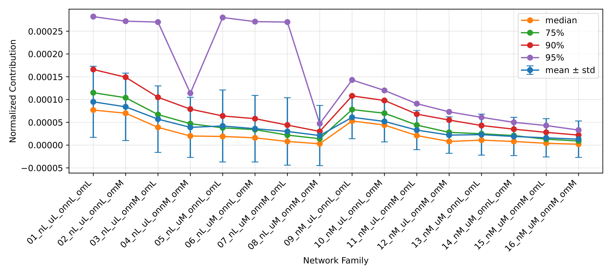
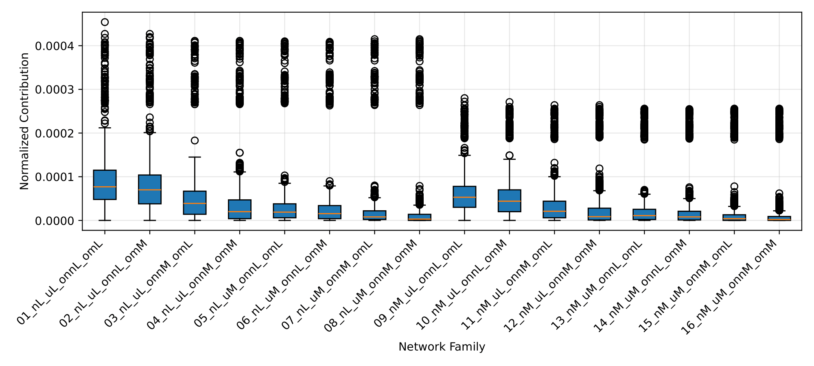
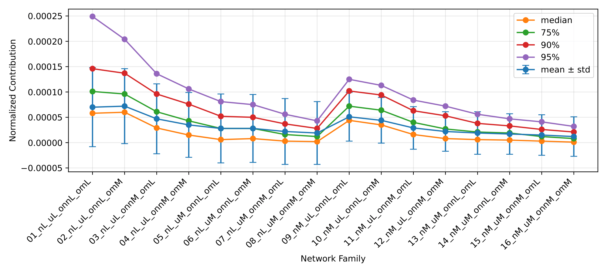
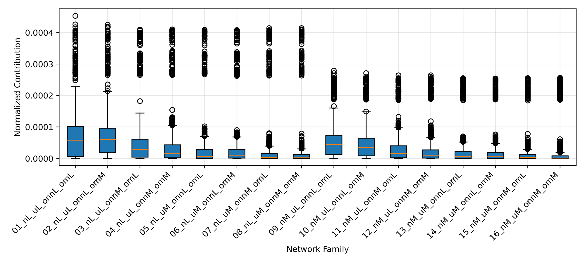
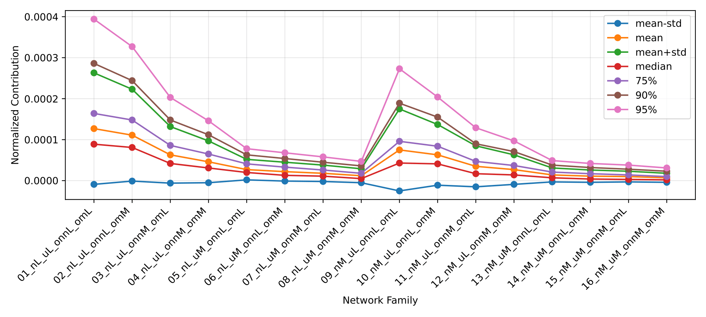
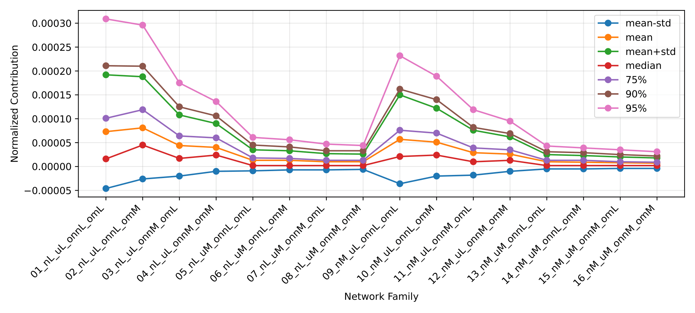
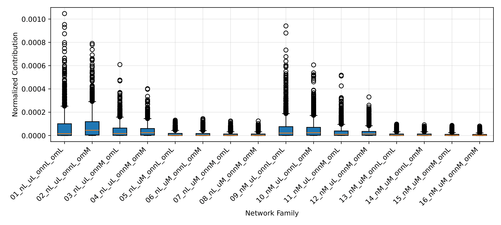

# Report 1 - Question: Does the relative contribution to data scatter provide a good hyperparameter for the definition of the stop rules under variations in the structure/architecture parameters of LFR synthetic networks?

## Table of Contents
- [Networks](#networks)
- [Scripts](#scripts)
- [Experience 1 (LAPIN-off + Extraction of K desired clusters)](#experience-1-lapin-off--extraction-of-k-desired-clusters)
- [Experience 2 (LAPIN-off + Extraction of clusters until the end)](#experience-2-lapin-off--extraction-of-clusters-until-the-end)
- [Experience 3 (LAPIN-on + Extraction of K desired clusters)](#experience-3-lapin-on--extraction-of-k-desired-clusters)
- [Experience 4 (LAPIN-on + Extraction of clusters until the end)](#experience-4-lapin-on--extraction-of-clusters-until-the-end)

## Networks

### LFR Network Parameterization

- $\overline{d}$ = 20
- $d_{max}$ = 50
- $c_{min}$ = 20
- $c_{max}$ = 100
- $t1$ = -2
- $t2$ = -1
- $n$ (2 groups) (*3 groups):
  - L: [500, 700] (*[1000, 3000])
  - M: [800, 1000] (*[4000, 6000])
  - #H: [2000, 4000] (*[7000, 10000])
- $\mu$ (2 groups) (*3 groups):
  - L: [0.1, 0.3]
  - M: [0.4, 0.6]
  - #H: [0.7, 0.8]
- $o_{n}$ / $n$ (2 groups) (*3 groups):
  - L: [0.1, 0.2]
  - M: [0.3, 0.4]
  - #H: [0.5, 0.6]
- $o_{m}$ (2 groups) (*3 groups):
  - L: [2, 3]
  - M: [4, 5]
  - #H: [6, 8]

### Network Families

| Network Family    | $n$         | $\mu$      | $o_{n}$/$n$ | $o_{m}$ |
|-------------------|-------------|------------|-------------|---------|
| 01_nL_uL_onnL_omL | [500, 700]  | [0.1, 0.3] | [0.1, 0.2]  | [2, 3]  |
| 02_nL_uL_onnL_omM | [500, 700]  | [0.1, 0.3] | [0.1, 0.2]  | [4, 5]  |
| 03_nL_uL_onnM_omL | [500, 700]  | [0.1, 0.3] | [0.3, 0.4]  | [2, 3]  |
| 04_nL_uL_onnM_omM | [500, 700]  | [0.1, 0.3] | [0.3, 0.4]  | [4, 5]  |
| 05_nL_uM_onnL_omL | [500, 700]  | [0.4, 0.6] | [0.1, 0.2]  | [2, 3]  |
| 06_nL_uM_onnL_omM | [500, 700]  | [0.4, 0.6] | [0.1, 0.2]  | [4, 5]  |
| 07_nL_uM_onnM_omL | [500, 700]  | [0.4, 0.6] | [0.3, 0.4]  | [2, 3]  |
| 08_nL_uM_onnM_omM | [500, 700]  | [0.4, 0.6] | [0.3, 0.4]  | [4, 5]  |
| 09_nM_uL_onnL_omL | [800, 1000] | [0.1, 0.3] | [0.1, 0.2]  | [2, 3]  |
| 10_nM_uL_onnL_omM | [800, 1000] | [0.1, 0.3] | [0.1, 0.2]  | [4, 5]  |
| 11_nM_uL_onnM_omL | [800, 1000] | [0.1, 0.3] | [0.3, 0.4]  | [2, 3]  |
| 12_nM_uL_onnM_omM | [800, 1000] | [0.1, 0.3] | [0.3, 0.4]  | [4, 5]  |
| 13_nM_uM_onnL_omL | [800, 1000] | [0.4, 0.6] | [0.1, 0.2]  | [2, 3]  |
| 14_nM_uM_onnL_omM | [800, 1000] | [0.4, 0.6] | [0.1, 0.2]  | [4, 5]  |
| 15_nM_uM_onnM_omL | [800, 1000] | [0.4, 0.6] | [0.3, 0.4]  | [2, 3]  |
| 16_nM_uM_onnM_omM | [800, 1000] | [0.4, 0.6] | [0.3, 0.4]  | [4, 5]  |

### Networks for Each Network Family

- $\overline{d}$: fixed
  - (20)
- $d_{max}$: fixed
  - (50)
- $c_{min}$: fixed
  - (20)
- $c_{max}$: fixed
  - (100)
- $t1$: fixed
  - (2.0)
- $t2$: fixed
  - (1.0)
- $n$: step 100 (*step 1000)
  - L: (500 600 700)
  - M: (800 900 1000)
- $\mu$: step 0.1
  - L: (0.1 0.2 0.3)
  - M: (0.4 0.5 0.6)
- $o_{n}$/$n$: step 0.1
  - L: (10 20)
  - M: (30 40)
- $o_{m}$: step 1
  - L: (2 3)
  - M: (4 5)
- Instances: 2 (*10)

## Scripts

### Script 1

- Stage 1 (obtain candidate thresholds for each network family)
  1. Choose the execution configuration: i) LAPIN-off or ii) LAPIN-on; and i) extraction of K desired clusters or ii) extraction of clusters until the end;
  2. For each network in each network family, execute FADDIS using the default input matrix and the selected configuration;
     Exceptionally, when the configuration is LAPIN-off and extraction of K desired clusters, the script extracts K + 1 clusters due to the conditional removal of the first extracted cluster, which may behave as a global/background component;
  3. Register the raw contribution values in the order in which they are extracted;
  4. Normalize the contributions by dividing each contribution value by the "universe", i.e., the sum of all contributions from all networks in all families. The normalized values are stored with 6 decimal places;
  5. Draw one line plot for each network, showing the normalized contribution by extraction number and highlighting the contribution at K;
  6. Create a table of statistics with statistical metrics for each network family, using 6 decimal places;
  7. Draw one histogram for each network family, showing the frequency distribution of the normalized contributions;
  8. Draw a line plot of the normalized contributions for each network family, with one line for each statistical metric;
  9. Draw a box plot of the normalized contributions for each network family;
  10. Create a table of candidate thresholds based on the statistical metrics;

- Stage 2 (Choose one of the candidate thresholds for each network family using bootstrap resampling)
  1. Load the candidate thresholds obtained in Stage 1;
  2. For each network family, repeatedly generate bootstrap subsamples of networks by pseudo-random resampling with replacement;
  3. In each bootstrap repetition:
      - Gather the raw contributions of the sampled networks;
      - Normalize the sampled contributions by dividing each contribution value by the "universe", i.e., the sum of the contributions in that bootstrap subsample;
      - Compute the thresholds for the network family using the same statistical metrics adopted in Stage 1;
      - For each statistical metric, compare the candidate threshold with the threshold computed for the bootstrap subsample using the squared error;
  4. After the defined number of bootstrap repetitions, compute the mean squared error (MSE) of each metric;
  5. Create a table of bootstrap statistics;
  6. For each network family, select the threshold metric with the lowest MSE, that is, the one that shows the greatest stability and robustness under bootstrap resampling;
  7. Create a table with the selected threshold for each network family.

### Script 2

- Stage 1 (test thresholds for each network family)
  1. Adopt the same execution configuration used in Script 1: i) LAPIN-off or ii) LAPIN-on;
  2. Execute FADDIS on a sample of the same networks as in Script 1, using the threshold as `epsilon` (FADDIS's individual cluster contribution);
  3. Apply a defuzzification step with the default `gamma` of 0.5;
  4. Compute the extrinsic evaluation measures for each network;
  5. Draw line plots for each network family showing the evaluation metrics by network.

## Experience 1 (LAPIN-off + Extraction of K desired clusters)

### Contributions Line Plots

[Open Folder](../results/experience1_cluster/results_2026-03-29_16-06-42-670441)

### Statistics

| Network Family    | #Networks | Mean    | Std     | Median  | 75%      | 90%      | 95%      | Min | Max      |
|-------------------|-----------|---------|---------|---------|----------|----------|----------|-----|----------|
| 01_nL_uL_onnL_omL | 72        | 9.5e-05 | 7.8e-05 | 7.7e-05 | 0.000115 | 0.000166 | 0.000282 | 0.0 | 0.000454 |
| 02_nL_uL_onnL_omM | 72        | 8.4e-05 | 7.4e-05 | 7e-05   | 0.000104 | 0.000149 | 0.000272 | 0.0 | 0.000427 |
| 03_nL_uL_onnM_omL | 72        | 5.7e-05 | 7.3e-05 | 3.9e-05 | 6.7e-05  | 0.000105 | 0.00027  | 0.0 | 0.000411 |
| 04_nL_uL_onnM_omM | 72        | 3.9e-05 | 6.6e-05 | 2e-05   | 4.7e-05  | 7.9e-05  | 0.000114 | 0.0 | 0.000411 |
| 05_nL_uM_onnL_omL | 72        | 4.2e-05 | 7.9e-05 | 1.9e-05 | 3.8e-05  | 6.4e-05  | 0.00028  | 0.0 | 0.00041  |
| 06_nL_uM_onnL_omM | 72        | 3.6e-05 | 7.3e-05 | 1.6e-05 | 3.4e-05  | 5.8e-05  | 0.000271 | 0.0 | 0.000409 |
| 07_nL_uM_onnM_omL | 72        | 3e-05   | 7.4e-05 | 8e-06   | 2.2e-05  | 4.4e-05  | 0.00027  | 0.0 | 0.000415 |
| 08_nL_uM_onnM_omM | 72        | 2.1e-05 | 6.6e-05 | 3e-06   | 1.4e-05  | 3e-05    | 4.7e-05  | 0.0 | 0.000415 |
| 09_nM_uL_onnL_omL | 72        | 6.1e-05 | 4.7e-05 | 5.3e-05 | 7.8e-05  | 0.000108 | 0.000143 | 0.0 | 0.00028  |
| 10_nM_uL_onnL_omM | 72        | 5.2e-05 | 4.5e-05 | 4.4e-05 | 7e-05    | 9.8e-05  | 0.00012  | 0.0 | 0.000271 |
| 11_nM_uL_onnM_omL | 72        | 3.3e-05 | 4.3e-05 | 2.1e-05 | 4.4e-05  | 6.8e-05  | 9.1e-05  | 0.0 | 0.000264 |
| 12_nM_uL_onnM_omM | 72        | 2.2e-05 | 4e-05   | 8e-06   | 2.8e-05  | 5.5e-05  | 7.3e-05  | 0.0 | 0.000264 |
| 13_nM_uM_onnL_omL | 72        | 2.3e-05 | 4.5e-05 | 1.1e-05 | 2.5e-05  | 4.3e-05  | 6.1e-05  | 0.0 | 0.000256 |
| 14_nM_uM_onnL_omM | 72        | 1.9e-05 | 4.2e-05 | 8e-06   | 2.1e-05  | 3.5e-05  | 5e-05    | 0.0 | 0.000255 |
| 15_nM_uM_onnM_omL | 72        | 1.6e-05 | 4.2e-05 | 4e-06   | 1.3e-05  | 2.8e-05  | 4.3e-05  | 0.0 | 0.000256 |
| 16_nM_uM_onnM_omM | 72        | 1.3e-05 | 4e-05   | 2e-06   | 9e-06    | 2.2e-05  | 3.3e-05  | 0.0 | 0.000256 |

- #Total Networks: 1152

### Histograms

[Open Folder](../results/experience1_cluster/results_2026-03-29_16-06-42-670441)

### Line plot

### Box plot

### Candidate Thresholds

| Network Family    | Mean-Std | Mean    | Mean+Std | Median  | 75%      | 90%      | 95%      |
|-------------------|----------|---------|----------|---------|----------|----------|----------|
| 01_nL_uL_onnL_omL | 1.7e-05  | 9.5e-05 | 0.000173 | 7.7e-05 | 0.000115 | 0.000166 | 0.000282 |
| 02_nL_uL_onnL_omM | 1e-05    | 8.4e-05 | 0.000158 | 7e-05   | 0.000104 | 0.000149 | 0.000272 |
| 03_nL_uL_onnM_omL | -1.6e-05 | 5.7e-05 | 0.00013  | 3.9e-05 | 6.7e-05  | 0.000105 | 0.00027  |
| 04_nL_uL_onnM_omM | -2.7e-05 | 3.9e-05 | 0.000105 | 2e-05   | 4.7e-05  | 7.9e-05  | 0.000114 |
| 05_nL_uM_onnL_omL | -3.7e-05 | 4.2e-05 | 0.000121 | 1.9e-05 | 3.8e-05  | 6.4e-05  | 0.00028  |
| 06_nL_uM_onnL_omM | -3.7e-05 | 3.6e-05 | 0.000109 | 1.6e-05 | 3.4e-05  | 5.8e-05  | 0.000271 |
| 07_nL_uM_onnM_omL | -4.4e-05 | 3e-05   | 0.000104 | 8e-06   | 2.2e-05  | 4.4e-05  | 0.00027  |
| 08_nL_uM_onnM_omM | -4.5e-05 | 2.1e-05 | 8.7e-05  | 3e-06   | 1.4e-05  | 3e-05    | 4.7e-05  |
| 09_nM_uL_onnL_omL | 1.4e-05  | 6.1e-05 | 0.000108 | 5.3e-05 | 7.8e-05  | 0.000108 | 0.000143 |
| 10_nM_uL_onnL_omM | 7e-06    | 5.2e-05 | 9.7e-05  | 4.4e-05 | 7e-05    | 9.8e-05  | 0.00012  |
| 11_nM_uL_onnM_omL | -1e-05   | 3.3e-05 | 7.6e-05  | 2.1e-05 | 4.4e-05  | 6.8e-05  | 9.1e-05  |
| 12_nM_uL_onnM_omM | -1.8e-05 | 2.2e-05 | 6.2e-05  | 8e-06   | 2.8e-05  | 5.5e-05  | 7.3e-05  |
| 13_nM_uM_onnL_omL | -2.2e-05 | 2.3e-05 | 6.8e-05  | 1.1e-05 | 2.5e-05  | 4.3e-05  | 6.1e-05  |
| 14_nM_uM_onnL_omM | -2.3e-05 | 1.9e-05 | 6.1e-05  | 8e-06   | 2.1e-05  | 3.5e-05  | 5e-05    |
| 15_nM_uM_onnM_omL | -2.6e-05 | 1.6e-05 | 5.8e-05  | 4e-06   | 1.3e-05  | 2.8e-05  | 4.3e-05  |
| 16_nM_uM_onnM_omM | -2.7e-05 | 1.3e-05 | 5.3e-05  | 2e-06   | 9e-06    | 2.2e-05  | 3.3e-05  |

### Bootstrap Statistics

| Network Family    | #Networks | Subsample Size | #Bootstraps | Metric   | Candidate Threshold | MSE           |
|-------------------|-----------|----------------|-------------|----------|---------------------|---------------|
| 01_nL_uL_onnL_omL | 72        | 58             | 1000        | Mean-Std | 1.7e-05             | 3.6051e-08    |
| 01_nL_uL_onnL_omL | 72        | 58             | 1000        | Mean     | 9.5e-05             | 1.05082e-06   |
| 01_nL_uL_onnL_omL | 72        | 58             | 1000        | Mean+Std | 0.000173            | 3.472707e-06  |
| 01_nL_uL_onnL_omL | 72        | 58             | 1000        | Median   | 7.7e-05             | 7.04192e-07   |
| 01_nL_uL_onnL_omL | 72        | 58             | 1000        | 75%      | 0.000115            | 1.530023e-06  |
| 01_nL_uL_onnL_omL | 72        | 58             | 1000        | 90%      | 0.000166            | 3.306089e-06  |
| 01_nL_uL_onnL_omL | 72        | 58             | 1000        | 95%      | 0.000282            | 9.530053e-06  |
| 02_nL_uL_onnL_omM | 72        | 58             | 1000        | Mean-Std | 1e-05               | 1.176e-08     |
| 02_nL_uL_onnL_omM | 72        | 58             | 1000        | Mean     | 8.4e-05             | 6.80863e-07   |
| 02_nL_uL_onnL_omM | 72        | 58             | 1000        | Mean+Std | 0.000158            | 2.392204e-06  |
| 02_nL_uL_onnL_omM | 72        | 58             | 1000        | Median   | 7e-05               | 4.75676e-07   |
| 02_nL_uL_onnL_omM | 72        | 58             | 1000        | 75%      | 0.000104            | 1.035443e-06  |
| 02_nL_uL_onnL_omM | 72        | 58             | 1000        | 90%      | 0.000149            | 2.140496e-06  |
| 02_nL_uL_onnL_omM | 72        | 58             | 1000        | 95%      | 0.000272            | 7.038438e-06  |
| 03_nL_uL_onnM_omL | 72        | 58             | 1000        | Mean-Std | -1.6e-05            | 6.0529e-08    |
| 03_nL_uL_onnM_omL | 72        | 58             | 1000        | Mean     | 5.7e-05             | 7.29588e-07   |
| 03_nL_uL_onnM_omL | 72        | 58             | 1000        | Mean+Std | 0.00013             | 3.808477e-06  |
| 03_nL_uL_onnM_omL | 72        | 58             | 1000        | Median   | 3.9e-05             | 3.47136e-07   |
| 03_nL_uL_onnM_omL | 72        | 58             | 1000        | 75%      | 6.7e-05             | 1.035803e-06  |
| 03_nL_uL_onnM_omL | 72        | 58             | 1000        | 90%      | 0.000105            | 2.454411e-06  |
| 03_nL_uL_onnM_omL | 72        | 58             | 1000        | 95%      | 0.00027             | 1.5821725e-05 |
| 04_nL_uL_onnM_omM | 72        | 58             | 1000        | Mean-Std | -2.7e-05            | 2.01481e-07   |
| 04_nL_uL_onnM_omM | 72        | 58             | 1000        | Mean     | 3.9e-05             | 4.03374e-07   |
| 04_nL_uL_onnM_omM | 72        | 58             | 1000        | Mean+Std | 0.000105            | 2.950625e-06  |
| 04_nL_uL_onnM_omM | 72        | 58             | 1000        | Median   | 2e-05               | 1.01233e-07   |
| 04_nL_uL_onnM_omM | 72        | 58             | 1000        | 75%      | 4.7e-05             | 5.8338e-07    |
| 04_nL_uL_onnM_omM | 72        | 58             | 1000        | 90%      | 7.9e-05             | 1.664874e-06  |
| 04_nL_uL_onnM_omM | 72        | 58             | 1000        | 95%      | 0.000114            | 3.375517e-06  |
| 05_nL_uM_onnL_omL | 72        | 58             | 1000        | Mean-Std | -3.7e-05            | 8.91753e-07   |
| 05_nL_uM_onnL_omL | 72        | 58             | 1000        | Mean     | 4.2e-05             | 1.164379e-06  |
| 05_nL_uM_onnL_omL | 72        | 58             | 1000        | Mean+Std | 0.000121            | 9.613792e-06  |
| 05_nL_uM_onnL_omL | 72        | 58             | 1000        | Median   | 1.9e-05             | 2.45185e-07   |
| 05_nL_uM_onnL_omL | 72        | 58             | 1000        | 75%      | 3.8e-05             | 9.61556e-07   |
| 05_nL_uM_onnL_omL | 72        | 58             | 1000        | 90%      | 6.4e-05             | 2.653388e-06  |
| 05_nL_uM_onnL_omL | 72        | 58             | 1000        | 95%      | 0.00028             | 5.1931237e-05 |
| 06_nL_uM_onnL_omM | 72        | 58             | 1000        | Mean-Std | -3.7e-05            | 8.67965e-07   |
| 06_nL_uM_onnL_omM | 72        | 58             | 1000        | Mean     | 3.6e-05             | 7.77474e-07   |
| 06_nL_uM_onnL_omM | 72        | 58             | 1000        | Mean+Std | 0.000109            | 7.254142e-06  |
| 06_nL_uM_onnL_omM | 72        | 58             | 1000        | Median   | 1.6e-05             | 1.41575e-07   |
| 06_nL_uM_onnL_omM | 72        | 58             | 1000        | 75%      | 3.4e-05             | 6.82938e-07   |
| 06_nL_uM_onnL_omM | 72        | 58             | 1000        | 90%      | 5.8e-05             | 2.003044e-06  |
| 06_nL_uM_onnL_omM | 72        | 58             | 1000        | 95%      | 0.000271            | 4.3761579e-05 |
| 07_nL_uM_onnM_omL | 72        | 58             | 1000        | Mean-Std | -4.4e-05            | 1.735265e-06  |
| 07_nL_uM_onnM_omL | 72        | 58             | 1000        | Mean     | 3e-05               | 7.82309e-07   |
| 07_nL_uM_onnM_omL | 72        | 58             | 1000        | Mean+Std | 0.000104            | 9.519742e-06  |
| 07_nL_uM_onnM_omL | 72        | 58             | 1000        | Median   | 8e-06               | 5.5519e-08    |
| 07_nL_uM_onnM_omL | 72        | 58             | 1000        | 75%      | 2.2e-05             | 4.41174e-07   |
| 07_nL_uM_onnM_omL | 72        | 58             | 1000        | 90%      | 4.4e-05             | 1.743698e-06  |
| 07_nL_uM_onnM_omL | 72        | 58             | 1000        | 95%      | 0.00027             | 6.2505783e-05 |
| 08_nL_uM_onnM_omM | 72        | 58             | 1000        | Mean-Std | -4.5e-05            | 1.939827e-06  |
| 08_nL_uM_onnM_omM | 72        | 58             | 1000        | Mean     | 2.1e-05             | 4.57316e-07   |
| 08_nL_uM_onnM_omM | 72        | 58             | 1000        | Mean+Std | 8.7e-05             | 7.534121e-06  |
| 08_nL_uM_onnM_omM | 72        | 58             | 1000        | Median   | 3e-06               | 1.2147e-08    |
| 08_nL_uM_onnM_omM | 72        | 58             | 1000        | 75%      | 1.4e-05             | 2.01846e-07   |
| 08_nL_uM_onnM_omM | 72        | 58             | 1000        | 90%      | 3e-05               | 9.20605e-07   |
| 08_nL_uM_onnM_omM | 72        | 58             | 1000        | 95%      | 4.7e-05             | 2.267283e-06  |
| 09_nM_uL_onnL_omL | 72        | 58             | 1000        | Mean-Std | 1.4e-05             | 2.7659e-08    |
| 09_nM_uL_onnL_omL | 72        | 58             | 1000        | Mean     | 6.1e-05             | 4.90169e-07   |
| 09_nM_uL_onnL_omL | 72        | 58             | 1000        | Mean+Std | 0.000108            | 1.5267e-06    |
| 09_nM_uL_onnL_omL | 72        | 58             | 1000        | Median   | 5.3e-05             | 3.72363e-07   |
| 09_nM_uL_onnL_omL | 72        | 58             | 1000        | 75%      | 7.8e-05             | 8.04268e-07   |
| 09_nM_uL_onnL_omL | 72        | 58             | 1000        | 90%      | 0.000108            | 1.538116e-06  |
| 09_nM_uL_onnL_omL | 72        | 58             | 1000        | 95%      | 0.000143            | 2.568031e-06  |
| 10_nM_uL_onnL_omM | 72        | 58             | 1000        | Mean-Std | 7e-06               | 5.883e-09     |
| 10_nM_uL_onnL_omM | 72        | 58             | 1000        | Mean     | 5.2e-05             | 3.1874e-07    |
| 10_nM_uL_onnL_omM | 72        | 58             | 1000        | Mean+Std | 9.7e-05             | 1.114816e-06  |
| 10_nM_uL_onnL_omM | 72        | 58             | 1000        | Median   | 4.4e-05             | 2.27066e-07   |
| 10_nM_uL_onnL_omM | 72        | 58             | 1000        | 75%      | 7e-05               | 5.8545e-07    |
| 10_nM_uL_onnL_omM | 72        | 58             | 1000        | 90%      | 9.8e-05             | 1.148746e-06  |
| 10_nM_uL_onnL_omM | 72        | 58             | 1000        | 95%      | 0.00012             | 1.661594e-06  |
| 11_nM_uL_onnM_omL | 72        | 58             | 1000        | Mean-Std | -1e-05              | 3.7081e-08    |
| 11_nM_uL_onnM_omL | 72        | 58             | 1000        | Mean     | 3.3e-05             | 3.58433e-07   |
| 11_nM_uL_onnM_omL | 72        | 58             | 1000        | Mean+Std | 7.6e-05             | 1.927411e-06  |
| 11_nM_uL_onnM_omL | 72        | 58             | 1000        | Median   | 2.1e-05             | 1.5296e-07    |
| 11_nM_uL_onnM_omL | 72        | 58             | 1000        | 75%      | 4.4e-05             | 6.29714e-07   |
| 11_nM_uL_onnM_omL | 72        | 58             | 1000        | 90%      | 6.8e-05             | 1.517999e-06  |
| 11_nM_uL_onnM_omL | 72        | 58             | 1000        | 95%      | 9.1e-05             | 2.698475e-06  |
| 12_nM_uL_onnM_omM | 72        | 58             | 1000        | Mean-Std | -1.8e-05            | 1.30378e-07   |
| 12_nM_uL_onnM_omM | 72        | 58             | 1000        | Mean     | 2.2e-05             | 2.24547e-07   |
| 12_nM_uL_onnM_omM | 72        | 58             | 1000        | Mean+Std | 6.2e-05             | 1.711018e-06  |
| 12_nM_uL_onnM_omM | 72        | 58             | 1000        | Median   | 8e-06               | 3.2798e-08    |
| 12_nM_uL_onnM_omM | 72        | 58             | 1000        | 75%      | 2.8e-05             | 3.41812e-07   |
| 12_nM_uL_onnM_omM | 72        | 58             | 1000        | 90%      | 5.5e-05             | 1.307267e-06  |
| 12_nM_uL_onnM_omM | 72        | 58             | 1000        | 95%      | 7.3e-05             | 2.369712e-06  |
| 13_nM_uM_onnL_omL | 72        | 58             | 1000        | Mean-Std | -2.2e-05            | 4.63376e-07   |
| 13_nM_uM_onnL_omL | 72        | 58             | 1000        | Mean     | 2.3e-05             | 5.56597e-07   |
| 13_nM_uM_onnL_omL | 72        | 58             | 1000        | Mean+Std | 6.8e-05             | 4.713852e-06  |
| 13_nM_uM_onnL_omL | 72        | 58             | 1000        | Median   | 1.1e-05             | 1.14944e-07   |
| 13_nM_uM_onnL_omL | 72        | 58             | 1000        | 75%      | 2.5e-05             | 6.40296e-07   |
| 13_nM_uM_onnL_omL | 72        | 58             | 1000        | 90%      | 4.3e-05             | 1.855859e-06  |
| 13_nM_uM_onnL_omL | 72        | 58             | 1000        | 95%      | 6.1e-05             | 3.815864e-06  |
| 14_nM_uM_onnL_omM | 72        | 58             | 1000        | Mean-Std | -2.3e-05            | 5.05209e-07   |
| 14_nM_uM_onnL_omM | 72        | 58             | 1000        | Mean     | 1.9e-05             | 3.89067e-07   |
| 14_nM_uM_onnL_omM | 72        | 58             | 1000        | Mean+Std | 6.1e-05             | 3.829912e-06  |
| 14_nM_uM_onnL_omM | 72        | 58             | 1000        | Median   | 8e-06               | 5.9252e-08    |
| 14_nM_uM_onnL_omM | 72        | 58             | 1000        | 75%      | 2.1e-05             | 4.42023e-07   |
| 14_nM_uM_onnL_omM | 72        | 58             | 1000        | 90%      | 3.5e-05             | 1.281237e-06  |
| 14_nM_uM_onnL_omM | 72        | 58             | 1000        | 95%      | 5e-05               | 2.502472e-06  |
| 15_nM_uM_onnM_omL | 72        | 58             | 1000        | Mean-Std | -2.6e-05            | 1.117115e-06  |
| 15_nM_uM_onnM_omL | 72        | 58             | 1000        | Mean     | 1.6e-05             | 4.07692e-07   |
| 15_nM_uM_onnM_omL | 72        | 58             | 1000        | Mean+Std | 5.8e-05             | 5.444117e-06  |
| 15_nM_uM_onnM_omL | 72        | 58             | 1000        | Median   | 4e-06               | 2.1662e-08    |
| 15_nM_uM_onnM_omL | 72        | 58             | 1000        | 75%      | 1.3e-05             | 2.74971e-07   |
| 15_nM_uM_onnM_omL | 72        | 58             | 1000        | 90%      | 2.8e-05             | 1.250113e-06  |
| 15_nM_uM_onnM_omL | 72        | 58             | 1000        | 95%      | 4.3e-05             | 3.031483e-06  |
| 16_nM_uM_onnM_omM | 72        | 58             | 1000        | Mean-Std | -2.7e-05            | 1.384486e-06  |
| 16_nM_uM_onnM_omM | 72        | 58             | 1000        | Mean     | 1.3e-05             | 3.13353e-07   |
| 16_nM_uM_onnM_omM | 72        | 58             | 1000        | Mean+Std | 5.3e-05             | 5.270775e-06  |
| 16_nM_uM_onnM_omM | 72        | 58             | 1000        | Median   | 2e-06               | 6.471e-09     |
| 16_nM_uM_onnM_omM | 72        | 58             | 1000        | 75%      | 9e-06               | 1.50153e-07   |
| 16_nM_uM_onnM_omM | 72        | 58             | 1000        | 90%      | 2.2e-05             | 8.97857e-07   |
| 16_nM_uM_onnM_omM | 72        | 58             | 1000        | 95%      | 3.3e-05             | 2.069605e-06  |

### Thresholds

| Network Family    | Selected Metric | Threshold |
|-------------------|-----------------|-----------|
| 01_nL_uL_onnL_omL | Mean-Std        | 1.7e-05   |
| 02_nL_uL_onnL_omM | Mean-Std        | 1e-05     |
| 03_nL_uL_onnM_omL | Mean-Std        | -1.6e-05  |
| 04_nL_uL_onnM_omM | Median          | 2e-05     |
| 05_nL_uM_onnL_omL | Median          | 1.9e-05   |
| 06_nL_uM_onnL_omM | Median          | 1.6e-05   |
| 07_nL_uM_onnM_omL | Median          | 8e-06     |
| 08_nL_uM_onnM_omM | Median          | 3e-06     |
| 09_nM_uL_onnL_omL | Mean-Std        | 1.4e-05   |
| 10_nM_uL_onnL_omM | Mean-Std        | 7e-06     |
| 11_nM_uL_onnM_omL | Mean-Std        | -1e-05    |
| 12_nM_uL_onnM_omM | Median          | 8e-06     |
| 13_nM_uM_onnL_omL | Median          | 1.1e-05   |
| 14_nM_uM_onnL_omM | Median          | 8e-06     |
| 15_nM_uM_onnM_omL | Median          | 4e-06     |
| 16_nM_uM_onnM_omM | Median          | 2e-06     |

### Updated Thresholds (excluding negative values)

| Network Family    | Selected Metric | Threshold |
|-------------------|-----------------|-----------|
| 01_nL_uL_onnL_omL | Mean-Std        | 1.7e-05   |
| 02_nL_uL_onnL_omM | Mean-Std        | 1e-05     |
| 03_nL_uL_onnM_omL | Median          | 3.9e-05   |
| 04_nL_uL_onnM_omM | Median          | 2e-05     |
| 05_nL_uM_onnL_omL | Median          | 1.9e-05   |
| 06_nL_uM_onnL_omM | Median          | 1.6e-05   |
| 07_nL_uM_onnM_omL | Median          | 8e-06     |
| 08_nL_uM_onnM_omM | Median          | 3e-06     |
| 09_nM_uL_onnL_omL | Mean-Std        | 1.4e-05   |
| 10_nM_uL_onnL_omM | Mean-Std        | 7e-06     |
| 11_nM_uL_onnM_omL | Median          | 2.1e-05   |
| 12_nM_uL_onnM_omM | Median          | 8e-06     |
| 13_nM_uM_onnL_omL | Median          | 1.1e-05   |
| 14_nM_uM_onnL_omM | Median          | 8e-06     |
| 15_nM_uM_onnM_omL | Median          | 4e-06     |
| 16_nM_uM_onnM_omM | Median          | 2e-06     |

### Extrinsic Metrics Results

[Open Folder](../results/experience1_cluster/results_2026-04-01_12-12-44-340843)

## Experience 2 (LAPIN-off + Extraction of clusters until the end)

### Contributions Line Plots

[Open Folder](../results/experience2_cluster/results_2026-03-30_11-30-49-106671)

### Statistics

| Network Family    | #Networks | Mean    | Std     | Median  | 75%      | 90%      | 95%      | Min | Max      |
|-------------------|-----------|---------|---------|---------|----------|----------|----------|-----|----------|
| 01_nL_uL_onnL_omL | 72        | 7e-05   | 7.8e-05 | 5.8e-05 | 0.000101 | 0.000146 | 0.000249 | 0.0 | 0.000453 |
| 02_nL_uL_onnL_omM | 72        | 7.2e-05 | 7.4e-05 | 6e-05   | 9.6e-05  | 0.000137 | 0.000204 | 0.0 | 0.000425 |
| 03_nL_uL_onnM_omL | 72        | 4.7e-05 | 6.9e-05 | 2.9e-05 | 6.1e-05  | 9.6e-05  | 0.000136 | 0.0 | 0.000409 |
| 04_nL_uL_onnM_omM | 72        | 3.5e-05 | 6.4e-05 | 1.5e-05 | 4.3e-05  | 7.6e-05  | 0.000106 | 0.0 | 0.00041  |
| 05_nL_uM_onnL_omL | 72        | 2.8e-05 | 6.8e-05 | 6e-06   | 2.8e-05  | 5.2e-05  | 8.1e-05  | 0.0 | 0.000409 |
| 06_nL_uM_onnL_omM | 72        | 2.8e-05 | 6.7e-05 | 8e-06   | 2.8e-05  | 5e-05    | 7.5e-05  | 0.0 | 0.000408 |
| 07_nL_uM_onnM_omL | 72        | 2.2e-05 | 6.5e-05 | 3e-06   | 1.6e-05  | 3.7e-05  | 5.6e-05  | 0.0 | 0.000414 |
| 08_nL_uM_onnM_omM | 72        | 1.9e-05 | 6.2e-05 | 2e-06   | 1.2e-05  | 2.8e-05  | 4.3e-05  | 0.0 | 0.000414 |
| 09_nM_uL_onnL_omL | 72        | 5.1e-05 | 4.8e-05 | 4.4e-05 | 7.2e-05  | 0.000102 | 0.000125 | 0.0 | 0.000279 |
| 10_nM_uL_onnL_omM | 72        | 4.4e-05 | 4.5e-05 | 3.5e-05 | 6.4e-05  | 9.4e-05  | 0.000113 | 0.0 | 0.000271 |
| 11_nM_uL_onnM_omL | 72        | 2.9e-05 | 4.2e-05 | 1.6e-05 | 4e-05    | 6.3e-05  | 8.4e-05  | 0.0 | 0.000264 |
| 12_nM_uL_onnM_omM | 72        | 2.2e-05 | 3.9e-05 | 8e-06   | 2.7e-05  | 5.3e-05  | 7.2e-05  | 0.0 | 0.000264 |
| 13_nM_uM_onnL_omL | 72        | 1.9e-05 | 4.2e-05 | 6e-06   | 2.1e-05  | 3.8e-05  | 5.6e-05  | 0.0 | 0.000255 |
| 14_nM_uM_onnL_omM | 72        | 1.7e-05 | 4e-05   | 5e-06   | 1.9e-05  | 3.3e-05  | 4.7e-05  | 0.0 | 0.000254 |
| 15_nM_uM_onnM_omL | 72        | 1.5e-05 | 4e-05   | 3e-06   | 1.2e-05  | 2.6e-05  | 4.1e-05  | 0.0 | 0.000255 |
| 16_nM_uM_onnM_omM | 72        | 1.2e-05 | 3.9e-05 | 1e-06   | 8e-06    | 2.1e-05  | 3.2e-05  | 0.0 | 0.000256 |

- #Total Networks: 1152

### Histograms

[Open Folder](../results/experience2_cluster/results_2026-03-30_11-30-49-106671)

### Line plot

### Box plot

### Candidate Thresholds

| Network Family    | Mean-Std | Mean    | Mean+Std | Median  | 75%      | 90%      | 95%      |
|-------------------|----------|---------|----------|---------|----------|----------|----------|
| 01_nL_uL_onnL_omL | -8e-06   | 7e-05   | 0.000148 | 5.8e-05 | 0.000101 | 0.000146 | 0.000249 |
| 02_nL_uL_onnL_omM | -2e-06   | 7.2e-05 | 0.000146 | 6e-05   | 9.6e-05  | 0.000137 | 0.000204 |
| 03_nL_uL_onnM_omL | -2.2e-05 | 4.7e-05 | 0.000116 | 2.9e-05 | 6.1e-05  | 9.6e-05  | 0.000136 |
| 04_nL_uL_onnM_omM | -2.9e-05 | 3.5e-05 | 9.9e-05  | 1.5e-05 | 4.3e-05  | 7.6e-05  | 0.000106 |
| 05_nL_uM_onnL_omL | -4e-05   | 2.8e-05 | 9.6e-05  | 6e-06   | 2.8e-05  | 5.2e-05  | 8.1e-05  |
| 06_nL_uM_onnL_omM | -3.9e-05 | 2.8e-05 | 9.5e-05  | 8e-06   | 2.8e-05  | 5e-05    | 7.5e-05  |
| 07_nL_uM_onnM_omL | -4.3e-05 | 2.2e-05 | 8.7e-05  | 3e-06   | 1.6e-05  | 3.7e-05  | 5.6e-05  |
| 08_nL_uM_onnM_omM | -4.3e-05 | 1.9e-05 | 8.1e-05  | 2e-06   | 1.2e-05  | 2.8e-05  | 4.3e-05  |
| 09_nM_uL_onnL_omL | 3e-06    | 5.1e-05 | 9.9e-05  | 4.4e-05 | 7.2e-05  | 0.000102 | 0.000125 |
| 10_nM_uL_onnL_omM | -1e-06   | 4.4e-05 | 8.9e-05  | 3.5e-05 | 6.4e-05  | 9.4e-05  | 0.000113 |
| 11_nM_uL_onnM_omL | -1.3e-05 | 2.9e-05 | 7.1e-05  | 1.6e-05 | 4e-05    | 6.3e-05  | 8.4e-05  |
| 12_nM_uL_onnM_omM | -1.7e-05 | 2.2e-05 | 6.1e-05  | 8e-06   | 2.7e-05  | 5.3e-05  | 7.2e-05  |
| 13_nM_uM_onnL_omL | -2.3e-05 | 1.9e-05 | 6.1e-05  | 6e-06   | 2.1e-05  | 3.8e-05  | 5.6e-05  |
| 14_nM_uM_onnL_omM | -2.3e-05 | 1.7e-05 | 5.7e-05  | 5e-06   | 1.9e-05  | 3.3e-05  | 4.7e-05  |
| 15_nM_uM_onnM_omL | -2.5e-05 | 1.5e-05 | 5.5e-05  | 3e-06   | 1.2e-05  | 2.6e-05  | 4.1e-05  |
| 16_nM_uM_onnM_omM | -2.7e-05 | 1.2e-05 | 5.1e-05  | 1e-06   | 8e-06    | 2.1e-05  | 3.2e-05  |

### Bootstrap Statistics

| Network Family    | #Networks | Subsample Size | #Bootstraps | Metric   | Candidate Threshold | MSE          |
|-------------------|-----------|----------------|-------------|----------|---------------------|--------------|
| 01_nL_uL_onnL_omL | 72        | 58             | 1000        | Mean-Std | -8e-06              | 8.027e-09    |
| 01_nL_uL_onnL_omL | 72        | 58             | 1000        | Mean     | 7e-05               | 5.78174e-07  |
| 01_nL_uL_onnL_omL | 72        | 58             | 1000        | Mean+Std | 0.000148            | 2.562748e-06 |
| 01_nL_uL_onnL_omL | 72        | 58             | 1000        | Median   | 5.8e-05             | 3.92146e-07  |
| 01_nL_uL_onnL_omL | 72        | 58             | 1000        | 75%      | 0.000101            | 1.173953e-06 |
| 01_nL_uL_onnL_omL | 72        | 58             | 1000        | 90%      | 0.000146            | 2.478727e-06 |
| 01_nL_uL_onnL_omL | 72        | 58             | 1000        | 95%      | 0.000249            | 6.465234e-06 |
| 02_nL_uL_onnL_omM | 72        | 58             | 1000        | Mean-Std | -2e-06              | 1.303e-09    |
| 02_nL_uL_onnL_omM | 72        | 58             | 1000        | Mean     | 7.2e-05             | 4.96142e-07  |
| 02_nL_uL_onnL_omM | 72        | 58             | 1000        | Mean+Std | 0.000146            | 2.031432e-06 |
| 02_nL_uL_onnL_omM | 72        | 58             | 1000        | Median   | 6e-05               | 3.52383e-07  |
| 02_nL_uL_onnL_omM | 72        | 58             | 1000        | 75%      | 9.6e-05             | 8.88125e-07  |
| 02_nL_uL_onnL_omM | 72        | 58             | 1000        | 90%      | 0.000137            | 1.831995e-06 |
| 02_nL_uL_onnL_omM | 72        | 58             | 1000        | 95%      | 0.000204            | 3.843893e-06 |
| 03_nL_uL_onnM_omL | 72        | 58             | 1000        | Mean-Std | -2.2e-05            | 1.14317e-07  |
| 03_nL_uL_onnM_omL | 72        | 58             | 1000        | Mean     | 4.7e-05             | 5.0469e-07   |
| 03_nL_uL_onnM_omL | 72        | 58             | 1000        | Mean+Std | 0.000116            | 3.086083e-06 |
| 03_nL_uL_onnM_omL | 72        | 58             | 1000        | Median   | 2.9e-05             | 1.92387e-07  |
| 03_nL_uL_onnM_omL | 72        | 58             | 1000        | 75%      | 6.1e-05             | 8.48202e-07  |
| 03_nL_uL_onnM_omL | 72        | 58             | 1000        | 90%      | 9.6e-05             | 2.09465e-06  |
| 03_nL_uL_onnM_omL | 72        | 58             | 1000        | 95%      | 0.000136            | 4.150499e-06 |
| 04_nL_uL_onnM_omM | 72        | 58             | 1000        | Mean-Std | -2.9e-05            | 2.19549e-07  |
| 04_nL_uL_onnM_omM | 72        | 58             | 1000        | Mean     | 3.5e-05             | 3.38563e-07  |
| 04_nL_uL_onnM_omM | 72        | 58             | 1000        | Mean+Std | 9.9e-05             | 2.660698e-06 |
| 04_nL_uL_onnM_omM | 72        | 58             | 1000        | Median   | 1.5e-05             | 6.3122e-08   |
| 04_nL_uL_onnM_omM | 72        | 58             | 1000        | 75%      | 4.3e-05             | 4.99581e-07  |
| 04_nL_uL_onnM_omM | 72        | 58             | 1000        | 90%      | 7.6e-05             | 1.52879e-06  |
| 04_nL_uL_onnM_omM | 72        | 58             | 1000        | 95%      | 0.000106            | 3.044043e-06 |
| 05_nL_uM_onnL_omL | 72        | 58             | 1000        | Mean-Std | -4e-05              | 9.95387e-07  |
| 05_nL_uM_onnL_omL | 72        | 58             | 1000        | Mean     | 2.8e-05             | 5.18165e-07  |
| 05_nL_uM_onnL_omL | 72        | 58             | 1000        | Mean+Std | 9.6e-05             | 5.933338e-06 |
| 05_nL_uM_onnL_omL | 72        | 58             | 1000        | Median   | 6e-06               | 2.9345e-08   |
| 05_nL_uM_onnL_omL | 72        | 58             | 1000        | 75%      | 2.8e-05             | 4.97892e-07  |
| 05_nL_uM_onnL_omL | 72        | 58             | 1000        | 90%      | 5.2e-05             | 1.698581e-06 |
| 05_nL_uM_onnL_omL | 72        | 58             | 1000        | 95%      | 8.1e-05             | 4.253254e-06 |
| 06_nL_uM_onnL_omM | 72        | 58             | 1000        | Mean-Std | -3.9e-05            | 8.97649e-07  |
| 06_nL_uM_onnL_omM | 72        | 58             | 1000        | Mean     | 2.8e-05             | 4.87722e-07  |
| 06_nL_uM_onnL_omM | 72        | 58             | 1000        | Mean+Std | 9.5e-05             | 5.48795e-06  |
| 06_nL_uM_onnL_omM | 72        | 58             | 1000        | Median   | 8e-06               | 4.0674e-08   |
| 06_nL_uM_onnL_omM | 72        | 58             | 1000        | 75%      | 2.8e-05             | 4.65355e-07  |
| 06_nL_uM_onnL_omM | 72        | 58             | 1000        | 90%      | 5e-05               | 1.50709e-06  |
| 06_nL_uM_onnL_omM | 72        | 58             | 1000        | 95%      | 7.5e-05             | 3.349996e-06 |
| 07_nL_uM_onnM_omL | 72        | 58             | 1000        | Mean-Std | -4.3e-05            | 1.618022e-06 |
| 07_nL_uM_onnM_omL | 72        | 58             | 1000        | Mean     | 2.2e-05             | 4.27963e-07  |
| 07_nL_uM_onnM_omL | 72        | 58             | 1000        | Mean+Std | 8.7e-05             | 6.653616e-06 |
| 07_nL_uM_onnM_omL | 72        | 58             | 1000        | Median   | 3e-06               | 8.574e-09    |
| 07_nL_uM_onnM_omL | 72        | 58             | 1000        | 75%      | 1.6e-05             | 2.22823e-07  |
| 07_nL_uM_onnM_omL | 72        | 58             | 1000        | 90%      | 3.7e-05             | 1.209034e-06 |
| 07_nL_uM_onnM_omL | 72        | 58             | 1000        | 95%      | 5.6e-05             | 2.815846e-06 |
| 08_nL_uM_onnM_omM | 72        | 58             | 1000        | Mean-Std | -4.3e-05            | 1.861571e-06 |
| 08_nL_uM_onnM_omM | 72        | 58             | 1000        | Mean     | 1.9e-05             | 3.6882e-07   |
| 08_nL_uM_onnM_omM | 72        | 58             | 1000        | Mean+Std | 8.1e-05             | 6.648459e-06 |
| 08_nL_uM_onnM_omM | 72        | 58             | 1000        | Median   | 2e-06               | 5.498e-09    |
| 08_nL_uM_onnM_omM | 72        | 58             | 1000        | 75%      | 1.2e-05             | 1.50614e-07  |
| 08_nL_uM_onnM_omM | 72        | 58             | 1000        | 90%      | 2.8e-05             | 8.13075e-07  |
| 08_nL_uM_onnM_omM | 72        | 58             | 1000        | 95%      | 4.3e-05             | 1.946097e-06 |
| 09_nM_uL_onnL_omL | 72        | 58             | 1000        | Mean-Std | 3e-06               | 1.355e-09    |
| 09_nM_uL_onnL_omL | 72        | 58             | 1000        | Mean     | 5.1e-05             | 3.34002e-07  |
| 09_nM_uL_onnL_omL | 72        | 58             | 1000        | Mean+Std | 9.9e-05             | 1.269588e-06 |
| 09_nM_uL_onnL_omL | 72        | 58             | 1000        | Median   | 4.4e-05             | 2.52533e-07  |
| 09_nM_uL_onnL_omL | 72        | 58             | 1000        | 75%      | 7.2e-05             | 6.66888e-07  |
| 09_nM_uL_onnL_omL | 72        | 58             | 1000        | 90%      | 0.000102            | 1.350667e-06 |
| 09_nM_uL_onnL_omL | 72        | 58             | 1000        | 95%      | 0.000125            | 2.056383e-06 |
| 10_nM_uL_onnL_omM | 72        | 58             | 1000        | Mean-Std | -1e-06              | 7.47e-10     |
| 10_nM_uL_onnL_omM | 72        | 58             | 1000        | Mean     | 4.4e-05             | 2.27757e-07  |
| 10_nM_uL_onnL_omM | 72        | 58             | 1000        | Mean+Std | 8.9e-05             | 9.39754e-07  |
| 10_nM_uL_onnL_omM | 72        | 58             | 1000        | Median   | 3.5e-05             | 1.45307e-07  |
| 10_nM_uL_onnL_omM | 72        | 58             | 1000        | 75%      | 6.4e-05             | 4.88515e-07  |
| 10_nM_uL_onnL_omM | 72        | 58             | 1000        | 90%      | 9.4e-05             | 1.040886e-06 |
| 10_nM_uL_onnL_omM | 72        | 58             | 1000        | 95%      | 0.000113            | 1.517384e-06 |
| 11_nM_uL_onnM_omL | 72        | 58             | 1000        | Mean-Std | -1.3e-05            | 5.824e-08    |
| 11_nM_uL_onnM_omL | 72        | 58             | 1000        | Mean     | 2.9e-05             | 2.73948e-07  |
| 11_nM_uL_onnM_omL | 72        | 58             | 1000        | Mean+Std | 7.1e-05             | 1.655726e-06 |
| 11_nM_uL_onnM_omL | 72        | 58             | 1000        | Median   | 1.6e-05             | 8.6022e-08   |
| 11_nM_uL_onnM_omL | 72        | 58             | 1000        | 75%      | 4e-05               | 5.17253e-07  |
| 11_nM_uL_onnM_omL | 72        | 58             | 1000        | 90%      | 6.3e-05             | 1.344409e-06 |
| 11_nM_uL_onnM_omL | 72        | 58             | 1000        | 95%      | 8.4e-05             | 2.375493e-06 |
| 12_nM_uL_onnM_omM | 72        | 58             | 1000        | Mean-Std | -1.7e-05            | 1.35733e-07  |
| 12_nM_uL_onnM_omM | 72        | 58             | 1000        | Mean     | 2.2e-05             | 2.0903e-07   |
| 12_nM_uL_onnM_omM | 72        | 58             | 1000        | Mean+Std | 6.1e-05             | 1.642865e-06 |
| 12_nM_uL_onnM_omM | 72        | 58             | 1000        | Median   | 8e-06               | 2.696e-08    |
| 12_nM_uL_onnM_omM | 72        | 58             | 1000        | 75%      | 2.7e-05             | 3.18282e-07  |
| 12_nM_uL_onnM_omM | 72        | 58             | 1000        | 90%      | 5.3e-05             | 1.264524e-06 |
| 12_nM_uL_onnM_omM | 72        | 58             | 1000        | 95%      | 7.2e-05             | 2.298055e-06 |
| 13_nM_uM_onnL_omL | 72        | 58             | 1000        | Mean-Std | -2.3e-05            | 5.00873e-07  |
| 13_nM_uM_onnL_omL | 72        | 58             | 1000        | Mean     | 1.9e-05             | 3.80196e-07  |
| 13_nM_uM_onnL_omL | 72        | 58             | 1000        | Mean+Std | 6.1e-05             | 3.760336e-06 |
| 13_nM_uM_onnL_omL | 72        | 58             | 1000        | Median   | 6e-06               | 4.0229e-08   |
| 13_nM_uM_onnL_omL | 72        | 58             | 1000        | 75%      | 2.1e-05             | 4.63112e-07  |
| 13_nM_uM_onnL_omL | 72        | 58             | 1000        | 90%      | 3.8e-05             | 1.500398e-06 |
| 13_nM_uM_onnL_omL | 72        | 58             | 1000        | 95%      | 5.6e-05             | 3.122381e-06 |
| 14_nM_uM_onnL_omM | 72        | 58             | 1000        | Mean-Std | -2.3e-05            | 5.14859e-07  |
| 14_nM_uM_onnL_omM | 72        | 58             | 1000        | Mean     | 1.7e-05             | 3.11496e-07  |
| 14_nM_uM_onnL_omM | 72        | 58             | 1000        | Mean+Std | 5.7e-05             | 3.358673e-06 |
| 14_nM_uM_onnL_omM | 72        | 58             | 1000        | Median   | 5e-06               | 2.9952e-08   |
| 14_nM_uM_onnL_omM | 72        | 58             | 1000        | 75%      | 1.9e-05             | 3.56387e-07  |
| 14_nM_uM_onnL_omM | 72        | 58             | 1000        | 90%      | 3.3e-05             | 1.159932e-06 |
| 14_nM_uM_onnL_omM | 72        | 58             | 1000        | 95%      | 4.7e-05             | 2.244249e-06 |
| 15_nM_uM_onnM_omL | 72        | 58             | 1000        | Mean-Std | -2.5e-05            | 1.099841e-06 |
| 15_nM_uM_onnM_omL | 72        | 58             | 1000        | Mean     | 1.5e-05             | 3.47354e-07  |
| 15_nM_uM_onnM_omL | 72        | 58             | 1000        | Mean+Std | 5.5e-05             | 4.958237e-06 |
| 15_nM_uM_onnM_omL | 72        | 58             | 1000        | Median   | 3e-06               | 1.2349e-08   |
| 15_nM_uM_onnM_omL | 72        | 58             | 1000        | 75%      | 1.2e-05             | 2.21772e-07  |
| 15_nM_uM_onnM_omL | 72        | 58             | 1000        | 90%      | 2.6e-05             | 1.131503e-06 |
| 15_nM_uM_onnM_omL | 72        | 58             | 1000        | 95%      | 4.1e-05             | 2.713385e-06 |
| 16_nM_uM_onnM_omM | 72        | 58             | 1000        | Mean-Std | -2.7e-05            | 1.36153e-06  |
| 16_nM_uM_onnM_omM | 72        | 58             | 1000        | Mean     | 1.2e-05             | 2.89464e-07  |
| 16_nM_uM_onnM_omM | 72        | 58             | 1000        | Mean+Std | 5.1e-05             | 5.027715e-06 |
| 16_nM_uM_onnM_omM | 72        | 58             | 1000        | Median   | 1e-06               | 4.851e-09    |
| 16_nM_uM_onnM_omM | 72        | 58             | 1000        | 75%      | 8e-06               | 1.32992e-07  |
| 16_nM_uM_onnM_omM | 72        | 58             | 1000        | 90%      | 2.1e-05             | 8.427e-07    |
| 16_nM_uM_onnM_omM | 72        | 58             | 1000        | 95%      | 3.2e-05             | 1.964974e-06 |

### Thresholds

| Network Family    | Selected Metric | Threshold |
|-------------------|-----------------|-----------|
| 01_nL_uL_onnL_omL | Mean-Std        | -8e-06    |
| 02_nL_uL_onnL_omM | Mean-Std        | -2e-06    |
| 03_nL_uL_onnM_omL | Mean-Std        | -2.2e-05  |
| 04_nL_uL_onnM_omM | Median          | 1.5e-05   |
| 05_nL_uM_onnL_omL | Median          | 6e-06     |
| 06_nL_uM_onnL_omM | Median          | 8e-06     |
| 07_nL_uM_onnM_omL | Median          | 3e-06     |
| 08_nL_uM_onnM_omM | Median          | 2e-06     |
| 09_nM_uL_onnL_omL | Mean-Std        | 3e-06     |
| 10_nM_uL_onnL_omM | Mean-Std        | -1e-06    |
| 11_nM_uL_onnM_omL | Mean-Std        | -1.3e-05  |
| 12_nM_uL_onnM_omM | Median          | 8e-06     |
| 13_nM_uM_onnL_omL | Median          | 6e-06     |
| 14_nM_uM_onnL_omM | Median          | 5e-06     |
| 15_nM_uM_onnM_omL | Median          | 3e-06     |
| 16_nM_uM_onnM_omM | Median          | 1e-06     |

### Updated Thresholds (excluding negative values)

| Network Family    | Selected Metric | Threshold |
|-------------------|-----------------|-----------|
| 01_nL_uL_onnL_omL | Median          | 5.8e-05   |
| 02_nL_uL_onnL_omM | Median          | 6e-05     |
| 03_nL_uL_onnM_omL | Median          | 2.9e-05   |
| 04_nL_uL_onnM_omM | Median          | 1.5e-05   |
| 05_nL_uM_onnL_omL | Median          | 6e-06     |
| 06_nL_uM_onnL_omM | Median          | 8e-06     |
| 07_nL_uM_onnM_omL | Median          | 3e-06     |
| 08_nL_uM_onnM_omM | Median          | 2e-06     |
| 09_nM_uL_onnL_omL | Mean-Std        | 3e-06     |
| 10_nM_uL_onnL_omM | Median          | 3.5e-05   |
| 11_nM_uL_onnM_omL | Median          | 1.6e-05   |
| 12_nM_uL_onnM_omM | Median          | 8e-06     |
| 13_nM_uM_onnL_omL | Median          | 6e-06     |
| 14_nM_uM_onnL_omM | Median          | 5e-06     |
| 15_nM_uM_onnM_omL | Median          | 3e-06     |
| 16_nM_uM_onnM_omM | Median          | 1e-06     |

### Extrinsic Metrics Results

[Open Folder](../results/experience2_cluster/results_2026-04-01_13-16-20-179409)

## Experience 3 (LAPIN-on + Extraction of K desired clusters)

### Contributions Line Plots

[Open Folder](../results/experience3_cluster/results_2026-03-30_22-25-10-638299)

### Statistics

| Network Family    | #Networks | Mean     | Std      | Median  | 75%      | 90%      | 95%      | Min | Max      |
|-------------------|-----------|----------|----------|---------|----------|----------|----------|-----|----------|
| 01_nL_uL_onnL_omL | 72        | 0.000127 | 0.000136 | 8.9e-05 | 0.000164 | 0.000286 | 0.000394 | 0.0 | 0.001053 |
| 02_nL_uL_onnL_omM | 72        | 0.000111 | 0.000112 | 8.1e-05 | 0.000148 | 0.000244 | 0.000327 | 0.0 | 0.000795 |
| 03_nL_uL_onnM_omL | 72        | 6.3e-05  | 6.9e-05  | 4.2e-05 | 8.6e-05  | 0.000148 | 0.000203 | 0.0 | 0.000612 |
| 04_nL_uL_onnM_omM | 72        | 4.6e-05  | 5.1e-05  | 3.1e-05 | 6.5e-05  | 0.000112 | 0.000146 | 0.0 | 0.000405 |
| 05_nL_uM_onnL_omL | 72        | 2.7e-05  | 2.5e-05  | 2e-05   | 4.1e-05  | 6.3e-05  | 7.8e-05  | 0.0 | 0.000133 |
| 06_nL_uM_onnL_omM | 72        | 2.2e-05  | 2.3e-05  | 1.3e-05 | 3.3e-05  | 5.4e-05  | 6.8e-05  | 0.0 | 0.000146 |
| 07_nL_uM_onnM_omL | 72        | 1.8e-05  | 2e-05    | 1.1e-05 | 2.6e-05  | 4.5e-05  | 5.8e-05  | 0.0 | 0.000125 |
| 08_nL_uM_onnM_omM | 72        | 1.2e-05  | 1.7e-05  | 5e-06   | 1.8e-05  | 3.6e-05  | 4.7e-05  | 0.0 | 0.000125 |
| 09_nM_uL_onnL_omL | 72        | 7.5e-05  | 0.0001   | 4.3e-05 | 9.6e-05  | 0.000189 | 0.000273 | 0.0 | 0.000947 |
| 10_nM_uL_onnL_omM | 72        | 6.3e-05  | 7.4e-05  | 4.1e-05 | 8.4e-05  | 0.000155 | 0.000204 | 0.0 | 0.00061  |
| 11_nM_uL_onnM_omL | 72        | 3.5e-05  | 5e-05    | 1.7e-05 | 4.7e-05  | 9e-05    | 0.000129 | 0.0 | 0.000521 |
| 12_nM_uL_onnM_omM | 72        | 2.7e-05  | 3.6e-05  | 1.4e-05 | 3.7e-05  | 7.1e-05  | 9.7e-05  | 0.0 | 0.000333 |
| 13_nM_uM_onnL_omL | 72        | 1.4e-05  | 1.7e-05  | 7e-06   | 2.1e-05  | 3.8e-05  | 4.9e-05  | 0.0 | 9.8e-05  |
| 14_nM_uM_onnL_omM | 72        | 1.1e-05  | 1.5e-05  | 4e-06   | 1.7e-05  | 3.2e-05  | 4.2e-05  | 0.0 | 9.3e-05  |
| 15_nM_uM_onnM_omL | 72        | 1e-05    | 1.3e-05  | 3e-06   | 1.4e-05  | 2.8e-05  | 3.8e-05  | 0.0 | 8.7e-05  |
| 16_nM_uM_onnM_omM | 72        | 7e-06    | 1.1e-05  | 2e-06   | 1e-05    | 2.3e-05  | 3.1e-05  | 0.0 | 8.2e-05  |

- #Total Networks: 1152

### Histograms

[Open Folder](../results/experience3_cluster/results_2026-03-30_22-25-10-638299)

### Line plot

### Box plot

### Candidate Thresholds

| Network Family    | Mean-Std | Mean     | Mean+Std | Median  | 75%      | 90%      | 95%      |
|-------------------|----------|----------|----------|---------|----------|----------|----------|
| 01_nL_uL_onnL_omL | -9e-06   | 0.000127 | 0.000263 | 8.9e-05 | 0.000164 | 0.000286 | 0.000394 |
| 02_nL_uL_onnL_omM | -1e-06   | 0.000111 | 0.000223 | 8.1e-05 | 0.000148 | 0.000244 | 0.000327 |
| 03_nL_uL_onnM_omL | -6e-06   | 6.3e-05  | 0.000132 | 4.2e-05 | 8.6e-05  | 0.000148 | 0.000203 |
| 04_nL_uL_onnM_omM | -5e-06   | 4.6e-05  | 9.7e-05  | 3.1e-05 | 6.5e-05  | 0.000112 | 0.000146 |
| 05_nL_uM_onnL_omL | 2e-06    | 2.7e-05  | 5.2e-05  | 2e-05   | 4.1e-05  | 6.3e-05  | 7.8e-05  |
| 06_nL_uM_onnL_omM | -1e-06   | 2.2e-05  | 4.5e-05  | 1.3e-05 | 3.3e-05  | 5.4e-05  | 6.8e-05  |
| 07_nL_uM_onnM_omL | -2e-06   | 1.8e-05  | 3.8e-05  | 1.1e-05 | 2.6e-05  | 4.5e-05  | 5.8e-05  |
| 08_nL_uM_onnM_omM | -5e-06   | 1.2e-05  | 2.9e-05  | 5e-06   | 1.8e-05  | 3.6e-05  | 4.7e-05  |
| 09_nM_uL_onnL_omL | -2.5e-05 | 7.5e-05  | 0.000175 | 4.3e-05 | 9.6e-05  | 0.000189 | 0.000273 |
| 10_nM_uL_onnL_omM | -1.1e-05 | 6.3e-05  | 0.000137 | 4.1e-05 | 8.4e-05  | 0.000155 | 0.000204 |
| 11_nM_uL_onnM_omL | -1.5e-05 | 3.5e-05  | 8.5e-05  | 1.7e-05 | 4.7e-05  | 9e-05    | 0.000129 |
| 12_nM_uL_onnM_omM | -9e-06   | 2.7e-05  | 6.3e-05  | 1.4e-05 | 3.7e-05  | 7.1e-05  | 9.7e-05  |
| 13_nM_uM_onnL_omL | -3e-06   | 1.4e-05  | 3.1e-05  | 7e-06   | 2.1e-05  | 3.8e-05  | 4.9e-05  |
| 14_nM_uM_onnL_omM | -4e-06   | 1.1e-05  | 2.6e-05  | 4e-06   | 1.7e-05  | 3.2e-05  | 4.2e-05  |
| 15_nM_uM_onnM_omL | -3e-06   | 1e-05    | 2.3e-05  | 3e-06   | 1.4e-05  | 2.8e-05  | 3.8e-05  |
| 16_nM_uM_onnM_omM | -4e-06   | 7e-06    | 1.8e-05  | 2e-06   | 1e-05    | 2.3e-05  | 3.1e-05  |

### Bootstrap Statistics

| Network Family    | #Networks | Subsample Size | #Bootstraps | Metric   | Candidate Threshold | MSE           |
|-------------------|-----------|----------------|-------------|----------|---------------------|---------------|
| 01_nL_uL_onnL_omL | 72        | 58             | 1000        | Mean-Std | -9e-06              | 7.841e-09     |
| 01_nL_uL_onnL_omL | 72        | 58             | 1000        | Mean     | 0.000127            | 1.147114e-06  |
| 01_nL_uL_onnL_omL | 72        | 58             | 1000        | Mean+Std | 0.000263            | 4.882866e-06  |
| 01_nL_uL_onnL_omL | 72        | 58             | 1000        | Median   | 8.9e-05             | 5.78888e-07   |
| 01_nL_uL_onnL_omL | 72        | 58             | 1000        | 75%      | 0.000164            | 1.964081e-06  |
| 01_nL_uL_onnL_omL | 72        | 58             | 1000        | 90%      | 0.000286            | 6.026061e-06  |
| 01_nL_uL_onnL_omL | 72        | 58             | 1000        | 95%      | 0.000394            | 1.0846737e-05 |
| 02_nL_uL_onnL_omM | 72        | 58             | 1000        | Mean-Std | -1e-06              | 1.802e-09     |
| 02_nL_uL_onnL_omM | 72        | 58             | 1000        | Mean     | 0.000111            | 7.2049e-07    |
| 02_nL_uL_onnL_omM | 72        | 58             | 1000        | Mean+Std | 0.000223            | 2.894594e-06  |
| 02_nL_uL_onnL_omM | 72        | 58             | 1000        | Median   | 8.1e-05             | 3.94722e-07   |
| 02_nL_uL_onnL_omM | 72        | 58             | 1000        | 75%      | 0.000148            | 1.286826e-06  |
| 02_nL_uL_onnL_omM | 72        | 58             | 1000        | 90%      | 0.000244            | 3.530345e-06  |
| 02_nL_uL_onnL_omM | 72        | 58             | 1000        | 95%      | 0.000327            | 6.28361e-06   |
| 03_nL_uL_onnM_omL | 72        | 58             | 1000        | Mean-Std | -6e-06              | 9.94e-09      |
| 03_nL_uL_onnM_omL | 72        | 58             | 1000        | Mean     | 6.3e-05             | 8.01791e-07   |
| 03_nL_uL_onnM_omL | 72        | 58             | 1000        | Mean+Std | 0.000132            | 3.545e-06     |
| 03_nL_uL_onnM_omL | 72        | 58             | 1000        | Median   | 4.2e-05             | 3.69296e-07   |
| 03_nL_uL_onnM_omL | 72        | 58             | 1000        | 75%      | 8.6e-05             | 1.530904e-06  |
| 03_nL_uL_onnM_omL | 72        | 58             | 1000        | 90%      | 0.000148            | 4.618853e-06  |
| 03_nL_uL_onnM_omL | 72        | 58             | 1000        | 95%      | 0.000203            | 8.45423e-06   |
| 04_nL_uL_onnM_omM | 72        | 58             | 1000        | Mean-Std | -5e-06              | 4.093e-09     |
| 04_nL_uL_onnM_omM | 72        | 58             | 1000        | Mean     | 4.6e-05             | 3.85136e-07   |
| 04_nL_uL_onnM_omM | 72        | 58             | 1000        | Mean+Std | 9.7e-05             | 1.689908e-06  |
| 04_nL_uL_onnM_omM | 72        | 58             | 1000        | Median   | 3.1e-05             | 1.76148e-07   |
| 04_nL_uL_onnM_omM | 72        | 58             | 1000        | 75%      | 6.5e-05             | 7.89e-07      |
| 04_nL_uL_onnM_omM | 72        | 58             | 1000        | 90%      | 0.000112            | 2.243063e-06  |
| 04_nL_uL_onnM_omM | 72        | 58             | 1000        | 95%      | 0.000146            | 3.748309e-06  |
| 05_nL_uM_onnL_omL | 72        | 58             | 1000        | Mean-Std | 2e-06               | 1.0473e-08    |
| 05_nL_uM_onnL_omL | 72        | 58             | 1000        | Mean     | 2.7e-05             | 1.37121e-06   |
| 05_nL_uM_onnL_omL | 72        | 58             | 1000        | Mean+Std | 5.2e-05             | 5.050353e-06  |
| 05_nL_uM_onnL_omL | 72        | 58             | 1000        | Median   | 2e-05               | 7.23573e-07   |
| 05_nL_uM_onnL_omL | 72        | 58             | 1000        | 75%      | 4.1e-05             | 3.092548e-06  |
| 05_nL_uM_onnL_omL | 72        | 58             | 1000        | 90%      | 6.3e-05             | 7.205278e-06  |
| 05_nL_uM_onnL_omL | 72        | 58             | 1000        | 95%      | 7.8e-05             | 1.1129846e-05 |
| 06_nL_uM_onnL_omM | 72        | 58             | 1000        | Mean-Std | -1e-06              | 3.72e-09      |
| 06_nL_uM_onnL_omM | 72        | 58             | 1000        | Mean     | 2.2e-05             | 8.79409e-07   |
| 06_nL_uM_onnL_omM | 72        | 58             | 1000        | Mean+Std | 4.5e-05             | 3.71705e-06   |
| 06_nL_uM_onnL_omM | 72        | 58             | 1000        | Median   | 1.3e-05             | 3.22815e-07   |
| 06_nL_uM_onnL_omM | 72        | 58             | 1000        | 75%      | 3.3e-05             | 1.996814e-06  |
| 06_nL_uM_onnL_omM | 72        | 58             | 1000        | 90%      | 5.4e-05             | 5.310859e-06  |
| 06_nL_uM_onnL_omM | 72        | 58             | 1000        | 95%      | 6.8e-05             | 8.502226e-06  |
| 07_nL_uM_onnM_omL | 72        | 58             | 1000        | Mean-Std | -2e-06              | 8.245e-09     |
| 07_nL_uM_onnM_omL | 72        | 58             | 1000        | Mean     | 1.8e-05             | 8.81544e-07   |
| 07_nL_uM_onnM_omL | 72        | 58             | 1000        | Mean+Std | 3.8e-05             | 3.855526e-06  |
| 07_nL_uM_onnM_omL | 72        | 58             | 1000        | Median   | 1.1e-05             | 3.17731e-07   |
| 07_nL_uM_onnM_omL | 72        | 58             | 1000        | 75%      | 2.6e-05             | 1.902419e-06  |
| 07_nL_uM_onnM_omL | 72        | 58             | 1000        | 90%      | 4.5e-05             | 5.608875e-06  |
| 07_nL_uM_onnM_omL | 72        | 58             | 1000        | 95%      | 5.8e-05             | 9.09241e-06   |
| 08_nL_uM_onnM_omM | 72        | 58             | 1000        | Mean-Std | -5e-06              | 5.3857e-08    |
| 08_nL_uM_onnM_omM | 72        | 58             | 1000        | Mean     | 1.2e-05             | 4.32251e-07   |
| 08_nL_uM_onnM_omM | 72        | 58             | 1000        | Mean+Std | 2.9e-05             | 2.390171e-06  |
| 08_nL_uM_onnM_omM | 72        | 58             | 1000        | Median   | 5e-06               | 6.2956e-08    |
| 08_nL_uM_onnM_omM | 72        | 58             | 1000        | 75%      | 1.8e-05             | 9.05983e-07   |
| 08_nL_uM_onnM_omM | 72        | 58             | 1000        | 90%      | 3.6e-05             | 3.75279e-06   |
| 08_nL_uM_onnM_omM | 72        | 58             | 1000        | 95%      | 4.7e-05             | 6.395614e-06  |
| 09_nM_uL_onnL_omL | 72        | 58             | 1000        | Mean-Std | -2.5e-05            | 5.4683e-08    |
| 09_nM_uL_onnL_omL | 72        | 58             | 1000        | Mean     | 7.5e-05             | 5.23366e-07   |
| 09_nM_uL_onnL_omL | 72        | 58             | 1000        | Mean+Std | 0.000175            | 2.813802e-06  |
| 09_nM_uL_onnL_omL | 72        | 58             | 1000        | Median   | 4.3e-05             | 1.69888e-07   |
| 09_nM_uL_onnL_omL | 72        | 58             | 1000        | 75%      | 9.6e-05             | 8.53127e-07   |
| 09_nM_uL_onnL_omL | 72        | 58             | 1000        | 90%      | 0.000189            | 3.265436e-06  |
| 09_nM_uL_onnL_omL | 72        | 58             | 1000        | 95%      | 0.000273            | 6.661591e-06  |
| 10_nM_uL_onnL_omM | 72        | 58             | 1000        | Mean-Std | -1.1e-05            | 1.1995e-08    |
| 10_nM_uL_onnL_omM | 72        | 58             | 1000        | Mean     | 6.3e-05             | 3.36391e-07   |
| 10_nM_uL_onnL_omM | 72        | 58             | 1000        | Mean+Std | 0.000137            | 1.605217e-06  |
| 10_nM_uL_onnL_omM | 72        | 58             | 1000        | Median   | 4.1e-05             | 1.41075e-07   |
| 10_nM_uL_onnL_omM | 72        | 58             | 1000        | 75%      | 8.4e-05             | 6.21087e-07   |
| 10_nM_uL_onnL_omM | 72        | 58             | 1000        | 90%      | 0.000155            | 2.049803e-06  |
| 10_nM_uL_onnL_omM | 72        | 58             | 1000        | 95%      | 0.000204            | 3.662262e-06  |
| 11_nM_uL_onnM_omL | 72        | 58             | 1000        | Mean-Std | -1.5e-05            | 6.5834e-08    |
| 11_nM_uL_onnM_omL | 72        | 58             | 1000        | Mean     | 3.5e-05             | 3.7344e-07    |
| 11_nM_uL_onnM_omL | 72        | 58             | 1000        | Mean+Std | 8.5e-05             | 2.181385e-06  |
| 11_nM_uL_onnM_omL | 72        | 58             | 1000        | Median   | 1.7e-05             | 9.2323e-08    |
| 11_nM_uL_onnM_omL | 72        | 58             | 1000        | 75%      | 4.7e-05             | 6.63769e-07   |
| 11_nM_uL_onnM_omL | 72        | 58             | 1000        | 90%      | 9e-05               | 2.523201e-06  |
| 11_nM_uL_onnM_omL | 72        | 58             | 1000        | 95%      | 0.000129            | 5.115162e-06  |
| 12_nM_uL_onnM_omM | 72        | 58             | 1000        | Mean-Std | -9e-06              | 2.3281e-08    |
| 12_nM_uL_onnM_omM | 72        | 58             | 1000        | Mean     | 2.7e-05             | 2.01013e-07   |
| 12_nM_uL_onnM_omM | 72        | 58             | 1000        | Mean+Std | 6.3e-05             | 1.099311e-06  |
| 12_nM_uL_onnM_omM | 72        | 58             | 1000        | Median   | 1.4e-05             | 5.2622e-08    |
| 12_nM_uL_onnM_omM | 72        | 58             | 1000        | 75%      | 3.7e-05             | 3.80132e-07   |
| 12_nM_uL_onnM_omM | 72        | 58             | 1000        | 90%      | 7.1e-05             | 1.407644e-06  |
| 12_nM_uL_onnM_omM | 72        | 58             | 1000        | 95%      | 9.7e-05             | 2.657566e-06  |
| 13_nM_uM_onnL_omL | 72        | 58             | 1000        | Mean-Std | -3e-06              | 2.0411e-08    |
| 13_nM_uM_onnL_omL | 72        | 58             | 1000        | Mean     | 1.4e-05             | 6.13685e-07   |
| 13_nM_uM_onnL_omL | 72        | 58             | 1000        | Mean+Std | 3.1e-05             | 2.917332e-06  |
| 13_nM_uM_onnL_omL | 72        | 58             | 1000        | Median   | 7e-06               | 1.61764e-07   |
| 13_nM_uM_onnL_omL | 72        | 58             | 1000        | 75%      | 2.1e-05             | 1.380592e-06  |
| 13_nM_uM_onnL_omL | 72        | 58             | 1000        | 90%      | 3.8e-05             | 4.405844e-06  |
| 13_nM_uM_onnL_omL | 72        | 58             | 1000        | 95%      | 4.9e-05             | 7.337776e-06  |
| 14_nM_uM_onnL_omM | 72        | 58             | 1000        | Mean-Std | -4e-06              | 3.9064e-08    |
| 14_nM_uM_onnL_omM | 72        | 58             | 1000        | Mean     | 1.1e-05             | 4.0116e-07    |
| 14_nM_uM_onnL_omM | 72        | 58             | 1000        | Mean+Std | 2.6e-05             | 2.142506e-06  |
| 14_nM_uM_onnL_omM | 72        | 58             | 1000        | Median   | 4e-06               | 6.5412e-08    |
| 14_nM_uM_onnL_omM | 72        | 58             | 1000        | 75%      | 1.7e-05             | 9.04424e-07   |
| 14_nM_uM_onnL_omM | 72        | 58             | 1000        | 90%      | 3.2e-05             | 3.341423e-06  |
| 14_nM_uM_onnL_omM | 72        | 58             | 1000        | 95%      | 4.2e-05             | 5.639409e-06  |
| 15_nM_uM_onnM_omL | 72        | 58             | 1000        | Mean-Std | -3e-06              | 6.067e-08     |
| 15_nM_uM_onnM_omL | 72        | 58             | 1000        | Mean     | 1e-05               | 3.97178e-07   |
| 15_nM_uM_onnM_omL | 72        | 58             | 1000        | Mean+Std | 2.3e-05             | 2.26835e-06   |
| 15_nM_uM_onnM_omL | 72        | 58             | 1000        | Median   | 3e-06               | 5.2316e-08    |
| 15_nM_uM_onnM_omL | 72        | 58             | 1000        | 75%      | 1.4e-05             | 8.2252e-07    |
| 15_nM_uM_onnM_omL | 72        | 58             | 1000        | 90%      | 2.8e-05             | 3.508572e-06  |
| 15_nM_uM_onnM_omL | 72        | 58             | 1000        | 95%      | 3.8e-05             | 6.171174e-06  |
| 16_nM_uM_onnM_omM | 72        | 58             | 1000        | Mean-Std | -4e-06              | 8.1509e-08    |
| 16_nM_uM_onnM_omM | 72        | 58             | 1000        | Mean     | 7e-06               | 2.48686e-07   |
| 16_nM_uM_onnM_omM | 72        | 58             | 1000        | Mean+Std | 1.8e-05             | 1.645152e-06  |
| 16_nM_uM_onnM_omM | 72        | 58             | 1000        | Median   | 2e-06               | 1.4872e-08    |
| 16_nM_uM_onnM_omM | 72        | 58             | 1000        | 75%      | 1e-05               | 4.5026e-07    |
| 16_nM_uM_onnM_omM | 72        | 58             | 1000        | 90%      | 2.3e-05             | 2.493428e-06  |
| 16_nM_uM_onnM_omM | 72        | 58             | 1000        | 95%      | 3.1e-05             | 4.750499e-06  |

### Thresholds

| Network Family    | Selected Metric | Threshold |
|-------------------|-----------------|-----------|
| 01_nL_uL_onnL_omL | Mean-Std        | -9e-06    |
| 02_nL_uL_onnL_omM | Mean-Std        | -1e-06    |
| 03_nL_uL_onnM_omL | Mean-Std        | -6e-06    |
| 04_nL_uL_onnM_omM | Mean-Std        | -5e-06    |
| 05_nL_uM_onnL_omL | Mean-Std        | 2e-06     |
| 06_nL_uM_onnL_omM | Mean-Std        | -1e-06    |
| 07_nL_uM_onnM_omL | Mean-Std        | -2e-06    |
| 08_nL_uM_onnM_omM | Mean-Std        | -5e-06    |
| 09_nM_uL_onnL_omL | Mean-Std        | -2.5e-05  |
| 10_nM_uL_onnL_omM | Mean-Std        | -1.1e-05  |
| 11_nM_uL_onnM_omL | Mean-Std        | -1.5e-05  |
| 12_nM_uL_onnM_omM | Mean-Std        | -9e-06    |
| 13_nM_uM_onnL_omL | Mean-Std        | -3e-06    |
| 14_nM_uM_onnL_omM | Mean-Std        | -4e-06    |
| 15_nM_uM_onnM_omL | Median          | 3e-06     |
| 16_nM_uM_onnM_omM | Median          | 2e-06     |

### Updated Thresholds (excluding negative values)

| Network Family    | Selected Metric | Threshold |
|-------------------|-----------------|-----------|
| 01_nL_uL_onnL_omL | Median          | 8.9e-05   |
| 02_nL_uL_onnL_omM | Median          | 8.1e-05   |
| 03_nL_uL_onnM_omL | Median          | 4.2e-05   |
| 04_nL_uL_onnM_omM | Median          | 3.1e-05   |
| 05_nL_uM_onnL_omL | Mean-Std        | 2e-06     |
| 06_nL_uM_onnL_omM | Mean-Std        | 1.3e-05   |
| 07_nL_uM_onnM_omL | Median          | 1.1e-05   |
| 08_nL_uM_onnM_omM | Mean-Std        | 5e-06     |
| 09_nM_uL_onnL_omL | Median          | 4.3e-05   |
| 10_nM_uL_onnL_omM | Median          | 4.1e-05   |
| 11_nM_uL_onnM_omL | Median          | 1.7e-05   |
| 12_nM_uL_onnM_omM | Median          | 1.4e-05   |
| 13_nM_uM_onnL_omL | Median          | 7e-06     |
| 14_nM_uM_onnL_omM | Median          | 4e-06     |
| 15_nM_uM_onnM_omL | Median          | 3e-06     |
| 16_nM_uM_onnM_omM | Median          | 2e-06     |

### Extrinsic Metrics Results

[Open Folder](../results/experience3_cluster/results_2026-04-01_14-22-21-965344)

## Experience 4 (LAPIN-on + Extraction of clusters until the end)

### Contributions Line Plots

[Open Folder](../results/experience4_cluster/results_2026-03-31_10-54-49-895653)

### Statistics

| Network Family    | #Networks | Mean    | Std      | Median  | 75%      | 90%      | 95%      | Min | Max      |
|-------------------|-----------|---------|----------|---------|----------|----------|----------|-----|----------|
| 01_nL_uL_onnL_omL | 72        | 7.3e-05 | 0.000119 | 1.6e-05 | 0.000101 | 0.000211 | 0.000309 | 0.0 | 0.001047 |
| 02_nL_uL_onnL_omM | 72        | 8.1e-05 | 0.000107 | 4.5e-05 | 0.000119 | 0.00021  | 0.000296 | 0.0 | 0.000791 |
| 03_nL_uL_onnM_omL | 72        | 4.4e-05 | 6.4e-05  | 1.7e-05 | 6.4e-05  | 0.000125 | 0.000175 | 0.0 | 0.000609 |
| 04_nL_uL_onnM_omM | 72        | 4e-05   | 5e-05    | 2.4e-05 | 6e-05    | 0.000106 | 0.000136 | 0.0 | 0.000402 |
| 05_nL_uM_onnL_omL | 72        | 1.3e-05 | 2.2e-05  | 2e-06   | 1.8e-05  | 4.5e-05  | 6.1e-05  | 0.0 | 0.000132 |
| 06_nL_uM_onnL_omM | 72        | 1.3e-05 | 2e-05    | 2e-06   | 1.7e-05  | 4.1e-05  | 5.6e-05  | 0.0 | 0.000145 |
| 07_nL_uM_onnM_omL | 72        | 1e-05   | 1.7e-05  | 2e-06   | 1.3e-05  | 3.3e-05  | 4.7e-05  | 0.0 | 0.000125 |
| 08_nL_uM_onnM_omM | 72        | 1e-05   | 1.6e-05  | 2e-06   | 1.3e-05  | 3.3e-05  | 4.4e-05  | 0.0 | 0.000125 |
| 09_nM_uL_onnL_omL | 72        | 5.7e-05 | 9.3e-05  | 2.1e-05 | 7.6e-05  | 0.000162 | 0.000232 | 0.0 | 0.000941 |
| 10_nM_uL_onnL_omM | 72        | 5.1e-05 | 7.1e-05  | 2.4e-05 | 7e-05    | 0.00014  | 0.000189 | 0.0 | 0.000606 |
| 11_nM_uL_onnM_omL | 72        | 2.9e-05 | 4.7e-05  | 1e-05   | 3.9e-05  | 8.2e-05  | 0.000119 | 0.0 | 0.000518 |
| 12_nM_uL_onnM_omM | 72        | 2.6e-05 | 3.6e-05  | 1.3e-05 | 3.5e-05  | 6.9e-05  | 9.5e-05  | 0.0 | 0.000331 |
| 13_nM_uM_onnL_omL | 72        | 1e-05   | 1.5e-05  | 2e-06   | 1.3e-05  | 3.1e-05  | 4.3e-05  | 0.0 | 9.8e-05  |
| 14_nM_uM_onnL_omM | 72        | 9e-06   | 1.4e-05  | 2e-06   | 1.3e-05  | 2.9e-05  | 3.9e-05  | 0.0 | 9.2e-05  |
| 15_nM_uM_onnM_omL | 72        | 8e-06   | 1.2e-05  | 2e-06   | 1e-05    | 2.5e-05  | 3.5e-05  | 0.0 | 8.7e-05  |
| 16_nM_uM_onnM_omM | 72        | 7e-06   | 1.1e-05  | 2e-06   | 9e-06    | 2.2e-05  | 3.1e-05  | 0.0 | 8.1e-05  |

- #Total Networks: 1152

### Histograms

[Open Folder](../results/experience4_cluster/results_2026-03-31_10-54-49-895653)

### Line plot

### Box plot

### Candidate Thresholds

| Network Family    | Mean-Std | Mean    | Mean+Std | Median  | 75%      | 90%      | 95%      |
|-------------------|----------|---------|----------|---------|----------|----------|----------|
| 01_nL_uL_onnL_omL | -4.6e-05 | 7.3e-05 | 0.000192 | 1.6e-05 | 0.000101 | 0.000211 | 0.000309 |
| 02_nL_uL_onnL_omM | -2.6e-05 | 8.1e-05 | 0.000188 | 4.5e-05 | 0.000119 | 0.00021  | 0.000296 |
| 03_nL_uL_onnM_omL | -2e-05   | 4.4e-05 | 0.000108 | 1.7e-05 | 6.4e-05  | 0.000125 | 0.000175 |
| 04_nL_uL_onnM_omM | -1e-05   | 4e-05   | 9e-05    | 2.4e-05 | 6e-05    | 0.000106 | 0.000136 |
| 05_nL_uM_onnL_omL | -9e-06   | 1.3e-05 | 3.5e-05  | 2e-06   | 1.8e-05  | 4.5e-05  | 6.1e-05  |
| 06_nL_uM_onnL_omM | -7e-06   | 1.3e-05 | 3.3e-05  | 2e-06   | 1.7e-05  | 4.1e-05  | 5.6e-05  |
| 07_nL_uM_onnM_omL | -7e-06   | 1e-05   | 2.7e-05  | 2e-06   | 1.3e-05  | 3.3e-05  | 4.7e-05  |
| 08_nL_uM_onnM_omM | -6e-06   | 1e-05   | 2.6e-05  | 2e-06   | 1.3e-05  | 3.3e-05  | 4.4e-05  |
| 09_nM_uL_onnL_omL | -3.6e-05 | 5.7e-05 | 0.00015  | 2.1e-05 | 7.6e-05  | 0.000162 | 0.000232 |
| 10_nM_uL_onnL_omM | -2e-05   | 5.1e-05 | 0.000122 | 2.4e-05 | 7e-05    | 0.00014  | 0.000189 |
| 11_nM_uL_onnM_omL | -1.8e-05 | 2.9e-05 | 7.6e-05  | 1e-05   | 3.9e-05  | 8.2e-05  | 0.000119 |
| 12_nM_uL_onnM_omM | -1e-05   | 2.6e-05 | 6.2e-05  | 1.3e-05 | 3.5e-05  | 6.9e-05  | 9.5e-05  |
| 13_nM_uM_onnL_omL | -5e-06   | 1e-05   | 2.5e-05  | 2e-06   | 1.3e-05  | 3.1e-05  | 4.3e-05  |
| 14_nM_uM_onnL_omM | -5e-06   | 9e-06   | 2.3e-05  | 2e-06   | 1.3e-05  | 2.9e-05  | 3.9e-05  |
| 15_nM_uM_onnM_omL | -4e-06   | 8e-06   | 2e-05    | 2e-06   | 1e-05    | 2.5e-05  | 3.5e-05  |
| 16_nM_uM_onnM_omM | -4e-06   | 7e-06   | 1.8e-05  | 2e-06   | 9e-06    | 2.2e-05  | 3.1e-05  |

### Bootstrap Statistics

| Network Family    | #Networks | Subsample Size | #Bootstraps | Metric   | Candidate Threshold | MSE          |
|-------------------|-----------|----------------|-------------|----------|---------------------|--------------|
| 01_nL_uL_onnL_omL | 72        | 58             | 1000        | Mean-Std | -4.6e-05            | 1.51177e-07  |
| 01_nL_uL_onnL_omL | 72        | 58             | 1000        | Mean     | 7.3e-05             | 3.76496e-07  |
| 01_nL_uL_onnL_omL | 72        | 58             | 1000        | Mean+Std | 0.000192            | 2.601319e-06 |
| 01_nL_uL_onnL_omL | 72        | 58             | 1000        | Median   | 1.6e-05             | 2.2583e-08   |
| 01_nL_uL_onnL_omL | 72        | 58             | 1000        | 75%      | 0.000101            | 7.48052e-07  |
| 01_nL_uL_onnL_omL | 72        | 58             | 1000        | 90%      | 0.000211            | 3.163575e-06 |
| 01_nL_uL_onnL_omL | 72        | 58             | 1000        | 95%      | 0.000309            | 6.716135e-06 |
| 02_nL_uL_onnL_omM | 72        | 58             | 1000        | Mean-Std | -2.6e-05            | 3.5824e-08   |
| 02_nL_uL_onnL_omM | 72        | 58             | 1000        | Mean     | 8.1e-05             | 3.90305e-07  |
| 02_nL_uL_onnL_omM | 72        | 58             | 1000        | Mean+Std | 0.000188            | 2.059734e-06 |
| 02_nL_uL_onnL_omM | 72        | 58             | 1000        | Median   | 4.5e-05             | 1.21353e-07  |
| 02_nL_uL_onnL_omM | 72        | 58             | 1000        | 75%      | 0.000119            | 8.32073e-07  |
| 02_nL_uL_onnL_omM | 72        | 58             | 1000        | 90%      | 0.00021             | 2.580341e-06 |
| 02_nL_uL_onnL_omM | 72        | 58             | 1000        | 95%      | 0.000296            | 4.994302e-06 |
| 03_nL_uL_onnM_omL | 72        | 58             | 1000        | Mean-Std | -2e-05              | 8.0924e-08   |
| 03_nL_uL_onnM_omL | 72        | 58             | 1000        | Mean     | 4.4e-05             | 4.0491e-07   |
| 03_nL_uL_onnM_omL | 72        | 58             | 1000        | Mean+Std | 0.000108            | 2.419274e-06 |
| 03_nL_uL_onnM_omL | 72        | 58             | 1000        | Median   | 1.7e-05             | 6.1559e-08   |
| 03_nL_uL_onnM_omL | 72        | 58             | 1000        | 75%      | 6.4e-05             | 8.39051e-07  |
| 03_nL_uL_onnM_omL | 72        | 58             | 1000        | 90%      | 0.000125            | 3.117387e-06 |
| 03_nL_uL_onnM_omL | 72        | 58             | 1000        | 95%      | 0.000175            | 6.286783e-06 |
| 04_nL_uL_onnM_omM | 72        | 58             | 1000        | Mean-Std | -1e-05              | 1.5083e-08   |
| 04_nL_uL_onnM_omM | 72        | 58             | 1000        | Mean     | 4e-05               | 2.96634e-07  |
| 04_nL_uL_onnM_omM | 72        | 58             | 1000        | Mean+Std | 9e-05               | 1.464857e-06 |
| 04_nL_uL_onnM_omM | 72        | 58             | 1000        | Median   | 2.4e-05             | 1.08377e-07  |
| 04_nL_uL_onnM_omM | 72        | 58             | 1000        | 75%      | 6e-05               | 6.41862e-07  |
| 04_nL_uL_onnM_omM | 72        | 58             | 1000        | 90%      | 0.000106            | 2.0108e-06   |
| 04_nL_uL_onnM_omM | 72        | 58             | 1000        | 95%      | 0.000136            | 3.407836e-06 |
| 05_nL_uM_onnL_omL | 72        | 58             | 1000        | Mean-Std | -9e-06              | 1.20906e-07  |
| 05_nL_uM_onnL_omL | 72        | 58             | 1000        | Mean     | 1.3e-05             | 3.11756e-07  |
| 05_nL_uM_onnL_omL | 72        | 58             | 1000        | Mean+Std | 3.5e-05             | 2.142957e-06 |
| 05_nL_uM_onnL_omL | 72        | 58             | 1000        | Median   | 2e-06               | 8.918e-09    |
| 05_nL_uM_onnL_omL | 72        | 58             | 1000        | 75%      | 1.8e-05             | 5.73647e-07  |
| 05_nL_uM_onnL_omL | 72        | 58             | 1000        | 90%      | 4.5e-05             | 3.526564e-06 |
| 05_nL_uM_onnL_omL | 72        | 58             | 1000        | 95%      | 6.1e-05             | 6.509205e-06 |
| 06_nL_uM_onnL_omM | 72        | 58             | 1000        | Mean-Std | -7e-06              | 1.0591e-07   |
| 06_nL_uM_onnL_omM | 72        | 58             | 1000        | Mean     | 1.3e-05             | 2.82141e-07  |
| 06_nL_uM_onnL_omM | 72        | 58             | 1000        | Mean+Std | 3.3e-05             | 1.92412e-06  |
| 06_nL_uM_onnL_omM | 72        | 58             | 1000        | Median   | 2e-06               | 1.0609e-08   |
| 06_nL_uM_onnL_omM | 72        | 58             | 1000        | 75%      | 1.7e-05             | 5.14573e-07  |
| 06_nL_uM_onnL_omM | 72        | 58             | 1000        | 90%      | 4.1e-05             | 2.978342e-06 |
| 06_nL_uM_onnL_omM | 72        | 58             | 1000        | 95%      | 5.6e-05             | 5.657853e-06 |
| 07_nL_uM_onnM_omL | 72        | 58             | 1000        | Mean-Std | -7e-06              | 1.24109e-07  |
| 07_nL_uM_onnM_omL | 72        | 58             | 1000        | Mean     | 1e-05               | 2.65723e-07  |
| 07_nL_uM_onnM_omL | 72        | 58             | 1000        | Mean+Std | 2.7e-05             | 1.912377e-06 |
| 07_nL_uM_onnM_omL | 72        | 58             | 1000        | Median   | 2e-06               | 8.277e-09    |
| 07_nL_uM_onnM_omL | 72        | 58             | 1000        | 75%      | 1.3e-05             | 4.17293e-07  |
| 07_nL_uM_onnM_omL | 72        | 58             | 1000        | 90%      | 3.3e-05             | 2.968648e-06 |
| 07_nL_uM_onnM_omL | 72        | 58             | 1000        | 95%      | 4.7e-05             | 5.785905e-06 |
| 08_nL_uM_onnM_omM | 72        | 58             | 1000        | Mean-Std | -6e-06              | 9.2914e-08   |
| 08_nL_uM_onnM_omM | 72        | 58             | 1000        | Mean     | 1e-05               | 2.80826e-07  |
| 08_nL_uM_onnM_omM | 72        | 58             | 1000        | Mean+Std | 2.6e-05             | 1.861227e-06 |
| 08_nL_uM_onnM_omM | 72        | 58             | 1000        | Median   | 2e-06               | 1.4827e-08   |
| 08_nL_uM_onnM_omM | 72        | 58             | 1000        | 75%      | 1.3e-05             | 5.09868e-07  |
| 08_nL_uM_onnM_omM | 72        | 58             | 1000        | 90%      | 3.3e-05             | 3.030867e-06 |
| 08_nL_uM_onnM_omM | 72        | 58             | 1000        | 95%      | 4.4e-05             | 5.488162e-06 |
| 09_nM_uL_onnL_omL | 72        | 58             | 1000        | Mean-Std | -3.6e-05            | 1.11121e-07  |
| 09_nM_uL_onnL_omL | 72        | 58             | 1000        | Mean     | 5.7e-05             | 3.06597e-07  |
| 09_nM_uL_onnL_omL | 72        | 58             | 1000        | Mean+Std | 0.00015             | 2.070287e-06 |
| 09_nM_uL_onnL_omL | 72        | 58             | 1000        | Median   | 2.1e-05             | 4.0939e-08   |
| 09_nM_uL_onnL_omL | 72        | 58             | 1000        | 75%      | 7.6e-05             | 5.32003e-07  |
| 09_nM_uL_onnL_omL | 72        | 58             | 1000        | 90%      | 0.000162            | 2.388691e-06 |
| 09_nM_uL_onnL_omL | 72        | 58             | 1000        | 95%      | 0.000232            | 5.030477e-06 |
| 10_nM_uL_onnL_omM | 72        | 58             | 1000        | Mean-Std | -2e-05              | 3.5374e-08   |
| 10_nM_uL_onnL_omM | 72        | 58             | 1000        | Mean     | 5.1e-05             | 2.21658e-07  |
| 10_nM_uL_onnL_omM | 72        | 58             | 1000        | Mean+Std | 0.000122            | 1.270807e-06 |
| 10_nM_uL_onnL_omM | 72        | 58             | 1000        | Median   | 2.4e-05             | 5.13e-08     |
| 10_nM_uL_onnL_omM | 72        | 58             | 1000        | 75%      | 7e-05               | 4.39109e-07  |
| 10_nM_uL_onnL_omM | 72        | 58             | 1000        | 90%      | 0.00014             | 1.657945e-06 |
| 10_nM_uL_onnL_omM | 72        | 58             | 1000        | 95%      | 0.000189            | 3.088321e-06 |
| 11_nM_uL_onnM_omL | 72        | 58             | 1000        | Mean-Std | -1.8e-05            | 9.8513e-08   |
| 11_nM_uL_onnM_omL | 72        | 58             | 1000        | Mean     | 2.9e-05             | 2.59668e-07  |
| 11_nM_uL_onnM_omL | 72        | 58             | 1000        | Mean+Std | 7.6e-05             | 1.771441e-06 |
| 11_nM_uL_onnM_omL | 72        | 58             | 1000        | Median   | 1e-05               | 3.0776e-08   |
| 11_nM_uL_onnM_omL | 72        | 58             | 1000        | 75%      | 3.9e-05             | 4.6319e-07   |
| 11_nM_uL_onnM_omL | 72        | 58             | 1000        | 90%      | 8.2e-05             | 2.035074e-06 |
| 11_nM_uL_onnM_omL | 72        | 58             | 1000        | 95%      | 0.000119            | 4.320474e-06 |
| 12_nM_uL_onnM_omM | 72        | 58             | 1000        | Mean-Std | -1e-05              | 2.5881e-08   |
| 12_nM_uL_onnM_omM | 72        | 58             | 1000        | Mean     | 2.6e-05             | 1.89578e-07  |
| 12_nM_uL_onnM_omM | 72        | 58             | 1000        | Mean+Std | 6.2e-05             | 1.062864e-06 |
| 12_nM_uL_onnM_omM | 72        | 58             | 1000        | Median   | 1.3e-05             | 4.4549e-08   |
| 12_nM_uL_onnM_omM | 72        | 58             | 1000        | 75%      | 3.5e-05             | 3.59723e-07  |
| 12_nM_uL_onnM_omM | 72        | 58             | 1000        | 90%      | 6.9e-05             | 1.362774e-06 |
| 12_nM_uL_onnM_omM | 72        | 58             | 1000        | 95%      | 9.5e-05             | 2.591068e-06 |
| 13_nM_uM_onnL_omL | 72        | 58             | 1000        | Mean-Std | -5e-06              | 9.3066e-08   |
| 13_nM_uM_onnL_omL | 72        | 58             | 1000        | Mean     | 1e-05               | 2.87071e-07  |
| 13_nM_uM_onnL_omL | 72        | 58             | 1000        | Mean+Std | 2.5e-05             | 1.893516e-06 |
| 13_nM_uM_onnL_omL | 72        | 58             | 1000        | Median   | 2e-06               | 1.467e-08    |
| 13_nM_uM_onnL_omL | 72        | 58             | 1000        | 75%      | 1.3e-05             | 5.55045e-07  |
| 13_nM_uM_onnL_omL | 72        | 58             | 1000        | 90%      | 3.1e-05             | 2.937501e-06 |
| 13_nM_uM_onnL_omL | 72        | 58             | 1000        | 95%      | 4.3e-05             | 5.545134e-06 |
| 14_nM_uM_onnL_omM | 72        | 58             | 1000        | Mean-Std | -5e-06              | 7.2538e-08   |
| 14_nM_uM_onnL_omM | 72        | 58             | 1000        | Mean     | 9e-06               | 2.70071e-07  |
| 14_nM_uM_onnL_omM | 72        | 58             | 1000        | Mean+Std | 2.3e-05             | 1.711468e-06 |
| 14_nM_uM_onnL_omM | 72        | 58             | 1000        | Median   | 2e-06               | 1.7713e-08   |
| 14_nM_uM_onnL_omM | 72        | 58             | 1000        | 75%      | 1.3e-05             | 5.35473e-07  |
| 14_nM_uM_onnL_omM | 72        | 58             | 1000        | 90%      | 2.9e-05             | 2.776525e-06 |
| 14_nM_uM_onnL_omM | 72        | 58             | 1000        | 95%      | 3.9e-05             | 4.905053e-06 |
| 15_nM_uM_onnM_omL | 72        | 58             | 1000        | Mean-Std | -4e-06              | 1.00365e-07  |
| 15_nM_uM_onnM_omL | 72        | 58             | 1000        | Mean     | 8e-06               | 2.55055e-07  |
| 15_nM_uM_onnM_omL | 72        | 58             | 1000        | Mean+Std | 2e-05               | 1.759591e-06 |
| 15_nM_uM_onnM_omL | 72        | 58             | 1000        | Median   | 2e-06               | 1.1031e-08   |
| 15_nM_uM_onnM_omL | 72        | 58             | 1000        | 75%      | 1e-05               | 4.38036e-07  |
| 15_nM_uM_onnM_omL | 72        | 58             | 1000        | 90%      | 2.5e-05             | 2.727753e-06 |
| 15_nM_uM_onnM_omL | 72        | 58             | 1000        | 95%      | 3.5e-05             | 5.303348e-06 |
| 16_nM_uM_onnM_omM | 72        | 58             | 1000        | Mean-Std | -4e-06              | 8.3748e-08   |
| 16_nM_uM_onnM_omM | 72        | 58             | 1000        | Mean     | 7e-06               | 2.4138e-07   |
| 16_nM_uM_onnM_omM | 72        | 58             | 1000        | Mean+Std | 1.8e-05             | 1.617321e-06 |
| 16_nM_uM_onnM_omM | 72        | 58             | 1000        | Median   | 2e-06               | 1.3188e-08   |
| 16_nM_uM_onnM_omM | 72        | 58             | 1000        | 75%      | 9e-06               | 4.30067e-07  |
| 16_nM_uM_onnM_omM | 72        | 58             | 1000        | 90%      | 2.2e-05             | 2.457085e-06 |
| 16_nM_uM_onnM_omM | 72        | 58             | 1000        | 95%      | 3.1e-05             | 4.702634e-06 |

### Thresholds

| Network Family    | Selected Metric | Threshold |
|-------------------|-----------------|-----------|
| 01_nL_uL_onnL_omL | Median          | 1.6e-05   |
| 02_nL_uL_onnL_omM | Mean-Std        | -2.6e-05  |
| 03_nL_uL_onnM_omL | Median          | 1.7e-05   |
| 04_nL_uL_onnM_omM | Mean-Std        | -1e-05    |
| 05_nL_uM_onnL_omL | Median          | 2e-06     |
| 06_nL_uM_onnL_omM | Median          | 2e-06     |
| 07_nL_uM_onnM_omL | Median          | 2e-06     |
| 08_nL_uM_onnM_omM | Median          | 2e-06     |
| 09_nM_uL_onnL_omL | Median          | 2.1e-05   |
| 10_nM_uL_onnL_omM | Mean-Std        | -2e-05    |
| 11_nM_uL_onnM_omL | Median          | 1e-05     |
| 12_nM_uL_onnM_omM | Mean-Std        | -1e-05    |
| 13_nM_uM_onnL_omL | Median          | 2e-06     |
| 14_nM_uM_onnL_omM | Median          | 2e-06     |
| 15_nM_uM_onnM_omL | Median          | 2e-06     |
| 16_nM_uM_onnM_omM | Median          | 2e-06     |

### Updated Thresholds (excluding negative values)

| Network Family    | Selected Metric | Threshold |
|-------------------|-----------------|-----------|
| 01_nL_uL_onnL_omL | Median          | 1.6e-05   |
| 02_nL_uL_onnL_omM | Median          | 4.5e-05   |
| 03_nL_uL_onnM_omL | Median          | 1.7e-05   |
| 04_nL_uL_onnM_omM | Median          | 2.4e-05   |
| 05_nL_uM_onnL_omL | Median          | 2e-06     |
| 06_nL_uM_onnL_omM | Median          | 2e-06     |
| 07_nL_uM_onnM_omL | Median          | 2e-06     |
| 08_nL_uM_onnM_omM | Median          | 2e-06     |
| 09_nM_uL_onnL_omL | Median          | 2.1e-05   |
| 10_nM_uL_onnL_omM | Median          | 2.4e-05   |
| 11_nM_uL_onnM_omL | Median          | 1e-05     |
| 12_nM_uL_onnM_omM | Median          | 1.3e-05   |
| 13_nM_uM_onnL_omL | Median          | 2e-06     |
| 14_nM_uM_onnL_omM | Median          | 2e-06     |
| 15_nM_uM_onnM_omL | Median          | 2e-06     |
| 16_nM_uM_onnM_omM | Median          | 2e-06     |

### Extrinsic Metrics Results

[Open Folder](../results/experience4_cluster/results_2026-04-01_15-42-23-745804)
