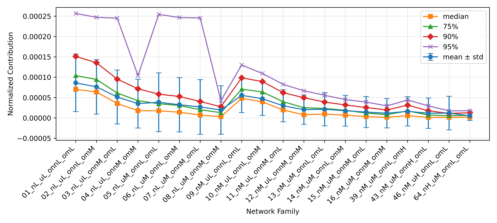
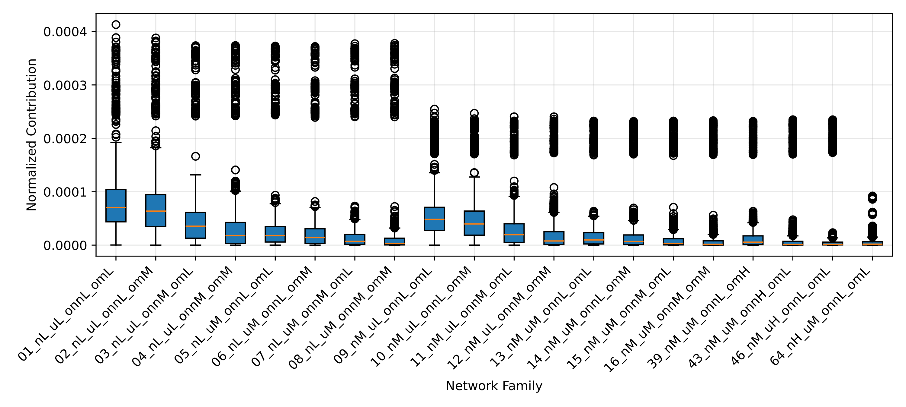

# Report 3 - Extend the experiment to larger networks after optimizations in FADDIS implementation

## Table of Contents

- [Optimizations in FADDIS implementation](#optimizations-in-faddis-implementation)
- [Networks](#networks)
- [Experience 9 (LAPIN-off + Extraction of K desired clusters)](#experience-9-lapin-off--extraction-of-k-desired-clusters)
- [Hardware](#hardware)
- [Discussion](#discussion)

## Optimizations in FADDIS implementation

1. Remove the stored sequence of matrices;
2. Replace deprecated 'np.matrix' for 'np.ndarray';
3. Replace reconstructions of 'np.arrays' with concatenated Python 'lists';
4. Replace 'numpy.linalg.eig' for 'numpy.linalg.eigh'.

## Networks

### LFR Network Parameterization

- $\overline{d}$ = 20
- $d_{max}$ = 50
- $c_{min}$ = 20
- $c_{max}$ = 100
- $t1$ = -2
- $t2$ = -1
- $n$ (4 groups):
  - L: [500, 700]
  - M: [800, 1000]
  - H: [2000, 5000]
  - VH: [6000, 10000]
- $\mu$ (3 groups):
  - L: [0.1, 0.3]
  - M: [0.4, 0.6]
  - H: [0.7, 0.8]
- $o_{n}$ / $n$ (3 groups):
  - L: [0.1, 0.2]
  - M: [0.3, 0.4]
  - H: [0.5, 0.6]
- $o_{m}$ (3 groups):
  - L: [2, 3]
  - M: [4, 5]
  - H: [6, 8]

### Network Families

| Network Family      | $n$           | $\mu$      | $o_{n}$/$n$| $o_{m}$|
|---------------------|---------------|------------|------------|--------|
| 01_nL_uL_onnL_omL   | [500, 700]    | [0.1, 0.3] | [0.1, 0.2] | [2, 3] |
| 02_nL_uL_onnL_omM   | [500, 700]    | [0.1, 0.3] | [0.1, 0.2] | [4, 5] |
| 03_nL_uL_onnL_omH   | [500, 700]    | [0.1, 0.3] | [0.1, 0.2] | [6, 8] |
| 04_nL_uL_onnM_omL   | [500, 700]    | [0.1, 0.3] | [0.3, 0.4] | [2, 3] |
| 05_nL_uL_onnM_omM   | [500, 700]    | [0.1, 0.3] | [0.3, 0.4] | [4, 5] |
| 06_nL_uL_onnM_omH   | [500, 700]    | [0.1, 0.3] | [0.3, 0.4] | [6, 8] |
| 07_nL_uL_onnH_omL   | [500, 700]    | [0.1, 0.3] | [0.5, 0.6] | [2, 3] |
| 08_nL_uL_onnH_omM   | [500, 700]    | [0.1, 0.3] | [0.5, 0.6] | [4, 5] |
| 09_nL_uL_onnH_omH   | [500, 700]    | [0.1, 0.3] | [0.5, 0.6] | [6, 8] |
| 10_nL_uM_onnL_omL   | [500, 700]    | [0.4, 0.6] | [0.1, 0.2] | [2, 3] |
| 11_nL_uM_onnL_omM   | [500, 700]    | [0.4, 0.6] | [0.1, 0.2] | [4, 5] |
| 12_nL_uM_onnL_omH   | [500, 700]    | [0.4, 0.6] | [0.1, 0.2] | [6, 8] |
| 13_nL_uM_onnM_omL   | [500, 700]    | [0.4, 0.6] | [0.3, 0.4] | [2, 3] |
| 14_nL_uM_onnM_omM   | [500, 700]    | [0.4, 0.6] | [0.3, 0.4] | [4, 5] |
| 15_nL_uM_onnM_omH   | [500, 700]    | [0.4, 0.6] | [0.3, 0.4] | [6, 8] |
| 16_nL_uM_onnH_omL   | [500, 700]    | [0.4, 0.6] | [0.5, 0.6] | [2, 3] |
| 17_nL_uM_onnH_omM   | [500, 700]    | [0.4, 0.6] | [0.5, 0.6] | [4, 5] |
| 18_nL_uM_onnH_omH   | [500, 700]    | [0.4, 0.6] | [0.5, 0.6] | [6, 8] |
| 19_nL_uH_onnL_omL   | [500, 700]    | [0.7, 0.8] | [0.1, 0.2] | [2, 3] |
| 20_nL_uH_onnL_omM   | [500, 700]    | [0.7, 0.8] | [0.1, 0.2] | [4, 5] |
| 21_nL_uH_onnL_omH   | [500, 700]    | [0.7, 0.8] | [0.1, 0.2] | [6, 8] |
| 22_nL_uH_onnM_omL   | [500, 700]    | [0.7, 0.8] | [0.3, 0.4] | [2, 3] |
| 23_nL_uH_onnM_omM   | [500, 700]    | [0.7, 0.8] | [0.3, 0.4] | [4, 5] |
| 24_nL_uH_onnM_omH   | [500, 700]    | [0.7, 0.8] | [0.3, 0.4] | [6, 8] |
| 25_nL_uH_onnH_omL   | [500, 700]    | [0.7, 0.8] | [0.5, 0.6] | [2, 3] |
| 26_nL_uH_onnH_omM   | [500, 700]    | [0.7, 0.8] | [0.5, 0.6] | [4, 5] |
| 27_nL_uH_onnH_omH   | [500, 700]    | [0.7, 0.8] | [0.5, 0.6] | [6, 8] |
| 28_nM_uL_onnL_omL   | [800, 1000]   | [0.1, 0.3] | [0.1, 0.2] | [2, 3] |
| 29_nM_uL_onnL_omM   | [800, 1000]   | [0.1, 0.3] | [0.1, 0.2] | [4, 5] |
| 30_nM_uL_onnL_omH   | [800, 1000]   | [0.1, 0.3] | [0.1, 0.2] | [6, 8] |
| 31_nM_uL_onnM_omL   | [800, 1000]   | [0.1, 0.3] | [0.3, 0.4] | [2, 3] |
| 32_nM_uL_onnM_omM   | [800, 1000]   | [0.1, 0.3] | [0.3, 0.4] | [4, 5] |
| 33_nM_uL_onnM_omH   | [800, 1000]   | [0.1, 0.3] | [0.3, 0.4] | [6, 8] |
| 34_nM_uL_onnH_omL   | [800, 1000]   | [0.1, 0.3] | [0.5, 0.6] | [2, 3] |
| 35_nM_uL_onnH_omM   | [800, 1000]   | [0.1, 0.3] | [0.5, 0.6] | [4, 5] |
| 36_nM_uL_onnH_omH   | [800, 1000]   | [0.1, 0.3] | [0.5, 0.6] | [6, 8] |
| 37_nM_uM_onnL_omL   | [800, 1000]   | [0.4, 0.6] | [0.1, 0.2] | [2, 3] |
| 38_nM_uM_onnL_omM   | [800, 1000]   | [0.4, 0.6] | [0.1, 0.2] | [4, 5] |
| 39_nM_uM_onnL_omH   | [800, 1000]   | [0.4, 0.6] | [0.1, 0.2] | [6, 8] |
| 40_nM_uM_onnM_omL   | [800, 1000]   | [0.4, 0.6] | [0.3, 0.4] | [2, 3] |
| 41_nM_uM_onnM_omM   | [800, 1000]   | [0.4, 0.6] | [0.3, 0.4] | [4, 5] |
| 42_nM_uM_onnM_omH   | [800, 1000]   | [0.4, 0.6] | [0.3, 0.4] | [6, 8] |
| 43_nM_uM_onnH_omL   | [800, 1000]   | [0.4, 0.6] | [0.5, 0.6] | [2, 3] |
| 44_nM_uM_onnH_omM   | [800, 1000]   | [0.4, 0.6] | [0.5, 0.6] | [4, 5] |
| 45_nM_uM_onnH_omH   | [800, 1000]   | [0.4, 0.6] | [0.5, 0.6] | [6, 8] |
| 46_nM_uH_onnL_omL   | [800, 1000]   | [0.7, 0.8] | [0.1, 0.2] | [2, 3] |
| 47_nM_uH_onnL_omM   | [800, 1000]   | [0.7, 0.8] | [0.1, 0.2] | [4, 5] |
| 48_nM_uH_onnL_omH   | [800, 1000]   | [0.7, 0.8] | [0.1, 0.2] | [6, 8] |
| 49_nM_uH_onnM_omL   | [800, 1000]   | [0.7, 0.8] | [0.3, 0.4] | [2, 3] |
| 50_nM_uH_onnM_omM   | [800, 1000]   | [0.7, 0.8] | [0.3, 0.4] | [4, 5] |
| 51_nM_uH_onnM_omH   | [800, 1000]   | [0.7, 0.8] | [0.3, 0.4] | [6, 8] |
| 52_nM_uH_onnH_omL   | [800, 1000]   | [0.7, 0.8] | [0.5, 0.6] | [2, 3] |
| 53_nM_uH_onnH_omM   | [800, 1000]   | [0.7, 0.8] | [0.5, 0.6] | [4, 5] |
| 54_nM_uH_onnH_omH   | [800, 1000]   | [0.7, 0.8] | [0.5, 0.6] | [6, 8] |
| 55_nH_uL_onnL_omL   | [2000, 5000]  | [0.1, 0.3] | [0.1, 0.2] | [2, 3] |
| 56_nH_uL_onnL_omM   | [2000, 5000]  | [0.1, 0.3] | [0.1, 0.2] | [4, 5] |
| 57_nH_uL_onnL_omH   | [2000, 5000]  | [0.1, 0.3] | [0.1, 0.2] | [6, 8] |
| 58_nH_uL_onnM_omL   | [2000, 5000]  | [0.1, 0.3] | [0.3, 0.4] | [2, 3] |
| 59_nH_uL_onnM_omM   | [2000, 5000]  | [0.1, 0.3] | [0.3, 0.4] | [4, 5] |
| 60_nH_uL_onnM_omH   | [2000, 5000]  | [0.1, 0.3] | [0.3, 0.4] | [6, 8] |
| 61_nH_uL_onnH_omL   | [2000, 5000]  | [0.1, 0.3] | [0.5, 0.6] | [2, 3] |
| 62_nH_uL_onnH_omM   | [2000, 5000]  | [0.1, 0.3] | [0.5, 0.6] | [4, 5] |
| 63_nH_uL_onnH_omH   | [2000, 5000]  | [0.1, 0.3] | [0.5, 0.6] | [6, 8] |
| 64_nH_uM_onnL_omL   | [2000, 5000]  | [0.4, 0.6] | [0.1, 0.2] | [2, 3] |
| 65_nH_uM_onnL_omM   | [2000, 5000]  | [0.4, 0.6] | [0.1, 0.2] | [4, 5] |
| 66_nH_uM_onnL_omH   | [2000, 5000]  | [0.4, 0.6] | [0.1, 0.2] | [6, 8] |
| 67_nH_uM_onnM_omL   | [2000, 5000]  | [0.4, 0.6] | [0.3, 0.4] | [2, 3] |
| 68_nH_uM_onnM_omM   | [2000, 5000]  | [0.4, 0.6] | [0.3, 0.4] | [4, 5] |
| 69_nH_uM_onnM_omH   | [2000, 5000]  | [0.4, 0.6] | [0.3, 0.4] | [6, 8] |
| 70_nH_uM_onnH_omL   | [2000, 5000]  | [0.4, 0.6] | [0.5, 0.6] | [2, 3] |
| 71_nH_uM_onnH_omM   | [2000, 5000]  | [0.4, 0.6] | [0.5, 0.6] | [4, 5] |
| 72_nH_uM_onnH_omH   | [2000, 5000]  | [0.4, 0.6] | [0.5, 0.6] | [6, 8] |
| 73_nH_uH_onnL_omL   | [2000, 5000]  | [0.7, 0.8] | [0.1, 0.2] | [2, 3] |
| 74_nH_uH_onnL_omM   | [2000, 5000]  | [0.7, 0.8] | [0.1, 0.2] | [4, 5] |
| 75_nH_uH_onnL_omH   | [2000, 5000]  | [0.7, 0.8] | [0.1, 0.2] | [6, 8] |
| 76_nH_uH_onnM_omL   | [2000, 5000]  | [0.7, 0.8] | [0.3, 0.4] | [2, 3] |
| 77_nH_uH_onnM_omM   | [2000, 5000]  | [0.7, 0.8] | [0.3, 0.4] | [4, 5] |
| 78_nH_uH_onnM_omH   | [2000, 5000]  | [0.7, 0.8] | [0.3, 0.4] | [6, 8] |
| 79_nH_uH_onnH_omL   | [2000, 5000]  | [0.7, 0.8] | [0.5, 0.6] | [2, 3] |
| 80_nH_uH_onnH_omM   | [2000, 5000]  | [0.7, 0.8] | [0.5, 0.6] | [4, 5] |
| 81_nH_uH_onnH_omH   | [2000, 5000]  | [0.7, 0.8] | [0.5, 0.6] | [6, 8] |
| 82_nVH_uL_onnL_omL  | [6000, 10000] | [0.1, 0.3] | [0.1, 0.2] | [2, 3] |
| 83_nVH_uL_onnL_omM  | [6000, 10000] | [0.1, 0.3] | [0.1, 0.2] | [4, 5] |
| 84_nVH_uL_onnL_omH  | [6000, 10000] | [0.1, 0.3] | [0.1, 0.2] | [6, 8] |
| 85_nVH_uL_onnM_omL  | [6000, 10000] | [0.1, 0.3] | [0.3, 0.4] | [2, 3] |
| 86_nVH_uL_onnM_omM  | [6000, 10000] | [0.1, 0.3] | [0.3, 0.4] | [4, 5] |
| 87_nVH_uL_onnM_omH  | [6000, 10000] | [0.1, 0.3] | [0.3, 0.4] | [6, 8] |
| 88_nVH_uL_onnH_omL  | [6000, 10000] | [0.1, 0.3] | [0.5, 0.6] | [2, 3] |
| 89_nVH_uL_onnH_omM  | [6000, 10000] | [0.1, 0.3] | [0.5, 0.6] | [4, 5] |
| 90_nVH_uL_onnH_omH  | [6000, 10000] | [0.1, 0.3] | [0.5, 0.6] | [6, 8] |
| 91_nVH_uM_onnL_omL  | [6000, 10000] | [0.4, 0.6] | [0.1, 0.2] | [2, 3] |
| 92_nVH_uM_onnL_omM  | [6000, 10000] | [0.4, 0.6] | [0.1, 0.2] | [4, 5] |
| 93_nVH_uM_onnL_omH  | [6000, 10000] | [0.4, 0.6] | [0.1, 0.2] | [6, 8] |
| 94_nVH_uM_onnM_omL  | [6000, 10000] | [0.4, 0.6] | [0.3, 0.4] | [2, 3] |
| 95_nVH_uM_onnM_omM  | [6000, 10000] | [0.4, 0.6] | [0.3, 0.4] | [4, 5] |
| 96_nVH_uM_onnM_omH  | [6000, 10000] | [0.4, 0.6] | [0.3, 0.4] | [6, 8] |
| 97_nVH_uM_onnH_omL  | [6000, 10000] | [0.4, 0.6] | [0.5, 0.6] | [2, 3] |
| 98_nVH_uM_onnH_omM  | [6000, 10000] | [0.4, 0.6] | [0.5, 0.6] | [4, 5] |
| 99_nVH_uM_onnH_omH  | [6000, 10000] | [0.4, 0.6] | [0.5, 0.6] | [6, 8] |
| 100_nVH_uH_onnL_omL | [6000, 10000] | [0.7, 0.8] | [0.1, 0.2] | [2, 3] |
| 101_nVH_uH_onnL_omM | [6000, 10000] | [0.7, 0.8] | [0.1, 0.2] | [4, 5] |
| 102_nVH_uH_onnL_omH | [6000, 10000] | [0.7, 0.8] | [0.1, 0.2] | [6, 8] |
| 103_nVH_uH_onnM_omL | [6000, 10000] | [0.7, 0.8] | [0.3, 0.4] | [2, 3] |
| 104_nVH_uH_onnM_omM | [6000, 10000] | [0.7, 0.8] | [0.3, 0.4] | [4, 5] |
| 105_nVH_uH_onnM_omH | [6000, 10000] | [0.7, 0.8] | [0.3, 0.4] | [6, 8] |
| 106_nVH_uH_onnH_omL | [6000, 10000] | [0.7, 0.8] | [0.5, 0.6] | [2, 3] |
| 107_nVH_uH_onnH_omM | [6000, 10000] | [0.7, 0.8] | [0.5, 0.6] | [4, 5] |
| 108_nVH_uH_onnH_omH | [6000, 10000] | [0.7, 0.8] | [0.5, 0.6] | [6, 8] |

### Networks for Each Network Family

- $\overline{d}$: fixed
  - (20)
- $d_{max}$: fixed
  - (50)
- $c_{min}$: fixed
  - (20)
- $c_{max}$: fixed
  - (100)
- $t1$: fixed
  - (2.0)
- $t2$: fixed
  - (1.0)
- $n$: step 100 or 1000 or 2000
  - L: (500 600 700)
  - M: (800 900 1000)
  - H: (2000 3000 5000)
  - VH: (6000 8000 10000)
- $\mu$: step 0.1 or 0.05
  - L: (0.1 0.2 0.3)
  - M: (0.4 0.5 0.6)
  - H: (0.7 0.75 0.8)
- $o_{n}$/$n$: step 0.1
  - L: (10 20)
  - M: (30 40)
  - H: (50 60)
- $o_{m}$: step 1 or 2
  - L: (2 3)
  - M: (4 5)
  - H: (6 8)
- Instances: 2

**Networks for Each Network Family: 3 ($n$) * 3 ($\mu$) * 2 ($o_{n}$/$n$) * 2 ($o_{m}$) * 2 (instances) = 72 networks**

**Total Networks: 108 (families) * 3 ($n$) * 3 ($\mu$) * 2 ($o_{n}$/$n$) * 2 ($o_{m}$) * 2 (instances) = 7776 networks**

**NOTE**: The total number of networks is quite large (7776), which make the computation computationally intensive. Therefore, the 16 base network families from [Report 1](./report1.md) (combinations of L/M for $n$, $\mu$, $o_{n}$/$n$ and $o_m$) are used to ensure robustness in the experiment, and only the necessary network families with larger parameters are computed.

### Reduced Network Families

**NOTE**: The range of very high networks was excluded because further optimizations are needed first (FADDIS version-a top-e and use of GPUs), and that will be future work.

| Network Family          | $n$           | $\mu$      | $o_{n}$/$n$ | $o_{m}$ |
|-------------------------|---------------|------------|-------------|---------|
| 01_nL_uL_onnL_omL       | [500, 700]    | [0.1, 0.3] | [0.1, 0.2]  | [2, 3]  |
| 02_nL_uL_onnL_omM       | [500, 700]    | [0.1, 0.3] | [0.1, 0.2]  | [4, 5]  |
| 03_nL_uL_onnM_omL       | [500, 700]    | [0.1, 0.3] | [0.3, 0.4]  | [2, 3]  |
| 04_nL_uL_onnM_omM       | [500, 700]    | [0.1, 0.3] | [0.3, 0.4]  | [4, 5]  |
| 05_nL_uM_onnL_omL       | [500, 700]    | [0.4, 0.6] | [0.1, 0.2]  | [2, 3]  |
| 06_nL_uM_onnL_omM       | [500, 700]    | [0.4, 0.6] | [0.1, 0.2]  | [4, 5]  |
| 07_nL_uM_onnM_omL       | [500, 700]    | [0.4, 0.6] | [0.3, 0.4]  | [2, 3]  |
| 08_nL_uM_onnM_omM       | [500, 700]    | [0.4, 0.6] | [0.3, 0.4]  | [4, 5]  |
| 09_nM_uL_onnL_omL       | [800, 1000]   | [0.1, 0.3] | [0.1, 0.2]  | [2, 3]  |
| 10_nM_uL_onnL_omM       | [800, 1000]   | [0.1, 0.3] | [0.1, 0.2]  | [4, 5]  |
| 11_nM_uL_onnM_omL       | [800, 1000]   | [0.1, 0.3] | [0.3, 0.4]  | [2, 3]  |
| 12_nM_uL_onnM_omM       | [800, 1000]   | [0.1, 0.3] | [0.3, 0.4]  | [4, 5]  |
| 13_nM_uM_onnL_omL       | [800, 1000]   | [0.4, 0.6] | [0.1, 0.2]  | [2, 3]  |
| 14_nM_uM_onnL_omM       | [800, 1000]   | [0.4, 0.6] | [0.1, 0.2]  | [4, 5]  |
| 15_nM_uM_onnM_omL       | [800, 1000]   | [0.4, 0.6] | [0.3, 0.4]  | [2, 3]  |
| 16_nM_uM_onnM_omM       | [800, 1000]   | [0.4, 0.6] | [0.3, 0.4]  | [4, 5]  |
| 39_nM_uM_onnL_omH       | [800, 1000]   | [0.4, 0.6] | [0.1, 0.2]  | [6, 8]  |
| 43_nM_uM_onnH_omL       | [800, 1000]   | [0.4, 0.6] | [0.5, 0.6]  | [2, 3]  |
| 46_nM_uH_onnL_omL       | [800, 1000]   | [0.7, 0.8] | [0.1, 0.2]  | [2, 3]  |
| 64_nH_uM_onnL_omL       | [2000, 5000]  | [0.4, 0.6] | [0.1, 0.2]  | [2, 3]  |

**Networks for Each Network Family: 3 ($n$) * 3 ($\mu$) * 2 ($o_{n}$/$n$) * 2 ($o_{m}$) * 2 (instances) = 72 networks**

**Total Networks: 20 (families) * 3 ($n$) * 3 ($\mu$) * 2 ($o_{n}$/$n$) * 2 ($o_{m}$) * 2 (instances) = 1440 networks**

## Experience 9 (LAPIN-off + Extraction of K desired clusters)

### Contributions Line Plots

[Open Folder](../results/synthetic/experience9_cluster/results_2026-04-28_21-51-06-981808/)

### Statistics

| Network Family    | #Networks | Mean                   | Std                    | Median                 | 75%                    | 90%                    | 95%                    | Min                    | Max                    |
|-------------------|-----------|------------------------|------------------------|------------------------|------------------------|------------------------|------------------------|------------------------|------------------------|
| 01_nL_uL_onnL_omL | 72        | 8.63132896038744e-05   | 7.075896410038747e-05  | 7.041848604468066e-05  | 0.00010417201763888729 | 0.00015114103459435267 | 0.0002566762922469874  | 2.1814847632378542e-07 | 0.0004130367768598989  |
| 02_nL_uL_onnL_omM | 72        | 7.627940523607497e-05  | 6.691765043802764e-05  | 6.371008417602246e-05  | 9.450721746529167e-05  | 0.00013557864450402108 | 0.00024725408308486855 | 1.6264253340418218e-09 | 0.0003880096063772814  |
| 03_nL_uL_onnM_omL | 72        | 5.145441517201867e-05  | 6.622018788078566e-05  | 3.55225686303996e-05   | 6.118964922389605e-05  | 9.540280194356344e-05  | 0.00024522972012529107 | 2.173150015273568e-10  | 0.0003734073673469267  |
| 04_nL_uL_onnM_omM | 72        | 3.519051668980114e-05  | 5.9975332634838206e-05 | 1.7834634092090344e-05 | 4.239485058938036e-05  | 7.157237249812772e-05  | 0.00010402998634334285 | 1.1189229264110884e-14 | 0.0003737772592442533  |
| 05_nL_uM_onnL_omL | 72        | 3.857619129775897e-05  | 7.224411427742824e-05  | 1.760087854495113e-05  | 3.490357534254181e-05  | 5.841370977025466e-05  | 0.0002544730024867853  | 1.74544557900563e-08   | 0.00037278521293997093 |
| 06_nL_uM_onnL_omM | 72        | 3.2475954098895995e-05 | 6.668458171190511e-05  | 1.409580281139142e-05  | 3.060124878846159e-05  | 5.276100738648031e-05  | 0.00024667880465390266 | 1.3094305423126197e-11 | 0.00037205281953863086 |
| 07_nL_uM_onnM_omL | 72        | 2.6962306898540117e-05 | 6.715446274574327e-05  | 7.100304600777862e-06  | 2.022952675709426e-05  | 4.030616777222529e-05  | 0.0002456927210890273  | 2.8101006389575386e-12 | 0.0003772723484587213  |
| 08_nL_uM_onnM_omM | 72        | 1.9458497698607535e-05 | 5.962597067523425e-05  | 3.1300602522422143e-06 | 1.301200351135368e-05  | 2.7520526332320424e-05 | 4.27424807926795e-05   | 2.5175768443346173e-24 | 0.0003777905670903819  |
| 09_nM_uL_onnL_omL | 72        | 5.559471844509508e-05  | 4.261781195828126e-05  | 4.823054381463032e-05  | 7.08187057119336e-05   | 9.848960226246443e-05  | 0.0001302230861500802  | 2.2101183064177545e-08 | 0.00025477335558011876 |
| 10_nM_uL_onnL_omM | 72        | 4.713855939463825e-05  | 4.111213593189357e-05  | 3.965159205175901e-05  | 6.377491616300438e-05  | 8.937326346796171e-05  | 0.00010922685341722193 | 5.011591394050306e-09  | 0.0002468708216536695  |
| 11_nM_uL_onnM_omL | 72        | 2.9932140582090894e-05 | 3.9489819920953514e-05 | 1.9484360269484806e-05 | 3.996824996892851e-05  | 6.20714410996722e-05   | 8.248631768813678e-05  | 8.771820459273839e-11  | 0.00024043196177684275 |
| 12_nM_uL_onnM_omM | 72        | 2.0436319673328856e-05 | 3.604241044794265e-05  | 7.745385699331224e-06  | 2.516887535084135e-05  | 4.972556935001106e-05  | 6.679946971261794e-05  | 2.7193187597167954e-24 | 0.00024039217123974387 |
| 13_nM_uM_onnL_omL | 72        | 2.136442943369807e-05  | 4.0853334335997076e-05 | 9.712261209652882e-06  | 2.318773542002135e-05  | 3.892785097950698e-05  | 5.5695069944385835e-05 | 4.019734269363831e-13  | 0.00023247626861168808 |
| 14_nM_uM_onnL_omM | 72        | 1.765265815031617e-05  | 3.780728403819505e-05  | 6.847625994932702e-06  | 1.9013181180132314e-05 | 3.1941893099427344e-05 | 4.508569531451307e-05  | 3.484974011017086e-23  | 0.0002317928692349837  |
| 15_nM_uM_onnM_omL | 72        | 1.4402214212570092e-05 | 3.8228825396708874e-05 | 3.267998361807228e-06  | 1.187502706682049e-05  | 2.5499760746126346e-05 | 3.9025565533874315e-05 | 7.954992525192198e-23  | 0.00023252372671413271 |
| 16_nM_uM_onnM_omM | 72        | 1.1590252220452215e-05 | 3.594533191227532e-05  | 1.6519292187457004e-06 | 8.08876516994435e-06   | 1.9717718780702e-05    | 2.9622506272458955e-05 | 5.3499814458462915e-25 | 0.0002330990053086213  |
| 39_nM_uM_onnL_omH | 72        | 1.6255025680008422e-05 | 3.595455626161793e-05  | 5.567570996079995e-06  | 1.7336057099509218e-05 | 3.144129314340558e-05  | 4.417702400821972e-05  | 1.4469193946311624e-24 | 0.00023180326481907188 |
| 43_nM_uM_onnH_omL | 72        | 1.1602358969193138e-05 | 3.7309727154206366e-05 | 1.348363875801133e-06  | 7.1394498142128385e-06 | 1.7541881812306782e-05 | 2.9704891598293997e-05 | 9.044231315103238e-25  | 0.000234851089361834   |
| 46_nM_uH_onnL_omL | 72        | 1.193890820699696e-05  | 4.124523334470308e-05  | 1.5507912396150759e-06 | 5.610484571803961e-06  | 1.120205501570321e-05  | 1.7328750364010633e-05 | 5.154415406168791e-11  | 0.0002347882687369048  |
| 64_nH_uM_onnL_omL | 52        | 5.465236077277763e-06  | 1.1593237155152267e-05 | 1.8167903862702782e-06 | 6.183955955577961e-06  | 1.2647738521094852e-05 | 1.7805683705189513e-05 | 5.838953691020085e-25  | 9.206981951137042e-05  |

- #Total Networks: 1420

### Histograms

[Open Folder](../results/synthetic/experience9_cluster/results_2026-04-28_21-51-06-981808/)

### Line plot

### Box plot

### Candidate Thresholds

| Network Family    | Mean                   | Median                 | 75%                    | 90%                    | 95%                    |
|-------------------|------------------------|------------------------|------------------------|------------------------|------------------------|
| 01_nL_uL_onnL_omL | 8.63132896038744e-05   | 7.041848604468066e-05  | 0.00010417201763888729 | 0.00015114103459435267 | 0.0002566762922469874  |
| 02_nL_uL_onnL_omM | 7.627940523607497e-05  | 6.371008417602246e-05  | 9.450721746529167e-05  | 0.00013557864450402108 | 0.00024725408308486855 |
| 03_nL_uL_onnM_omL | 5.145441517201867e-05  | 3.55225686303996e-05   | 6.118964922389605e-05  | 9.540280194356344e-05  | 0.00024522972012529107 |
| 04_nL_uL_onnM_omM | 3.519051668980114e-05  | 1.7834634092090344e-05 | 4.239485058938036e-05  | 7.157237249812772e-05  | 0.00010402998634334285 |
| 05_nL_uM_onnL_omL | 3.857619129775897e-05  | 1.760087854495113e-05  | 3.490357534254181e-05  | 5.841370977025466e-05  | 0.0002544730024867853  |
| 06_nL_uM_onnL_omM | 3.2475954098895995e-05 | 1.409580281139142e-05  | 3.060124878846159e-05  | 5.276100738648031e-05  | 0.00024667880465390266 |
| 07_nL_uM_onnM_omL | 2.6962306898540117e-05 | 7.100304600777862e-06  | 2.022952675709426e-05  | 4.030616777222529e-05  | 0.0002456927210890273  |
| 08_nL_uM_onnM_omM | 1.9458497698607535e-05 | 3.1300602522422143e-06 | 1.301200351135368e-05  | 2.7520526332320424e-05 | 4.27424807926795e-05   |
| 09_nM_uL_onnL_omL | 5.559471844509508e-05  | 4.823054381463032e-05  | 7.08187057119336e-05   | 9.848960226246443e-05  | 0.0001302230861500802  |
| 10_nM_uL_onnL_omM | 4.713855939463825e-05  | 3.965159205175901e-05  | 6.377491616300438e-05  | 8.937326346796171e-05  | 0.00010922685341722193 |
| 11_nM_uL_onnM_omL | 2.9932140582090894e-05 | 1.9484360269484806e-05 | 3.996824996892851e-05  | 6.20714410996722e-05   | 8.248631768813678e-05  |
| 12_nM_uL_onnM_omM | 2.0436319673328856e-05 | 7.745385699331224e-06  | 2.516887535084135e-05  | 4.972556935001106e-05  | 6.679946971261794e-05  |
| 13_nM_uM_onnL_omL | 2.136442943369807e-05  | 9.712261209652882e-06  | 2.318773542002135e-05  | 3.892785097950698e-05  | 5.5695069944385835e-05 |
| 14_nM_uM_onnL_omM | 1.765265815031617e-05  | 6.847625994932702e-06  | 1.9013181180132314e-05 | 3.1941893099427344e-05 | 4.508569531451307e-05  |
| 15_nM_uM_onnM_omL | 1.4402214212570092e-05 | 3.267998361807228e-06  | 1.187502706682049e-05  | 2.5499760746126346e-05 | 3.9025565533874315e-05 |
| 16_nM_uM_onnM_omM | 1.1590252220452215e-05 | 1.6519292187457004e-06 | 8.08876516994435e-06   | 1.9717718780702e-05    | 2.9622506272458955e-05 |
| 39_nM_uM_onnL_omH | 1.6255025680008422e-05 | 5.567570996079995e-06  | 1.7336057099509218e-05 | 3.144129314340558e-05  | 4.417702400821972e-05  |
| 43_nM_uM_onnH_omL | 1.1602358969193138e-05 | 1.348363875801133e-06  | 7.1394498142128385e-06 | 1.7541881812306782e-05 | 2.9704891598293997e-05 |
| 46_nM_uH_onnL_omL | 1.193890820699696e-05  | 1.5507912396150759e-06 | 5.610484571803961e-06  | 1.120205501570321e-05  | 1.7328750364010633e-05 |
| 64_nH_uM_onnL_omL | 5.465236077277763e-06  | 1.8167903862702782e-06 | 6.183955955577961e-06  | 1.2647738521094852e-05 | 1.7805683705189513e-05 |

### Bootstrap Statistics

| Network Family    | #Networks | Subsample Size | #Bootstraps | Metric | Candidate Threshold    | MSE                    |
|-------------------|-----------|----------------|-------------|--------|------------------------|------------------------|
| 01_nL_uL_onnL_omL | 72        | 58             | 1000        | Mean   | 8.63132896038744e-05   | 1.0686932957012814e-06 |
| 01_nL_uL_onnL_omL | 72        | 58             | 1000        | Median | 7.041848604468066e-05  | 7.152571550442427e-07  |
| 01_nL_uL_onnL_omL | 72        | 58             | 1000        | 75%    | 0.00010417201763888729 | 1.5568764261595826e-06 |
| 01_nL_uL_onnL_omL | 72        | 58             | 1000        | 90%    | 0.00015114103459435267 | 3.360239655590544e-06  |
| 01_nL_uL_onnL_omL | 72        | 58             | 1000        | 95%    | 0.0002566762922469874  | 9.686861645476528e-06  |
| 02_nL_uL_onnL_omM | 72        | 58             | 1000        | Mean   | 7.627940523607497e-05  | 6.936465732109851e-07  |
| 02_nL_uL_onnL_omM | 72        | 58             | 1000        | Median | 6.371008417602246e-05  | 4.843891242605356e-07  |
| 02_nL_uL_onnL_omM | 72        | 58             | 1000        | 75%    | 9.450721746529167e-05  | 1.054889748679338e-06  |
| 02_nL_uL_onnL_omM | 72        | 58             | 1000        | 90%    | 0.00013557864450402108 | 2.1798693922248415e-06 |
| 02_nL_uL_onnL_omM | 72        | 58             | 1000        | 95%    | 0.00024725408308486855 | 7.1700705560736255e-06 |
| 03_nL_uL_onnM_omL | 72        | 58             | 1000        | Mean   | 5.145441517201867e-05  | 7.390717102614523e-07  |
| 03_nL_uL_onnM_omL | 72        | 58             | 1000        | Median | 3.55225686303996e-05   | 3.512536320115343e-07  |
| 03_nL_uL_onnM_omL | 72        | 58             | 1000        | 75%    | 6.118964922389605e-05  | 1.0476660676005175e-06 |
| 03_nL_uL_onnM_omL | 72        | 58             | 1000        | 90%    | 9.540280194356344e-05  | 2.4845713931419528e-06 |
| 03_nL_uL_onnM_omL | 72        | 58             | 1000        | 95%    | 0.00024522972012529107 | 1.601841252774113e-05  |
| 04_nL_uL_onnM_omM | 72        | 58             | 1000        | Mean   | 3.519051668980114e-05  | 4.08227886348681e-07   |
| 04_nL_uL_onnM_omM | 72        | 58             | 1000        | Median | 1.7834634092090344e-05 | 1.0261243115075622e-07 |
| 04_nL_uL_onnM_omM | 72        | 58             | 1000        | 75%    | 4.239485058938036e-05  | 5.90427672800672e-07   |
| 04_nL_uL_onnM_omM | 72        | 58             | 1000        | 90%    | 7.157237249812772e-05  | 1.684039994239069e-06  |
| 04_nL_uL_onnM_omM | 72        | 58             | 1000        | 95%    | 0.00010402998634334285 | 3.412165939903422e-06  |
| 05_nL_uM_onnL_omL | 72        | 58             | 1000        | Mean   | 3.857619129775897e-05  | 1.1717728998540104e-06 |
| 05_nL_uM_onnL_omL | 72        | 58             | 1000        | Median | 1.760087854495113e-05  | 2.465469716157313e-07  |
| 05_nL_uM_onnL_omL | 72        | 58             | 1000        | 75%    | 3.490357534254181e-05  | 9.676698986417815e-07  |
| 05_nL_uM_onnL_omL | 72        | 58             | 1000        | 90%    | 5.841370977025466e-05  | 2.6716094806206927e-06 |
| 05_nL_uM_onnL_omL | 72        | 58             | 1000        | 95%    | 0.0002544730024867853  | 5.229944658602145e-05  |
| 06_nL_uM_onnL_omM | 72        | 58             | 1000        | Mean   | 3.2475954098895995e-05 | 7.8367468626275e-07    |
| 06_nL_uM_onnL_omM | 72        | 58             | 1000        | Median | 1.409580281139142e-05  | 1.429990886410625e-07  |
| 06_nL_uM_onnL_omM | 72        | 58             | 1000        | 75%    | 3.060124878846159e-05  | 6.885589188498734e-07  |
| 06_nL_uM_onnL_omM | 72        | 58             | 1000        | 90%    | 5.276100738648031e-05  | 2.0178758868386018e-06 |
| 06_nL_uM_onnL_omM | 72        | 58             | 1000        | 95%    | 0.00024667880465390266 | 4.408245694008782e-05  |
| 07_nL_uM_onnM_omL | 72        | 58             | 1000        | Mean   | 2.6962306898540117e-05 | 7.876434639659786e-07  |
| 07_nL_uM_onnM_omL | 72        | 58             | 1000        | Median | 7.100304600777862e-06  | 5.5952895620014725e-08 |
| 07_nL_uM_onnM_omL | 72        | 58             | 1000        | 75%    | 2.022952675709426e-05  | 4.435235521298886e-07  |
| 07_nL_uM_onnM_omL | 72        | 58             | 1000        | 90%    | 4.030616777222529e-05  | 1.7534166268945572e-06 |
| 07_nL_uM_onnM_omL | 72        | 58             | 1000        | 95%    | 0.0002456927210890273  | 6.28871880021917e-05   |
| 08_nL_uM_onnM_omM | 72        | 58             | 1000        | Mean   | 1.9458497698607535e-05 | 4.5942808902874595e-07 |
| 08_nL_uM_onnM_omM | 72        | 58             | 1000        | Median | 3.1300602522422143e-06 | 1.2117941010131031e-08 |
| 08_nL_uM_onnM_omM | 72        | 58             | 1000        | 75%    | 1.301200351135368e-05  | 2.0273243345897404e-07 |
| 08_nL_uM_onnM_omM | 72        | 58             | 1000        | 90%    | 2.7520526332320424e-05 | 9.2533486147175e-07    |
| 08_nL_uM_onnM_omM | 72        | 58             | 1000        | 95%    | 4.27424807926795e-05   | 2.2800638861950442e-06 |
| 09_nM_uL_onnL_omL | 72        | 58             | 1000        | Mean   | 5.559471844509508e-05  | 4.97775361887275e-07   |
| 09_nM_uL_onnL_omL | 72        | 58             | 1000        | Median | 4.823054381463032e-05  | 3.7819358494137744e-07 |
| 09_nM_uL_onnL_omL | 72        | 58             | 1000        | 75%    | 7.08187057119336e-05   | 8.171849068347392e-07  |
| 09_nM_uL_onnL_omL | 72        | 58             | 1000        | 90%    | 9.848960226246443e-05  | 1.5618032049058585e-06 |
| 09_nM_uL_onnL_omL | 72        | 58             | 1000        | 95%    | 0.0001302230861500802  | 2.609027429667407e-06  |
| 10_nM_uL_onnL_omM | 72        | 58             | 1000        | Mean   | 4.713855939463825e-05  | 3.2421589893504197e-07 |
| 10_nM_uL_onnL_omM | 72        | 58             | 1000        | Median | 3.965159205175901e-05  | 2.3123036068609766e-07 |
| 10_nM_uL_onnL_omM | 72        | 58             | 1000        | 75%    | 6.377491616300438e-05  | 5.950246072196271e-07  |
| 10_nM_uL_onnL_omM | 72        | 58             | 1000        | 90%    | 8.937326346796171e-05  | 1.1672922666703672e-06 |
| 10_nM_uL_onnL_omM | 72        | 58             | 1000        | 95%    | 0.00010922685341722193 | 1.6894543185453327e-06 |
| 11_nM_uL_onnM_omL | 72        | 58             | 1000        | Mean   | 2.9932140582090894e-05 | 3.620582251482607e-07  |
| 11_nM_uL_onnM_omL | 72        | 58             | 1000        | Median | 1.9484360269484806e-05 | 1.541427413300666e-07  |
| 11_nM_uL_onnM_omL | 72        | 58             | 1000        | 75%    | 3.996824996892851e-05  | 6.36137411422248e-07   |
| 11_nM_uL_onnM_omL | 72        | 58             | 1000        | 90%    | 6.20714410996722e-05   | 1.5326342673387182e-06 |
| 11_nM_uL_onnM_omL | 72        | 58             | 1000        | 95%    | 8.248631768813678e-05  | 2.726481792359185e-06  |
| 12_nM_uL_onnM_omM | 72        | 58             | 1000        | Mean   | 2.0436319673328856e-05 | 2.2599062440875837e-07 |
| 12_nM_uL_onnM_omM | 72        | 58             | 1000        | Median | 7.745385699331224e-06  | 3.2893331836114565e-08 |
| 12_nM_uL_onnM_omM | 72        | 58             | 1000        | 75%    | 2.516887535084135e-05  | 3.4512474471766514e-07 |
| 12_nM_uL_onnM_omM | 72        | 58             | 1000        | 90%    | 4.972556935001106e-05  | 1.3193595303371676e-06 |
| 12_nM_uL_onnM_omM | 72        | 58             | 1000        | 95%    | 6.679946971261794e-05  | 2.388871326306754e-06  |
| 13_nM_uM_onnL_omL | 72        | 58             | 1000        | Mean   | 2.136442943369807e-05  | 5.59031085796405e-07   |
| 13_nM_uM_onnL_omL | 72        | 58             | 1000        | Median | 9.712261209652882e-06  | 1.1581011701658106e-07 |
| 13_nM_uM_onnL_omL | 72        | 58             | 1000        | 75%    | 2.318773542002135e-05  | 6.432010986121325e-07  |
| 13_nM_uM_onnL_omL | 72        | 58             | 1000        | 90%    | 3.892785097950698e-05  | 1.8669605757703658e-06 |
| 13_nM_uM_onnL_omL | 72        | 58             | 1000        | 95%    | 5.5695069944385835e-05 | 3.836589942392364e-06  |
| 14_nM_uM_onnL_omM | 72        | 58             | 1000        | Mean   | 1.765265815031617e-05  | 3.9071720871658053e-07 |
| 14_nM_uM_onnL_omM | 72        | 58             | 1000        | Median | 6.847625994932702e-06  | 5.981322119642959e-08  |
| 14_nM_uM_onnL_omM | 72        | 58             | 1000        | 75%    | 1.9013181180132314e-05 | 4.446753559774484e-07  |
| 14_nM_uM_onnL_omM | 72        | 58             | 1000        | 90%    | 3.1941893099427344e-05 | 1.28817279737014e-06   |
| 14_nM_uM_onnL_omM | 72        | 58             | 1000        | 95%    | 4.508569531451307e-05  | 2.517996700884873e-06  |
| 15_nM_uM_onnM_omL | 72        | 58             | 1000        | Mean   | 1.4402214212570092e-05 | 4.097209763972604e-07  |
| 15_nM_uM_onnM_omL | 72        | 58             | 1000        | Median | 3.267998361807228e-06  | 2.1874589370363244e-08 |
| 15_nM_uM_onnM_omL | 72        | 58             | 1000        | 75%    | 1.187502706682049e-05  | 2.7614650447201463e-07 |
| 15_nM_uM_onnM_omL | 72        | 58             | 1000        | 90%    | 2.5499760746126346e-05 | 1.255709508821763e-06  |
| 15_nM_uM_onnM_omL | 72        | 58             | 1000        | 95%    | 3.9025565533874315e-05 | 3.0453215176732234e-06 |
| 16_nM_uM_onnM_omM | 72        | 58             | 1000        | Mean   | 1.1590252220452215e-05 | 3.1495481273480276e-07 |
| 16_nM_uM_onnM_omM | 72        | 58             | 1000        | Median | 1.6519292187457004e-06 | 6.526761404878413e-09  |
| 16_nM_uM_onnM_omM | 72        | 58             | 1000        | 75%    | 8.08876516994435e-06   | 1.5086437049912344e-07 |
| 16_nM_uM_onnM_omM | 72        | 58             | 1000        | 90%    | 1.9717718780702e-05    | 9.021736372998877e-07  |
| 16_nM_uM_onnM_omM | 72        | 58             | 1000        | 95%    | 2.9622506272458955e-05 | 2.0793452761296245e-06 |
| 39_nM_uM_onnL_omH | 72        | 58             | 1000        | Mean   | 1.6255025680008422e-05 | 3.09028565143105e-07   |
| 39_nM_uM_onnL_omH | 72        | 58             | 1000        | Median | 5.567570996079995e-06  | 3.7304357341821396e-08 |
| 39_nM_uM_onnL_omH | 72        | 58             | 1000        | 75%    | 1.7336057099509218e-05 | 3.530736457424767e-07  |
| 39_nM_uM_onnL_omH | 72        | 58             | 1000        | 90%    | 3.144129314340558e-05  | 1.1731952589575604e-06 |
| 39_nM_uM_onnL_omH | 72        | 58             | 1000        | 95%    | 4.417702400821972e-05  | 2.3048873367798136e-06 |
| 43_nM_uM_onnH_omL | 72        | 58             | 1000        | Mean   | 1.1602358969193138e-05 | 3.6946613982264285e-07 |
| 43_nM_uM_onnH_omL | 72        | 58             | 1000        | Median | 1.348363875801133e-06  | 5.162635051384796e-09  |
| 43_nM_uM_onnH_omL | 72        | 58             | 1000        | 75%    | 7.1394498142128385e-06 | 1.4110725944157398e-07 |
| 43_nM_uM_onnH_omL | 72        | 58             | 1000        | 90%    | 1.7541881812306782e-05 | 8.466336925435826e-07  |
| 43_nM_uM_onnH_omL | 72        | 58             | 1000        | 95%    | 2.9704891598293997e-05 | 2.3358865611021808e-06 |
| 46_nM_uH_onnL_omL | 72        | 58             | 1000        | Mean   | 1.193890820699696e-05  | 5.618117257891092e-07  |
| 46_nM_uH_onnL_omL | 72        | 58             | 1000        | Median | 1.5507912396150759e-06 | 9.454613636583995e-09  |
| 46_nM_uH_onnL_omL | 72        | 58             | 1000        | 75%    | 5.610484571803961e-06  | 1.2309293026279487e-07 |
| 46_nM_uH_onnL_omL | 72        | 58             | 1000        | 90%    | 1.120205501570321e-05  | 4.970176123133862e-07  |
| 46_nM_uH_onnL_omL | 72        | 58             | 1000        | 95%    | 1.7328750364010633e-05 | 1.2157871332496105e-06 |
| 64_nH_uM_onnL_omL | 52        | 42             | 1000        | Mean   | 5.465236077277763e-06  | 2.8545912284460414e-07 |
| 64_nH_uM_onnL_omL | 52        | 42             | 1000        | Median | 1.8167903862702782e-06 | 3.122709494615663e-08  |
| 64_nH_uM_onnL_omL | 52        | 42             | 1000        | 75%    | 6.183955955577961e-06  | 3.681445883038063e-07  |
| 64_nH_uM_onnL_omL | 52        | 42             | 1000        | 90%    | 1.2647738521094852e-05 | 1.5278869712590899e-06 |
| 64_nH_uM_onnL_omL | 52        | 42             | 1000        | 95%    | 1.7805683705189513e-05 | 3.043311205288436e-06  |

### Thresholds 

| Network Family    | Selected Metric | Threshold              |
|-------------------|-----------------|------------------------|
| 01_nL_uL_onnL_omL | Median          | 7.041848604468066e-05  |
| 02_nL_uL_onnL_omM | Median          | 6.371008417602246e-05  |
| 03_nL_uL_onnM_omL | Median          | 3.55225686303996e-05   |
| 04_nL_uL_onnM_omM | Median          | 1.7834634092090344e-05 |
| 05_nL_uM_onnL_omL | Median          | 1.760087854495113e-05  |
| 06_nL_uM_onnL_omM | Median          | 1.409580281139142e-05  |
| 07_nL_uM_onnM_omL | Median          | 7.100304600777862e-06  |
| 08_nL_uM_onnM_omM | Median          | 3.1300602522422143e-06 |
| 09_nM_uL_onnL_omL | Median          | 4.823054381463032e-05  |
| 10_nM_uL_onnL_omM | Median          | 3.965159205175901e-05  |
| 11_nM_uL_onnM_omL | Median          | 1.9484360269484806e-05 |
| 12_nM_uL_onnM_omM | Median          | 7.745385699331224e-06  |
| 13_nM_uM_onnL_omL | Median          | 9.712261209652882e-06  |
| 14_nM_uM_onnL_omM | Median          | 6.847625994932702e-06  |
| 15_nM_uM_onnM_omL | Median          | 3.267998361807228e-06  |
| 16_nM_uM_onnM_omM | Median          | 1.6519292187457004e-06 |
| 39_nM_uM_onnL_omH | Median          | 5.567570996079995e-06  |
| 43_nM_uM_onnH_omL | Median          | 1.348363875801133e-06  |
| 46_nM_uH_onnL_omL | Median          | 1.5507912396150759e-06 |
| 64_nH_uM_onnL_omL | Median          | 1.8167903862702782e-06 |

## Hardware

## Discussion

- **Observations**
  - The median was always the most stable and robust measure across all families, even in larger networks;
  - The same order of magnitude was observed between network families within the same experiment (`10^-5`, `10^-6`).

- **Warnings**
  - Different normalizations are used across Stage 1 and Stage 2;
  - The last family don't have a sample of 72 networks (only 52).

- **TODO**
  - Change $u$ to $\mu$ in network family names;
  - Change numeration in network family names.
