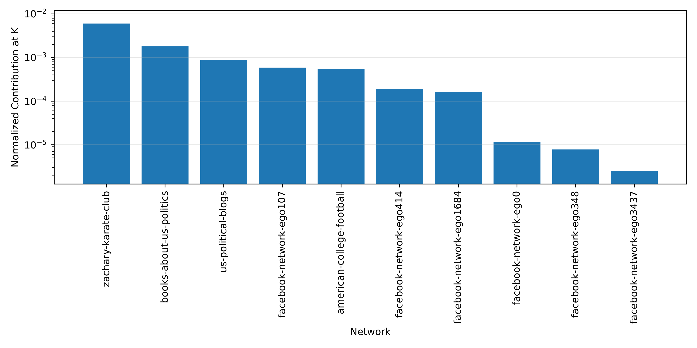
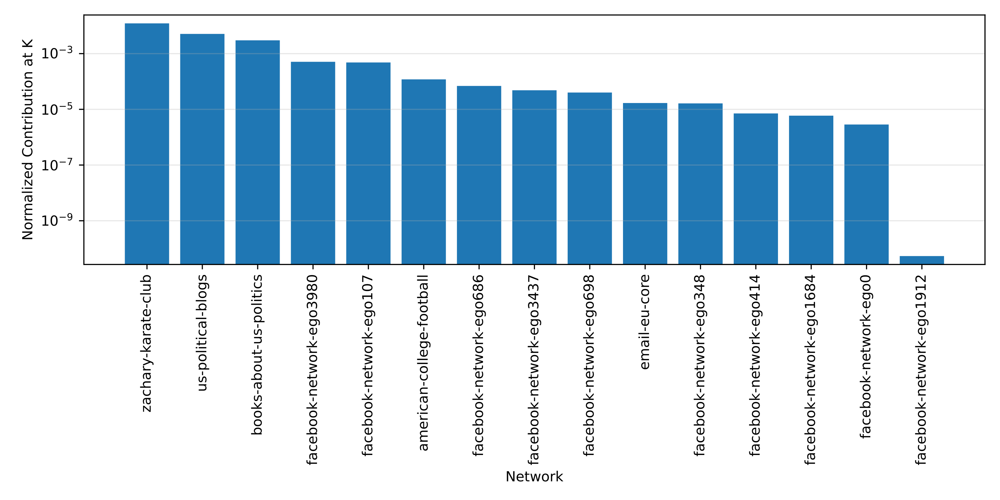

# Report 5 - Add sensitivity analysis and k boundary strategy 

## Table of Contents

- [Real-World Networks](#real-world-networks)
- [Scripts](#scripts)
- [Experience 7 (One network per family)](#experience-7-one-network-per-family)
  - [LAPIN-off Median Normalized Contributions](#lapin-off-median-normalized-contributions)
  - [LAPIN-on Median Normalized Contributions](#lapin-on-median-normalized-contributions)
  - [LAPIN-off Median K Boundary Normalized Contributions](#lapin-off-median-k-boundary-normalized-contributions)
  - [LAPIN-off Median K Boundary Raw Contributions](#lapin-off-median-k-boundary-raw-contributions)
  - [LAPIN-on Median K Boundary Normalized Contributions](#lapin-on-median-k-boundary-normalized-contributions)
  - [LAPIN-on Median K Boundary Raw Contributions](#lapin-on-median-k-boundary-raw-contributions)
- [Experience 8 (Networks grouped by ground-truth type, K, degree assortativity and average degree)](#experience-8-networks-grouped-by-ground-truth-type-k-degree-assortativity-and-average-degree)
  - [Range Definitions](#range-definitions)
  - [Network Family 1 (Non-Overlapping + Low K + Low Average Degree + Disassortative)](#network-family-1-non-overlapping--low-k--low-average-degree--disassortative)
  - [Network Family 2 (Non-Overlapping + Low K + Medium Average Degree + Disassortative)](#network-family-2-non-overlapping--low-k--medium-average-degree--disassortative)
  - [Network Family 3 (Non-Overlapping + Medium K + Low Average Degree + Moderately Assortative)](#network-family-3-non-overlapping--medium-k--low-average-degree--moderately-assortative)
  - [Network Family 4 (Non-Overlapping + Very Large K + Medium Average Degree + Near-Neutral)](#network-family-4-non-overlapping--very-large-k--medium-average-degree--near-neutral)
  - [Network Family 5 (Overlapping + Medium K + Low Average Degree + Near-Neutral)](#network-family-5-overlapping--medium-k--low-average-degree--near-neutral)
  - [Network Family 6 (Overlapping + Medium K + Medium Average Degree + Near-Neutral / Moderately Assortative)](#network-family-6-overlapping--medium-k--medium-average-degree--near-neutral--moderately-assortative)
  - [Network Family 7 (Overlapping + Medium K + Large Average Degree + Assortative)](#network-family-7-overlapping--medium-k--large-average-degree--assortative)
  - [Network Family 8 (Overlapping + Large K + Medium Average Degree + Moderately Assortative)](#network-family-8-overlapping--large-k--medium-average-degree--moderately-assortative)
  - [Network Family 9 (Overlapping + Very Large K + Very Large Average Degree + Highly Assortative)](#network-family-9-overlapping--very-large-k--very-large-average-degree--highly-assortative)
  - [LAPIN-off Median Normalized Contributions](#lapin-off-median-normalized-contributions-1)
  - [LAPIN-on Median Normalized Contributions](#lapin-on-median-normalized-contributions-1)
  - [LAPIN-off Median K Boundary Normalized Contributions](#lapin-off-median-k-boundary-normalized-contributions-1)
  - [LAPIN-off Median K Boundary Raw Contributions](#lapin-off-median-k-boundary-raw-contributions-1)
  - [LAPIN-on Median K Boundary Normalized Contributions](#lapin-on-median-k-boundary-normalized-contributions-1)
  - [LAPIN-on Median K Boundary Raw Contributions](#lapin-on-median-k-boundary-raw-contributions-1)

## Real-World Networks

- Pre-processed to **undirected, unweighted simple graphs without self-loops**, saved as .gml files.

| Network                                                                                                                                                                                 | Ground-Truth? | Nodes | Edges | CC  | Nodes LCC | Edges LCC | Relative Size LCC | Overlapping Ground-Truth? | K LCC  |
|-----------------------------------------------------------------------------------------------------------------------------------------------------------------------------------------|---------------|-------|-------|-----|-----------|-----------|-------------------|---------------------------|--------|
| Zachary Karate Club [[1](https://networkx.org/documentation/stable/reference/generated/networkx.generators.social.karate_club_graph.html)] [[2](https://networks.skewed.de/net/karate)] | Yes           | 34    | 78    | 1   | 34        | 78        | 1.0000            | No                        | 2      |
| US Political Blogs [[3](https://websites.umich.edu/~mejn/netdata/)] [[4](https://networks.skewed.de/net/polblogs)]                                                                      | Yes           | 1490  | 16715 | 268 | 1222      | 16714     | 0.8201            | No                        | 2      |
| Books about US Politics [[3](https://websites.umich.edu/~mejn/netdata/)] [[5](https://networks.skewed.de/net/polbooks)]                                                                 | Yes           | 105   | 441   | 1   | 105       | 441       | 1.0000            | No                        | 3      |
| American College Football [[3](https://websites.umich.edu/~mejn/netdata/)] [[6](https://networks.skewed.de/net/football)]                                                               | Yes           | 115   | 613   | 1   | 115       | 613       | 1.0000            | No                        | 12     |
| E-mail EU Core [[7](https://snap.stanford.edu/data/email-Eu-core.html/)] [[8](https://networks.skewed.de/net/email_eu)]*                                                                | Yes           | 1005  | 16064 | 20  | 986       | 16064     | 0.9811            | No                        | 42     |
| Facebook Ego-414 Network [[9](https://snap.stanford.edu/data/egonets-Facebook.html)]                                                                                                    | Yes           | 150   | 1693  | 2   | 148       | 1692      | 0.9867            | Yes                       | 7      |
| Facebook Ego-107 Network [[9](https://snap.stanford.edu/data/egonets-Facebook.html)]                                                                                                    | Yes           | 1034  | 26749 | 1   | 1034      | 26749     | 1.0000            | Yes                       | 9      |
| Facebook Ego-698 Network [[9](https://snap.stanford.edu/data/egonets-Facebook.html)]                                                                                                    | Yes           | 61    | 270   | 3   | 40        | 220       | 0.6557            | Yes                       | 9      |
| Facebook Ego-3980 Network [[9](https://snap.stanford.edu/data/egonets-Facebook.html)]                                                                                                   | Yes           | 52    | 146   | 4   | 44        | 138       | 0.8462            | Yes                       | 11     |
| Facebook Ego-348 Network [[9](https://snap.stanford.edu/data/egonets-Facebook.html)]                                                                                                    | Yes           | 224   | 3192  | 1   | 224       | 3192      | 1.0000            | Yes                       | 14     |
| Facebook Ego-686 Network [[9](https://snap.stanford.edu/data/egonets-Facebook.html)]                                                                                                    | Yes           | 168   | 1656  | 1   | 168       | 1656      | 1.0000            | Yes                       | 14     |
| Facebook Ego-1684 Network [[9](https://snap.stanford.edu/data/egonets-Facebook.html)]                                                                                                   | Yes           | 786   | 14024 | 4   | 775       | 14006     | 0.9860            | Yes                       | 17     |
| Facebook Ego-0 Network [[9](https://snap.stanford.edu/data/egonets-Facebook.html)]                                                                                                      | Yes           | 333   | 2519  | 5   | 324       | 2514      | 0.9730            | Yes                       | 22     |
| Facebook Ego-3437 Network [[9](https://snap.stanford.edu/data/egonets-Facebook.html)]                                                                                                   | Yes           | 534   | 4813  | 2   | 532       | 4812      | 0.9963            | Yes                       | 32     |
| Facebook Ego-1912 Network [[9](https://snap.stanford.edu/data/egonets-Facebook.html)]                                                                                                   | Yes           | 747   | 30025 | 2   | 744       | 30023     | 0.9960            | Yes                       | 45     |

#### Legend:

- **Network**: Name of the network.
- **Ground-Truth?**: Indicates whether the network has ground-truth community labels.
- **Nodes**: Number of nodes in the original network.
- **Edges**: Number of edges in the original network.
- **CC**: Number of connected components.
- **Nodes LCC**: Number of nodes in the largest connected component.
- **Edges LCC**: Number of edges in the largest connected component.
- **Relative Size LCC**: Proportion of nodes that belong to the largest connected component, computed as `Nodes LCC / Nodes`.
- **Overlapping Ground-Truth?**: Indicates whether nodes can belong to more than one ground-truth community.
- **K LCC**: Number of ground-truth communities represented in the largest connected component.

| Network                   | Ground-Truth? | Nodes LCC | Edges LCC | Min Degree | Max Degree | Average Degree     | Degree Std         | Degree CV           | Degree Hub Ratio   | Density              | Sparsity           | Global Clustering Coefficient | Degree Assortativity  | Average Clustering | Overlapping Ground-Truth? | Overlap Fraction     | K  | Community Proportion  | Min Community Size | Max Community Size | Average Community Size | Community Size Std | Community Size CV   | Nodes Without Community | Nodes Fraction Without Community |
|---------------------------|---------------|-----------|-----------|------------|------------|--------------------|--------------------|---------------------|--------------------|----------------------|--------------------|-------------------------------|-----------------------|--------------------|---------------------------|----------------------|----|-----------------------|--------------------|--------------------|------------------------|--------------------|---------------------|-------------------------|----------------------------------|
| zachary-karate-club       | True          | 34        | 78        | 1.0        | 17.0       | 4.588235294117647  | 3.8778129345135013 | 0.8451643575221734  | 3.7051282051282053 | 0.13903743315508021  | 0.8609625668449198 | 0.2556818181818182            | -0.47561309768461413  | 0.5706384782076823 | False                     | 0.0                  | 2  | 0.058823529411764705  | 17.0               | 17.0               | 17.0                   | 0.0                | 0.0                 | 0                       | 0.0                              |
| us-political-blogs        | True          | 1222      | 16714     | 1.0        | 351.0      | 27.355155482815057 | 38.41718773263562  | 1.4043856470408258  | 12.831219337082684 | 0.022403894744320276 | 0.9775961052556797 | 0.2259585173589758            | -0.2213287230119227   | 0.3202546194373154 | False                     | 0.0                  | 2  | 0.0016366612111292963 | 586.0              | 636.0              | 611.0                  | 35.35533905932738  | 0.05786471204472566 | 0                       | 0.0                              |
| books-about-us-politics   | True          | 105       | 441       | 2.0        | 25.0       | 8.4                | 5.474767293965737  | 0.6517580111863972  | 2.9761904761904763 | 0.08076923076923077  | 0.9192307692307692 | 0.34840315221899626           | -0.1278960096667189   | 0.4875267912317313 | False                     | 0.0                  | 3  | 0.02857142857142857   | 13.0               | 49.0               | 35.0                   | 19.28730152198591  | 0.551065757771026   | 0                       | 0.0                              |
| american-college-football | True          | 115       | 613       | 7.0        | 12.0       | 10.660869565217391 | 0.8874065952502659 | 0.08323960722168074 | 1.1256117455138663 | 0.0935163996948894   | 0.9064836003051107 | 0.4072398190045249            | 0.16244224957444287   | 0.403216011042098  | False                     | 0.0                  | 12 | 0.10434782608695652   | 5.0                | 13.0               | 9.583333333333334      | 2.3143164446679725 | 0.24149388987839712 | 0                       | 0.0                              |
| email-eu-core             | True          | 986       | 16064     | 1.0        | 345.0      | 32.5841784989858   | 37.044293876612585 | 1.1368797859294077  | 10.587960657370518 | 0.033080384262929745 | 0.9669196157370703 | 0.26739242877040204           | -0.025743368083088566 | 0.4070504475195386 | False                     | 0.0                  | 42 | 0.04259634888438134   | 1.0                | 107.0              | 23.476190476190474     | 23.593341449301363 | 1.0049902037227763  | 0                       | 0.0                              |
| facebook-network-ego414   | True          | 148       | 1692      | 1.0        | 57.0       | 22.864864864864863 | 12.951846268016066 | 0.5664519053387641  | 2.49290780141844   | 0.15554329840044126  | 0.8444567015995588 | 0.6457982767359352            | 0.3039224601932676    | 0.6793500241563419 | True                      | 0.2537313432835821   | 7  | 0.0472972972972973    | 7.0                | 55.0               | 24.285714285714285     | 21.63880993118834  | 0.8910098206959906  | 14                      | 0.0945945945945946               |
| facebook-network-ego107   | True          | 1034      | 26749     | 1.0        | 253.0      | 51.73887814313346  | 47.02619707281583  | 0.9089141233932403  | 4.88993981083405   | 0.05008603886072939  | 0.9499139611392706 | 0.5045088189930924            | 0.4315692408853532    | 0.5264047980773338 | True                      | 0.03958333333333333  | 9  | 0.008704061895551257  | 10.0               | 307.0              | 55.55555555555556      | 94.95539888693943  | 1.7091971799649097  | 554                     | 0.5357833655705996               |
| facebook-network-ego698   | True          | 40        | 220       | 1.0        | 29.0       | 11.0               | 5.808923286082348  | 0.5280839350983952  | 2.6363636363636362 | 0.28205128205128205  | 0.717948717948718  | 0.6560531840447865            | 0.012473574916280844  | 0.7249190619129633 | True                      | 0.59375              | 9  | 0.225                 | 1.0                | 15.0               | 6.444444444444445      | 6.125991983163035  | 0.9505849629046089  | 8                       | 0.2                              |
| facebook-network-ego3980  | True          | 44        | 138       | 1.0        | 18.0       | 6.2727272727272725 | 4.206106504106863  | 0.6705387180460217  | 2.8695652173913047 | 0.14587737843551796  | 0.854122621564482  | 0.44404332129963897           | 0.05297863564191894   | 0.4547680965795939 | True                      | 0.0                  | 11 | 0.25                  | 1.0                | 21.0               | 4.0                    | 5.932958789676531  | 1.4832396974191326  | 0                       | 0.0                              |
| facebook-network-ego348   | True          | 224       | 3192      | 1.0        | 99.0       | 28.5               | 22.417561981665038 | 0.7865811221636856  | 3.473684210526316  | 0.12780269058295965  | 0.8721973094170403 | 0.4902791105177521            | 0.22269166051622483   | 0.5442814709697877 | True                      | 0.8532110091743119   | 14 | 0.0625                | 4.0                | 201.0              | 40.357142857142854     | 55.757175658049945 | 1.3815937331198218  | 6                       | 0.026785714285714284             |
| facebook-network-ego686   | True          | 168       | 1656      | 1.0        | 77.0       | 19.714285714285715 | 16.068767957698487 | 0.8150824326368797  | 3.905797101449275  | 0.11804961505560307  | 0.8819503849443969 | 0.45355939944054346           | 0.08406304044981644   | 0.5337913395248177 | True                      | 0.8035714285714286   | 14 | 0.08333333333333333   | 4.0                | 101.0              | 34.42857142857143      | 30.88617885003006  | 0.8971089292539851  | 0                       | 0.0                              |
| facebook-network-ego1684  | True          | 775       | 14006     | 1.0        | 136.0      | 36.144516129032255 | 28.476378855199318 | 0.7878478370976536  | 3.762673140082822  | 0.046698341251979664 | 0.9533016587480203 | 0.45225878166971445           | 0.3268349056797533    | 0.4713855751563139 | True                      | 0.006640106241699867 | 17 | 0.02193548387096774   | 1.0                | 223.0              | 44.705882352941174     | 62.501764680969565 | 1.3980657889164245  | 22                      | 0.02838709677419355              |
| facebook-network-ego0     | True          | 324       | 2514      | 1.0        | 77.0       | 15.518518518518519 | 15.570959005850767 | 1.003379219947424   | 4.9618138424821    | 0.04804494897374154  | 0.9519550510262584 | 0.4258750132177223            | 0.23295552356572546   | 0.5223624457077098 | True                      | 0.1417910447761194   | 22 | 0.06790123456790123   | 1.0                | 129.0              | 13.909090909090908     | 27.300635071819762 | 1.9627907567974994  | 56                      | 0.1728395061728395               |
| facebook-network-ego3437  | True          | 532       | 4812      | 1.0        | 107.0      | 18.090225563909776 | 14.664847676938885 | 0.810650349556472   | 5.91479634247714   | 0.034068221400960025 | 0.96593177859904   | 0.4488933226158351            | 0.22207842776444284   | 0.545768617282594  | True                      | 0.6804123711340206   | 32 | 0.06015037593984962   | 1.0                | 50.0               | 6.0                    | 9.315266692284613  | 1.5525444487141022  | 435                     | 0.8176691729323309               |
| facebook-network-ego1912  | True          | 744       | 30023     | 1.0        | 293.0      | 80.70698924731182  | 64.25341111081488  | 0.7961319299611344  | 3.630416680544916  | 0.10862313492235777  | 0.8913768650776422 | 0.7000214679657459            | 0.5026087042032253    | 0.6379667606225469 | True                      | 0.36415362731152207  | 45 | 0.06048387096774194   | 1.0                | 232.0              | 23.333333333333332     | 45.70010940905941  | 1.9585761175311176  | 41                      | 0.05510752688172043              |

#### Legend:

- **Network**: Name of the network.
- **Ground-Truth?**: Indicates whether the network has ground-truth community labels.
- **Nodes LCc**: Number of nodes in the largest connected component.
- **Edges LCC**: Number of edges in the largest connected component.
- **Min Degree**: Minimum node degree in the network.
- **Max Degree**: Maximum node degree in the network.
- **Average Degree**: Average node degree in the network.
- **Degree Std**: Standard deviation of node degrees.
- **Degree CV**: Coefficient of variation of node degrees, computed as `Degree Std / Average Degree`.
- **Degree Hub Ratio**: Ratio between the maximum degree and the average degree, computed as `Max Degree / Average Degree`.
- **Density**: Proportion of existing edges relative to all possible edges.
- **Sparsity**: Proportion of missing edges relative to all possible edges, computed as `1 - Density`.
- **Global Clustering Coefficient**: Global tendency of nodes to form triangles, computed using transitivity.
- **Degree Assortativity**: Correlation between the degrees of connected nodes.
- **Average Clustering**: Average local clustering coefficient over all nodes.
- **Overlapping Ground-Truth?**: Indicates whether nodes can belong to more than one ground-truth community.
- **Overlap Fraction**: Fraction of labeled nodes that belong to more than one ground-truth community.
- **K**: Number of ground-truth communities represented in the network.
- **Community Proportion**: Proportion of communities relative to the number of nodes, computed as `K / Nodes`.
- **Min Community Size**: Size of the smallest ground-truth community.
- **Max Community Size**: Size of the largest ground-truth community.
- **Average Community Size**: Average size of the ground-truth communities.
- **Community Size Std**: Standard deviation of ground-truth community sizes.
- **Community Size CV**: Coefficient of variation of community sizes, computed as `Community Size Std / Average Community Size`.
- **Nodes Without Community**: Number of nodes without ground-truth community labels.
- **Nodes Fraction Without Community**: Fraction of nodes without ground-truth community labels, computed as `Nodes Without Community / Nodes`.

## Scripts

### Script 1

- **Median Normalized Contributions (LAPIN-off + Extraction of K desired clusters / LAPIN-on + Extraction of K desired clusters)**
  - This strategy is based on [Report 1](./report1.md). However, instead of using bootstrap resampling to select the final threshold (Stage 2), it uses previous knowledge obtained from the LFR networks. In those experiments, the median was the statistical metric that showed the greatest stability and robustness under bootstrap resampling. Therefore, the median is selected as the final threshold for each network family. Bootstrap resampling is not used in this case because the number of networks per family is small.
  - Additionally, a sensitivity analysis (Stage 3) is performed to evaluate the correlation between the selected thresholds, defined as the median of the normalized contributions, and the computed network properties for each network. These properties include both structural properties and properties related to the ground-truth community structure. The correlation is evaluated using both Spearman and Pearson correlation coefficients.
- **Median K-Boundary Normalized Contributions (LAPIN-off + Extraction of clusters until the end / LAPIN-on + Extraction of clusters until the end)**
  - This strategy is also based on [Report 1](./report1.md). However, instead of computing statistical (Stage 1.6 to 1.10) metrics over all normalized contributions and then using bootstrap resampling (Stage 2) to choose the final thresholds, the following procedure is applied:
    - Draw one bar plot showing, for each network, the normalized contribution at K.
    - Compute the geometric mean between the normalized contributions at K and K + 1, when possible, and use it as the network-level K-boundary threshold. The threshold is considered valid when the contribution at K + 1 is smaller than the contribution at K. Exceptionally, when LAPIN is not applied, the first extracted cluster is removed because it behaves as a global/background component. In this case, after removing the first contribution, the effective contribution at K corresponds to the original contribution at K + 1, and the effective contribution at K + 1 corresponds to the original contribution at K + 2. Therefore, the threshold is valid when the original contribution at K + 2 is smaller than the original contribution at K + 1.
    - The threshold for each network family is then computed as the median of the valid network-level K-boundary thresholds across all networks in that family.
    - A sensitivity analysis (Stage 3) is performed to evaluate the correlation between the selected thresholds, defined as the geometric mean between the normalized contributions at K and K + 1, and the computed network properties for each network. These properties include both structural properties and properties related to the ground-truth community structure. The correlation is evaluated using both Spearman and Pearson correlation coefficients.
- **Median K-Boundary Raw Contributions (LAPIN-off + Extraction of clusters until the end / LAPIN-on + Extraction of clusters until the end)**
  - This strategy follows the same procedure as the previous one. However, the final thresholds are converted back to the raw contribution scale by multiplying the normalized K-boundary thresholds by the global normalization factor.

## Experience 7 (One network per family)

### LAPIN-off Median Normalized Contributions

`Median of the normalized contributions for each network family, where each contribution is normalized by the global sum of all contributions across all networks and all families, under the LAPIN-off and extraction of K clusters configuration`

[Open Folder](../results/real-world/experience7/results_2026-05-17_22-40-29-009438/)

#### Thresholds

| Network Family    | Selected Metric | Threshold             |
|-------------------|-----------------|-----------------------|
| network_family_01 | Median          | 0.00635104681728345   |
| network_family_02 | Median          | 0.009598290673725801  |
| network_family_03 | Median          | 0.011042331616159046  |
| network_family_04 | Median          | 0.0023192712176332347 |
| network_family_05 | Median          | 0.0002581203044896468 |
| network_family_06 | Median          | 0.001617836009111571  |
| network_family_07 | Median          | 0.0020827632126837184 |
| network_family_08 | Median          | 0.0013007136413987772 |
| network_family_09 | Median          | 0.001496257530477729  |
| network_family_10 | Median          | 0.0002711446055993693 |
| network_family_11 | Median          | 0.0006779471723406171 |
| network_family_12 | Median          | 0.0004793528259040332 |
| network_family_13 | Median          | 0.0004012267444095074 |
| network_family_14 | Median          | 0.0003726041379143695 |
| network_family_15 | Median          | 6.816377967792331e-06 |

#### Sensitivity Analysis

| Group           | Threshold Mode    | Threshold Label             | Property                         | N  | Spearman Correlation | Pearson Correlation   | Abs Spearman Correlation |
|-----------------|-------------------|-----------------------------|----------------------------------|----|----------------------|-----------------------|--------------------------|
| All             | network_statistic | Median Normalized Threshold | K                                | 15 | -0.913163544155121   | -0.8713146760296984   | 0.913163544155121        |
| All             | network_statistic | Median Normalized Threshold | Min Community Size               | 15 | 0.8064283054047788   | 0.37739178087763925   | 0.8064283054047788       |
| All             | network_statistic | Median Normalized Threshold | Community Size CV                | 15 | -0.6892857142857142  | -0.7223999346983905   | 0.6892857142857142       |
| Non-overlapping | network_statistic | Median Normalized Threshold | Min Community Size               | 5  | 0.7                  | 0.40201147810284793   | 0.7                      |
| Non-overlapping | network_statistic | Median Normalized Threshold | K                                | 5  | -0.6668859288553501  | -0.9796490964623256   | 0.6668859288553501       |
| Non-overlapping | network_statistic | Median Normalized Threshold | Average Community Size           | 5  | 0.6                  | 0.3895046496187797    | 0.6                      |
| Non-overlapping | network_statistic | Median Normalized Threshold | Community Proportion             | 5  | -0.6                 | -0.30306186985804173  | 0.6                      |
| Overlapping     | network_statistic | Median Normalized Threshold | K                                | 10 | -0.8658697553131279  | -0.9030927911613401   | 0.8658697553131279       |
| Overlapping     | network_statistic | Median Normalized Threshold | Min Community Size               | 10 | 0.5003639737012046   | 0.4238715502815799    | 0.5003639737012046       |
| Overlapping     | network_statistic | Median Normalized Threshold | Overlap Fraction                 | 10 | -0.49090909090909085 | -0.19303487694118468  | 0.49090909090909085      |

### LAPIN-on Median Normalized Contributions

`Median of the normalized contributions for each network family, where each contribution is normalized by the global sum of all contributions across all networks and all families, under the LAPIN-on and extraction of K clusters configuration`

[Open Folder](../results/real-world/experience7/results_2026-05-17_22-49-34-021831/)

#### Thresholds

| Network Family    | Selected Metric | Threshold              |
|-------------------|-----------------|------------------------|
| network_family_01 | Median          | 0.020335278629810948   |
| network_family_02 | Median          | 0.006974281899112465   |
| network_family_03 | Median          | 0.027004154335183172   |
| network_family_04 | Median          | 0.0008149498488533231  |
| network_family_05 | Median          | 0.00014210358578151637 |
| network_family_06 | Median          | 2.6014194001310346e-05 |
| network_family_07 | Median          | 0.0026998636901662313  |
| network_family_08 | Median          | 0.0013724897999800954  |
| network_family_09 | Median          | 0.0013968421848834522  |
| network_family_10 | Median          | 0.0001123888204484642  |
| network_family_11 | Median          | 0.0005677389710904313  |
| network_family_12 | Median          | 6.507205398672682e-05  |
| network_family_13 | Median          | 4.1496548697439925e-05 |
| network_family_14 | Median          | 0.00011720406254712831 |
| network_family_15 | Median          | 4.899535861185364e-05  |

#### Sensitivity Analysis

| Group           | Threshold Mode    | Threshold Label             | Property                         | N  | Spearman Correlation  | Pearson Correlation    | Abs Spearman Correlation |
|-----------------|-------------------|-----------------------------|----------------------------------|----|-----------------------|------------------------|--------------------------|
| All             | network_statistic | Median Normalized Threshold | Degree Assortativity             | 15 | -0.7142857142857142   | -0.7316206180603525    | 0.7142857142857142       |
| All             | network_statistic | Median Normalized Threshold | K                                | 15 | -0.673234299220246    | -0.6410418591397632    | 0.673234299220246        |
| All             | network_statistic | Median Normalized Threshold | Min Community Size               | 15 | 0.5784427330823998    | 0.3386755885092125     | 0.5784427330823998       |
| All             | network_statistic | Median Normalized Threshold | Overlap Fraction                 | 15 | -0.5477505018207631   | -0.3506304777175473    | 0.5477505018207631       |
| Non-overlapping | network_statistic | Median Normalized Threshold | Average Degree                   | 5  | -0.7999999999999999   | -0.6546613515472839    | 0.7999999999999999       |
| Non-overlapping | network_statistic | Median Normalized Threshold | K                                | 5  | -0.6668859288553501   | -0.9013528896543332    | 0.6668859288553501       |
| Non-overlapping | network_statistic | Median Normalized Threshold | Degree Assortativity             | 5  | -0.6                  | -0.6728008802871027    | 0.6                      |
| Non-overlapping | network_statistic | Median Normalized Threshold | Edges LCC                        | 5  | -0.6                  | -0.49088780902370205   | 0.6                      |
| Non-overlapping | network_statistic | Median Normalized Threshold | Min Community Size               | 5  | 0.6                   | 0.20337052965680097    | 0.6                      |
| Non-overlapping | network_statistic | Median Normalized Threshold | Nodes LCC                        | 5  | -0.6                  | -0.41917026795624274   | 0.6                      |
| Overlapping     | network_statistic | Median Normalized Threshold | Degree Assortativity             | 10 | -0.43030303030303024  | -0.4243953978905938    | 0.43030303030303024      |
| Overlapping     | network_statistic | Median Normalized Threshold | K                                | 10 | -0.3231767396591252   | -0.4596182188913021    | 0.3231767396591252       |
| Overlapping     | network_statistic | Median Normalized Threshold | Average Clustering               | 10 | -0.23636363636363633  | -0.1342598853862729    | 0.23636363636363633      |
| Overlapping     | network_statistic | Median Normalized Threshold | Average Degree                   | 10 | -0.23636363636363633  | -0.20597220524498813   | 0.23636363636363633      |
| Overlapping     | network_statistic | Median Normalized Threshold | Community Proportion             | 10 | 0.23636363636363633   | 0.5018355917807854     | 0.23636363636363633      |

### LAPIN-off Median K Boundary Normalized Contributions

`Median of the geometric means between the K-th and (K+1)-th normalized contributions for each network family, computed only when the K-th contribution is greater than the (K+1)-th contribution and the previous contributions are decreasing, where each contribution is normalized by the global sum of all contributions across all networks and all families, under the LAPIN-off configuration`

[Open Folder](../results/real-world/experience7/results_2026-05-17_22-43-29-341884/)

#### Bar plot

#### Thresholds by Network

| Network Family    | Network                   | K  | First Contribution Removed? | Number of Contributions | Effective Number of Contributions | Normalized c_K         | Normalized c_K+1       | gap_K                  | ratio_K            | Normalized Threshold   | Global Normalization Factor | Raw Threshold          | Valid Threshold? |
|-------------------|---------------------------|----|-----------------------------|-------------------------|-----------------------------------|------------------------|------------------------|------------------------|--------------------|------------------------|-----------------------------|------------------------|------------------|
| network_family_01 | zachary-karate-club       | 2  | True                        | 11                      | 10                                | 0.006031667632284965   | 0.00347208579440202    | 0.002559581837882945   | 1.7371885343414357 | 0.004576294079559474   | 6.940412929765686           | 0.03176137060018473    | True             |
| network_family_02 | us-political-blogs        | 2  | True                        | 18                      | 17                                | 0.0008841293900780564  | 0.0006699501349254016  | 0.00021417925515265486 | 1.3196943234834986 | 0.0007696249763191855  | 6.940412929765686           | 0.005341515136716286   | True             |
| network_family_03 | books-about-us-politics   | 3  | True                        | 33                      | 32                                | 0.0018138095459005587  | 0.00152166477289713    | 0.00029214477300342867 | 1.1919902321502838 | 0.0016613278095371244  | 6.940412929765686           | 0.011530301009890763   | True             |
| network_family_04 | american-college-football | 12 | True                        | 19                      | 18                                | 0.0005539557711803757  | 0.0003140914294136626  | 0.00023986434176671308 | 1.7636768128773375 | 0.00041712439391863914 | 6.940412929765686           | 0.0028950155368735984  | True             |
| network_family_05 | email-eu-core             | 42 | True                        | 23                      | 22                                |                        |                        |                        |                    |                        | 6.940412929765686           |                        | False            |
| network_family_06 | facebook-network-ego414   | 7  | True                        | 27                      | 26                                | 0.00019295375047731172 | 0.0001560181855224268  | 3.6935564954884915e-05 | 1.2367388444571779 | 0.0001735058905029373  | 6.940412929765686           | 0.0012042025258370954  | True             |
| network_family_07 | facebook-network-ego107   | 9  | True                        | 37                      | 36                                | 0.0005867454679268797  | 0.0004018234982277158  | 0.0001849219696991639  | 1.4602069578180008 | 0.00048555959108191534 | 6.940412929765686           | 0.0033699840641166646  | True             |
| network_family_08 | facebook-network-ego698   | 9  | True                        | 8                       | 7                                 |                        |                        |                        |                    |                        | 6.940412929765686           |                        | False            |
| network_family_09 | facebook-network-ego3980  | 11 | True                        | 10                      | 9                                 |                        |                        |                        |                    |                        | 6.940412929765686           |                        | False            |
| network_family_10 | facebook-network-ego348   | 14 | True                        | 21                      | 20                                | 7.791093938482307e-06  | 9.770210731123174e-06  | -1.979116792640867e-06 | 0.7974335613523302 | 8.724713726246183e-06  | 6.940412929765686           | 6.0553115954143166e-05 | False            |
| network_family_11 | facebook-network-ego686   | 14 | True                        | 14                      | 13                                |                        |                        |                        |                    |                        | 6.940412929765686           |                        | False            |
| network_family_12 | facebook-network-ego1684  | 17 | True                        | 98                      | 97                                | 0.000162090396093191   | 0.0003016791080483512  | -0.0001395887119551602 | 0.5372940709809185 | 0.0002211318297229004  | 6.940412929765686           | 0.0015347462101915619  | False            |
| network_family_13 | facebook-network-ego0     | 22 | True                        | 34                      | 33                                | 1.1407550095486016e-05 | 9.224813664701198e-06  | 2.182736430784818e-06  | 1.2366157745968431 | 1.0258290500936443e-05 | 6.940412929765686           | 7.11967720299918e-05   | True             |
| network_family_14 | facebook-network-ego3437  | 32 | True                        | 37                      | 36                                | 2.5059532103379205e-06 | 1.0098852071461738e-06 | 1.4960680031917467e-06 | 2.4814238218415663 | 1.590825281707809e-06  | 6.940412929765686           | 1.1040984354163018e-05 | True             |
| network_family_15 | facebook-network-ego1912  | 45 | True                        | 38                      | 37                                |                        |                        |                        |                    |                        | 6.940412929765686           |                        | False            |

#### Sensitivity Analysis

| Group           | Threshold Mode | Threshold Label      | Property                         | N | Spearman Correlation | Pearson Correlation   | Abs Spearman Correlation |
|-----------------|----------------|----------------------|----------------------------------|---|----------------------|-----------------------|--------------------------|
| All             | k_boundary     | Normalized Threshold | Min Community Size               | 8 | 0.8982196964349441   | 0.22363735836836063   | 0.8982196964349441       |
| All             | k_boundary     | Normalized Threshold | K                                | 8 | -0.8862434338158116  | -0.9579652650419176   | 0.8862434338158116       |
| All             | k_boundary     | Normalized Threshold | Overlap Fraction                 | 8 | -0.8498050347983338  | -0.8484173577102034   | 0.8498050347983338       |
| Non-overlapping | k_boundary     | Normalized Threshold | Average Clustering               | 4 | 0.7999999999999999   | 0.8417216806462875    | 0.7999999999999999       |
| Non-overlapping | k_boundary     | Normalized Threshold | Average Degree                   | 4 | -0.7999999999999999  | -0.5331555779406754   | 0.7999999999999999       |
| Non-overlapping | k_boundary     | Normalized Threshold | Degree Assortativity             | 4 | -0.7999999999999999  | -0.8869592521102766   | 0.7999999999999999       |
| Non-overlapping | k_boundary     | Normalized Threshold | Edges LCC                        | 4 | -0.7999999999999999  | -0.33748899433535995  | 0.7999999999999999       |
| Non-overlapping | k_boundary     | Normalized Threshold | Nodes LCC                        | 4 | -0.7999999999999999  | -0.36493741713430955  | 0.7999999999999999       |
| Overlapping     | k_boundary     | Normalized Threshold | Average Community Size           | 4 | 1.0                  | 0.8880132661117176    | 1.0                      |
| Overlapping     | k_boundary     | Normalized Threshold | Degree Assortativity             | 4 | 1.0                  | 0.892486939541744     | 1.0                      |
| Overlapping     | k_boundary     | Normalized Threshold | Min Community Size               | 4 | 0.9486832980505139   | 0.9513067328868404    | 0.9486832980505139       |

#### Thresholds

| Network Family    | #Networks | #Valid Thresholds | Median Normalized Threshold | Median Raw Threshold   | Median gap_K           | Median ratio_K     | Threshold              |
|-------------------|-----------|-------------------|-----------------------------|------------------------|------------------------|--------------------|------------------------|
| network_family_01 | 1         | 1                 | 0.004576294079559474        | 0.03176137060018473    | 0.002559581837882945   | 1.7371885343414357 | 0.004576294079559474   |
| network_family_02 | 1         | 1                 | 0.0007696249763191855       | 0.005341515136716286   | 0.00021417925515265486 | 1.3196943234834986 | 0.0007696249763191855  |
| network_family_03 | 1         | 1                 | 0.0016613278095371244       | 0.011530301009890763   | 0.00029214477300342867 | 1.1919902321502838 | 0.0016613278095371244  |
| network_family_04 | 1         | 1                 | 0.00041712439391863914      | 0.0028950155368735984  | 0.00023986434176671308 | 1.7636768128773375 | 0.00041712439391863914 |
| network_family_05 | 1         | 0                 |                             |                        |                        |                    |                        |
| network_family_06 | 1         | 1                 | 0.0001735058905029373       | 0.0012042025258370954  | 3.6935564954884915e-05 | 1.2367388444571779 | 0.0001735058905029373  |
| network_family_07 | 1         | 1                 | 0.00048555959108191534      | 0.0033699840641166646  | 0.0001849219696991639  | 1.4602069578180008 | 0.00048555959108191534 |
| network_family_08 | 1         | 0                 |                             |                        |                        |                    |                        |
| network_family_09 | 1         | 0                 |                             |                        |                        |                    |                        |
| network_family_10 | 1         | 0                 |                             |                        |                        |                    |                        |
| network_family_11 | 1         | 0                 |                             |                        |                        |                    |                        |
| network_family_12 | 1         | 0                 |                             |                        |                        |                    |                        |
| network_family_13 | 1         | 1                 | 1.0258290500936443e-05      | 7.11967720299918e-05   | 2.182736430784818e-06  | 1.2366157745968431 | 1.0258290500936443e-05 |
| network_family_14 | 1         | 1                 | 1.590825281707809e-06       | 1.1040984354163018e-05 | 1.4960680031917467e-06 | 2.4814238218415663 | 1.590825281707809e-06  |
| network_family_15 | 1         | 0                 |                             |                        |                        |                    |                        |

### LAPIN-off Median K Boundary Raw Contributions

`Median of the geometric means between the K-th and (K+1)-th normalized contributions for each network family multiplied by the global sum, computed only when the K-th contribution is greater than the (K+1)-th contribution and the previous contributions are decreasing, where each contribution is normalized by the global sum of all contributions across all networks and all families, under the LAPIN-off configuration`

[Open Folder](../results/real-world/experience7/results_2026-05-17_23-19-37-286945/)

#### Thresholds

| Network Family    | #Networks | #Valid Thresholds | Median Normalized Threshold | Median Raw Threshold   | Median gap_K           | Median ratio_K     | Threshold              |
|-------------------|-----------|-------------------|-----------------------------|------------------------|------------------------|--------------------|------------------------|
| network_family_01 | 1         | 1                 | 0.004576294079559474        | 0.03176137060018473    | 0.002559581837882945   | 1.7371885343414357 | 0.03176137060018473    |
| network_family_02 | 1         | 1                 | 0.0007696249763191855       | 0.005341515136716286   | 0.00021417925515265486 | 1.3196943234834986 | 0.005341515136716286   |
| network_family_03 | 1         | 1                 | 0.0016613278095371244       | 0.011530301009890763   | 0.00029214477300342867 | 1.1919902321502838 | 0.011530301009890763   |
| network_family_04 | 1         | 1                 | 0.00041712439391863914      | 0.0028950155368735984  | 0.00023986434176671308 | 1.7636768128773375 | 0.0028950155368735984  |
| network_family_05 | 1         | 0                 |                             |                        |                        |                    |                        |
| network_family_06 | 1         | 1                 | 0.0001735058905029373       | 0.0012042025258370954  | 3.6935564954884915e-05 | 1.2367388444571779 | 0.0012042025258370954  |
| network_family_07 | 1         | 1                 | 0.00048555959108191534      | 0.0033699840641166646  | 0.0001849219696991639  | 1.4602069578180008 | 0.0033699840641166646  |
| network_family_08 | 1         | 0                 |                             |                        |                        |                    |                        |
| network_family_09 | 1         | 0                 |                             |                        |                        |                    |                        |
| network_family_10 | 1         | 0                 |                             |                        |                        |                    |                        |
| network_family_11 | 1         | 0                 |                             |                        |                        |                    |                        |
| network_family_12 | 1         | 0                 |                             |                        |                        |                    |                        |
| network_family_13 | 1         | 1                 | 1.0258290500936443e-05      | 7.11967720299918e-05   | 2.182736430784818e-06  | 1.2366157745968431 | 7.11967720299918e-05   |
| network_family_14 | 1         | 1                 | 1.590825281707809e-06       | 1.1040984354163018e-05 | 1.4960680031917467e-06 | 2.4814238218415663 | 1.1040984354163018e-05 |
| network_family_15 | 1         | 0                 |                             |                        |                        |                    |                        |

### LAPIN-on Median K Boundary Normalized Contributions

`Median of the geometric means between the K-th and (K+1)-th normalized contributions for each network family, computed only when the K-th contribution is greater than the (K+1)-th contribution and the previous contributions are decreasing, where each contribution is normalized by the global sum of all contributions across all networks and all families, under the LAPIN-on configuration`

[Open Folder](../results/real-world/experience7//results_2026-05-17_22-56-32-909059/)

#### Bar plot

#### Thresholds By Family

| Network Family    | Network                   | K  | First Contribution Removed? | Number of Contributions | Effective Number of Contributions | Normalized c_K         | Normalized c_K+1       | gap_K                   | ratio_K            | Normalized Threshold   | Global Normalization Factor | Raw Threshold          | Valid Threshold? |
|-------------------|---------------------------|----|-----------------------------|-------------------------|-----------------------------------|------------------------|------------------------|-------------------------|--------------------|------------------------|-----------------------------|------------------------|------------------|
| network_family_01 | zachary-karate-club       | 2  | False                       | 19                      | 19                                | 0.012176903608968791   | 0.0041459505623200575  | 0.008030953046648734    | 2.937059529758272  | 0.007105268493513901   | 7.629197295944828           | 0.05420749517767824    | True             |
| network_family_02 | us-political-blogs        | 2  | False                       | 69                      | 69                                | 0.005098018579361157   | 0.0047978486323320265  | 0.00030016994702913077  | 1.0625634466678102 | 0.00494565682883388    | 7.629197295944828           | 0.03773139170521051    | True             |
| network_family_03 | books-about-us-politics   | 3  | False                       | 6                       | 6                                 | 0.0029962589897708273  | 0.0006939185359319567  | 0.0023023404538388705   | 4.317882913657505  | 0.0014419291423141208  | 7.629197295944828           | 0.011000761913486935   | True             |
| network_family_04 | american-college-football | 12 | False                       | 43                      | 43                                | 0.00011894382798371007 | 9.639847761958679e-05  | 2.2545350364123275e-05  | 1.233876622544736  | 0.00010707942818242753 | 7.629197295944828           | 0.0008169300839406945  | True             |
| network_family_05 | email-eu-core             | 42 | False                       | 63                      | 63                                | 1.6857831937251085e-05 | 1.2798357892635045e-05 | 4.05947404461604e-06    | 1.317187101554029  | 1.4688518183493955e-05 | 7.629197295944828           | 0.00011206160320694851 | True             |
| network_family_06 | facebook-network-ego414   | 7  | False                       | 27                      | 27                                | 7.11920903967093e-06   | 6.782920454887121e-06  | 3.362885847838093e-07   | 1.0495787304333655 | 6.94903076822957e-06   | 7.629197295944828           | 5.301552674641445e-05  | True             |
| network_family_07 | facebook-network-ego107   | 9  | False                       | 68                      | 68                                | 0.00048136232933863947 | 0.0003323168959543623  | 0.0001490454333842772   | 1.4485039286258437 | 0.00039995604147853315 | 7.629197295944828           | 0.0030513435501448227  | True             |
| network_family_08 | facebook-network-ego698   | 9  | False                       | 18                      | 18                                | 4.0078176214693585e-05 | 2.6662112747512562e-05 | 1.3416063467181023e-05  | 1.5031883104774835 | 3.2688971426932916e-05 | 7.629197295944828           | 0.00024939061241757433 | True             |
| network_family_09 | facebook-network-ego3980  | 11 | False                       | 27                      | 27                                | 0.0005088559829894431  | 0.00041881798425698655 | 9.003799873245655e-05   | 1.2149812140760634 | 0.0004616470914808692  | 7.629197295944828           | 0.003521996742006642   | True             |
| network_family_10 | facebook-network-ego348   | 14 | False                       | 45                      | 45                                | 1.6317081015192923e-05 | 1.590902860980727e-05  | 4.080524053856545e-07   | 1.0256491087792818 | 1.6111763053720943e-05 | 7.629197295944828           | 0.0001229198191223516  | True             |
| network_family_11 | facebook-network-ego686   | 14 | False                       | 36                      | 36                                | 6.922855958660968e-05  | 7.934122066829394e-05  | -1.0112661081684255e-05 | 0.8725421540467244 | 7.411260636834556e-05  | 7.629197295944828           | 0.0005654196961008054  | False            |
| network_family_12 | facebook-network-ego1684  | 17 | False                       | 36                      | 36                                | 5.920254613800205e-06  | 4.783108478854217e-06  | 1.137146134945988e-06   | 1.2377420750487325 | 5.321392678636257e-06  | 7.629197295944828           | 4.0597954634512334e-05 | True             |
| network_family_13 | facebook-network-ego0     | 22 | False                       | 43                      | 43                                | 2.8518250772898582e-06 | 2.581314480870171e-06  | 2.7051059641968714e-07  | 1.1047956761659266 | 2.713200576610031e-06  | 7.629197295944828           | 2.06995425024292e-05   | True             |
| network_family_14 | facebook-network-ego3437  | 32 | False                       | 66                      | 66                                | 4.836820764252035e-05  | 1.576913190118163e-05  | 3.2599075741338715e-05  | 3.0672714227785725 | 2.7617469944559453e-05 | 7.629197295944828           | 0.00021069912702187054 | True             |
| network_family_15 | facebook-network-ego1912  | 45 | False                       | 56                      | 56                                | 5.400044716513034e-11  | 4.799791007329535e-12  | 4.9200656157800805e-11  | 11.250583011357952 | 1.6099405600672537e-11 | 7.629197295944828           | 1.2282554167496995e-10 | True             |

#### Sensitivity Analysis

| Group           | Threshold Mode | Threshold Label      | Property                         | N  | Spearman Correlation  | Pearson Correlation    | Abs Spearman Correlation |
|-----------------|----------------|----------------------|----------------------------------|----|-----------------------|------------------------|--------------------------|
| All             | k_boundary     | Normalized Threshold | K                                | 14 | -0.7841428713535642   | -0.7575723113051862    | 0.7841428713535642       |
| All             | k_boundary     | Normalized Threshold | Degree Assortativity             | 14 | -0.7406593406593407   | -0.6930961702458763    | 0.7406593406593407       |
| All             | k_boundary     | Normalized Threshold | Min Community Size               | 14 | 0.692356653031393     | 0.321137251350618      | 0.692356653031393        |
| All             | k_boundary     | Normalized Threshold | Community Size CV                | 14 | -0.6439560439560439   | -0.6356287437147794    | 0.6439560439560439       |
| All             | k_boundary     | Normalized Threshold | Average Degree                   | 14 | -0.5912087912087912   | -0.7394333763076143    | 0.5912087912087912       |
| Non-overlapping | k_boundary     | Normalized Threshold | K                                | 5  | -0.9746794344808964   | -0.9064760743983954    | 0.9746794344808964       |
| Non-overlapping | k_boundary     | Normalized Threshold | Community Size CV                | 5  | -0.8999999999999998   | -0.808290283625821     | 0.8999999999999998       |
| Non-overlapping | k_boundary     | Normalized Threshold | Degree Assortativity             | 5  | -0.8999999999999998   | -0.7722378112725222    | 0.8999999999999998       |
| Non-overlapping | k_boundary     | Normalized Threshold | Min Community Size               | 5  | 0.8999999999999998    | 0.4659167297126441     | 0.8999999999999998       |
| Non-overlapping | k_boundary     | Normalized Threshold | Average Degree                   | 5  | -0.7                  | -0.48042225307654174   | 0.7                      |
| Overlapping     | k_boundary     | Normalized Threshold | Degree Assortativity             | 9  | -0.5666666666666667   | -0.5842891155428251    | 0.5666666666666667       |
| Overlapping     | k_boundary     | Normalized Threshold | K                                | 9  | -0.5606743638663344   | -0.8053126249897753    | 0.5606743638663344       |
| Overlapping     | k_boundary     | Normalized Threshold | Degree Std                       | 9  | -0.5333333333333333   | -0.6742959795153124    | 0.5333333333333333       |
| Overlapping     | k_boundary     | Normalized Threshold | Average Degree                   | 9  | -0.4666666666666666   | -0.7356865416534639    | 0.4666666666666666       |

#### Thresholds

| Network Family    | #Networks | #Valid Thresholds | Median Normalized Threshold | Median Raw Threshold   | Median gap_K           | Median ratio_K     | Threshold              |
|-------------------|-----------|-------------------|-----------------------------|------------------------|------------------------|--------------------|------------------------|
| network_family_01 | 1         | 1                 | 0.007105268493513901        | 0.05420749517767824    | 0.008030953046648734   | 2.937059529758272  | 0.007105268493513901   |
| network_family_02 | 1         | 1                 | 0.00494565682883388         | 0.03773139170521051    | 0.00030016994702913077 | 1.0625634466678102 | 0.00494565682883388    |
| network_family_03 | 1         | 1                 | 0.0014419291423141208       | 0.011000761913486935   | 0.0023023404538388705  | 4.317882913657505  | 0.0014419291423141208  |
| network_family_04 | 1         | 1                 | 0.00010707942818242753      | 0.0008169300839406945  | 2.2545350364123275e-05 | 1.233876622544736  | 0.00010707942818242753 |
| network_family_05 | 1         | 1                 | 1.4688518183493955e-05      | 0.00011206160320694851 | 4.05947404461604e-06   | 1.317187101554029  | 1.4688518183493955e-05 |
| network_family_06 | 1         | 1                 | 6.94903076822957e-06        | 5.301552674641445e-05  | 3.362885847838093e-07  | 1.0495787304333655 | 6.94903076822957e-06   |
| network_family_07 | 1         | 1                 | 0.00039995604147853315      | 0.0030513435501448227  | 0.0001490454333842772  | 1.4485039286258437 | 0.00039995604147853315 |
| network_family_08 | 1         | 1                 | 3.2688971426932916e-05      | 0.00024939061241757433 | 1.3416063467181023e-05 | 1.5031883104774835 | 3.2688971426932916e-05 |
| network_family_09 | 1         | 1                 | 0.0004616470914808692       | 0.003521996742006642   | 9.003799873245655e-05  | 1.2149812140760634 | 0.0004616470914808692  |
| network_family_10 | 1         | 1                 | 1.6111763053720943e-05      | 0.0001229198191223516  | 4.080524053856545e-07  | 1.0256491087792818 | 1.6111763053720943e-05 |
| network_family_11 | 1         | 0                 |                             |                        |                        |                    |                        |
| network_family_12 | 1         | 1                 | 5.321392678636257e-06       | 4.0597954634512334e-05 | 1.137146134945988e-06  | 1.2377420750487325 | 5.321392678636257e-06  |
| network_family_13 | 1         | 1                 | 2.713200576610031e-06       | 2.06995425024292e-05   | 2.7051059641968714e-07 | 1.1047956761659266 | 2.713200576610031e-06  |
| network_family_14 | 1         | 1                 | 2.7617469944559453e-05      | 0.00021069912702187054 | 3.2599075741338715e-05 | 3.0672714227785725 | 2.7617469944559453e-05 |
| network_family_15 | 1         | 1                 | 1.6099405600672537e-11      | 1.2282554167496995e-10 | 4.9200656157800805e-11 | 11.250583011357952 | 1.6099405600672537e-11 |

### LAPIN-on Median K Boundary Raw Contributions

`Median of the geometric means between the K-th and (K+1)-th normalized contributions for each network family multiplied by the global sum, computed only when the K-th contribution is greater than the (K+1)-th contribution and the previous contributions are decreasing, where each contribution is normalized by the global sum of all contributions across all networks and all families, under the LAPIN-off configuration`

#### Thresholds

[Open Folder](../results/real-world/experience7/results_2026-05-17_23-25-30-050698/)

| Network Family    | #Networks | #Valid Thresholds | Median Normalized Threshold | Median Raw Threshold   | Median gap_K           | Median ratio_K     | Threshold              |
|-------------------|-----------|-------------------|-----------------------------|------------------------|------------------------|--------------------|------------------------|
| network_family_01 | 1         | 1                 | 0.007105268493513901        | 0.05420749517767824    | 0.008030953046648734   | 2.937059529758272  | 0.05420749517767824    |
| network_family_02 | 1         | 1                 | 0.00494565682883388         | 0.03773139170521051    | 0.00030016994702913077 | 1.0625634466678102 | 0.03773139170521051    |
| network_family_03 | 1         | 1                 | 0.0014419291423141208       | 0.011000761913486935   | 0.0023023404538388705  | 4.317882913657505  | 0.011000761913486935   |
| network_family_04 | 1         | 1                 | 0.00010707942818242753      | 0.0008169300839406945  | 2.2545350364123275e-05 | 1.233876622544736  | 0.0008169300839406945  |
| network_family_05 | 1         | 1                 | 1.4688518183493955e-05      | 0.00011206160320694851 | 4.05947404461604e-06   | 1.317187101554029  | 0.00011206160320694851 |
| network_family_06 | 1         | 1                 | 6.94903076822957e-06        | 5.301552674641445e-05  | 3.362885847838093e-07  | 1.0495787304333655 | 5.301552674641445e-05  |
| network_family_07 | 1         | 1                 | 0.00039995604147853315      | 0.0030513435501448227  | 0.0001490454333842772  | 1.4485039286258437 | 0.0030513435501448227  |
| network_family_08 | 1         | 1                 | 3.2688971426932916e-05      | 0.00024939061241757433 | 1.3416063467181023e-05 | 1.5031883104774835 | 0.00024939061241757433 |
| network_family_09 | 1         | 1                 | 0.0004616470914808692       | 0.003521996742006642   | 9.003799873245655e-05  | 1.2149812140760634 | 0.003521996742006642   |
| network_family_10 | 1         | 1                 | 1.6111763053720943e-05      | 0.0001229198191223516  | 4.080524053856545e-07  | 1.0256491087792818 | 0.0001229198191223516  |
| network_family_11 | 1         | 0                 |                             |                        |                        |                    |                        |
| network_family_12 | 1         | 1                 | 5.321392678636257e-06       | 4.0597954634512334e-05 | 1.137146134945988e-06  | 1.2377420750487325 | 4.0597954634512334e-05 |
| network_family_13 | 1         | 1                 | 2.713200576610031e-06       | 2.06995425024292e-05   | 2.7051059641968714e-07 | 1.1047956761659266 | 2.06995425024292e-05   |
| network_family_14 | 1         | 1                 | 2.7617469944559453e-05      | 0.00021069912702187054 | 3.2599075741338715e-05 | 3.0672714227785725 | 0.00021069912702187054 |
| network_family_15 | 1         | 1                 | 1.6099405600672537e-11      | 1.2282554167496995e-10 | 4.9200656157800805e-11 | 11.250583011357952 | 1.2282554167496995e-10 |

## Experience 8 (Networks grouped by ground-truth type, K, degree assortativity and average degree)

### Range Definitions

#### K

| Category     | Range           |
|--------------|-----------------|
| Low K        | `K <= 5`        |
| Medium K     | `6 <= K <= 20`  |
| Large K      | `21 <= K <= 40` |
| Very Large K | `K > 40`        |

#### Average Degree

| Category                  | Range          |
|---------------------------|----------------|
| Low Average Degree        | `a < 15`       |
| Medium Average Degree     | `15 <= a < 35` |
| Large Average Degree      | `35 <= a < 65` |
| Very Large Average Degree | `a >= 65`      |

#### Degree Assortativity

| Category                | Range                |
|-------------------------|----------------------|
| Strongly Disassortative | `r < -0.30`          |
| Disassortative          | `-0.30 <= r < -0.10` |
| Near-Neutral            | `-0.10 <= r < 0.10`  |
| Moderately Assortative  | `0.10 <= r < 0.35`   |
| Highly Assortative      | `r >= 0.35`          |

---

### Network Family 1 (Non-Overlapping + Low K + Low Average Degree + Disassortative)

**Range:**
- Overlapping Ground-Truth? = No
- Low K: `K <= 5`
- Low Average Degree: `a < 15`
- Strongly Disassortative or Disassortative: `r < -0.10`

| Network                 | Overlapping Ground-Truth? | K | K Category | Average Degree | Average Degree Category  | Degree Assortativity | Assortativity Category  |
|-------------------------|---------------------------|---|------------|----------------|--------------------------|----------------------|-------------------------|
| Zachary Karate Club     | No                        | 2 | Low        | 4.5882         | Low                      | -0.4756              | Strongly Disassortative |
| Books about US Politics | No                        | 3 | Low        | 8.4000         | Low                      | -0.1279              | Disassortative          |

### Network Family 2 (Non-Overlapping + Low K + Medium Average Degree + Disassortative)

**Range:**
- Overlapping Ground-Truth? = No
- Low K: `K <= 5`
- Medium Average Degree: `15 <= a < 35`
- Disassortative: `-0.30 <= r < -0.10`

| Network            | Overlapping Ground-Truth? | K | K Category | Average Degree | Average Degree Category  | Degree Assortativity | Assortativity Category |
|--------------------|---------------------------|---|------------|----------------|--------------------------|----------------------|------------------------|
| US Political Blogs | No                        | 2 | Low        | 27.3552        | Medium                   | -0.2213              | Disassortative         |

### Network Family 3 (Non-Overlapping + Medium K + Low Average Degree + Moderately Assortative)

**Range:**
- Overlapping Ground-Truth? = No
- Medium K: `6 <= K <= 20`
- Low Average Degree: `a < 15`
- Moderately Assortative: `0.10 <= r < 0.35`

| Network                   | Overlapping Ground-Truth? | K  | K Category | Average Degree | Average Degree Category  | Degree Assortativity | Assortativity Category |
|---------------------------|---------------------------|----|------------|----------------|--------------------------|----------------------|------------------------|
| American College Football | No                        | 12 | Medium     | 10.6609        | Low                      | 0.1624               | Moderately Assortative |

### Network Family 4 (Non-Overlapping + Very Large K + Medium Average Degree + Near-Neutral)

**Range:**
- Overlapping Ground-Truth? = No
- Very Large K: `K > 40`
- Medium Average Degree: `15 <= a < 35`
- Near-Neutral: `-0.10 <= r < 0.10`

| Network        | Overlapping Ground-Truth? | K  | K Category | Average Degree | Average Degree Category  | Degree Assortativity | Assortativity Category |
|----------------|---------------------------|----|------------|----------------|--------------------------|----------------------|------------------------|
| E-mail EU Core | No                        | 42 | Very Large | 32.5842        | Medium                   | -0.0257              | Near-Neutral           |

### Network Family 5 (Overlapping + Medium K + Low Average Degree + Near-Neutral)

**Range:**
- Overlapping Ground-Truth? = Yes
- Medium K: `6 <= K <= 20`
- Low Average Degree: `a < 15`
- Near-Neutral: `-0.10 <= r < 0.10`

| Network                   | Overlapping Ground-Truth? | K  | K Category | Average Degree | Average Degree Category | Degree Assortativity  | Assortativity Category |
|---------------------------|---------------------------|----|------------|----------------|--------------------------|----------------------|------------------------|
| Facebook Ego-3980 Network | Yes                       | 11 | Medium     | 6.2727         | Low                      | 0.0530               | Near-Neutral           |
| Facebook Ego-698 Network  | Yes                       | 9  | Medium     | 11.0000        | Low                      | 0.0125               | Near-Neutral           |

### Network Family 6 (Overlapping + Medium K + Medium Average Degree + Near-Neutral / Moderately Assortative)

**Range:**
- Overlapping Ground-Truth? = Yes
- Medium K: `6 <= K <= 20`
- Medium Average Degree: `15 <= a < 35`
- Near-Neutral or Moderately Assortative: `-0.10 <= r < 0.35`

| Network                  | Overlapping Ground-Truth? | K  | K Category | Average Degree | Average Degree Category  | Degree Assortativity  | Assortativity Category |
|--------------------------|---------------------------|----|------------|----------------|--------------------------|----------------------|-------------------------|
| Facebook Ego-686 Network | Yes                       | 14 | Medium     | 19.7143        | Medium                   | 0.0841               | Near-Neutral            |
| Facebook Ego-414 Network | Yes                       | 7  | Medium     | 22.8649        | Medium                   | 0.3039               | Moderately Assortative  |
| Facebook Ego-348 Network | Yes                       | 14 | Medium     | 28.5000        | Medium                   | 0.2227               | Moderately Assortative  |

### Network Family 7 (Overlapping + Medium K + Large Average Degree + Assortative)

**Range:**
- Overlapping Ground-Truth? = Yes
- Medium K: `6 <= K <= 20`
- Large Average Degree: `35 <= a < 65`
- Moderately or Highly Assortative: `r >= 0.10`

| Network                   | Overlapping Ground-Truth? | K  | K Category | Average Degree | Average Degree Category  | Degree Assortativity | Assortativity Category |
|---------------------------|---------------------------|----|------------|----------------|--------------------------|----------------------|------------------------|
| Facebook Ego-1684 Network | Yes                       | 17 | Medium     | 36.1445        | Large                    | 0.3268               | Moderately Assortative |
| Facebook Ego-107 Network  | Yes                       | 9  | Medium     | 51.7389        | Large                    | 0.4316               | Highly Assortative     |

### Network Family 8 (Overlapping + Large K + Medium Average Degree + Moderately Assortative)

**Range:**
- Overlapping Ground-Truth? = Yes
- Large K: `21 <= K <= 40`
- Medium Average Degree: `15 <= a < 35`
- Moderately Assortative: `0.10 <= r < 0.35`

| Network                   | Overlapping Ground-Truth? | K  | K Category | Average Degree | Average Degree Category  | Degree Assortativity | Assortativity Category |
|---------------------------|---------------------------|----|------------|----------------|--------------------------|----------------------|------------------------|
| Facebook Ego-0 Network    | Yes                       | 22 | Large      | 15.5185        | Medium                   | 0.2330               | Moderately Assortative |
| Facebook Ego-3437 Network | Yes                       | 32 | Large      | 18.0902        | Medium                   | 0.2221               | Moderately Assortative |

### Network Family 9 (Overlapping + Very Large K + Very Large Average Degree + Highly Assortative)

**Range:**
- Overlapping Ground-Truth? = Yes
- Very Large K: `K > 40`
- Very Large Average Degree: `a >= 65`
- Highly Assortative: `r >= 0.35`

| Network                   | Overlapping Ground-Truth? | K  | K Category | Average Degree | Average Degree Category  | Degree Assortativity | Assortativity Category |
|---------------------------|---------------------------|----|------------|----------------|--------------------------|----------------------|------------------------|
| Facebook Ego-1912 Network | Yes                       | 45 | Very Large | 80.7070        | Very Large               | 0.5026               | Highly Assortative     |

---

### LAPIN-off Median Normalized Contributions

[Open Folder](../results/real-world/experience8/results_2026-05-18_14-59-11-608487)

### LAPIN-on Median Normalized Contributions

[Open Folder](../results/real-world/experience8/results_2026-05-18_15-06-14-201183)

### LAPIN-off Median K Boundary Normalized Contributions

[Open Folder](../results/real-world/experience8/results_2026-05-18_15-01-36-389057)

### LAPIN-off Median K Boundary Raw Contributions

[Open Folder](../results/real-world/experience8/results_2026-05-18_15-26-12-860725)

### LAPIN-on Median K Boundary Normalized Contributions

[Open Folder](../results/real-world/experience8/results_2026-05-18_15-10-55-692486)

### LAPIN-on Median K Boundary Raw Contributions

[Open Folder](../results/real-world/experience8/results_2026-05-18_15-30-47-241039)

#### Thresholds By Family

| Network Family    | Network                   | K  | First Contribution Removed? | Number of Contributions | Effective Number of Contributions | Normalized c_K         | Normalized c_K+1       | gap_K                   | ratio_K            | Normalized Threshold   | Global Normalization Factor | Raw Threshold          | Valid Threshold? |
|-------------------|---------------------------|----|-----------------------------|-------------------------|-----------------------------------|------------------------|------------------------|-------------------------|--------------------|------------------------|-----------------------------|------------------------|------------------|
| network_family_01 | books-about-us-politics   | 3  | False                       | 6                       | 6                                 | 0.0029962589897708273  | 0.0006939185359319567  | 0.0023023404538388705   | 4.317882913657505  | 0.0014419291423141208  | 7.629197295944828           | 0.011000761913486935   | True             |
| network_family_01 | zachary-karate-club       | 2  | False                       | 19                      | 19                                | 0.012176903608968791   | 0.0041459505623200575  | 0.008030953046648734    | 2.937059529758272  | 0.007105268493513901   | 7.629197295944828           | 0.05420749517767824    | True             |
| network_family_02 | us-political-blogs        | 2  | False                       | 69                      | 69                                | 0.005098018579361157   | 0.0047978486323320265  | 0.00030016994702913077  | 1.0625634466678102 | 0.00494565682883388    | 7.629197295944828           | 0.03773139170521051    | True             |
| network_family_03 | american-college-football | 12 | False                       | 43                      | 43                                | 0.00011894382798371007 | 9.639847761958679e-05  | 2.2545350364123275e-05  | 1.233876622544736  | 0.00010707942818242753 | 7.629197295944828           | 0.0008169300839406945  | True             |
| network_family_04 | email-eu-core             | 42 | False                       | 63                      | 63                                | 1.6857831937251085e-05 | 1.2798357892635045e-05 | 4.05947404461604e-06    | 1.317187101554029  | 1.4688518183493955e-05 | 7.629197295944828           | 0.00011206160320694851 | True             |
| network_family_05 | facebook-network-ego3980  | 11 | False                       | 27                      | 27                                | 0.0005088559829894431  | 0.00041881798425698655 | 9.003799873245655e-05   | 1.2149812140760634 | 0.0004616470914808692  | 7.629197295944828           | 0.003521996742006642   | True             |
| network_family_06 | facebook-network-ego107   | 9  | False                       | 68                      | 68                                | 0.00048136232933863947 | 0.0003323168959543623  | 0.0001490454333842772   | 1.4485039286258437 | 0.00039995604147853315 | 7.629197295944828           | 0.0030513435501448227  | True             |
| network_family_07 | facebook-network-ego348   | 14 | False                       | 45                      | 45                                | 1.6317081015192923e-05 | 1.590902860980727e-05  | 4.080524053856545e-07   | 1.0256491087792818 | 1.6111763053720943e-05 | 7.629197295944828           | 0.0001229198191223516  | True             |
| network_family_07 | facebook-network-ego686   | 14 | False                       | 36                      | 36                                | 6.922855958660968e-05  | 7.934122066829394e-05  | -1.0112661081684255e-05 | 0.8725421540467244 | 7.411260636834556e-05  | 7.629197295944828           | 0.0005654196961008054  | False            |
| network_family_07 | facebook-network-ego698   | 9  | False                       | 18                      | 18                                | 4.0078176214693585e-05 | 2.6662112747512562e-05 | 1.3416063467181023e-05  | 1.5031883104774835 | 3.2688971426932916e-05 | 7.629197295944828           | 0.00024939061241757433 | True             |
| network_family_08 | facebook-network-ego0     | 22 | False                       | 43                      | 43                                | 2.8518250772898582e-06 | 2.581314480870171e-06  | 2.7051059641968714e-07  | 1.1047956761659266 | 2.713200576610031e-06  | 7.629197295944828           | 2.06995425024292e-05   | True             |
| network_family_08 | facebook-network-ego414   | 7  | False                       | 27                      | 27                                | 7.11920903967093e-06   | 6.782920454887121e-06  | 3.362885847838093e-07   | 1.0495787304333655 | 6.94903076822957e-06   | 7.629197295944828           | 5.301552674641445e-05  | True             |
| network_family_08 | facebook-network-ego1684  | 17 | False                       | 36                      | 36                                | 5.920254613800205e-06  | 4.783108478854217e-06  | 1.137146134945988e-06   | 1.2377420750487325 | 5.321392678636257e-06  | 7.629197295944828           | 4.0597954634512334e-05 | True             |
| network_family_09 | facebook-network-ego3437  | 32 | False                       | 66                      | 66                                | 4.836820764252035e-05  | 1.576913190118163e-05  | 3.2599075741338715e-05  | 3.0672714227785725 | 2.7617469944559453e-05 | 7.629197295944828           | 0.00021069912702187054 | True             |
| network_family_10 | facebook-network-ego1912  | 45 | False                       | 56                      | 56                                | 5.400044716513034e-11  | 4.799791007329535e-12  | 4.9200656157800805e-11  | 11.250583011357952 | 1.6099405600672537e-11 | 7.629197295944828           | 1.2282554167496995e-10 | True             |

#### Thresholds

| Network Family    | #Networks | #Valid Thresholds | Median Normalized Threshold | Median Raw Threshold   | Median gap_K           | Median ratio_K     | Threshold              |
|-------------------|-----------|-------------------|-----------------------------|------------------------|------------------------|--------------------|------------------------|
| network_family_01 | 2         | 2                 | 0.004273598817914011        | 0.03260412854558259    | 0.005166646750243802   | 3.6274712217078884 | 0.03260412854558259    |
| network_family_02 | 1         | 1                 | 0.00494565682883388         | 0.03773139170521051    | 0.00030016994702913077 | 1.0625634466678102 | 0.03773139170521051    |
| network_family_03 | 1         | 1                 | 0.00010707942818242753      | 0.0008169300839406945  | 2.2545350364123275e-05 | 1.233876622544736  | 0.0008169300839406945  |
| network_family_04 | 1         | 1                 | 1.4688518183493955e-05      | 0.00011206160320694851 | 4.05947404461604e-06   | 1.317187101554029  | 0.00011206160320694851 |
| network_family_05 | 1         | 1                 | 0.0004616470914808692       | 0.003521996742006642   | 9.003799873245655e-05  | 1.2149812140760634 | 0.003521996742006642   |
| network_family_06 | 1         | 1                 | 0.00039995604147853315      | 0.0030513435501448227  | 0.0001490454333842772  | 1.4485039286258437 | 0.0030513435501448227  |
| network_family_07 | 3         | 2                 | 2.440036724032693e-05       | 0.00018615521576996295 | 6.912057936283339e-06  | 1.2644187096283828 | 0.00018615521576996295 |
| network_family_08 | 3         | 3                 | 5.321392678636257e-06       | 4.0597954634512334e-05 | 3.362885847838093e-07  | 1.1047956761659266 | 4.0597954634512334e-05 |
| network_family_09 | 1         | 1                 | 2.7617469944559453e-05      | 0.00021069912702187054 | 3.2599075741338715e-05 | 3.0672714227785725 | 0.00021069912702187054 |
| network_family_10 | 1         | 1                 | 1.6099405600672537e-11      | 1.2282554167496995e-10 | 4.9200656157800805e-11 | 11.250583011357952 | 1.2282554167496995e-10 |

## Discussion

- **Observations**
  - Degree assortativity and average degree appear to be the structural properties, independent of K, with the highest sensitivity to FADDIS. K also shows high sensitivity, but it is not available for most networks, especially networks without ground-truth labels;
  - Overall, the LAPIN-on K-boundary configuration, using the geometric mean strategy over the raw contributions, seems to be more appropriate for defining the thresholds. In all observed networks, there are at least K + 1 contributions (extractions), which allows the boundary between the K-th and (K+1)-th contributions to be computed.

- **Warnings**
  - The families do not contain the same number of networks;
  - The total number of networks is small.

- **TODO**
  - Consider more networks and divide them into train and test sets. Also include networks without ground-truth labels;
  - Try only the split based on structural properties available for all networks, such as degree assortativity and average degree.
