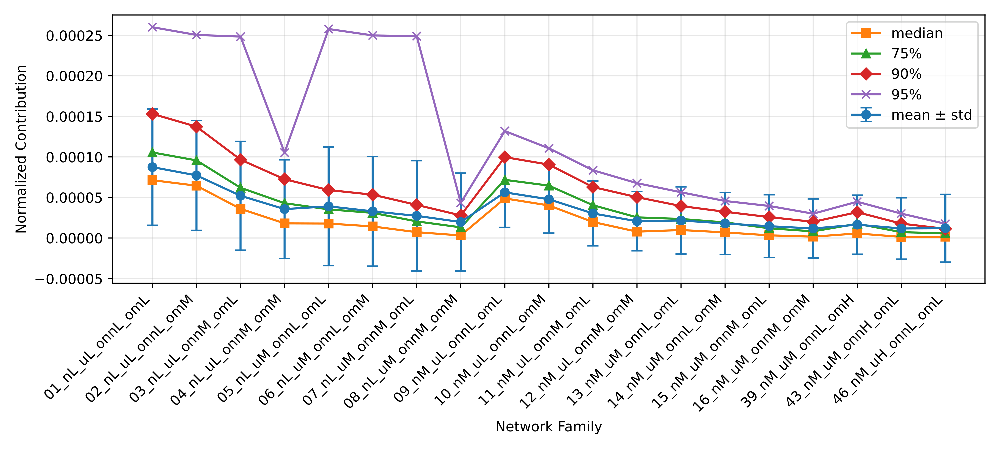
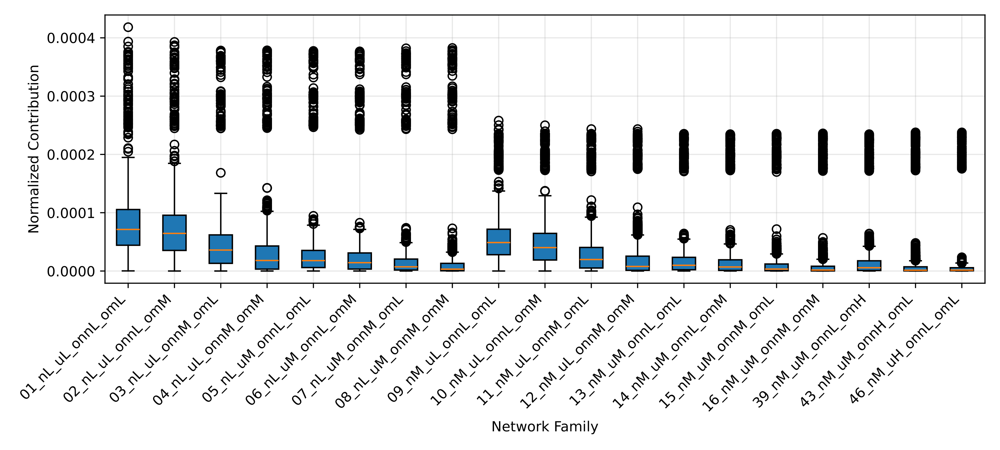
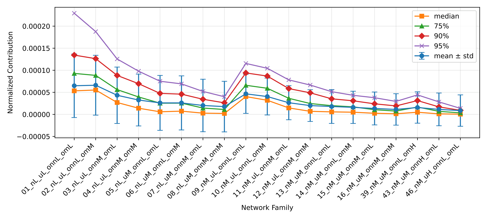
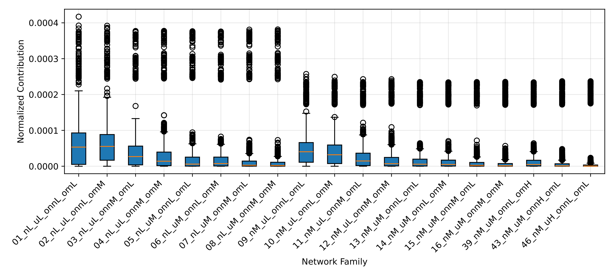
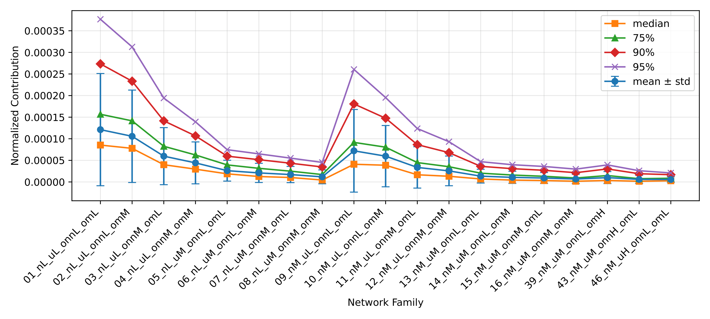
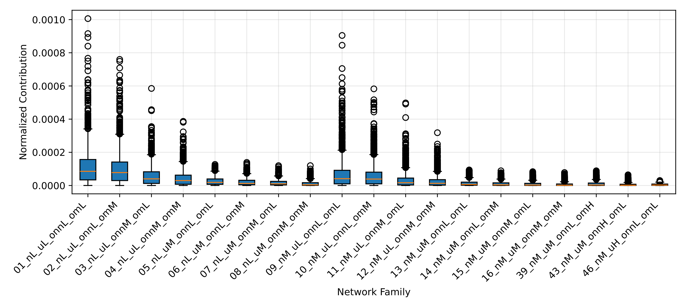
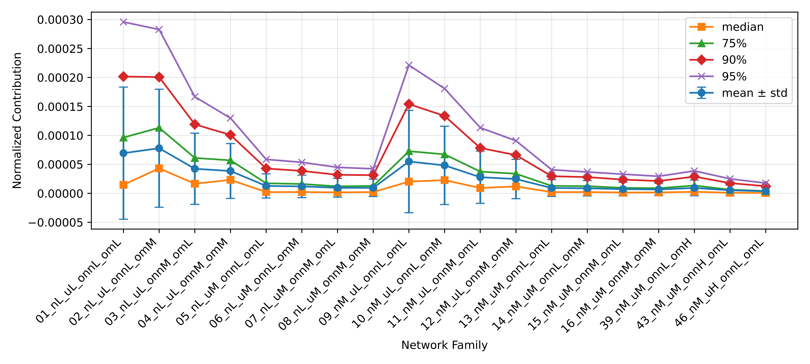
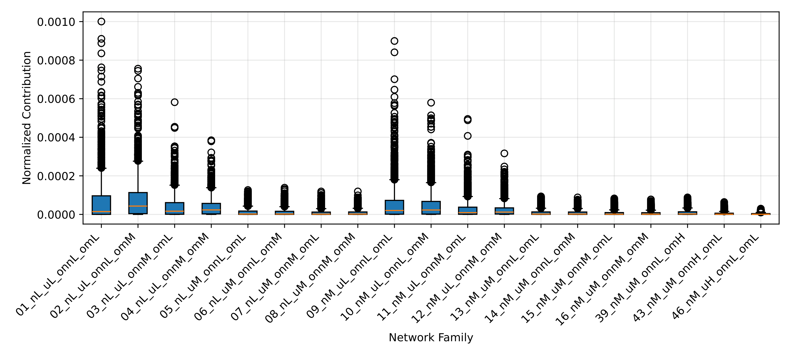

# Report 2 - Extend the experiments to larger parameter values

## Table of Contents

- [Networks](#networks)
- [Experience 5 (LAPIN-off + Extraction of K desired clusters)](#experience-5-lapin-off--extraction-of-k-desired-clusters)
- [Experience 6 (LAPIN-off + Extraction of clusters until the end)](#experience-6-lapin-off--extraction-of-clusters-until-the-end)
- [Experience 7 (LAPIN-on + Extraction of K desired clusters)](#experience-7-lapin-on--extraction-of-k-desired-clusters)
- [Experience 8 (LAPIN-on + Extraction of clusters until the end)](#experience-8-lapin-on--extraction-of-clusters-until-the-end)
- [Hardware](#hardware)
- [Discussion](#discussion)

## Networks

### LFR Network Parameterization

- $\overline{d}$ = 20
- $d_{max}$ = 50
- $c_{min}$ = 20
- $c_{max}$ = 100
- $t1$ = -2
- $t2$ = -1
- $n$ (4 groups):
  - L: [500, 700]
  - M: [800, 1000]
  - H: [2000, 5000]
  - VH: [6000, 10000]
- $\mu$ (3 groups):
  - L: [0.1, 0.3]
  - M: [0.4, 0.6]
  - H: [0.7, 0.8]
- $o_{n}$ / $n$ (3 groups):
  - L: [0.1, 0.2]
  - M: [0.3, 0.4]
  - H: [0.5, 0.6]
- $o_{m}$ (3 groups):
  - L: [2, 3]
  - M: [4, 5]
  - H: [6, 8]

### Network Families

| Network Family      | $n$           | $\mu$      | $o_{n}$/$n$| $o_{m}$|
|---------------------|---------------|------------|------------|--------|
| 01_nL_uL_onnL_omL   | [500, 700]    | [0.1, 0.3] | [0.1, 0.2] | [2, 3] |
| 02_nL_uL_onnL_omM   | [500, 700]    | [0.1, 0.3] | [0.1, 0.2] | [4, 5] |
| 03_nL_uL_onnL_omH   | [500, 700]    | [0.1, 0.3] | [0.1, 0.2] | [6, 8] |
| 04_nL_uL_onnM_omL   | [500, 700]    | [0.1, 0.3] | [0.3, 0.4] | [2, 3] |
| 05_nL_uL_onnM_omM   | [500, 700]    | [0.1, 0.3] | [0.3, 0.4] | [4, 5] |
| 06_nL_uL_onnM_omH   | [500, 700]    | [0.1, 0.3] | [0.3, 0.4] | [6, 8] |
| 07_nL_uL_onnH_omL   | [500, 700]    | [0.1, 0.3] | [0.5, 0.6] | [2, 3] |
| 08_nL_uL_onnH_omM   | [500, 700]    | [0.1, 0.3] | [0.5, 0.6] | [4, 5] |
| 09_nL_uL_onnH_omH   | [500, 700]    | [0.1, 0.3] | [0.5, 0.6] | [6, 8] |
| 10_nL_uM_onnL_omL   | [500, 700]    | [0.4, 0.6] | [0.1, 0.2] | [2, 3] |
| 11_nL_uM_onnL_omM   | [500, 700]    | [0.4, 0.6] | [0.1, 0.2] | [4, 5] |
| 12_nL_uM_onnL_omH   | [500, 700]    | [0.4, 0.6] | [0.1, 0.2] | [6, 8] |
| 13_nL_uM_onnM_omL   | [500, 700]    | [0.4, 0.6] | [0.3, 0.4] | [2, 3] |
| 14_nL_uM_onnM_omM   | [500, 700]    | [0.4, 0.6] | [0.3, 0.4] | [4, 5] |
| 15_nL_uM_onnM_omH   | [500, 700]    | [0.4, 0.6] | [0.3, 0.4] | [6, 8] |
| 16_nL_uM_onnH_omL   | [500, 700]    | [0.4, 0.6] | [0.5, 0.6] | [2, 3] |
| 17_nL_uM_onnH_omM   | [500, 700]    | [0.4, 0.6] | [0.5, 0.6] | [4, 5] |
| 18_nL_uM_onnH_omH   | [500, 700]    | [0.4, 0.6] | [0.5, 0.6] | [6, 8] |
| 19_nL_uH_onnL_omL   | [500, 700]    | [0.7, 0.8] | [0.1, 0.2] | [2, 3] |
| 20_nL_uH_onnL_omM   | [500, 700]    | [0.7, 0.8] | [0.1, 0.2] | [4, 5] |
| 21_nL_uH_onnL_omH   | [500, 700]    | [0.7, 0.8] | [0.1, 0.2] | [6, 8] |
| 22_nL_uH_onnM_omL   | [500, 700]    | [0.7, 0.8] | [0.3, 0.4] | [2, 3] |
| 23_nL_uH_onnM_omM   | [500, 700]    | [0.7, 0.8] | [0.3, 0.4] | [4, 5] |
| 24_nL_uH_onnM_omH   | [500, 700]    | [0.7, 0.8] | [0.3, 0.4] | [6, 8] |
| 25_nL_uH_onnH_omL   | [500, 700]    | [0.7, 0.8] | [0.5, 0.6] | [2, 3] |
| 26_nL_uH_onnH_omM   | [500, 700]    | [0.7, 0.8] | [0.5, 0.6] | [4, 5] |
| 27_nL_uH_onnH_omH   | [500, 700]    | [0.7, 0.8] | [0.5, 0.6] | [6, 8] |
| 28_nM_uL_onnL_omL   | [800, 1000]   | [0.1, 0.3] | [0.1, 0.2] | [2, 3] |
| 29_nM_uL_onnL_omM   | [800, 1000]   | [0.1, 0.3] | [0.1, 0.2] | [4, 5] |
| 30_nM_uL_onnL_omH   | [800, 1000]   | [0.1, 0.3] | [0.1, 0.2] | [6, 8] |
| 31_nM_uL_onnM_omL   | [800, 1000]   | [0.1, 0.3] | [0.3, 0.4] | [2, 3] |
| 32_nM_uL_onnM_omM   | [800, 1000]   | [0.1, 0.3] | [0.3, 0.4] | [4, 5] |
| 33_nM_uL_onnM_omH   | [800, 1000]   | [0.1, 0.3] | [0.3, 0.4] | [6, 8] |
| 34_nM_uL_onnH_omL   | [800, 1000]   | [0.1, 0.3] | [0.5, 0.6] | [2, 3] |
| 35_nM_uL_onnH_omM   | [800, 1000]   | [0.1, 0.3] | [0.5, 0.6] | [4, 5] |
| 36_nM_uL_onnH_omH   | [800, 1000]   | [0.1, 0.3] | [0.5, 0.6] | [6, 8] |
| 37_nM_uM_onnL_omL   | [800, 1000]   | [0.4, 0.6] | [0.1, 0.2] | [2, 3] |
| 38_nM_uM_onnL_omM   | [800, 1000]   | [0.4, 0.6] | [0.1, 0.2] | [4, 5] |
| 39_nM_uM_onnL_omH   | [800, 1000]   | [0.4, 0.6] | [0.1, 0.2] | [6, 8] |
| 40_nM_uM_onnM_omL   | [800, 1000]   | [0.4, 0.6] | [0.3, 0.4] | [2, 3] |
| 41_nM_uM_onnM_omM   | [800, 1000]   | [0.4, 0.6] | [0.3, 0.4] | [4, 5] |
| 42_nM_uM_onnM_omH   | [800, 1000]   | [0.4, 0.6] | [0.3, 0.4] | [6, 8] |
| 43_nM_uM_onnH_omL   | [800, 1000]   | [0.4, 0.6] | [0.5, 0.6] | [2, 3] |
| 44_nM_uM_onnH_omM   | [800, 1000]   | [0.4, 0.6] | [0.5, 0.6] | [4, 5] |
| 45_nM_uM_onnH_omH   | [800, 1000]   | [0.4, 0.6] | [0.5, 0.6] | [6, 8] |
| 46_nM_uH_onnL_omL   | [800, 1000]   | [0.7, 0.8] | [0.1, 0.2] | [2, 3] |
| 47_nM_uH_onnL_omM   | [800, 1000]   | [0.7, 0.8] | [0.1, 0.2] | [4, 5] |
| 48_nM_uH_onnL_omH   | [800, 1000]   | [0.7, 0.8] | [0.1, 0.2] | [6, 8] |
| 49_nM_uH_onnM_omL   | [800, 1000]   | [0.7, 0.8] | [0.3, 0.4] | [2, 3] |
| 50_nM_uH_onnM_omM   | [800, 1000]   | [0.7, 0.8] | [0.3, 0.4] | [4, 5] |
| 51_nM_uH_onnM_omH   | [800, 1000]   | [0.7, 0.8] | [0.3, 0.4] | [6, 8] |
| 52_nM_uH_onnH_omL   | [800, 1000]   | [0.7, 0.8] | [0.5, 0.6] | [2, 3] |
| 53_nM_uH_onnH_omM   | [800, 1000]   | [0.7, 0.8] | [0.5, 0.6] | [4, 5] |
| 54_nM_uH_onnH_omH   | [800, 1000]   | [0.7, 0.8] | [0.5, 0.6] | [6, 8] |
| 55_nH_uL_onnL_omL   | [2000, 5000]  | [0.1, 0.3] | [0.1, 0.2] | [2, 3] |
| 56_nH_uL_onnL_omM   | [2000, 5000]  | [0.1, 0.3] | [0.1, 0.2] | [4, 5] |
| 57_nH_uL_onnL_omH   | [2000, 5000]  | [0.1, 0.3] | [0.1, 0.2] | [6, 8] |
| 58_nH_uL_onnM_omL   | [2000, 5000]  | [0.1, 0.3] | [0.3, 0.4] | [2, 3] |
| 59_nH_uL_onnM_omM   | [2000, 5000]  | [0.1, 0.3] | [0.3, 0.4] | [4, 5] |
| 60_nH_uL_onnM_omH   | [2000, 5000]  | [0.1, 0.3] | [0.3, 0.4] | [6, 8] |
| 61_nH_uL_onnH_omL   | [2000, 5000]  | [0.1, 0.3] | [0.5, 0.6] | [2, 3] |
| 62_nH_uL_onnH_omM   | [2000, 5000]  | [0.1, 0.3] | [0.5, 0.6] | [4, 5] |
| 63_nH_uL_onnH_omH   | [2000, 5000]  | [0.1, 0.3] | [0.5, 0.6] | [6, 8] |
| 64_nH_uM_onnL_omL   | [2000, 5000]  | [0.4, 0.6] | [0.1, 0.2] | [2, 3] |
| 65_nH_uM_onnL_omM   | [2000, 5000]  | [0.4, 0.6] | [0.1, 0.2] | [4, 5] |
| 66_nH_uM_onnL_omH   | [2000, 5000]  | [0.4, 0.6] | [0.1, 0.2] | [6, 8] |
| 67_nH_uM_onnM_omL   | [2000, 5000]  | [0.4, 0.6] | [0.3, 0.4] | [2, 3] |
| 68_nH_uM_onnM_omM   | [2000, 5000]  | [0.4, 0.6] | [0.3, 0.4] | [4, 5] |
| 69_nH_uM_onnM_omH   | [2000, 5000]  | [0.4, 0.6] | [0.3, 0.4] | [6, 8] |
| 70_nH_uM_onnH_omL   | [2000, 5000]  | [0.4, 0.6] | [0.5, 0.6] | [2, 3] |
| 71_nH_uM_onnH_omM   | [2000, 5000]  | [0.4, 0.6] | [0.5, 0.6] | [4, 5] |
| 72_nH_uM_onnH_omH   | [2000, 5000]  | [0.4, 0.6] | [0.5, 0.6] | [6, 8] |
| 73_nH_uH_onnL_omL   | [2000, 5000]  | [0.7, 0.8] | [0.1, 0.2] | [2, 3] |
| 74_nH_uH_onnL_omM   | [2000, 5000]  | [0.7, 0.8] | [0.1, 0.2] | [4, 5] |
| 75_nH_uH_onnL_omH   | [2000, 5000]  | [0.7, 0.8] | [0.1, 0.2] | [6, 8] |
| 76_nH_uH_onnM_omL   | [2000, 5000]  | [0.7, 0.8] | [0.3, 0.4] | [2, 3] |
| 77_nH_uH_onnM_omM   | [2000, 5000]  | [0.7, 0.8] | [0.3, 0.4] | [4, 5] |
| 78_nH_uH_onnM_omH   | [2000, 5000]  | [0.7, 0.8] | [0.3, 0.4] | [6, 8] |
| 79_nH_uH_onnH_omL   | [2000, 5000]  | [0.7, 0.8] | [0.5, 0.6] | [2, 3] |
| 80_nH_uH_onnH_omM   | [2000, 5000]  | [0.7, 0.8] | [0.5, 0.6] | [4, 5] |
| 81_nH_uH_onnH_omH   | [2000, 5000]  | [0.7, 0.8] | [0.5, 0.6] | [6, 8] |
| 82_nVH_uL_onnL_omL  | [6000, 10000] | [0.1, 0.3] | [0.1, 0.2] | [2, 3] |
| 83_nVH_uL_onnL_omM  | [6000, 10000] | [0.1, 0.3] | [0.1, 0.2] | [4, 5] |
| 84_nVH_uL_onnL_omH  | [6000, 10000] | [0.1, 0.3] | [0.1, 0.2] | [6, 8] |
| 85_nVH_uL_onnM_omL  | [6000, 10000] | [0.1, 0.3] | [0.3, 0.4] | [2, 3] |
| 86_nVH_uL_onnM_omM  | [6000, 10000] | [0.1, 0.3] | [0.3, 0.4] | [4, 5] |
| 87_nVH_uL_onnM_omH  | [6000, 10000] | [0.1, 0.3] | [0.3, 0.4] | [6, 8] |
| 88_nVH_uL_onnH_omL  | [6000, 10000] | [0.1, 0.3] | [0.5, 0.6] | [2, 3] |
| 89_nVH_uL_onnH_omM  | [6000, 10000] | [0.1, 0.3] | [0.5, 0.6] | [4, 5] |
| 90_nVH_uL_onnH_omH  | [6000, 10000] | [0.1, 0.3] | [0.5, 0.6] | [6, 8] |
| 91_nVH_uM_onnL_omL  | [6000, 10000] | [0.4, 0.6] | [0.1, 0.2] | [2, 3] |
| 92_nVH_uM_onnL_omM  | [6000, 10000] | [0.4, 0.6] | [0.1, 0.2] | [4, 5] |
| 93_nVH_uM_onnL_omH  | [6000, 10000] | [0.4, 0.6] | [0.1, 0.2] | [6, 8] |
| 94_nVH_uM_onnM_omL  | [6000, 10000] | [0.4, 0.6] | [0.3, 0.4] | [2, 3] |
| 95_nVH_uM_onnM_omM  | [6000, 10000] | [0.4, 0.6] | [0.3, 0.4] | [4, 5] |
| 96_nVH_uM_onnM_omH  | [6000, 10000] | [0.4, 0.6] | [0.3, 0.4] | [6, 8] |
| 97_nVH_uM_onnH_omL  | [6000, 10000] | [0.4, 0.6] | [0.5, 0.6] | [2, 3] |
| 98_nVH_uM_onnH_omM  | [6000, 10000] | [0.4, 0.6] | [0.5, 0.6] | [4, 5] |
| 99_nVH_uM_onnH_omH  | [6000, 10000] | [0.4, 0.6] | [0.5, 0.6] | [6, 8] |
| 100_nVH_uH_onnL_omL | [6000, 10000] | [0.7, 0.8] | [0.1, 0.2] | [2, 3] |
| 101_nVH_uH_onnL_omM | [6000, 10000] | [0.7, 0.8] | [0.1, 0.2] | [4, 5] |
| 102_nVH_uH_onnL_omH | [6000, 10000] | [0.7, 0.8] | [0.1, 0.2] | [6, 8] |
| 103_nVH_uH_onnM_omL | [6000, 10000] | [0.7, 0.8] | [0.3, 0.4] | [2, 3] |
| 104_nVH_uH_onnM_omM | [6000, 10000] | [0.7, 0.8] | [0.3, 0.4] | [4, 5] |
| 105_nVH_uH_onnM_omH | [6000, 10000] | [0.7, 0.8] | [0.3, 0.4] | [6, 8] |
| 106_nVH_uH_onnH_omL | [6000, 10000] | [0.7, 0.8] | [0.5, 0.6] | [2, 3] |
| 107_nVH_uH_onnH_omM | [6000, 10000] | [0.7, 0.8] | [0.5, 0.6] | [4, 5] |
| 108_nVH_uH_onnH_omH | [6000, 10000] | [0.7, 0.8] | [0.5, 0.6] | [6, 8] |

### Networks for Each Network Family

- $\overline{d}$: fixed
  - (20)
- $d_{max}$: fixed
  - (50)
- $c_{min}$: fixed
  - (20)
- $c_{max}$: fixed
  - (100)
- $t1$: fixed
  - (2.0)
- $t2$: fixed
  - (1.0)
- $n$: step 100 or 1000 or 2000
  - L: (500 600 700)
  - M: (800 900 1000)
  - H: (2000 3000 5000)
  - VH: (6000 8000 10000)
- $\mu$: step 0.1 or 0.05
  - L: (0.1 0.2 0.3)
  - M: (0.4 0.5 0.6)
  - H: (0.7 0.75 0.8)
- $o_{n}$/$n$: step 0.1
  - L: (10 20)
  - M: (30 40)
  - H: (50 60)
- $o_{m}$: step 1 or 2
  - L: (2 3)
  - M: (4 5)
  - H: (6 8)
- Instances: 2

**Networks for Each Network Family: 3 ($n$) * 3 ($\mu$) * 2 ($o_{n}$/$n$) * 2 ($o_{m}$) * 2 (instances) = 72 networks**

**Total Networks: 108 (families) * 3 ($n$) * 3 ($\mu$) * 2 ($o_{n}$/$n$) * 2 ($o_{m}$) * 2 (instances) = 7776 networks**

**NOTE**: The total number of networks is quite large (7776), which make the computation computationally intensive. Therefore, the 16 base network families from [Report 1](./report1.md) (combinations of L/M for $n$, $\mu$, $o_{n}$/$n$ and $o_m$) are used to ensure robustness in the experiment, and only the necessary network families with larger parameters are computed.

### Reduced Network Families

| Network Family          | $n$           | $\mu$      | $o_{n}$/$n$ | $o_{m}$ |
|-------------------------|---------------|------------|-------------|---------|
| 01_nL_uL_onnL_omL       | [500, 700]    | [0.1, 0.3] | [0.1, 0.2]  | [2, 3]  |
| 02_nL_uL_onnL_omM       | [500, 700]    | [0.1, 0.3] | [0.1, 0.2]  | [4, 5]  |
| 03_nL_uL_onnM_omL       | [500, 700]    | [0.1, 0.3] | [0.3, 0.4]  | [2, 3]  |
| 04_nL_uL_onnM_omM       | [500, 700]    | [0.1, 0.3] | [0.3, 0.4]  | [4, 5]  |
| 05_nL_uM_onnL_omL       | [500, 700]    | [0.4, 0.6] | [0.1, 0.2]  | [2, 3]  |
| 06_nL_uM_onnL_omM       | [500, 700]    | [0.4, 0.6] | [0.1, 0.2]  | [4, 5]  |
| 07_nL_uM_onnM_omL       | [500, 700]    | [0.4, 0.6] | [0.3, 0.4]  | [2, 3]  |
| 08_nL_uM_onnM_omM       | [500, 700]    | [0.4, 0.6] | [0.3, 0.4]  | [4, 5]  |
| 09_nM_uL_onnL_omL       | [800, 1000]   | [0.1, 0.3] | [0.1, 0.2]  | [2, 3]  |
| 10_nM_uL_onnL_omM       | [800, 1000]   | [0.1, 0.3] | [0.1, 0.2]  | [4, 5]  |
| 11_nM_uL_onnM_omL       | [800, 1000]   | [0.1, 0.3] | [0.3, 0.4]  | [2, 3]  |
| 12_nM_uL_onnM_omM       | [800, 1000]   | [0.1, 0.3] | [0.3, 0.4]  | [4, 5]  |
| 13_nM_uM_onnL_omL       | [800, 1000]   | [0.4, 0.6] | [0.1, 0.2]  | [2, 3]  |
| 14_nM_uM_onnL_omM       | [800, 1000]   | [0.4, 0.6] | [0.1, 0.2]  | [4, 5]  |
| 15_nM_uM_onnM_omL       | [800, 1000]   | [0.4, 0.6] | [0.3, 0.4]  | [2, 3]  |
| 16_nM_uM_onnM_omM       | [800, 1000]   | [0.4, 0.6] | [0.3, 0.4]  | [4, 5]  |
| 39_nM_uM_onnL_omH       | [800, 1000]   | [0.4, 0.6] | [0.1, 0.2]  | [6, 8]  |
| 43_nM_uM_onnH_omL       | [800, 1000]   | [0.4, 0.6] | [0.5, 0.6]  | [2, 3]  |
| 46_nM_uH_onnL_omL       | [800, 1000]   | [0.7, 0.8] | [0.1, 0.2]  | [2, 3]  |
| ~~64_nH_uM_onnL_omL~~   | [2000, 5000]  | [0.4, 0.6] | [0.1, 0.2]  | [2, 3]  |
| ~~91_nVH_uM_onnL_omL~~  | [6000, 10000] | [0.4, 0.6] | [0.1, 0.2]  | [2, 3]  |

**Networks for Each Network Family: 3 ($n$) * 3 ($\mu$) * 2 ($o_{n}$/$n$) * 2 ($o_{m}$) * 2 (instances) = 72 networks**

**Total Networks: 21 (families) * 3 ($n$) * 3 ($\mu$) * 2 ($o_{n}$/$n$) * 2 ($o_{m}$) * 2 (instances) = 1512 networks**

**NOTE**: The last two network families (64 and 91) are computationally intensive due to their large number of nodes ($n$) and are therefore excluded from the experiment until optimizations are made.

**Networks for Each Network Family: 3 ($n$) * 3 ($\mu$) * 2 ($o_{n}$/$n$) * 2 ($o_{m}$) * 2 (instances) = 72 networks**

**Total Networks: 19 (families) * 3 ($n$) * 3 ($\mu$) * 2 ($o_{n}$/$n$) * 2 ($o_{m}$) * 2 (instances) = 1368 networks**

## Experience 5 (LAPIN-off + Extraction of K desired clusters)

### Contributions Line Plots

[Open Folder](../../results/synthetic/experience5_cluster/results_2026-04-18_11-37-07-535201/)

### Statistics

| Network Family    | #Networks | Mean                   | Std                    | Median                 | 75%                    | 90%                    | 95%                    | Min                    | Max                    |
|-------------------|-----------|------------------------|------------------------|------------------------|------------------------|------------------------|------------------------|------------------------|------------------------|
| 01_nL_uL_onnL_omL | 72        | 8.741303062129563e-05  | 7.166052324068398e-05  | 7.131570706178536e-05  | 0.00010549930155067866 | 0.00015306676348177806 | 0.00025994667445671546 | 2.2092796518815657e-07 | 0.000418299390384432   |
| 02_nL_uL_onnL_omM | 72        | 7.725130181315598e-05  | 6.777026635979239e-05  | 6.452183162665591e-05  | 9.571135953849872e-05  | 0.00013730608876123487 | 0.00025040441437384196 | 1.647148060053397e-09  | 0.0003929533419392662  |
| 03_nL_uL_onnM_omL | 72        | 5.211000982206374e-05  | 6.706391724306653e-05  | 3.597517130544882e-05  | 6.196928312965922e-05  | 9.661835490134971e-05  | 0.000248354258457108   | 2.200838708634395e-10  | 0.0003781650518235969  |
| 04_nL_uL_onnM_omM | 72        | 3.563888860107498e-05  | 6.073949460380866e-05  | 1.8061869999003227e-05 | 4.2935014871550106e-05 | 7.248429549528816e-05  | 0.00010535546059590118 | 1.1331794266922694e-14 | 0.0003785396566138438  |
| 05_nL_uM_onnL_omL | 72        | 3.906770100687483e-05  | 7.31645961186694e-05   | 1.7825136109080203e-05 | 3.534829125633689e-05  | 5.915797467904114e-05  | 0.0002577153119844932  | 1.7676847742178455e-08 | 0.0003775349703787118  |
| 06_nL_uM_onnL_omM | 72        | 3.288973903243701e-05  | 6.753422804185879e-05  | 1.4275401255574377e-05 | 3.099114759351735e-05  | 5.3433249682071976e-05 | 0.0002498218061644621  | 1.3261143517636811e-11 | 0.0003767932453545354  |
| 07_nL_uM_onnM_omL | 72        | 2.7305840958668134e-05 | 6.801009595730685e-05  | 7.19077150618138e-06   | 2.0487276640569897e-05 | 4.081971958049965e-05  | 0.0002488231586416161  | 2.8459048928554753e-12 | 0.0003820792777073114  |
| 08_nL_uM_onnM_omM | 72        | 1.9706423691867263e-05 | 6.0385681328785415e-05 | 3.169941198295696e-06  | 1.3177792974899077e-05 | 2.787117281755548e-05  | 4.328707432549208e-05  | 2.5496539732788536e-24 | 0.0003826040991030174  |
| 09_nM_uL_onnL_omL | 72        | 5.6303065821340965e-05 | 4.3160817051684204e-05 | 4.884506224590443e-05  | 7.172102603629535e-05  | 9.974448497976818e-05  | 0.000131882293786722   | 2.238278022796031e-08  | 0.0002580194919579973  |
| 10_nM_uL_onnL_omM | 72        | 4.7739164556442947e-05 | 4.163595679894197e-05  | 4.015680373336101e-05  | 6.458748965555621e-05  | 9.051199244176854e-05  | 0.00011061854236174089 | 5.075445438356653e-09  | 0.0002500162697048678  |
| 11_nM_uL_onnM_omL | 72        | 3.031351409813247e-05  | 3.999297041998978e-05  | 1.9732615784769943e-05 | 4.047749627488095e-05  | 6.28623101547278e-05   | 8.35372982191072e-05   | 8.883584601282456e-11  | 0.00024349537056914512 |
| 12_nM_uL_onnM_omM | 72        | 2.069670436139992e-05  | 3.650163656848846e-05  | 7.844071757855867e-06  | 2.5489558813523788e-05 | 5.0359136306847066e-05 | 6.765057986172825e-05  | 2.753966337085569e-24  | 0.00024345507305002814 |
| 13_nM_uM_onnL_omL | 72        | 2.1636639419783283e-05 | 4.1373857741765904e-05 | 9.836007762161582e-06  | 2.3483176641871898e-05 | 3.9423841279942755e-05 | 5.640469592628372e-05  | 4.0709507932090166e-13 | 0.00023543831176104147 |
| 14_nM_uM_onnL_omM | 72        | 1.7877575452431676e-05 | 3.828899689151019e-05  | 6.934873453732481e-06  | 1.925543327493041e-05  | 3.234887341702085e-05  | 4.566014437865928e-05  | 3.529377009467866e-23  | 0.00023474620500764815 |
| 15_nM_uM_onnM_omL | 72        | 1.4585716727466007e-05 | 3.8715909222728504e-05 | 3.3096368147017807e-06 | 1.2026330005317042e-05 | 2.5824660109314146e-05 | 3.952280084193209e-05  | 8.056349241097515e-23  | 0.0002354863745400325  |
| 16_nM_uM_onnM_omM | 72        | 1.1737926765445071e-05 | 3.6403321128885775e-05 | 1.672976896664927e-06  | 8.191826319374538e-06  | 1.9968947580028653e-05 | 2.9999934653837424e-05 | 5.41814700952069e-25   | 0.0002360689829150185  |
| 39_nM_uM_onnL_omH | 72        | 1.6462135368001807e-05 | 3.641266300816356e-05  | 5.638508927189958e-06  | 1.7556940501824023e-05 | 3.18418951812755e-05   | 4.473989544496382e-05  | 1.4653549868149503e-24 | 0.00023475673304469084 |
| 43_nM_uM_onnH_omL | 72        | 1.1750187769553147e-05 | 3.77851005004035e-05   | 1.3655437454067635e-06 | 7.230415479390753e-06  | 1.7765387683074605e-05 | 3.008336967343886e-05  | 9.159466317660923e-25  | 0.00023784339074604257 |
| 46_nM_uH_onnL_omL | 72        | 1.209102507241501e-05  | 4.177075004196316e-05  | 1.5705502911294985e-06 | 5.6819692764136315e-06 | 1.1344783434892382e-05 | 1.7549540669228014e-05 | 5.2200892099249314e-11 | 0.0002377797697065041  |

- #Total Networks: 1368

### Histograms

[Open Folder](../../results/synthetic/experience5_cluster/results_2026-04-18_11-37-07-535201/)

### Line plot

### Box plot

### Candidate Thresholds

| Network Family    | Mean                   | Median                 | 75%                    | 90%                    | 95%                    |
|-------------------|------------------------|------------------------|------------------------|------------------------|------------------------|
| 01_nL_uL_onnL_omL | 8.741303062129563e-05  | 7.131570706178536e-05  | 0.00010549930155067866 | 0.00015306676348177806 | 0.00025994667445671546 |
| 02_nL_uL_onnL_omM | 7.725130181315598e-05  | 6.452183162665591e-05  | 9.571135953849872e-05  | 0.00013730608876123487 | 0.00025040441437384196 |
| 03_nL_uL_onnM_omL | 5.211000982206374e-05  | 3.597517130544882e-05  | 6.196928312965922e-05  | 9.661835490134971e-05  | 0.000248354258457108   |
| 04_nL_uL_onnM_omM | 3.563888860107498e-05  | 1.8061869999003227e-05 | 4.2935014871550106e-05 | 7.248429549528816e-05  | 0.00010535546059590118 |
| 05_nL_uM_onnL_omL | 3.906770100687483e-05  | 1.7825136109080203e-05 | 3.534829125633689e-05  | 5.915797467904114e-05  | 0.0002577153119844932  |
| 06_nL_uM_onnL_omM | 3.288973903243701e-05  | 1.4275401255574377e-05 | 3.099114759351735e-05  | 5.3433249682071976e-05 | 0.0002498218061644621  |
| 07_nL_uM_onnM_omL | 2.7305840958668134e-05 | 7.19077150618138e-06   | 2.0487276640569897e-05 | 4.081971958049965e-05  | 0.0002488231586416161  |
| 08_nL_uM_onnM_omM | 1.9706423691867263e-05 | 3.169941198295696e-06  | 1.3177792974899077e-05 | 2.787117281755548e-05  | 4.328707432549208e-05  |
| 09_nM_uL_onnL_omL | 5.6303065821340965e-05 | 4.884506224590443e-05  | 7.172102603629535e-05  | 9.974448497976818e-05  | 0.000131882293786722   |
| 10_nM_uL_onnL_omM | 4.7739164556442947e-05 | 4.015680373336101e-05  | 6.458748965555621e-05  | 9.051199244176854e-05  | 0.00011061854236174089 |
| 11_nM_uL_onnM_omL | 3.031351409813247e-05  | 1.9732615784769943e-05 | 4.047749627488095e-05  | 6.28623101547278e-05   | 8.35372982191072e-05   |
| 12_nM_uL_onnM_omM | 2.069670436139992e-05  | 7.844071757855867e-06  | 2.5489558813523788e-05 | 5.0359136306847066e-05 | 6.765057986172825e-05  |
| 13_nM_uM_onnL_omL | 2.1636639419783283e-05 | 9.836007762161582e-06  | 2.3483176641871898e-05 | 3.9423841279942755e-05 | 5.640469592628372e-05  |
| 14_nM_uM_onnL_omM | 1.7877575452431676e-05 | 6.934873453732481e-06  | 1.925543327493041e-05  | 3.234887341702085e-05  | 4.566014437865928e-05  |
| 15_nM_uM_onnM_omL | 1.4585716727466007e-05 | 3.3096368147017807e-06 | 1.2026330005317042e-05 | 2.5824660109314146e-05 | 3.952280084193209e-05  |
| 16_nM_uM_onnM_omM | 1.1737926765445071e-05 | 1.672976896664927e-06  | 8.191826319374538e-06  | 1.9968947580028653e-05 | 2.9999934653837424e-05 |
| 39_nM_uM_onnL_omH | 1.6462135368001807e-05 | 5.638508927189958e-06  | 1.7556940501824023e-05 | 3.18418951812755e-05   | 4.473989544496382e-05  |
| 43_nM_uM_onnH_omL | 1.1750187769553147e-05 | 1.3655437454067635e-06 | 7.230415479390753e-06  | 1.7765387683074605e-05 | 3.008336967343886e-05  |
| 46_nM_uH_onnL_omL | 1.209102507241501e-05  | 1.5705502911294985e-06 | 5.6819692764136315e-06 | 1.1344783434892382e-05 | 1.7549540669228014e-05 |

### Bootstrap Statistics

| Network Family    | #Networks | Subsample Size | #Bootstraps | Metric | Candidate Threshold    | MSE                    |
|-------------------|-----------|----------------|-------------|--------|------------------------|------------------------|
| 01_nL_uL_onnL_omL | 72        | 58             | 1000        | Mean   | 8.741303062129563e-05  | 1.0664216964948635e-06 |
| 01_nL_uL_onnL_omL | 72        | 58             | 1000        | Median | 7.131570706178536e-05  | 7.137416065340206e-07  |
| 01_nL_uL_onnL_omL | 72        | 58             | 1000        | 75%    | 0.00010549930155067866 | 1.5535670784123048e-06 |
| 01_nL_uL_onnL_omL | 72        | 58             | 1000        | 90%    | 0.00015306676348177806 | 3.3531954477939427e-06 |
| 01_nL_uL_onnL_omL | 72        | 58             | 1000        | 95%    | 0.00025994667445671546 | 9.66653922416654e-06   |
| 02_nL_uL_onnL_omM | 72        | 58             | 1000        | Mean   | 7.725130181315598e-05  | 6.920294366416771e-07  |
| 02_nL_uL_onnL_omM | 72        | 58             | 1000        | Median | 6.452183162665591e-05  | 4.832606895230334e-07  |
| 02_nL_uL_onnL_omM | 72        | 58             | 1000        | 75%    | 9.571135953849872e-05  | 1.0524187474711473e-06 |
| 02_nL_uL_onnL_omM | 72        | 58             | 1000        | 90%    | 0.00013730608876123487 | 2.1747795907324e-06    |
| 02_nL_uL_onnL_omM | 72        | 58             | 1000        | 95%    | 0.00025040441437384196 | 7.153242406058092e-06  |
| 03_nL_uL_onnM_omL | 72        | 58             | 1000        | Mean   | 5.211000982206374e-05  | 7.379454866303304e-07  |
| 03_nL_uL_onnM_omL | 72        | 58             | 1000        | Median | 3.597517130544882e-05  | 3.507180433361464e-07  |
| 03_nL_uL_onnM_omL | 72        | 58             | 1000        | 75%    | 6.196928312965922e-05  | 1.0460711807641411e-06 |
| 03_nL_uL_onnM_omL | 72        | 58             | 1000        | 90%    | 9.661835490134971e-05  | 2.4807424464546935e-06 |
| 03_nL_uL_onnM_omL | 72        | 58             | 1000        | 95%    | 0.000248354258457108   | 1.5993550677718825e-05 |
| 04_nL_uL_onnM_omM | 72        | 58             | 1000        | Mean   | 3.563888860107498e-05  | 4.076552683012782e-07  |
| 04_nL_uL_onnM_omM | 72        | 58             | 1000        | Median | 1.8061869999003227e-05 | 1.0246724618719558e-07 |
| 04_nL_uL_onnM_omM | 72        | 58             | 1000        | 75%    | 4.2935014871550106e-05 | 5.895983292305878e-07  |
| 04_nL_uL_onnM_omM | 72        | 58             | 1000        | 90%    | 7.248429549528816e-05  | 1.6816751013255102e-06 |
| 04_nL_uL_onnM_omM | 72        | 58             | 1000        | 95%    | 0.00010535546059590118 | 3.407275720958329e-06  |
| 05_nL_uM_onnL_omL | 72        | 58             | 1000        | Mean   | 3.906770100687483e-05  | 1.1707094407676687e-06 |
| 05_nL_uM_onnL_omL | 72        | 58             | 1000        | Median | 1.7825136109080203e-05 | 2.463248189453484e-07  |
| 05_nL_uM_onnL_omL | 72        | 58             | 1000        | 75%    | 3.534829125633689e-05  | 9.66795808839609e-07   |
| 05_nL_uM_onnL_omL | 72        | 58             | 1000        | 90%    | 5.915797467904114e-05  | 2.6691788423548186e-06 |
| 05_nL_uM_onnL_omL | 72        | 58             | 1000        | 95%    | 0.0002577153119844932  | 5.225260617085649e-05  |
| 06_nL_uM_onnL_omM | 72        | 58             | 1000        | Mean   | 3.288973903243701e-05  | 7.829425395010395e-07  |
| 06_nL_uM_onnL_omM | 72        | 58             | 1000        | Median | 1.4275401255574377e-05 | 1.4286383945288967e-07 |
| 06_nL_uM_onnL_omM | 72        | 58             | 1000        | 75%    | 3.099114759351735e-05  | 6.879126878225584e-07  |
| 06_nL_uM_onnL_omM | 72        | 58             | 1000        | 90%    | 5.3433249682071976e-05 | 2.0159685070426935e-06 |
| 06_nL_uM_onnL_omM | 72        | 58             | 1000        | 95%    | 0.0002498218061644621  | 4.4040946569119126e-05 |
| 07_nL_uM_onnM_omL | 72        | 58             | 1000        | Mean   | 2.7305840958668134e-05 | 7.870340812129594e-07  |
| 07_nL_uM_onnM_omL | 72        | 58             | 1000        | Median | 7.19077150618138e-06   | 5.5910270573377046e-08 |
| 07_nL_uM_onnM_omL | 72        | 58             | 1000        | 75%    | 2.0487276640569897e-05 | 4.431806966037144e-07  |
| 07_nL_uM_onnM_omL | 72        | 58             | 1000        | 90%    | 4.081971958049965e-05  | 1.7520576658695625e-06 |
| 07_nL_uM_onnM_omL | 72        | 58             | 1000        | 95%    | 0.0002488231586416161  | 6.283797806515927e-05  |
| 08_nL_uM_onnM_omM | 72        | 58             | 1000        | Mean   | 1.9706423691867263e-05 | 4.590921259432064e-07  |
| 08_nL_uM_onnM_omM | 72        | 58             | 1000        | Median | 3.169941198295696e-06  | 1.2109204843034427e-08 |
| 08_nL_uM_onnM_omM | 72        | 58             | 1000        | 75%    | 1.3177792974899077e-05 | 2.0258343040316847e-07 |
| 08_nL_uM_onnM_omM | 72        | 58             | 1000        | 90%    | 2.787117281755548e-05  | 9.246608294709468e-07  |
| 08_nL_uM_onnM_omM | 72        | 58             | 1000        | 95%    | 4.328707432549208e-05  | 2.2784210380344293e-06 |
| 09_nM_uL_onnL_omL | 72        | 58             | 1000        | Mean   | 5.6303065821340965e-05 | 4.967765629512762e-07  |
| 09_nM_uL_onnL_omL | 72        | 58             | 1000        | Median | 4.884506224590443e-05  | 3.7743849753489027e-07 |
| 09_nM_uL_onnL_omL | 72        | 58             | 1000        | 75%    | 7.172102603629535e-05  | 8.155549501560463e-07  |
| 09_nM_uL_onnL_omL | 72        | 58             | 1000        | 90%    | 9.974448497976818e-05  | 1.5586704731265822e-06 |
| 09_nM_uL_onnL_omL | 72        | 58             | 1000        | 95%    | 0.000131882293786722   | 2.6036811594487887e-06 |
| 10_nM_uL_onnL_omM | 72        | 58             | 1000        | Mean   | 4.7739164556442947e-05 | 3.23532481488459e-07   |
| 10_nM_uL_onnL_omM | 72        | 58             | 1000        | Median | 4.015680373336101e-05  | 2.3074518006953374e-07 |
| 10_nM_uL_onnL_omM | 72        | 58             | 1000        | 75%    | 6.458748965555621e-05  | 5.93772094427332e-07   |
| 10_nM_uL_onnL_omM | 72        | 58             | 1000        | 90%    | 9.051199244176854e-05  | 1.1648341368815061e-06 |
| 10_nM_uL_onnL_omM | 72        | 58             | 1000        | 95%    | 0.00011061854236174089 | 1.6858409086898848e-06 |
| 11_nM_uL_onnM_omL | 72        | 58             | 1000        | Mean   | 3.031351409813247e-05  | 3.615994998572218e-07  |
| 11_nM_uL_onnM_omL | 72        | 58             | 1000        | Median | 1.9732615784769943e-05 | 1.5394811509529027e-07 |
| 11_nM_uL_onnM_omL | 72        | 58             | 1000        | 75%    | 4.047749627488095e-05  | 6.353255439753357e-07  |
| 11_nM_uL_onnM_omL | 72        | 58             | 1000        | 90%    | 6.28623101547278e-05   | 1.5306773213642153e-06 |
| 11_nM_uL_onnM_omL | 72        | 58             | 1000        | 95%    | 8.35372982191072e-05   | 2.723015316949859e-06  |
| 12_nM_uL_onnM_omM | 72        | 58             | 1000        | Mean   | 2.069670436139992e-05  | 2.2574316875805217e-07 |
| 12_nM_uL_onnM_omM | 72        | 58             | 1000        | Median | 7.844071757855867e-06  | 3.285763902930775e-08  |
| 12_nM_uL_onnM_omM | 72        | 58             | 1000        | 75%    | 2.5489558813523788e-05 | 3.4474821598191235e-07 |
| 12_nM_uL_onnM_omM | 72        | 58             | 1000        | 90%    | 5.0359136306847066e-05 | 1.3179047289705453e-06 |
| 12_nM_uL_onnM_omM | 72        | 58             | 1000        | 95%    | 6.765057986172825e-05  | 2.3862421609666655e-06 |
| 13_nM_uM_onnL_omL | 72        | 58             | 1000        | Mean   | 2.1636639419783283e-05 | 5.586241827355145e-07  |
| 13_nM_uM_onnL_omL | 72        | 58             | 1000        | Median | 9.836007762161582e-06  | 1.1572614145659929e-07 |
| 13_nM_uM_onnL_omL | 72        | 58             | 1000        | 75%    | 2.3483176641871898e-05 | 6.427275437726638e-07  |
| 13_nM_uM_onnL_omL | 72        | 58             | 1000        | 90%    | 3.9423841279942755e-05 | 1.8656061702664225e-06 |
| 13_nM_uM_onnL_omL | 72        | 58             | 1000        | 95%    | 5.640469592628372e-05  | 3.833812230522987e-06  |
| 14_nM_uM_onnL_omM | 72        | 58             | 1000        | Mean   | 1.7877575452431676e-05 | 3.904361303542712e-07  |
| 14_nM_uM_onnL_omM | 72        | 58             | 1000        | Median | 6.934873453732481e-06  | 5.977072953235307e-08  |
| 14_nM_uM_onnL_omM | 72        | 58             | 1000        | 75%    | 1.925543327493041e-05  | 4.4435259709174286e-07 |
| 14_nM_uM_onnL_omM | 72        | 58             | 1000        | 90%    | 3.234887341702085e-05  | 1.2872493915651851e-06 |
| 14_nM_uM_onnL_omM | 72        | 58             | 1000        | 95%    | 4.566014437865928e-05  | 2.516174955332312e-06  |
| 15_nM_uM_onnM_omL | 72        | 58             | 1000        | Mean   | 1.4585716727466007e-05 | 4.094861220341975e-07  |
| 15_nM_uM_onnM_omL | 72        | 58             | 1000        | Median | 3.3096368147017807e-06 | 2.186232730377921e-08  |
| 15_nM_uM_onnM_omL | 72        | 58             | 1000        | 75%    | 1.2026330005317042e-05 | 2.759877285125041e-07  |
| 15_nM_uM_onnM_omL | 72        | 58             | 1000        | 90%    | 2.5824660109314146e-05 | 1.2549818346978215e-06 |
| 15_nM_uM_onnM_omL | 72        | 58             | 1000        | 95%    | 3.952280084193209e-05  | 3.0435874275885877e-06 |
| 16_nM_uM_onnM_omM | 72        | 58             | 1000        | Mean   | 1.1737926765445071e-05 | 3.147891083053489e-07  |
| 16_nM_uM_onnM_omM | 72        | 58             | 1000        | Median | 1.672976896664927e-06  | 6.523382764672931e-09  |
| 16_nM_uM_onnM_omM | 72        | 58             | 1000        | 75%    | 8.191826319374538e-06  | 1.5078441537019303e-07 |
| 16_nM_uM_onnM_omM | 72        | 58             | 1000        | 90%    | 1.9968947580028653e-05 | 9.016967685402838e-07  |
| 16_nM_uM_onnM_omM | 72        | 58             | 1000        | 95%    | 2.9999934653837424e-05 | 2.0782578815914544e-06 |
| 39_nM_uM_onnL_omH | 72        | 58             | 1000        | Mean   | 1.6462135368001807e-05 | 3.0879837991980447e-07 |
| 39_nM_uM_onnL_omH | 72        | 58             | 1000        | Median | 5.638508927189958e-06  | 3.7277071735772625e-08 |
| 39_nM_uM_onnL_omH | 72        | 58             | 1000        | 75%    | 1.7556940501824023e-05 | 3.5281135561143517e-07 |
| 39_nM_uM_onnL_omH | 72        | 58             | 1000        | 90%    | 3.18418951812755e-05   | 1.1723277456141096e-06 |
| 39_nM_uM_onnL_omH | 72        | 58             | 1000        | 95%    | 4.473989544496382e-05  | 2.3031793216515836e-06 |
| 43_nM_uM_onnH_omL | 72        | 58             | 1000        | Mean   | 1.1750187769553147e-05 | 3.692864736203721e-07  |
| 43_nM_uM_onnH_omL | 72        | 58             | 1000        | Median | 1.3655437454067635e-06 | 5.160178737348803e-09  |
| 43_nM_uM_onnH_omL | 72        | 58             | 1000        | 75%    | 7.230415479390753e-06  | 1.4103899696029325e-07 |
| 43_nM_uM_onnH_omL | 72        | 58             | 1000        | 90%    | 1.7765387683074605e-05 | 8.46222950929883e-07   |
| 43_nM_uM_onnH_omL | 72        | 58             | 1000        | 95%    | 3.008336967343886e-05  | 2.3347314726351876e-06 |
| 46_nM_uH_onnL_omL | 72        | 58             | 1000        | Mean   | 1.209102507241501e-05  | 5.615837583404322e-07  |
| 46_nM_uH_onnL_omL | 72        | 58             | 1000        | Median | 1.5705502911294985e-06 | 9.450777539299981e-09  |
| 46_nM_uH_onnL_omL | 72        | 58             | 1000        | 75%    | 5.6819692764136315e-06 | 1.2304279542179697e-07 |
| 46_nM_uH_onnL_omL | 72        | 58             | 1000        | 90%    | 1.1344783434892382e-05 | 4.968164356293413e-07  |
| 46_nM_uH_onnL_omL | 72        | 58             | 1000        | 95%    | 1.7549540669228014e-05 | 1.2153012989769738e-06 |

### Thresholds 

| Network Family    | Selected Metric | Threshold              |
|-------------------|-----------------|------------------------|
| 01_nL_uL_onnL_omL | Median          | 7.131570706178536e-05  |
| 02_nL_uL_onnL_omM | Median          | 6.452183162665591e-05  |
| 03_nL_uL_onnM_omL | Median          | 3.597517130544882e-05  |
| 04_nL_uL_onnM_omM | Median          | 1.8061869999003227e-05 |
| 05_nL_uM_onnL_omL | Median          | 1.7825136109080203e-05 |
| 06_nL_uM_onnL_omM | Median          | 1.4275401255574377e-05 |
| 07_nL_uM_onnM_omL | Median          | 7.19077150618138e-06   |
| 08_nL_uM_onnM_omM | Median          | 3.169941198295696e-06  |
| 09_nM_uL_onnL_omL | Median          | 4.884506224590443e-05  |
| 10_nM_uL_onnL_omM | Median          | 4.015680373336101e-05  |
| 11_nM_uL_onnM_omL | Median          | 1.9732615784769943e-05 |
| 12_nM_uL_onnM_omM | Median          | 7.844071757855867e-06  |
| 13_nM_uM_onnL_omL | Median          | 9.836007762161582e-06  |
| 14_nM_uM_onnL_omM | Median          | 6.934873453732481e-06  |
| 15_nM_uM_onnM_omL | Median          | 3.3096368147017807e-06 |
| 16_nM_uM_onnM_omM | Median          | 1.672976896664927e-06  |
| 39_nM_uM_onnL_omH | Median          | 5.638508927189958e-06  |
| 43_nM_uM_onnH_omL | Median          | 1.3655437454067635e-06 |
| 46_nM_uH_onnL_omL | Median          | 1.5705502911294985e-06 |

## Experience 6 (LAPIN-off + Extraction of clusters until the end)

### Contributions Line Plots

[Open Folder](../../results/synthetic/experience6_cluster/results_2026-04-25_17-54-35-105243/)

### Statistics

| Network Family    | #Networks | Mean                   | Std                    | Median                 | 75%                    | 90%                    | 95%                    | Min                    | Max                    |
|-------------------|-----------|------------------------|------------------------|------------------------|------------------------|------------------------|------------------------|------------------------|------------------------|
| 01_nL_uL_onnL_omL | 72        | 6.490696865425063e-05  | 7.207679432222214e-05  | 5.3353016777232356e-05 | 9.290565889899539e-05  | 0.00013438976189675936 | 0.00022930315640266934 | 6.162021418524059e-25  | 0.00041716095339214434 |
| 02_nL_uL_onnL_omM | 72        | 6.607548375933474e-05  | 6.784804681244852e-05  | 5.527270873336184e-05  | 8.841318581852476e-05  | 0.00012632734412724018 | 0.00018765600684730914 | 5.975778757680945e-25  | 0.0003918838863507807  |
| 03_nL_uL_onnM_omL | 72        | 4.331230183956737e-05  | 6.392422107120939e-05  | 2.690490304442535e-05  | 5.61554732611034e-05   | 8.83242448459323e-05   | 0.00012560025585188112 | 8.086696505326016e-25  | 0.00037713584381114754 |
| 04_nL_uL_onnM_omM | 72        | 3.253802171797923e-05  | 5.875830010864506e-05  | 1.3983497043349274e-05 | 3.9483762308087776e-05 | 6.957335259162199e-05  | 9.79579966845919e-05   | 5.362407664576675e-25  | 0.0003775094290829334  |
| 05_nL_uM_onnL_omL | 72        | 2.604417465775452e-05  | 6.223248088249979e-05  | 5.8928286105116595e-06 | 2.5401290823229447e-05 | 4.761630730258898e-05  | 7.512403220075322e-05  | 5.963389089223701e-25  | 0.0003765074771859382  |
| 06_nL_uM_onnL_omM | 72        | 2.6007400754570483e-05 | 6.132188531219407e-05  | 7.332702993754699e-06  | 2.5477688287310634e-05 | 4.5853470014357305e-05 | 6.915969527067534e-05  | 1.1883015869093852e-24 | 0.00037576777082883386 |
| 07_nL_uM_onnM_omL | 72        | 2.017181931295769e-05  | 5.949255792434419e-05  | 2.7991218366511875e-06 | 1.4376911953346068e-05 | 3.428579999100117e-05  | 5.20288754355872e-05   | 5.412523709049041e-25  | 0.00038103941679972365 |
| 08_nL_uM_onnM_omM | 72        | 1.7635460874504446e-05 | 5.7352070051088725e-05 | 2.10701450455141e-06   | 1.1076615598347981e-05 | 2.6230386320104814e-05 | 3.999983996901877e-05  | 5.661085505896772e-25  | 0.00038156280984983563 |
| 09_nM_uL_onnL_omL | 72        | 4.6556477501215766e-05 | 4.432196255612496e-05  | 4.033213398067446e-05  | 6.596833779878989e-05  | 9.398391371596057e-05  | 0.00011553225007412897 | 7.811849313213741e-25  | 0.0002573172701973911  |
| 10_nM_uL_onnL_omM | 72        | 4.042703752408361e-05  | 4.1748544953764075e-05 | 3.196001074894147e-05  | 5.9193760040110316e-05 | 8.684341519194251e-05  | 0.0001044699191064911  | 4.2884673633460405e-25 | 0.0002493358293871226  |
| 11_nM_uL_onnM_omL | 72        | 2.6406164410215234e-05 | 3.858919794490683e-05  | 1.4625381004154202e-05 | 3.642970189895591e-05  | 5.847712703117051e-05  | 7.822326957447921e-05  | 4.1045755488631556e-25 | 0.0002428326774271543  |
| 12_nM_uL_onnM_omM | 72        | 1.9925261215499243e-05 | 3.596343172179107e-05  | 6.976670015680567e-06  | 2.4591078507191676e-05 | 4.8908495594668934e-05 | 6.652497686924244e-05  | 3.930006530885493e-25  | 0.00024279248958112675 |
| 13_nM_uM_onnL_omL | 72        | 1.7850342363342595e-05 | 3.837104150318609e-05  | 5.688900607855931e-06  | 1.9767872482361554e-05 | 3.524540911784548e-05  | 5.146106482192054e-05  | 4.536995681197842e-25  | 0.00023479754658262657 |
| 14_nM_uM_onnL_omM | 72        | 1.5952744063362314e-05 | 3.651455089557574e-05  | 4.939332202483173e-06  | 1.7068721098072272e-05 | 3.079568103006493e-05  | 4.325769199269278e-05  | 4.116803404172986e-25  | 0.00023410732345600582 |
| 15_nM_uM_onnM_omL | 72        | 1.3409928958932839e-05 | 3.727341819900171e-05  | 2.518244987918179e-06  | 1.0591158167018325e-05 | 2.3932484227230914e-05 | 3.7774979447261e-05    | 5.065336754043188e-25  | 0.00023484547855471993 |
| 16_nM_uM_onnM_omM | 72        | 1.1224274711879443e-05 | 3.562509345062352e-05  | 1.376378534048229e-06  | 7.54572381798871e-06   | 1.917374344887754e-05  | 2.9404393625635415e-05 | 3.3599142710375095e-25 | 0.00023542650131198488 |
| 39_nM_uM_onnL_omH | 72        | 1.558701295882935e-05  | 3.5562217152712515e-05 | 4.8468375111567665e-06 | 1.6706699735655377e-05 | 3.128026761839078e-05  | 4.418310518079656e-05  | 1.0494289207416516e-24 | 0.00023411782284010974 |
| 43_nM_uM_onnH_omL | 72        | 1.131186735444386e-05  | 3.708477200334198e-05  | 1.1942623005433341e-06 | 6.870802270927083e-06  | 1.6978718719366474e-05 | 2.8291072634571044e-05 | 3.682015189292728e-25  | 0.00023719607994277412 |
| 46_nM_uH_onnL_omL | 72        | 8.59739497317196e-06   | 3.55720932531504e-05   | 4.912281783543144e-07  | 3.4068365493563553e-06 | 9.185617634312087e-06  | 1.3634521730977137e-05 | 4.1134046666214233e-25 | 0.00023713263205324867 |

- #Total Networks: 1368

### Histograms

[Open Folder](../../results/synthetic/experience6_cluster/results_2026-04-25_17-54-35-105243/)

### Line plot

### Box plot

### Candidate Thresholds

| Network Family    | Mean                   | Median                 | 75%                    | 90%                    | 95%                    |
|-------------------|------------------------|------------------------|------------------------|------------------------|------------------------|
| 01_nL_uL_onnL_omL | 6.490696865425063e-05  | 5.3353016777232356e-05 | 9.290565889899539e-05  | 0.00013438976189675936 | 0.00022930315640266934 |
| 02_nL_uL_onnL_omM | 6.607548375933474e-05  | 5.527270873336184e-05  | 8.841318581852476e-05  | 0.00012632734412724018 | 0.00018765600684730914 |
| 03_nL_uL_onnM_omL | 4.331230183956737e-05  | 2.690490304442535e-05  | 5.61554732611034e-05   | 8.83242448459323e-05   | 0.00012560025585188112 |
| 04_nL_uL_onnM_omM | 3.253802171797923e-05  | 1.3983497043349274e-05 | 3.9483762308087776e-05 | 6.957335259162199e-05  | 9.79579966845919e-05   |
| 05_nL_uM_onnL_omL | 2.604417465775452e-05  | 5.8928286105116595e-06 | 2.5401290823229447e-05 | 4.761630730258898e-05  | 7.512403220075322e-05  |
| 06_nL_uM_onnL_omM | 2.6007400754570483e-05 | 7.332702993754699e-06  | 2.5477688287310634e-05 | 4.5853470014357305e-05 | 6.915969527067534e-05  |
| 07_nL_uM_onnM_omL | 2.017181931295769e-05  | 2.7991218366511875e-06 | 1.4376911953346068e-05 | 3.428579999100117e-05  | 5.20288754355872e-05   |
| 08_nL_uM_onnM_omM | 1.7635460874504446e-05 | 2.10701450455141e-06   | 1.1076615598347981e-05 | 2.6230386320104814e-05 | 3.999983996901877e-05  |
| 09_nM_uL_onnL_omL | 4.6556477501215766e-05 | 4.033213398067446e-05  | 6.596833779878989e-05  | 9.398391371596057e-05  | 0.00011553225007412897 |
| 10_nM_uL_onnL_omM | 4.042703752408361e-05  | 3.196001074894147e-05  | 5.9193760040110316e-05 | 8.684341519194251e-05  | 0.0001044699191064911  |
| 11_nM_uL_onnM_omL | 2.6406164410215234e-05 | 1.4625381004154202e-05 | 3.642970189895591e-05  | 5.847712703117051e-05  | 7.822326957447921e-05  |
| 12_nM_uL_onnM_omM | 1.9925261215499243e-05 | 6.976670015680567e-06  | 2.4591078507191676e-05 | 4.8908495594668934e-05 | 6.652497686924244e-05  |
| 13_nM_uM_onnL_omL | 1.7850342363342595e-05 | 5.688900607855931e-06  | 1.9767872482361554e-05 | 3.524540911784548e-05  | 5.146106482192054e-05  |
| 14_nM_uM_onnL_omM | 1.5952744063362314e-05 | 4.939332202483173e-06  | 1.7068721098072272e-05 | 3.079568103006493e-05  | 4.325769199269278e-05  |
| 15_nM_uM_onnM_omL | 1.3409928958932839e-05 | 2.518244987918179e-06  | 1.0591158167018325e-05 | 2.3932484227230914e-05 | 3.7774979447261e-05    |
| 16_nM_uM_onnM_omM | 1.1224274711879443e-05 | 1.376378534048229e-06  | 7.54572381798871e-06   | 1.917374344887754e-05  | 2.9404393625635415e-05 |
| 39_nM_uM_onnL_omH | 1.558701295882935e-05  | 4.8468375111567665e-06 | 1.6706699735655377e-05 | 3.128026761839078e-05  | 4.418310518079656e-05  |
| 43_nM_uM_onnH_omL | 1.131186735444386e-05  | 1.1942623005433341e-06 | 6.870802270927083e-06  | 1.6978718719366474e-05 | 2.8291072634571044e-05 |
| 46_nM_uH_onnL_omL | 8.59739497317196e-06   | 4.912281783543144e-07  | 3.4068365493563553e-06 | 9.185617634312087e-06  | 1.3634521730977137e-05 |

### Bootstrap Statistics

| Network Family    | #Networks | Subsample Size | #Bootstraps | Metric | Candidate Threshold    | MSE                    |
|-------------------|-----------|----------------|-------------|--------|------------------------|------------------------|
| 01_nL_uL_onnL_omL | 72        | 58             | 1000        | Mean   | 6.490696865425063e-05  | 5.859420265460418e-07  |
| 01_nL_uL_onnL_omL | 72        | 58             | 1000        | Median | 5.3353016777232356e-05 | 3.979528842172663e-07  |
| 01_nL_uL_onnL_omL | 72        | 58             | 1000        | 75%    | 9.290565889899539e-05  | 1.1915818558589072e-06 |
| 01_nL_uL_onnL_omL | 72        | 58             | 1000        | 90%    | 0.00013438976189675936 | 2.5153769792257704e-06 |
| 01_nL_uL_onnL_omL | 72        | 58             | 1000        | 95%    | 0.00022930315640266934 | 6.5651019153570484e-06 |
| 02_nL_uL_onnL_omM | 72        | 58             | 1000        | Mean   | 6.607548375933474e-05  | 5.045436167547427e-07  |
| 02_nL_uL_onnL_omM | 72        | 58             | 1000        | Median | 5.527270873336184e-05  | 3.580068298963468e-07  |
| 02_nL_uL_onnL_omM | 72        | 58             | 1000        | 75%    | 8.841318581852476e-05  | 9.024959031736591e-07  |
| 02_nL_uL_onnL_omM | 72        | 58             | 1000        | 90%    | 0.00012632734412724018 | 1.8609191023338528e-06 |
| 02_nL_uL_onnL_omM | 72        | 58             | 1000        | 95%    | 0.00018765600684730914 | 3.9081327610140155e-06 |
| 03_nL_uL_onnM_omL | 72        | 58             | 1000        | Mean   | 4.331230183956737e-05  | 5.099477857733252e-07  |
| 03_nL_uL_onnM_omL | 72        | 58             | 1000        | Median | 2.690490304442535e-05  | 1.9422468708916645e-07 |
| 03_nL_uL_onnM_omL | 72        | 58             | 1000        | 75%    | 5.61554732611034e-05   | 8.57133695872007e-07   |
| 03_nL_uL_onnM_omL | 72        | 58             | 1000        | 90%    | 8.83242448459323e-05   | 2.1169033566861923e-06 |
| 03_nL_uL_onnM_omL | 72        | 58             | 1000        | 95%    | 0.00012560025585188112 | 4.19289557578553e-06   |
| 04_nL_uL_onnM_omM | 72        | 58             | 1000        | Mean   | 3.253802171797923e-05  | 3.414046908390582e-07  |
| 04_nL_uL_onnM_omM | 72        | 58             | 1000        | Median | 1.3983497043349274e-05 | 6.363777681653042e-08  |
| 04_nL_uL_onnM_omM | 72        | 58             | 1000        | 75%    | 3.9483762308087776e-05 | 5.045699418079843e-07  |
| 04_nL_uL_onnM_omM | 72        | 58             | 1000        | 90%    | 6.957335259162199e-05  | 1.5446882419514787e-06 |
| 04_nL_uL_onnM_omM | 72        | 58             | 1000        | 95%    | 9.79579966845919e-05   | 3.0721313806007498e-06 |
| 05_nL_uM_onnL_omL | 72        | 58             | 1000        | Mean   | 2.604417465775452e-05  | 5.209774565487233e-07  |
| 05_nL_uM_onnL_omL | 72        | 58             | 1000        | Median | 5.8928286105116595e-06 | 2.9383632820693712e-08 |
| 05_nL_uM_onnL_omL | 72        | 58             | 1000        | 75%    | 2.5401290823229447e-05 | 5.015563549844411e-07  |
| 05_nL_uM_onnL_omL | 72        | 58             | 1000        | 90%    | 4.761630730258898e-05  | 1.710003674285342e-06  |
| 05_nL_uM_onnL_omL | 72        | 58             | 1000        | 95%    | 7.512403220075322e-05  | 4.277475782347467e-06  |
| 06_nL_uM_onnL_omM | 72        | 58             | 1000        | Mean   | 2.6007400754570483e-05 | 4.905232036123169e-07  |
| 06_nL_uM_onnL_omM | 72        | 58             | 1000        | Median | 7.332702993754699e-06  | 4.093884098161831e-08  |
| 06_nL_uM_onnL_omM | 72        | 58             | 1000        | 75%    | 2.5477688287310634e-05 | 4.6880094539642233e-07 |
| 06_nL_uM_onnL_omM | 72        | 58             | 1000        | 90%    | 4.5853470014357305e-05 | 1.517280041203821e-06  |
| 06_nL_uM_onnL_omM | 72        | 58             | 1000        | 95%    | 6.915969527067534e-05  | 3.371363178766489e-06  |
| 07_nL_uM_onnM_omL | 72        | 58             | 1000        | Mean   | 2.017181931295769e-05  | 4.303562582112201e-07  |
| 07_nL_uM_onnM_omL | 72        | 58             | 1000        | Median | 2.7991218366511875e-06 | 8.611998991517525e-09  |
| 07_nL_uM_onnM_omL | 72        | 58             | 1000        | 75%    | 1.4376911953346068e-05 | 2.2435939106438133e-07 |
| 07_nL_uM_onnM_omL | 72        | 58             | 1000        | 90%    | 3.428579999100117e-05  | 1.2149935194775662e-06 |
| 07_nL_uM_onnM_omL | 72        | 58             | 1000        | 95%    | 5.20288754355872e-05   | 2.82923081665955e-06   |
| 08_nL_uM_onnM_omM | 72        | 58             | 1000        | Mean   | 1.7635460874504446e-05 | 3.704372919808861e-07  |
| 08_nL_uM_onnM_omM | 72        | 58             | 1000        | Median | 2.10701450455141e-06   | 5.48424616075904e-09   |
| 08_nL_uM_onnM_omM | 72        | 58             | 1000        | 75%    | 1.1076615598347981e-05 | 1.5132864498499886e-07 |
| 08_nL_uM_onnM_omM | 72        | 58             | 1000        | 90%    | 2.6230386320104814e-05 | 8.162568592538418e-07  |
| 08_nL_uM_onnM_omM | 72        | 58             | 1000        | 95%    | 3.999983996901877e-05  | 1.954450581463247e-06  |
| 09_nM_uL_onnL_omL | 72        | 58             | 1000        | Mean   | 4.6556477501215766e-05 | 3.3913688887922363e-07 |
| 09_nM_uL_onnL_omL | 72        | 58             | 1000        | Median | 4.033213398067446e-05  | 2.562226728198997e-07  |
| 09_nM_uL_onnL_omL | 72        | 58             | 1000        | 75%    | 6.596833779878989e-05  | 6.767712131467133e-07  |
| 09_nM_uL_onnL_omL | 72        | 58             | 1000        | 90%    | 9.398391371596057e-05  | 1.3693574418308888e-06 |
| 09_nM_uL_onnL_omL | 72        | 58             | 1000        | 95%    | 0.00011553225007412897 | 2.0836195719895367e-06 |
| 10_nM_uL_onnL_omM | 72        | 58             | 1000        | Mean   | 4.042703752408361e-05  | 2.3115871144691692e-07 |
| 10_nM_uL_onnL_omM | 72        | 58             | 1000        | Median | 3.196001074894147e-05  | 1.4762639513586314e-07 |
| 10_nM_uL_onnL_omM | 72        | 58             | 1000        | 75%    | 5.9193760040110316e-05 | 4.952611825938604e-07  |
| 10_nM_uL_onnL_omM | 72        | 58             | 1000        | 90%    | 8.684341519194251e-05  | 1.0555280430427367e-06 |
| 10_nM_uL_onnL_omM | 72        | 58             | 1000        | 95%    | 0.0001044699191064911  | 1.538442787298785e-06  |
| 11_nM_uL_onnM_omL | 72        | 58             | 1000        | Mean   | 2.6406164410215234e-05 | 2.766974196441882e-07  |
| 11_nM_uL_onnM_omL | 72        | 58             | 1000        | Median | 1.4625381004154202e-05 | 8.682877619337038e-08  |
| 11_nM_uL_onnM_omL | 72        | 58             | 1000        | 75%    | 3.642970189895591e-05  | 5.224148692322876e-07  |
| 11_nM_uL_onnM_omL | 72        | 58             | 1000        | 90%    | 5.847712703117051e-05  | 1.35492316832221e-06   |
| 11_nM_uL_onnM_omL | 72        | 58             | 1000        | 95%    | 7.822326957447921e-05  | 2.3933402644039593e-06 |
| 12_nM_uL_onnM_omM | 72        | 58             | 1000        | Mean   | 1.9925261215499243e-05 | 2.109193146124933e-07  |
| 12_nM_uL_onnM_omM | 72        | 58             | 1000        | Median | 6.976670015680567e-06  | 2.7293243271473182e-08 |
| 12_nM_uL_onnM_omM | 72        | 58             | 1000        | 75%    | 2.4591078507191676e-05 | 3.2099626330462695e-07 |
| 12_nM_uL_onnM_omM | 72        | 58             | 1000        | 90%    | 4.8908495594668934e-05 | 1.2737597231393254e-06 |
| 12_nM_uL_onnM_omM | 72        | 58             | 1000        | 95%    | 6.652497686924244e-05  | 2.314625670424652e-06  |
| 13_nM_uM_onnL_omL | 72        | 58             | 1000        | Mean   | 1.7850342363342595e-05 | 3.815706828979724e-07  |
| 13_nM_uM_onnL_omL | 72        | 58             | 1000        | Median | 5.688900607855931e-06  | 4.035241989055643e-08  |
| 13_nM_uM_onnL_omL | 72        | 58             | 1000        | 75%    | 1.9767872482361554e-05 | 4.6478370758902106e-07 |
| 13_nM_uM_onnL_omL | 72        | 58             | 1000        | 90%    | 3.524540911784548e-05  | 1.5071974438333319e-06 |
| 13_nM_uM_onnL_omL | 72        | 58             | 1000        | 95%    | 5.146106482192054e-05  | 3.1384573203831086e-06 |
| 14_nM_uM_onnL_omM | 72        | 58             | 1000        | Mean   | 1.5952744063362314e-05 | 3.126902388280381e-07  |
| 14_nM_uM_onnL_omM | 72        | 58             | 1000        | Median | 4.939332202483173e-06  | 2.997211104449573e-08  |
| 14_nM_uM_onnL_omM | 72        | 58             | 1000        | 75%    | 1.7068721098072272e-05 | 3.5868068226852863e-07 |
| 14_nM_uM_onnL_omM | 72        | 58             | 1000        | 90%    | 3.079568103006493e-05  | 1.1647037276207067e-06 |
| 14_nM_uM_onnL_omM | 72        | 58             | 1000        | 95%    | 4.325769199269278e-05  | 2.2554652148274572e-06 |
| 15_nM_uM_onnM_omL | 72        | 58             | 1000        | Mean   | 1.3409928958932839e-05 | 3.4921960452331267e-07 |
| 15_nM_uM_onnM_omL | 72        | 58             | 1000        | Median | 2.518244987918179e-06  | 1.2455019639512108e-08 |
| 15_nM_uM_onnM_omL | 72        | 58             | 1000        | 75%    | 1.0591158167018325e-05 | 2.2310253063462953e-07 |
| 15_nM_uM_onnM_omL | 72        | 58             | 1000        | 90%    | 2.3932484227230914e-05 | 1.1359456744077247e-06 |
| 15_nM_uM_onnM_omL | 72        | 58             | 1000        | 95%    | 3.7774979447261e-05    | 2.7239870619961146e-06 |
| 16_nM_uM_onnM_omM | 72        | 58             | 1000        | Mean   | 1.1224274711879443e-05 | 2.9032374650615487e-07 |
| 16_nM_uM_onnM_omM | 72        | 58             | 1000        | Median | 1.376378534048229e-06  | 4.798935327433675e-09  |
| 16_nM_uM_onnM_omM | 72        | 58             | 1000        | 75%    | 7.54572381798871e-06   | 1.3331998722039176e-07 |
| 16_nM_uM_onnM_omM | 72        | 58             | 1000        | 90%    | 1.917374344887754e-05  | 8.460218354179828e-07  |
| 16_nM_uM_onnM_omM | 72        | 58             | 1000        | 95%    | 2.9404393625635415e-05 | 1.9722433251415234e-06 |
| 39_nM_uM_onnL_omH | 72        | 58             | 1000        | Mean   | 1.558701295882935e-05  | 2.7866890353964383e-07 |
| 39_nM_uM_onnL_omH | 72        | 58             | 1000        | Median | 4.8468375111567665e-06 | 2.7643441895136706e-08 |
| 39_nM_uM_onnL_omH | 72        | 58             | 1000        | 75%    | 1.6706699735655377e-05 | 3.2107991720808034e-07 |
| 39_nM_uM_onnL_omH | 72        | 58             | 1000        | 90%    | 3.128026761839078e-05  | 1.112834602950354e-06  |
| 39_nM_uM_onnL_omH | 72        | 58             | 1000        | 95%    | 4.418310518079656e-05  | 2.202555687098504e-06  |
| 43_nM_uM_onnH_omL | 72        | 58             | 1000        | Mean   | 1.131186735444386e-05  | 3.4460127664472503e-07 |
| 43_nM_uM_onnH_omL | 72        | 58             | 1000        | Median | 1.1942623005433341e-06 | 4.066874136707839e-09  |
| 43_nM_uM_onnH_omL | 72        | 58             | 1000        | 75%    | 6.870802270927083e-06  | 1.2813000490891692e-07 |
| 43_nM_uM_onnH_omL | 72        | 58             | 1000        | 90%    | 1.6978718719366474e-05 | 7.99895298950158e-07   |
| 43_nM_uM_onnH_omL | 72        | 58             | 1000        | 95%    | 2.8291072634571044e-05 | 2.205711636476778e-06  |
| 46_nM_uH_onnL_omL | 72        | 58             | 1000        | Mean   | 8.59739497317196e-06   | 2.847274510396e-07     |
| 46_nM_uH_onnL_omL | 72        | 58             | 1000        | Median | 4.912281783543144e-07  | 9.191014122957246e-10  |
| 46_nM_uH_onnL_omL | 72        | 58             | 1000        | 75%    | 3.4068365493563553e-06 | 4.49290022983871e-08   |
| 46_nM_uH_onnL_omL | 72        | 58             | 1000        | 90%    | 9.185617634312087e-06  | 3.2852407692330863e-07 |
| 46_nM_uH_onnL_omL | 72        | 58             | 1000        | 95%    | 1.3634521730977137e-05 | 7.27098477276982e-07   |

### Thresholds

| Network Family    | Selected Metric | Threshold              |
|-------------------|-----------------|------------------------|
| 01_nL_uL_onnL_omL | Median          | 5.3353016777232356e-05 |
| 02_nL_uL_onnL_omM | Median          | 5.527270873336184e-05  |
| 03_nL_uL_onnM_omL | Median          | 2.690490304442535e-05  |
| 04_nL_uL_onnM_omM | Median          | 1.3983497043349274e-05 |
| 05_nL_uM_onnL_omL | Median          | 5.8928286105116595e-06 |
| 06_nL_uM_onnL_omM | Median          | 7.332702993754699e-06  |
| 07_nL_uM_onnM_omL | Median          | 2.7991218366511875e-06 |
| 08_nL_uM_onnM_omM | Median          | 2.10701450455141e-06   |
| 09_nM_uL_onnL_omL | Median          | 4.033213398067446e-05  |
| 10_nM_uL_onnL_omM | Median          | 3.196001074894147e-05  |
| 11_nM_uL_onnM_omL | Median          | 1.4625381004154202e-05 |
| 12_nM_uL_onnM_omM | Median          | 6.976670015680567e-06  |
| 13_nM_uM_onnL_omL | Median          | 5.688900607855931e-06  |
| 14_nM_uM_onnL_omM | Median          | 4.939332202483173e-06  |
| 15_nM_uM_onnM_omL | Median          | 2.518244987918179e-06  |
| 16_nM_uM_onnM_omM | Median          | 1.376378534048229e-06  |
| 39_nM_uM_onnL_omH | Median          | 4.8468375111567665e-06 |
| 43_nM_uM_onnH_omL | Median          | 1.1942623005433341e-06 |
| 46_nM_uH_onnL_omL | Median          | 4.912281783543144e-07  |

## Experience 7 (LAPIN-on + Extraction of K desired clusters)

### Contributions Line Plots

[Open Folder](../../results/synthetic/experience7_cluster/results_2026-04-25_20-05-14-328211/)

### Statistics

| Network Family    | #Networks | Mean                   | Std                    | Median                 | 75%                    | 90%                    | 95%                    | Min                    | Max                    |
|-------------------|-----------|------------------------|------------------------|------------------------|------------------------|------------------------|------------------------|------------------------|------------------------|
| 01_nL_uL_onnL_omL | 72        | 0.00012113552782972096 | 0.00012991951082978585 | 8.54072591150887e-05   | 0.0001567365004518057  | 0.0002733861105785715  | 0.0003766734472002859  | 3.2544611865869375e-08 | 0.0010060562287751056  |
| 02_nL_uL_onnL_omM | 72        | 0.00010572803358917772 | 0.00010700151263126669 | 7.783638353177548e-05  | 0.00014151268650987675 | 0.00023330500828003676 | 0.0003127174053492078  | 3.4046066069811343e-09 | 0.0007600607817260142  |
| 03_nL_uL_onnM_omL | 72        | 5.973003688734026e-05  | 6.605777526575449e-05  | 3.992705481071253e-05  | 8.260497631869757e-05  | 0.00014152482439563498 | 0.00019423305707593361 | 4.4002658634141065e-11 | 0.0005851588967169087  |
| 04_nL_uL_onnM_omM | 72        | 4.416387684233394e-05  | 4.852997124514459e-05  | 2.964651050231931e-05  | 6.250418865284807e-05  | 0.0001065870445751047  | 0.00013921508098020663 | 1.2702965558684512e-16 | 0.0003866592324016929  |
| 05_nL_uM_onnL_omL | 72        | 2.6127480394932173e-05 | 2.4139597281398318e-05 | 1.880780206186746e-05  | 3.948031248137962e-05  | 5.972308582516867e-05  | 7.473281301853207e-05  | 1.0578357220152225e-07 | 0.00012725879180250078 |
| 06_nL_uM_onnL_omM | 72        | 2.0948370045945532e-05 | 2.2215476752229542e-05 | 1.2569171467468851e-05 | 3.156026684123924e-05  | 5.16027394280523e-05   | 6.505548845559968e-05  | 1.7124071329325137e-08 | 0.00013927163112253707 |
| 07_nL_uM_onnM_omL | 72        | 1.71500713212092e-05   | 1.8780972648072225e-05 | 1.031100658696153e-05  | 2.501144659606803e-05  | 4.3381511784120905e-05 | 5.516655934789816e-05  | 3.0387020791495154e-10 | 0.00011969115956191842 |
| 08_nL_uM_onnM_omM | 72        | 1.1824889523700277e-05 | 1.603769752745249e-05  | 4.448279379989367e-06  | 1.7124527814991645e-05 | 3.46800871241218e-05   | 4.5239928293055765e-05 | 1.1588465707273844e-12 | 0.00011982564023097013 |
| 09_nM_uL_onnL_omL | 72        | 7.211234047094692e-05  | 9.565076464570553e-05  | 4.1007015206001445e-05 | 9.160282868131467e-05  | 0.00018065752305493641 | 0.0002605481982879884  | 7.276758499522716e-09  | 0.0009045048339867764  |
| 10_nM_uL_onnL_omM | 72        | 5.972998166468549e-05  | 7.094800132297454e-05  | 3.87299688230591e-05   | 8.051392683966711e-05  | 0.0001475470720015219  | 0.0001953591497687582  | 7.572936712846086e-19  | 0.0005825956133151916  |
| 11_nM_uL_onnM_omL | 72        | 3.364484059546955e-05  | 4.7852741949917176e-05 | 1.6618869423213632e-05 | 4.4851283061777246e-05 | 8.642014783715681e-05  | 0.00012362925121436026 | 4.16823358696783e-17   | 0.000497785760791414   |
| 12_nM_uL_onnM_omM | 72        | 2.5609005982291585e-05 | 3.438745175352114e-05  | 1.3186705265267445e-05 | 3.530287858678376e-05  | 6.785674427486987e-05  | 9.315748559134891e-05  | 7.1388128163400215e-22 | 0.0003182522191195693  |
| 13_nM_uM_onnL_omL | 72        | 1.3464800922353064e-05 | 1.594739550452437e-05  | 6.906092966372945e-06  | 2.0314623970817637e-05 | 3.621887716013889e-05  | 4.6981846660358524e-05 | 2.8634201694711316e-10 | 9.391659636628524e-05  |
| 14_nM_uM_onnL_omM | 72        | 1.0674483529969473e-05 | 1.4033005553737057e-05 | 4.279168882073914e-06  | 1.601595100861036e-05  | 3.077539047497161e-05  | 3.990079557859857e-05  | 3.585089259501769e-21  | 8.869414017979328e-05  |
| 15_nM_uM_onnM_omL | 72        | 9.10741013127262e-06   | 1.2669558747752387e-05 | 3.300124021751621e-06  | 1.309389726642114e-05  | 2.700307867328216e-05  | 3.586026028267265e-05  | 5.837232410270692e-14  | 8.342064648281445e-05  |
| 16_nM_uM_onnM_omM | 72        | 6.829284970456443e-06  | 1.0751823173160911e-05 | 1.6481801384039982e-06 | 9.135720153713945e-06  | 2.1481070511761235e-05 | 2.973388738683473e-05  | 3.9885792176560657e-22 | 7.809731802372844e-05  |
| 39_nM_uM_onnL_omH | 72        | 1.0070435286109085e-05 | 1.3869135638487598e-05 | 3.4437125125331185e-06 | 1.4908438057102165e-05 | 3.0177533525679883e-05 | 3.945452526296213e-05  | 3.8299894906385215e-23 | 8.878214079437435e-05  |
| 43_nM_uM_onnH_omL | 72        | 5.953057766440158e-06  | 9.371636061390273e-06  | 1.5681039929237823e-06 | 7.547659748521652e-06  | 1.9062376028293736e-05 | 2.6030939063311127e-05 | 1.3600071245855656e-13 | 6.455379320140312e-05  |
| 46_nM_uH_onnL_omL | 72        | 5.761585111371587e-06  | 6.633212732118379e-06  | 2.771063765186848e-06  | 8.606601275070354e-06  | 1.682557626604516e-05  | 2.088647081939536e-05  | 3.298256952049553e-09  | 3.005139484472194e-05  |

- #Total Networks: 1368

### Histograms

[Open Folder](../../results/synthetic/experience7_cluster/results_2026-04-25_20-05-14-328211/)

### Line plot

### Box plot

### Candidate Thresholds

| Network Family    | Mean                   | Median                 | 75%                    | 90%                    | 95%                    |
|-------------------|------------------------|------------------------|------------------------|------------------------|------------------------|
| 01_nL_uL_onnL_omL | 0.00012113552782972096 | 8.54072591150887e-05   | 0.0001567365004518057  | 0.0002733861105785715  | 0.0003766734472002859  |
| 02_nL_uL_onnL_omM | 0.00010572803358917772 | 7.783638353177548e-05  | 0.00014151268650987675 | 0.00023330500828003676 | 0.0003127174053492078  |
| 03_nL_uL_onnM_omL | 5.973003688734026e-05  | 3.992705481071253e-05  | 8.260497631869757e-05  | 0.00014152482439563498 | 0.00019423305707593361 |
| 04_nL_uL_onnM_omM | 4.416387684233394e-05  | 2.964651050231931e-05  | 6.250418865284807e-05  | 0.0001065870445751047  | 0.00013921508098020663 |
| 05_nL_uM_onnL_omL | 2.6127480394932173e-05 | 1.880780206186746e-05  | 3.948031248137962e-05  | 5.972308582516867e-05  | 7.473281301853207e-05  |
| 06_nL_uM_onnL_omM | 2.0948370045945532e-05 | 1.2569171467468851e-05 | 3.156026684123924e-05  | 5.16027394280523e-05   | 6.505548845559968e-05  |
| 07_nL_uM_onnM_omL | 1.71500713212092e-05   | 1.031100658696153e-05  | 2.501144659606803e-05  | 4.3381511784120905e-05 | 5.516655934789816e-05  |
| 08_nL_uM_onnM_omM | 1.1824889523700277e-05 | 4.448279379989367e-06  | 1.7124527814991645e-05 | 3.46800871241218e-05   | 4.5239928293055765e-05 |
| 09_nM_uL_onnL_omL | 7.211234047094692e-05  | 4.1007015206001445e-05 | 9.160282868131467e-05  | 0.00018065752305493641 | 0.0002605481982879884  |
| 10_nM_uL_onnL_omM | 5.972998166468549e-05  | 3.87299688230591e-05   | 8.051392683966711e-05  | 0.0001475470720015219  | 0.0001953591497687582  |
| 11_nM_uL_onnM_omL | 3.364484059546955e-05  | 1.6618869423213632e-05 | 4.4851283061777246e-05 | 8.642014783715681e-05  | 0.00012362925121436026 |
| 12_nM_uL_onnM_omM | 2.5609005982291585e-05 | 1.3186705265267445e-05 | 3.530287858678376e-05  | 6.785674427486987e-05  | 9.315748559134891e-05  |
| 13_nM_uM_onnL_omL | 1.3464800922353064e-05 | 6.906092966372945e-06  | 2.0314623970817637e-05 | 3.621887716013889e-05  | 4.6981846660358524e-05 |
| 14_nM_uM_onnL_omM | 1.0674483529969473e-05 | 4.279168882073914e-06  | 1.601595100861036e-05  | 3.077539047497161e-05  | 3.990079557859857e-05  |
| 15_nM_uM_onnM_omL | 9.10741013127262e-06   | 3.300124021751621e-06  | 1.309389726642114e-05  | 2.700307867328216e-05  | 3.586026028267265e-05  |
| 16_nM_uM_onnM_omM | 6.829284970456443e-06  | 1.6481801384039982e-06 | 9.135720153713945e-06  | 2.1481070511761235e-05 | 2.973388738683473e-05  |
| 39_nM_uM_onnL_omH | 1.0070435286109085e-05 | 3.4437125125331185e-06 | 1.4908438057102165e-05 | 3.0177533525679883e-05 | 3.945452526296213e-05  |
| 43_nM_uM_onnH_omL | 5.953057766440158e-06  | 1.5681039929237823e-06 | 7.547659748521652e-06  | 1.9062376028293736e-05 | 2.6030939063311127e-05 |
| 46_nM_uH_onnL_omL | 5.761585111371587e-06  | 2.771063765186848e-06  | 8.606601275070354e-06  | 1.682557626604516e-05  | 2.088647081939536e-05  |

### Bootstrap Statistics

| Network Family    | #Networks | Subsample Size | #Bootstraps | Metric | Candidate Threshold    | MSE                    |
|-------------------|-----------|----------------|-------------|--------|------------------------|------------------------|
| 01_nL_uL_onnL_omL | 72        | 58             | 1000        | Mean   | 0.00012113552782972096 | 1.159692645108816e-06  |
| 01_nL_uL_onnL_omL | 72        | 58             | 1000        | Median | 8.54072591150887e-05   | 5.84375749158353e-07   |
| 01_nL_uL_onnL_omL | 72        | 58             | 1000        | 75%    | 0.0001567365004518057  | 1.98446306166477e-06   |
| 01_nL_uL_onnL_omL | 72        | 58             | 1000        | 90%    | 0.0002733861105785715  | 6.088108348718316e-06  |
| 01_nL_uL_onnL_omL | 72        | 58             | 1000        | 95%    | 0.0003766734472002859  | 1.0961026647318093e-05 |
| 02_nL_uL_onnL_omM | 72        | 58             | 1000        | Mean   | 0.00010572803358917772 | 7.294888507711602e-07  |
| 02_nL_uL_onnL_omM | 72        | 58             | 1000        | Median | 7.783638353177548e-05  | 3.986995219917724e-07  |
| 02_nL_uL_onnL_omM | 72        | 58             | 1000        | 75%    | 0.00014151268650987675 | 1.3015749528605566e-06 |
| 02_nL_uL_onnL_omM | 72        | 58             | 1000        | 90%    | 0.00023330500828003676 | 3.5705710213109695e-06 |
| 02_nL_uL_onnL_omM | 72        | 58             | 1000        | 95%    | 0.0003127174053492078  | 6.355373473801293e-06  |
| 03_nL_uL_onnM_omL | 72        | 58             | 1000        | Mean   | 5.973003688734026e-05  | 8.076751251095836e-07  |
| 03_nL_uL_onnM_omL | 72        | 58             | 1000        | Median | 3.992705481071253e-05  | 3.718105376052189e-07  |
| 03_nL_uL_onnM_omL | 72        | 58             | 1000        | 75%    | 8.260497631869757e-05  | 1.539289699227189e-06  |
| 03_nL_uL_onnM_omL | 72        | 58             | 1000        | 90%    | 0.00014152482439563498 | 4.646718457248862e-06  |
| 03_nL_uL_onnM_omL | 72        | 58             | 1000        | 95%    | 0.00019423305707593361 | 8.505258330239232e-06  |
| 04_nL_uL_onnM_omM | 72        | 58             | 1000        | Mean   | 4.416387684233394e-05  | 3.87401833561114e-07   |
| 04_nL_uL_onnM_omM | 72        | 58             | 1000        | Median | 2.964651050231931e-05  | 1.772752537066205e-07  |
| 04_nL_uL_onnM_omM | 72        | 58             | 1000        | 75%    | 6.250418865284807e-05  | 7.934402651673729e-07  |
| 04_nL_uL_onnM_omM | 72        | 58             | 1000        | 90%    | 0.0001065870445751047  | 2.2592588475846743e-06 |
| 04_nL_uL_onnM_omM | 72        | 58             | 1000        | 95%    | 0.00013921508098020663 | 3.7745808499878925e-06 |
| 05_nL_uM_onnL_omL | 72        | 58             | 1000        | Mean   | 2.6127480394932173e-05 | 1.3732410524682367e-06 |
| 05_nL_uM_onnL_omL | 72        | 58             | 1000        | Median | 1.880780206186746e-05  | 7.255763349661706e-07  |
| 05_nL_uM_onnL_omL | 72        | 58             | 1000        | 75%    | 3.948031248137962e-05  | 3.0979048440417102e-06 |
| 05_nL_uM_onnL_omL | 72        | 58             | 1000        | 90%    | 5.972308582516867e-05  | 7.2228686050452e-06    |
| 05_nL_uM_onnL_omL | 72        | 58             | 1000        | 95%    | 7.473281301853207e-05  | 1.1151643204606691e-05 |
| 06_nL_uM_onnL_omM | 72        | 58             | 1000        | Mean   | 2.0948370045945532e-05 | 8.814110639465505e-07  |
| 06_nL_uM_onnL_omM | 72        | 58             | 1000        | Median | 1.2569171467468851e-05 | 3.2332887407730877e-07 |
| 06_nL_uM_onnL_omM | 72        | 58             | 1000        | 75%    | 3.156026684123924e-05  | 2.0009009142674374e-06 |
| 06_nL_uM_onnL_omM | 72        | 58             | 1000        | 90%    | 5.16027394280523e-05   | 5.321904103151732e-06  |
| 06_nL_uM_onnL_omM | 72        | 58             | 1000        | 95%    | 6.505548845559968e-05  | 8.519326370676769e-06  |
| 07_nL_uM_onnM_omL | 72        | 58             | 1000        | Mean   | 1.71500713212092e-05   | 8.831868855149295e-07  |
| 07_nL_uM_onnM_omL | 72        | 58             | 1000        | Median | 1.031100658696153e-05  | 3.18507144711438e-07   |
| 07_nL_uM_onnM_omL | 72        | 58             | 1000        | 75%    | 2.501144659606803e-05  | 1.9051731352749342e-06 |
| 07_nL_uM_onnM_omL | 72        | 58             | 1000        | 90%    | 4.3381511784120905e-05 | 5.6165295286192115e-06 |
| 07_nL_uM_onnM_omL | 72        | 58             | 1000        | 95%    | 5.516655934789816e-05  | 9.10945688453809e-06   |
| 08_nL_uM_onnM_omM | 72        | 58             | 1000        | Mean   | 1.1824889523700277e-05 | 4.3247184267954956e-07 |
| 08_nL_uM_onnM_omM | 72        | 58             | 1000        | Median | 4.448279379989367e-06  | 6.322307197183206e-08  |
| 08_nL_uM_onnM_omM | 72        | 58             | 1000        | 75%    | 1.7124527814991645e-05 | 9.076372727230533e-07  |
| 08_nL_uM_onnM_omM | 72        | 58             | 1000        | 90%    | 3.46800871241218e-05   | 3.757861212310305e-06  |
| 08_nL_uM_onnM_omM | 72        | 58             | 1000        | 95%    | 4.5239928293055765e-05 | 6.404464908472937e-06  |
| 09_nM_uL_onnL_omL | 72        | 58             | 1000        | Mean   | 7.211234047094692e-05  | 5.275430518391187e-07  |
| 09_nM_uL_onnL_omL | 72        | 58             | 1000        | Median | 4.1007015206001445e-05 | 1.715356962825032e-07  |
| 09_nM_uL_onnL_omL | 72        | 58             | 1000        | 75%    | 9.160282868131467e-05  | 8.612330226948389e-07  |
| 09_nM_uL_onnL_omL | 72        | 58             | 1000        | 90%    | 0.00018065752305493641 | 3.295599879113522e-06  |
| 09_nM_uL_onnL_omL | 72        | 58             | 1000        | 95%    | 0.0002605481982879884  | 6.725980986484978e-06  |
| 10_nM_uL_onnL_omM | 72        | 58             | 1000        | Mean   | 5.972998166468549e-05  | 3.401626915447272e-07  |
| 10_nM_uL_onnL_omM | 72        | 58             | 1000        | Median | 3.87299688230591e-05   | 1.4278687059302555e-07 |
| 10_nM_uL_onnL_omM | 72        | 58             | 1000        | 75%    | 8.051392683966711e-05  | 6.266011484190677e-07  |
| 10_nM_uL_onnL_omM | 72        | 58             | 1000        | 90%    | 0.0001475470720015219  | 2.0712022844319855e-06 |
| 10_nM_uL_onnL_omM | 72        | 58             | 1000        | 95%    | 0.0001953591497687582  | 3.6953838323437154e-06 |
| 11_nM_uL_onnM_omL | 72        | 58             | 1000        | Mean   | 3.364484059546955e-05  | 3.7506687949904385e-07 |
| 11_nM_uL_onnM_omL | 72        | 58             | 1000        | Median | 1.6618869423213632e-05 | 9.255106554814921e-08  |
| 11_nM_uL_onnM_omL | 72        | 58             | 1000        | 75%    | 4.4851283061777246e-05 | 6.672797899143903e-07  |
| 11_nM_uL_onnM_omL | 72        | 58             | 1000        | 90%    | 8.642014783715681e-05  | 2.5345636885093186e-06 |
| 11_nM_uL_onnM_omL | 72        | 58             | 1000        | 95%    | 0.00012362925121436026 | 5.139495409604456e-06  |
| 12_nM_uL_onnM_omM | 72        | 58             | 1000        | Mean   | 2.5609005982291585e-05 | 2.0228460075894358e-07 |
| 12_nM_uL_onnM_omM | 72        | 58             | 1000        | Median | 1.3186705265267445e-05 | 5.2996099339111105e-08 |
| 12_nM_uL_onnM_omM | 72        | 58             | 1000        | 75%    | 3.530287858678376e-05  | 3.82207910248495e-07   |
| 12_nM_uL_onnM_omM | 72        | 58             | 1000        | 90%    | 6.785674427486987e-05  | 1.4151080772526475e-06 |
| 12_nM_uL_onnM_omM | 72        | 58             | 1000        | 95%    | 9.315748559134891e-05  | 2.6701235563636083e-06 |
| 13_nM_uM_onnL_omL | 72        | 58             | 1000        | Mean   | 1.3464800922353064e-05 | 6.145376730839693e-07  |
| 13_nM_uM_onnL_omL | 72        | 58             | 1000        | Median | 6.906092966372945e-06  | 1.6183237244717346e-07 |
| 13_nM_uM_onnL_omL | 72        | 58             | 1000        | 75%    | 2.0314623970817637e-05 | 1.3821502472267076e-06 |
| 13_nM_uM_onnL_omL | 72        | 58             | 1000        | 90%    | 3.621887716013889e-05  | 4.413434799702923e-06  |
| 13_nM_uM_onnL_omL | 72        | 58             | 1000        | 95%    | 4.6981846660358524e-05 | 7.348815432088359e-06  |
| 14_nM_uM_onnL_omM | 72        | 58             | 1000        | Mean   | 1.0674483529969473e-05 | 4.0154659860574824e-07 |
| 14_nM_uM_onnL_omM | 72        | 58             | 1000        | Median | 4.279168882073914e-06  | 6.526409268315413e-08  |
| 14_nM_uM_onnL_omM | 72        | 58             | 1000        | 75%    | 1.601595100861036e-05  | 9.062780741623888e-07  |
| 14_nM_uM_onnL_omM | 72        | 58             | 1000        | 90%    | 3.077539047497161e-05  | 3.345853875594736e-06  |
| 14_nM_uM_onnL_omM | 72        | 58             | 1000        | 95%    | 3.990079557859857e-05  | 5.6493480496858015e-06 |
| 15_nM_uM_onnM_omL | 72        | 58             | 1000        | Mean   | 9.10741013127262e-06   | 3.982779323861589e-07  |
| 15_nM_uM_onnM_omL | 72        | 58             | 1000        | Median | 3.300124021751621e-06  | 5.217879709417359e-08  |
| 15_nM_uM_onnM_omL | 72        | 58             | 1000        | 75%    | 1.309389726642114e-05  | 8.241690541565639e-07  |
| 15_nM_uM_onnM_omL | 72        | 58             | 1000        | 90%    | 2.700307867328216e-05  | 3.5122840904536542e-06 |
| 15_nM_uM_onnM_omL | 72        | 58             | 1000        | 95%    | 3.586026028267265e-05  | 6.181798644065716e-06  |
| 16_nM_uM_onnM_omM | 72        | 58             | 1000        | Mean   | 6.829284970456443e-06  | 2.4879525004719316e-07 |
| 16_nM_uM_onnM_omM | 72        | 58             | 1000        | Median | 1.6481801384039982e-06 | 1.495575127626927e-08  |
| 16_nM_uM_onnM_omM | 72        | 58             | 1000        | 75%    | 9.135720153713945e-06  | 4.5142120339591805e-07 |
| 16_nM_uM_onnM_omM | 72        | 58             | 1000        | 90%    | 2.1481070511761235e-05 | 2.4982033314475883e-06 |
| 16_nM_uM_onnM_omM | 72        | 58             | 1000        | 95%    | 2.973388738683473e-05  | 4.756006837617994e-06  |
| 39_nM_uM_onnL_omH | 72        | 58             | 1000        | Mean   | 1.0070435286109085e-05 | 2.991823436260316e-07  |
| 39_nM_uM_onnL_omH | 72        | 58             | 1000        | Median | 3.4437125125331185e-06 | 3.6471490161585015e-08 |
| 39_nM_uM_onnL_omH | 72        | 58             | 1000        | 75%    | 1.4908438057102165e-05 | 6.550399435289665e-07  |
| 39_nM_uM_onnL_omH | 72        | 58             | 1000        | 90%    | 3.0177533525679883e-05 | 2.689688477607822e-06  |
| 39_nM_uM_onnL_omH | 72        | 58             | 1000        | 95%    | 3.945452526296213e-05  | 4.636163082005978e-06  |
| 43_nM_uM_onnH_omL | 72        | 58             | 1000        | Mean   | 5.953057766440158e-06  | 3.1209707204351247e-07 |
| 43_nM_uM_onnH_omL | 72        | 58             | 1000        | Median | 1.5681039929237823e-06 | 2.2277388925497976e-08 |
| 43_nM_uM_onnH_omL | 72        | 58             | 1000        | 75%    | 7.547659748521652e-06  | 5.105402755498835e-07  |
| 43_nM_uM_onnH_omL | 72        | 58             | 1000        | 90%    | 1.9062376028293736e-05 | 3.217008078647265e-06  |
| 43_nM_uM_onnH_omL | 72        | 58             | 1000        | 95%    | 2.6030939063311127e-05 | 6.071958452644294e-06  |
| 46_nM_uH_onnL_omL | 72        | 58             | 1000        | Mean   | 5.761585111371587e-06  | 6.231740593703088e-07  |
| 46_nM_uH_onnL_omL | 72        | 58             | 1000        | Median | 2.771063765186848e-06  | 1.4756060862457257e-07 |
| 46_nM_uH_onnL_omL | 72        | 58             | 1000        | 75%    | 8.606601275070354e-06  | 1.3909163236313594e-06 |
| 46_nM_uH_onnL_omL | 72        | 58             | 1000        | 90%    | 1.682557626604516e-05  | 5.306416108792731e-06  |
| 46_nM_uH_onnL_omL | 72        | 58             | 1000        | 95%    | 2.088647081939536e-05  | 8.18244818263351e-06   |

### Thresholds

| Network Family    | Selected Metric | Threshold              |
|-------------------|-----------------|------------------------|
| 01_nL_uL_onnL_omL | Median          | 8.54072591150887e-05   |
| 02_nL_uL_onnL_omM | Median          | 7.783638353177548e-05  |
| 03_nL_uL_onnM_omL | Median          | 3.992705481071253e-05  |
| 04_nL_uL_onnM_omM | Median          | 2.964651050231931e-05  |
| 05_nL_uM_onnL_omL | Median          | 1.880780206186746e-05  |
| 06_nL_uM_onnL_omM | Median          | 1.2569171467468851e-05 |
| 07_nL_uM_onnM_omL | Median          | 1.031100658696153e-05  |
| 08_nL_uM_onnM_omM | Median          | 4.448279379989367e-06  |
| 09_nM_uL_onnL_omL | Median          | 4.1007015206001445e-05 |
| 10_nM_uL_onnL_omM | Median          | 3.87299688230591e-05   |
| 11_nM_uL_onnM_omL | Median          | 1.6618869423213632e-05 |
| 12_nM_uL_onnM_omM | Median          | 1.3186705265267445e-05 |
| 13_nM_uM_onnL_omL | Median          | 6.906092966372945e-06  |
| 14_nM_uM_onnL_omM | Median          | 4.279168882073914e-06  |
| 15_nM_uM_onnM_omL | Median          | 3.300124021751621e-06  |
| 16_nM_uM_onnM_omM | Median          | 1.6481801384039982e-06 |
| 39_nM_uM_onnL_omH | Median          | 3.4437125125331185e-06 |
| 43_nM_uM_onnH_omL | Median          | 1.5681039929237823e-06 |
| 46_nM_uH_onnL_omL | Median          | 2.771063765186848e-06  |

## Experience 8 (LAPIN-on + Extraction of clusters until the end)

### Contributions Line Plots

[Open Folder](../../results/synthetic/experience8_cluster/results_2026-04-25_22-23-02-010592/)

### Statistics

| Network Family    | #Networks | Mean                   | Std                    | Median                 | 75%                    | 90%                    | 95%                    | Min                    | Max                    |
|-------------------|-----------|------------------------|------------------------|------------------------|------------------------|------------------------|------------------------|------------------------|------------------------|
| 01_nL_uL_onnL_omL | 72        | 6.938174707764463e-05  | 0.00011406639500431814 | 1.4709309158741336e-05 | 9.636057797713338e-05  | 0.00020161937425481003 | 0.00029581749706746795 | 2.0036601363379556e-23 | 0.0010004154962943055  |
| 02_nL_uL_onnL_omM | 72        | 7.78576449279234e-05   | 0.00010189947726460885 | 4.31681230914532e-05   | 0.0001132685132116658  | 0.00020076604394123166 | 0.0002828734107199002  | 2.1292897171576637e-23 | 0.0007557992907514152  |
| 03_nL_uL_onnM_omL | 72        | 4.241939171980026e-05  | 6.143204298132381e-05  | 1.6602807554414064e-05 | 6.109729866873489e-05  | 0.00011910147834308888 | 0.00016673473700955105 | 2.2712909967191317e-23 | 0.0005818780415313503  |
| 04_nL_uL_onnM_omM | 72        | 3.8570986163210275e-05 | 4.736982667564665e-05  | 2.329059920286411e-05  | 5.7008738768757154e-05 | 0.00010083168606792802 | 0.00012986410410390328 | 2.6088862168602135e-23 | 0.0003844913204810392  |
| 05_nL_uM_onnL_omL | 72        | 1.2796362757823355e-05 | 2.0841698063076015e-05 | 2.148188332926315e-06  | 1.732829679643135e-05  | 4.287000563919399e-05  | 5.860947282051726e-05  | 3.28922482174757e-23   | 0.00012654528019166196 |
| 06_nL_uM_onnL_omM | 72        | 1.2028744508471133e-05 | 1.9442587920132165e-05 | 2.252070158372644e-06  | 1.6178568920049773e-05 | 3.875055089429635e-05  | 5.357959660039825e-05  | 3.51019752213719e-23   | 0.00013849076620578844 |
| 07_nL_uM_onnM_omL | 72        | 9.56203102328568e-06   | 1.6129703051607675e-05 | 1.6805572285539315e-06 | 1.2036717426511307e-05 | 3.196278596846705e-05  | 4.486054894794355e-05  | 2.342525828906023e-23  | 0.00011902007797413525 |
| 08_nL_uM_onnM_omM | 72        | 9.524170497965622e-06  | 1.503301131623659e-05  | 2.1605073908487925e-06 | 1.2840697170123163e-05 | 3.1473616868482505e-05 | 4.239483889021464e-05  | 9.318171169388408e-23  | 0.00011915380464012405 |
| 09_nM_uL_onnL_omL | 72        | 5.494358740095325e-05  | 8.846040841391467e-05  | 2.025730812729182e-05  | 7.277859974074342e-05  | 0.00015411236673870319 | 0.00022128068996835258 | 1.4797717892089575e-23 | 0.0008994334774858363  |
| 10_nM_uL_onnL_omM | 72        | 4.8285752643062595e-05 | 6.760797525080643e-05  | 2.285632463928619e-05  | 6.731268081969253e-05  | 0.0001336644781143305  | 0.0001808479914406904  | 1.3945028658136078e-23 | 0.0005793291298869245  |
| 11_nM_uL_onnM_omL | 72        | 2.7830697563106297e-05 | 4.514438372076502e-05  | 9.222547654010063e-06  | 3.752948322769401e-05  | 7.825588679869068e-05  | 0.00011328226713808535 | 1.342090212457833e-23  | 0.0004949947872562721  |
| 12_nM_uL_onnM_omM | 72        | 2.472495999253374e-05  | 3.3956864282017345e-05 | 1.1976657667071576e-05 | 3.387228035153736e-05  | 6.607754090714665e-05  | 9.076489935098295e-05  | 1.6497780543253365e-23 | 0.0003164678500374752  |
| 13_nM_uM_onnL_omL | 72        | 9.221652648670706e-06  | 1.4487111432208156e-05 | 2.0513948237377787e-06 | 1.288150971570103e-05  | 2.9635169960412853e-05 | 4.075827854527695e-05  | 1.7443575895277615e-23 | 9.339002699525267e-05  |
| 14_nM_uM_onnL_omM | 72        | 8.735783389368061e-06  | 1.3275149518863108e-05 | 2.207547290125855e-06  | 1.2424796477124493e-05 | 2.8005944049675683e-05 | 3.686555043508785e-05  | 1.5894119560480718e-23 | 8.819685195368895e-05  |
| 15_nM_uM_onnM_omL | 72        | 7.264388407540367e-06  | 1.1830550888560335e-05 | 1.4807924756032774e-06 | 9.47197875900269e-06   | 2.375792705066048e-05  | 3.3053450326920295e-05 | 3.166040393549963e-23  | 8.295292555755576e-05  |
| 16_nM_uM_onnM_omM | 72        | 6.690183977672645e-06  | 1.0643576944177982e-05 | 1.5371305372157242e-06 | 8.891432066183172e-06  | 2.1297673609258883e-05 | 2.948502502054301e-05  | 3.0987047481930616e-23 | 7.765944381169143e-05  |
| 39_nM_uM_onnL_omH | 72        | 9.359295201849425e-06  | 1.3553419458653946e-05 | 2.6718167104796284e-06 | 1.353587922875012e-05  | 2.8904689873535014e-05 | 3.875624099157592e-05  | 3.808515595340173e-23  | 8.828435916848697e-05  |
| 43_nM_uM_onnH_omL | 72        | 5.331282003148538e-06  | 9.013763165988851e-06  | 1.0565510582107734e-06 | 6.266257451126707e-06  | 1.7693305772269715e-05 | 2.502844014961315e-05  | 1.1261354369455456e-22 | 6.419185450686977e-05  |
| 46_nM_uH_onnL_omL | 72        | 3.518255885536797e-06  | 5.827318631138872e-06  | 6.224030661783513e-07  | 4.11213217382319e-06   | 1.2349594785462767e-05 | 1.7726270703677918e-05 | 1.1171972926308583e-22 | 2.9882903388533294e-05 |

- #Total Networks: 1368

### Histograms

[Open Folder](../../results/synthetic/experience8_cluster/results_2026-04-25_22-23-02-010592/)

### Line plot

### Box plot

### Candidate Thresholds

| Network Family    | Mean                   | Median                 | 75%                    | 90%                    | 95%                    |
|-------------------|------------------------|------------------------|------------------------|------------------------|------------------------|
| 01_nL_uL_onnL_omL | 6.938174707764463e-05  | 1.4709309158741336e-05 | 9.636057797713338e-05  | 0.00020161937425481003 | 0.00029581749706746795 |
| 02_nL_uL_onnL_omM | 7.78576449279234e-05   | 4.31681230914532e-05   | 0.0001132685132116658  | 0.00020076604394123166 | 0.0002828734107199002  |
| 03_nL_uL_onnM_omL | 4.241939171980026e-05  | 1.6602807554414064e-05 | 6.109729866873489e-05  | 0.00011910147834308888 | 0.00016673473700955105 |
| 04_nL_uL_onnM_omM | 3.8570986163210275e-05 | 2.329059920286411e-05  | 5.7008738768757154e-05 | 0.00010083168606792802 | 0.00012986410410390328 |
| 05_nL_uM_onnL_omL | 1.2796362757823355e-05 | 2.148188332926315e-06  | 1.732829679643135e-05  | 4.287000563919399e-05  | 5.860947282051726e-05  |
| 06_nL_uM_onnL_omM | 1.2028744508471133e-05 | 2.252070158372644e-06  | 1.6178568920049773e-05 | 3.875055089429635e-05  | 5.357959660039825e-05  |
| 07_nL_uM_onnM_omL | 9.56203102328568e-06   | 1.6805572285539315e-06 | 1.2036717426511307e-05 | 3.196278596846705e-05  | 4.486054894794355e-05  |
| 08_nL_uM_onnM_omM | 9.524170497965622e-06  | 2.1605073908487925e-06 | 1.2840697170123163e-05 | 3.1473616868482505e-05 | 4.239483889021464e-05  |
| 09_nM_uL_onnL_omL | 5.494358740095325e-05  | 2.025730812729182e-05  | 7.277859974074342e-05  | 0.00015411236673870319 | 0.00022128068996835258 |
| 10_nM_uL_onnL_omM | 4.8285752643062595e-05 | 2.285632463928619e-05  | 6.731268081969253e-05  | 0.0001336644781143305  | 0.0001808479914406904  |
| 11_nM_uL_onnM_omL | 2.7830697563106297e-05 | 9.222547654010063e-06  | 3.752948322769401e-05  | 7.825588679869068e-05  | 0.00011328226713808535 |
| 12_nM_uL_onnM_omM | 2.472495999253374e-05  | 1.1976657667071576e-05 | 3.387228035153736e-05  | 6.607754090714665e-05  | 9.076489935098295e-05  |
| 13_nM_uM_onnL_omL | 9.221652648670706e-06  | 2.0513948237377787e-06 | 1.288150971570103e-05  | 2.9635169960412853e-05 | 4.075827854527695e-05  |
| 14_nM_uM_onnL_omM | 8.735783389368061e-06  | 2.207547290125855e-06  | 1.2424796477124493e-05 | 2.8005944049675683e-05 | 3.686555043508785e-05  |
| 15_nM_uM_onnM_omL | 7.264388407540367e-06  | 1.4807924756032774e-06 | 9.47197875900269e-06   | 2.375792705066048e-05  | 3.3053450326920295e-05 |
| 16_nM_uM_onnM_omM | 6.690183977672645e-06  | 1.5371305372157242e-06 | 8.891432066183172e-06  | 2.1297673609258883e-05 | 2.948502502054301e-05  |
| 39_nM_uM_onnL_omH | 9.359295201849425e-06  | 2.6718167104796284e-06 | 1.353587922875012e-05  | 2.8904689873535014e-05 | 3.875624099157592e-05  |
| 43_nM_uM_onnH_omL | 5.331282003148538e-06  | 1.0565510582107734e-06 | 6.266257451126707e-06  | 1.7693305772269715e-05 | 2.502844014961315e-05  |
| 46_nM_uH_onnL_omL | 3.518255885536797e-06  | 6.224030661783513e-07  | 4.11213217382319e-06   | 1.2349594785462767e-05 | 1.7726270703677918e-05 |

### Bootstrap Statistics

| Network Family    | #Networks | Subsample Size | #Bootstraps | Metric | Candidate Threshold    | MSE                    |
|-------------------|-----------|----------------|-------------|--------|------------------------|------------------------|
| 01_nL_uL_onnL_omL | 72        | 58             | 1000        | Mean   | 6.938174707764463e-05  | 3.809333143189079e-07  |
| 01_nL_uL_onnL_omL | 72        | 58             | 1000        | Median | 1.4709309158741336e-05 | 2.2942040164374275e-08 |
| 01_nL_uL_onnL_omL | 72        | 58             | 1000        | 75%    | 9.636057797713338e-05  | 7.560690849253043e-07  |
| 01_nL_uL_onnL_omL | 72        | 58             | 1000        | 90%    | 0.00020161937425481003 | 3.196996673287636e-06  |
| 01_nL_uL_onnL_omL | 72        | 58             | 1000        | 95%    | 0.00029581749706746795 | 6.784492845443906e-06  |
| 02_nL_uL_onnL_omM | 72        | 58             | 1000        | Mean   | 7.78576449279234e-05   | 3.942459911073833e-07  |
| 02_nL_uL_onnL_omM | 72        | 58             | 1000        | Median | 4.31681230914532e-05   | 1.226197509708803e-07  |
| 02_nL_uL_onnL_omM | 72        | 58             | 1000        | 75%    | 0.0001132685132116658  | 8.425288898323668e-07  |
| 02_nL_uL_onnL_omM | 72        | 58             | 1000        | 90%    | 0.00020076604394123166 | 2.6100560579440038e-06 |
| 02_nL_uL_onnL_omM | 72        | 58             | 1000        | 95%    | 0.0002828734107199002  | 5.052993452416216e-06  |
| 03_nL_uL_onnM_omL | 72        | 58             | 1000        | Mean   | 4.241939171980026e-05  | 4.0692331555385743e-07 |
| 03_nL_uL_onnM_omL | 72        | 58             | 1000        | Median | 1.6602807554414064e-05 | 6.175218587277431e-08  |
| 03_nL_uL_onnM_omL | 72        | 58             | 1000        | 75%    | 6.109729866873489e-05  | 8.443581970809964e-07  |
| 03_nL_uL_onnM_omL | 72        | 58             | 1000        | 90%    | 0.00011910147834308888 | 3.1382402711926402e-06 |
| 03_nL_uL_onnM_omL | 72        | 58             | 1000        | 95%    | 0.00016673473700955105 | 6.328356041544802e-06  |
| 04_nL_uL_onnM_omM | 72        | 58             | 1000        | Mean   | 3.8570986163210275e-05 | 2.9820725356531626e-07 |
| 04_nL_uL_onnM_omM | 72        | 58             | 1000        | Median | 2.329059920286411e-05  | 1.0885188066350627e-07 |
| 04_nL_uL_onnM_omM | 72        | 58             | 1000        | 75%    | 5.7008738768757154e-05 | 6.466460369583822e-07  |
| 04_nL_uL_onnM_omM | 72        | 58             | 1000        | 90%    | 0.00010083168606792802 | 2.0254717301148366e-06 |
| 04_nL_uL_onnM_omM | 72        | 58             | 1000        | 95%    | 0.00012986410410390328 | 3.4304332058461447e-06 |
| 05_nL_uM_onnL_omL | 72        | 58             | 1000        | Mean   | 1.2796362757823355e-05 | 3.119999488602605e-07  |
| 05_nL_uM_onnL_omL | 72        | 58             | 1000        | Median | 2.148188332926315e-06  | 8.889814324014927e-09  |
| 05_nL_uM_onnL_omL | 72        | 58             | 1000        | 75%    | 1.732829679643135e-05  | 5.746444187748052e-07  |
| 05_nL_uM_onnL_omL | 72        | 58             | 1000        | 90%    | 4.287000563919399e-05  | 3.5346468605847146e-06 |
| 05_nL_uM_onnL_omL | 72        | 58             | 1000        | 95%    | 5.860947282051726e-05  | 6.521347022651548e-06  |
| 06_nL_uM_onnL_omM | 72        | 58             | 1000        | Mean   | 1.2028744508471133e-05 | 2.8318461218627194e-07 |
| 06_nL_uM_onnL_omM | 72        | 58             | 1000        | Median | 2.252070158372644e-06  | 1.0554773542796933e-08 |
| 06_nL_uM_onnL_omM | 72        | 58             | 1000        | 75%    | 1.6178568920049773e-05 | 5.157410767215998e-07  |
| 06_nL_uM_onnL_omM | 72        | 58             | 1000        | 90%    | 3.875055089429635e-05  | 2.986091482496138e-06  |
| 06_nL_uM_onnL_omM | 72        | 58             | 1000        | 95%    | 5.357959660039825e-05  | 5.6694553749944605e-06 |
| 07_nL_uM_onnM_omL | 72        | 58             | 1000        | Mean   | 9.56203102328568e-06   | 2.661635851455495e-07  |
| 07_nL_uM_onnM_omL | 72        | 58             | 1000        | Median | 1.6805572285539315e-06 | 8.33545725535763e-09   |
| 07_nL_uM_onnM_omL | 72        | 58             | 1000        | 75%    | 1.2036717426511307e-05 | 4.1853978478820794e-07 |
| 07_nL_uM_onnM_omL | 72        | 58             | 1000        | 90%    | 3.196278596846705e-05  | 2.9721927031195274e-06 |
| 07_nL_uM_onnM_omL | 72        | 58             | 1000        | 95%    | 4.486054894794355e-05  | 5.796152290895985e-06  |
| 08_nL_uM_onnM_omM | 72        | 58             | 1000        | Mean   | 9.524170497965622e-06  | 2.813214563117189e-07  |
| 08_nL_uM_onnM_omM | 72        | 58             | 1000        | Median | 2.1605073908487925e-06 | 1.4790275094244646e-08 |
| 08_nL_uM_onnM_omM | 72        | 58             | 1000        | 75%    | 1.2840697170123163e-05 | 5.100854058005457e-07  |
| 08_nL_uM_onnM_omM | 72        | 58             | 1000        | 90%    | 3.1473616868482505e-05 | 3.0362183186527253e-06 |
| 08_nL_uM_onnM_omM | 72        | 58             | 1000        | 95%    | 4.239483889021464e-05  | 5.495660783451588e-06  |
| 09_nM_uL_onnL_omL | 72        | 58             | 1000        | Mean   | 5.494358740095325e-05  | 3.0886510149846275e-07 |
| 09_nM_uL_onnL_omL | 72        | 58             | 1000        | Median | 2.025730812729182e-05  | 4.123403432007937e-08  |
| 09_nM_uL_onnL_omL | 72        | 58             | 1000        | 75%    | 7.277859974074342e-05  | 5.367064954330169e-07  |
| 09_nM_uL_onnL_omL | 72        | 58             | 1000        | 90%    | 0.00015411236673870319 | 2.4131700315303407e-06 |
| 09_nM_uL_onnL_omL | 72        | 58             | 1000        | 95%    | 0.00022128068996835258 | 5.078644767682845e-06  |
| 10_nM_uL_onnL_omM | 72        | 58             | 1000        | Mean   | 4.8285752643062595e-05 | 2.2421786559670648e-07 |
| 10_nM_uL_onnL_omM | 72        | 58             | 1000        | Median | 2.285632463928619e-05  | 5.1805151963655664e-08 |
| 10_nM_uL_onnL_omM | 72        | 58             | 1000        | 75%    | 6.731268081969253e-05  | 4.426746859235259e-07  |
| 10_nM_uL_onnL_omM | 72        | 58             | 1000        | 90%    | 0.0001336644781143305  | 1.6743134195207538e-06 |
| 10_nM_uL_onnL_omM | 72        | 58             | 1000        | 95%    | 0.0001808479914406904  | 3.1169523513682967e-06 |
| 11_nM_uL_onnM_omL | 72        | 58             | 1000        | Mean   | 2.7830697563106297e-05 | 2.6084884781279726e-07 |
| 11_nM_uL_onnM_omL | 72        | 58             | 1000        | Median | 9.222547654010063e-06  | 3.1046310113438204e-08 |
| 11_nM_uL_onnM_omL | 72        | 58             | 1000        | 75%    | 3.752948322769401e-05  | 4.6519421472922246e-07 |
| 11_nM_uL_onnM_omL | 72        | 58             | 1000        | 90%    | 7.825588679869068e-05  | 2.04575747997808e-06   |
| 11_nM_uL_onnM_omL | 72        | 58             | 1000        | 95%    | 0.00011328226713808535 | 4.344280701914742e-06  |
| 12_nM_uL_onnM_omM | 72        | 58             | 1000        | Mean   | 2.472495999253374e-05  | 1.9069065334039928e-07 |
| 12_nM_uL_onnM_omM | 72        | 58             | 1000        | Median | 1.1976657667071576e-05 | 4.497352471825283e-08  |
| 12_nM_uL_onnM_omM | 72        | 58             | 1000        | 75%    | 3.387228035153736e-05  | 3.6106441238190555e-07 |
| 12_nM_uL_onnM_omM | 72        | 58             | 1000        | 90%    | 6.607754090714665e-05  | 1.3696342041726867e-06 |
| 12_nM_uL_onnM_omM | 72        | 58             | 1000        | 95%    | 9.076489935098295e-05  | 2.604670294979231e-06  |
| 13_nM_uM_onnL_omL | 72        | 58             | 1000        | Mean   | 9.221652648670706e-06  | 2.8793116267463076e-07 |
| 13_nM_uM_onnL_omL | 72        | 58             | 1000        | Median | 2.0513948237377787e-06 | 1.4658524662588459e-08 |
| 13_nM_uM_onnL_omL | 72        | 58             | 1000        | 75%    | 1.288150971570103e-05  | 5.552293278369816e-07  |
| 13_nM_uM_onnL_omL | 72        | 58             | 1000        | 90%    | 2.9635169960412853e-05 | 2.942200147605068e-06  |
| 13_nM_uM_onnL_omL | 72        | 58             | 1000        | 95%    | 4.075827854527695e-05  | 5.555674804802822e-06  |
| 14_nM_uM_onnL_omM | 72        | 58             | 1000        | Mean   | 8.735783389368061e-06  | 2.703472486873988e-07  |
| 14_nM_uM_onnL_omM | 72        | 58             | 1000        | Median | 2.207547290125855e-06  | 1.766258222273059e-08  |
| 14_nM_uM_onnL_omM | 72        | 58             | 1000        | 75%    | 1.2424796477124493e-05 | 5.363143052713817e-07  |
| 14_nM_uM_onnL_omM | 72        | 58             | 1000        | 90%    | 2.8005944049675683e-05 | 2.779773915975076e-06  |
| 14_nM_uM_onnL_omM | 72        | 58             | 1000        | 95%    | 3.686555043508785e-05  | 4.914514052548408e-06  |
| 15_nM_uM_onnM_omL | 72        | 58             | 1000        | Mean   | 7.264388407540367e-06  | 2.557800566024259e-07  |
| 15_nM_uM_onnM_omL | 72        | 58             | 1000        | Median | 1.4807924756032774e-06 | 1.1138557467933418e-08 |
| 15_nM_uM_onnM_omL | 72        | 58             | 1000        | 75%    | 9.47197875900269e-06   | 4.387444773530788e-07  |
| 15_nM_uM_onnM_omL | 72        | 58             | 1000        | 90%    | 2.375792705066048e-05  | 2.731920074069165e-06  |
| 15_nM_uM_onnM_omL | 72        | 58             | 1000        | 95%    | 3.3053450326920295e-05 | 5.312304232475535e-06  |
| 16_nM_uM_onnM_omM | 72        | 58             | 1000        | Mean   | 6.690183977672645e-06  | 2.416295525811288e-07  |
| 16_nM_uM_onnM_omM | 72        | 58             | 1000        | Median | 1.5371305372157242e-06 | 1.3287235110733559e-08 |
| 16_nM_uM_onnM_omM | 72        | 58             | 1000        | 75%    | 8.891432066183172e-06  | 4.302060727800413e-07  |
| 16_nM_uM_onnM_omM | 72        | 58             | 1000        | 90%    | 2.1297673609258883e-05 | 2.459286362437088e-06  |
| 16_nM_uM_onnM_omM | 72        | 58             | 1000        | 95%    | 2.948502502054301e-05  | 4.709221295540888e-06  |
| 39_nM_uM_onnL_omH | 72        | 58             | 1000        | Mean   | 9.359295201849425e-06  | 2.6105731180213546e-07 |
| 39_nM_uM_onnL_omH | 72        | 58             | 1000        | Median | 2.6718167104796284e-06 | 2.2130498574154716e-08 |
| 39_nM_uM_onnL_omH | 72        | 58             | 1000        | 75%    | 1.353587922875012e-05  | 5.455239035349169e-07  |
| 39_nM_uM_onnL_omH | 72        | 58             | 1000        | 90%    | 2.8904689873535014e-05 | 2.513489452191398e-06  |
| 39_nM_uM_onnL_omH | 72        | 58             | 1000        | 95%    | 3.875624099157592e-05  | 4.4580921135101665e-06 |
| 43_nM_uM_onnH_omL | 72        | 58             | 1000        | Mean   | 5.331282003148538e-06  | 2.530493755938229e-07  |
| 43_nM_uM_onnH_omL | 72        | 58             | 1000        | Median | 1.0565510582107734e-06 | 1.0118264681854217e-08 |
| 43_nM_uM_onnH_omL | 72        | 58             | 1000        | 75%    | 6.266257451126707e-06  | 3.578431094792359e-07  |
| 43_nM_uM_onnH_omL | 72        | 58             | 1000        | 90%    | 1.7693305772269715e-05 | 2.794506866757881e-06  |
| 43_nM_uM_onnH_omL | 72        | 58             | 1000        | 95%    | 2.502844014961315e-05  | 5.57916025967314e-06   |
| 46_nM_uH_onnL_omL | 72        | 58             | 1000        | Mean   | 3.518255885536797e-06  | 2.2934870399068611e-07 |
| 46_nM_uH_onnL_omL | 72        | 58             | 1000        | Median | 6.224030661783513e-07  | 7.374467230465275e-09  |
| 46_nM_uH_onnL_omL | 72        | 58             | 1000        | 75%    | 4.11213217382319e-06   | 3.135212722275812e-07  |
| 46_nM_uH_onnL_omL | 72        | 58             | 1000        | 90%    | 1.2349594785462767e-05 | 2.8440059203054025e-06 |
| 46_nM_uH_onnL_omL | 72        | 58             | 1000        | 95%    | 1.7726270703677918e-05 | 5.807340530461616e-06  |

### Thresholds

| Network Family    | Selected Metric | Threshold              |
|-------------------|-----------------|------------------------|
| 01_nL_uL_onnL_omL | Median          | 1.4709309158741336e-05 |
| 02_nL_uL_onnL_omM | Median          | 4.31681230914532e-05   |
| 03_nL_uL_onnM_omL | Median          | 1.6602807554414064e-05 |
| 04_nL_uL_onnM_omM | Median          | 2.329059920286411e-05  |
| 05_nL_uM_onnL_omL | Median          | 2.148188332926315e-06  |
| 06_nL_uM_onnL_omM | Median          | 2.252070158372644e-06  |
| 07_nL_uM_onnM_omL | Median          | 1.6805572285539315e-06 |
| 08_nL_uM_onnM_omM | Median          | 2.1605073908487925e-06 |
| 09_nM_uL_onnL_omL | Median          | 2.025730812729182e-05  |
| 10_nM_uL_onnL_omM | Median          | 2.285632463928619e-05  |
| 11_nM_uL_onnM_omL | Median          | 9.222547654010063e-06  |
| 12_nM_uL_onnM_omM | Median          | 1.1976657667071576e-05 |
| 13_nM_uM_onnL_omL | Median          | 2.0513948237377787e-06 |
| 14_nM_uM_onnL_omM | Median          | 2.207547290125855e-06  |
| 15_nM_uM_onnM_omL | Median          | 1.4807924756032774e-06 |
| 16_nM_uM_onnM_omM | Median          | 1.5371305372157242e-06 |
| 39_nM_uM_onnL_omH | Median          | 2.6718167104796284e-06 |
| 43_nM_uM_onnH_omL | Median          | 1.0565510582107734e-06 |
| 46_nM_uH_onnL_omL | Median          | 6.224030661783513e-07  |

## Hardware

## Discussion

- **Observations**
  - The median was always the most stable and robust measure across all experiments, even in larger parameter values;
  - The same order of magnitude was observed between network families within the same experiment and across experiments (`10^-5`, `10^-6`, `10^-7`).

- **Warnings**
  - Different normalizations are used across Stage 1 and Stage 2.

- **TODO**
  - [DONE [Report 3](./report3.md)] Extend the experiment to larger networks after optimizations in FADDIS implementation;
  - Change $u$ to $\mu$ in network family names;
  - Change numeration in network family names.
