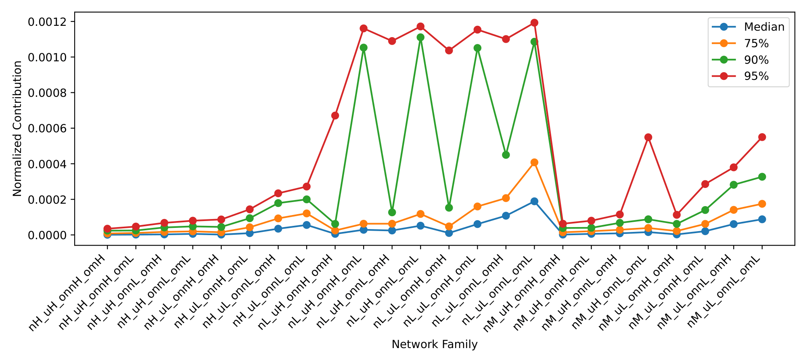
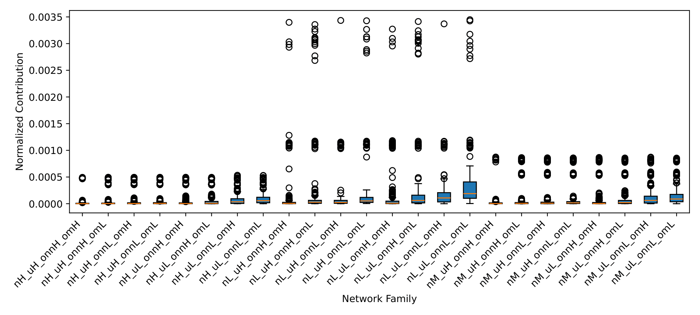
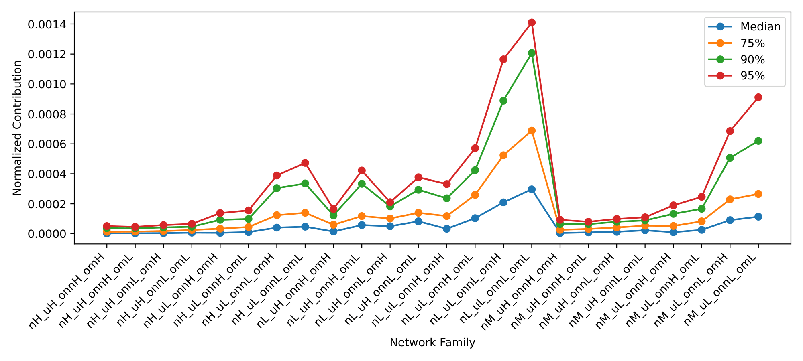
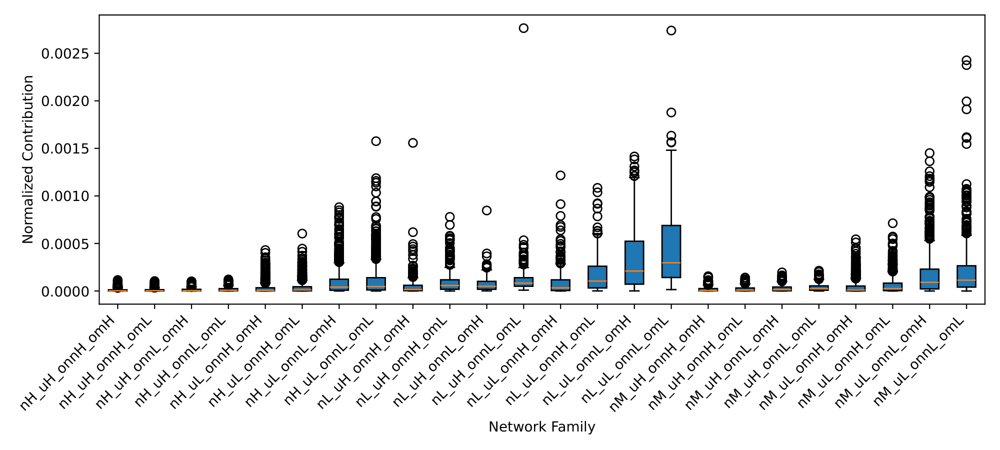

# Report 1 - Question: Does the relative contribution to data scatter provide a good hyperparameter for the definition of the stop rules under variations in the structure/architecture parameters of LFR synthetic networks?

---

## LFR Network Parameterization

- $\overline{d}$ = 20
- $d_{max}$ = 50
- $c_{min}$ = 20
- $c_{max}$ = 100
- $t1$ = -2
- $t2$ = -1
- $n$ (3 groups):
  - low (L): [100, 300] *[1000, 3000]
  - medium (M): [400, 600] *[4000, 6000]
  - high (H): [700, 900] *[7000, 9000]
- $\mu$ (2 groups) *3 groups:
  - low (L): [0.1, 0.4]
  - high (H): [0.5, 0.8]
- $o_{n}$/$n$ (2 groups) *3 groups:
  - low (L): [0.1, 0.3]
  - high (H): [0.4, 0.6]
- $o_{m}$ (2 groups) *3 groups:
  - low (L): [2, 5]
  - high (H): [6, 9]

## Network Families

| Network Family | $n$        | $\mu$      | $o_{n}$/$n$  | $o_{m}$  |
|----------------|------------|------------|--------------|----------|
| nL_uL_onnL_omL | [100, 300] | [0.1, 0.4] | [0.1, 0.3]   | [2, 5]   |
| nL_uL_onnL_omH | [100, 300] | [0.1, 0.4] | [0.1, 0.3]   | [6, 9]   |
| nL_uL_onnH_omL | [100, 300] | [0.1, 0.4] | [0.4, 0.6]   | [2, 5]   |
| nL_uL_onnH_omH | [100, 300] | [0.1, 0.4] | [0.4, 0.6]   | [6, 9]   |
| nL_uH_onnL_omL | [100, 300] | [0.5, 0.8] | [0.1, 0.3]   | [2, 5]   |
| nL_uH_onnL_omH | [100, 300] | [0.5, 0.8] | [0.1, 0.3]   | [6, 9]   |
| nL_uH_onnH_omL | [100, 300] | [0.5, 0.8] | [0.4, 0.6]   | [2, 5]   |
| nL_uH_onnH_omH | [100, 300] | [0.5, 0.8] | [0.4, 0.6]   | [6, 9]   |
| nM_uL_onnL_omL | [400, 600] | [0.1, 0.4] | [0.1, 0.3]   | [2, 5]   |
| nM_uL_onnL_omH | [400, 600] | [0.1, 0.4] | [0.1, 0.3]   | [6, 9]   |
| nM_uL_onnH_omL | [400, 600] | [0.1, 0.4] | [0.4, 0.6]   | [2, 5]   |
| nM_uL_onnH_omH | [400, 600] | [0.1, 0.4] | [0.4, 0.6]   | [6, 9]   |
| nM_uH_onnL_omL | [400, 600] | [0.5, 0.8] | [0.1, 0.3]   | [2, 5]   |
| nM_uH_onnL_omH | [400, 600] | [0.5, 0.8] | [0.1, 0.3]   | [6, 9]   |
| nM_uH_onnH_omL | [400, 600] | [0.5, 0.8] | [0.4, 0.6]   | [2, 5]   |
| nM_uH_onnH_omH | [400, 600] | [0.5, 0.8] | [0.4, 0.6]   | [6, 9]   |
| nH_uL_onnL_omL | [700, 900] | [0.1, 0.4] | [0.1, 0.3]   | [2, 5]   |
| nH_uL_onnL_omH | [700, 900] | [0.1, 0.4] | [0.1, 0.3]   | [6, 9]   |
| nH_uL_onnH_omL | [700, 900] | [0.1, 0.4] | [0.4, 0.6]   | [2, 5]   |
| nH_uL_onnH_omH | [700, 900] | [0.1, 0.4] | [0.4, 0.6]   | [6, 9]   |
| nH_uH_onnL_omL | [700, 900] | [0.5, 0.8] | [0.1, 0.3]   | [2, 5]   |
| nH_uH_onnL_omH | [700, 900] | [0.5, 0.8] | [0.1, 0.3]   | [6, 9]   |
| nH_uH_onnH_omL | [700, 900] | [0.5, 0.8] | [0.4, 0.6]   | [2, 5]   |
| nH_uH_onnH_omH | [700, 900] | [0.5, 0.8] | [0.4, 0.6]   | [6, 9]   |

## Networks for Each Network Family

- $\overline{d}$: fixed
- $d_{max}$: fixed
- $c_{min}$: fixed
- $c_{max}$: fixed
- $t1$: fixed
- $t2$: fixed
- $n$: step 200 *100
- $\mu$: step 0.3 *0.1
- $o_{n}$/$n$: step 0.2 *0.1
- $o_{m}$: step 3 *1
- Instances: 2 *10

---

## Experience 1

- Script 1:
  1. Execute FADDIS **without LAPIN** for each network in each network family until the desired $K$ clusters are extracted;
  2. Register the contributions in the order of extraction;
  3. Normalize the contributions by dividing by the "universe", i.e., the sum of all contributions from all networks in all families (values with 6 decimal places);
  4. Create a table with statistics (values with 6 decimal places);
  5. Create a line plot and a box plot (values with 4 decimal places);
  6. Create histograms for each network family (values with 4 decimal places).

### Statistics

| Network Family | #Networks | Mean     | Std      | Median   | 75%      | 90%      | 95%      | Min   | Max      |
|----------------|-----------|----------|----------|----------|----------|----------|----------|-------|----------|
| nH_uH_onnH_omH | 10        | 2.1e-05  | 8.4e-05  | 1e-06    | 8e-06    | 2.4e-05  | 3.5e-05  | 0.0   | 0.000494 |
| nH_uH_onnH_omL | 32        | 2.2e-05  | 8e-05    | 2e-06    | 1.1e-05  | 2.5e-05  | 4.7e-05  | 0.0   | 0.000496 |
| nH_uH_onnL_omH | 32        | 2.5e-05  | 7.8e-05  | 3e-06    | 1.7e-05  | 4.2e-05  | 6.8e-05  | 0.0   | 0.000495 |
| nH_uH_onnL_omL | 32        | 3e-05    | 8.6e-05  | 6e-06    | 2e-05    | 4.8e-05  | 8e-05    | 0.0   | 0.000495 |
| nH_uL_onnH_omH | 32        | 2.4e-05  | 7.3e-05  | 2e-06    | 1.5e-05  | 4.5e-05  | 8.7e-05  | 0.0   | 0.000496 |
| nH_uL_onnH_omL | 32        | 4e-05    | 8.3e-05  | 1e-05    | 4.3e-05  | 9.4e-05  | 0.000144 | 0.0   | 0.000495 |
| nH_uL_onnL_omH | 32        | 6.8e-05  | 9.1e-05  | 3.5e-05  | 9.3e-05  | 0.000179 | 0.000234 | 0.0   | 0.000534 |
| nH_uL_onnL_omL | 32        | 8.5e-05  | 9.7e-05  | 5.6e-05  | 0.000121 | 0.0002   | 0.000272 | 0.0   | 0.00053  |
| nL_uH_onnH_omH | 20        | 9.2e-05  | 0.000373 | 6e-06    | 2.5e-05  | 6.2e-05  | 0.000671 | 0.0   | 0.003398 |
| nL_uH_onnH_omL | 28        | 0.000241 | 0.000671 | 2.9e-05  | 6.3e-05  | 0.001053 | 0.001161 | 0.0   | 0.003357 |
| nL_uH_onnL_omH | 16        | 0.000127 | 0.000359 | 2.5e-05  | 6.3e-05  | 0.000127 | 0.00109  | 0.0   | 0.003434 |
| nL_uH_onnL_omL | 24        | 0.000315 | 0.000709 | 5.2e-05  | 0.000118 | 0.001111 | 0.001172 | 3e-06 | 0.003428 |
| nL_uL_onnH_omH | 20        | 0.000111 | 0.00038  | 1.1e-05  | 4.8e-05  | 0.000153 | 0.001037 | 0.0   | 0.003272 |
| nL_uL_onnH_omL | 28        | 0.000283 | 0.000668 | 6.1e-05  | 0.00016  | 0.001051 | 0.001154 | 0.0   | 0.003414 |
| nL_uL_onnL_omH | 16        | 0.00021  | 0.000355 | 0.000108 | 0.000207 | 0.00045  | 0.001101 | 0.0   | 0.00337  |
| nL_uL_onnL_omL | 24        | 0.000439 | 0.000675 | 0.000189 | 0.000408 | 0.001086 | 0.001193 | 3e-06 | 0.003448 |
| nM_uH_onnH_omH | 10        | 3.9e-05  | 0.000154 | 2e-06    | 1.5e-05  | 3.9e-05  | 6.3e-05  | 0.0   | 0.000875 |
| nM_uH_onnH_omL | 32        | 4.4e-05  | 0.000149 | 6e-06    | 2.1e-05  | 4e-05    | 8e-05    | 0.0   | 0.000864 |
| nM_uH_onnL_omH | 32        | 5e-05    | 0.000148 | 9e-06    | 2.9e-05  | 6.8e-05  | 0.000115 | 0.0   | 0.00086  |
| nM_uH_onnL_omL | 32        | 6.7e-05  | 0.000172 | 1.6e-05  | 3.9e-05  | 8.8e-05  | 0.000549 | 0.0   | 0.000858 |
| nM_uL_onnH_omH | 32        | 3.9e-05  | 0.000127 | 3e-06    | 2.2e-05  | 6.2e-05  | 0.000113 | 0.0   | 0.000867 |
| nM_uL_onnH_omL | 32        | 7e-05    | 0.000152 | 2.1e-05  | 6.2e-05  | 0.00014  | 0.000286 | 0.0   | 0.000857 |
| nM_uL_onnL_omH | 32        | 0.000114 | 0.000158 | 6.1e-05  | 0.000141 | 0.000282 | 0.00038  | 0.0   | 0.000873 |
| nM_uL_onnL_omL | 32        | 0.000143 | 0.000173 | 8.8e-05  | 0.000175 | 0.000327 | 0.00055  | 0.0   | 0.000855 |

- #Total Networks: 644 (322 different parametrization)

### Line plot

### Box plot

### Histograms

[Open Folder](../results/results_2026-03-09_15-03-15-298590)

### Thresholds

| Network Family | Threshold (75%) | Threshold (90%) | Threshold (95%) | Threshold (Median) |
|----------------|-----------------|-----------------|-----------------|--------------------|
| nH_uH_onnH_omH | 8e-06           | 2.4e-05         | 3.5e-05         | 1e-06              |
| nH_uH_onnH_omL | 1.1e-05         | 2.5e-05         | 4.7e-05         | 2e-06              |
| nH_uH_onnL_omH | 1.7e-05         | 4.2e-05         | 6.8e-05         | 3e-06              |
| nH_uH_onnL_omL | 2e-05           | 4.8e-05         | 8e-05           | 6e-06              |
| nH_uL_onnH_omH | 1.5e-05         | 4.5e-05         | 8.7e-05         | 2e-06              |
| nH_uL_onnH_omL | 4.3e-05         | 9.4e-05         | 0.000144        | 1e-05              |
| nH_uL_onnL_omH | 9.3e-05         | 0.000179        | 0.000234        | 3.5e-05            |
| nH_uL_onnL_omL | 0.000121        | 0.0002          | 0.000272        | 5.6e-05            |
| nL_uH_onnH_omH | 2.5e-05         | 6.2e-05         | 0.000671        | 6e-06              |
| nL_uH_onnH_omL | 6.3e-05         | 0.001053        | 0.001161        | 2.9e-05            |
| nL_uH_onnL_omH | 6.3e-05         | 0.000127        | 0.00109         | 2.5e-05            |
| nL_uH_onnL_omL | 0.000118        | 0.001111        | 0.001172        | 5.2e-05            |
| nL_uL_onnH_omH | 4.8e-05         | 0.000153        | 0.001037        | 1.1e-05            |
| nL_uL_onnH_omL | 0.00016         | 0.001051        | 0.001154        | 6.1e-05            |
| nL_uL_onnL_omH | 0.000207        | 0.00045         | 0.001101        | 0.000108           |
| nL_uL_onnL_omL | 0.000408        | 0.001086        | 0.001193        | 0.000189           |
| nM_uH_onnH_omH | 1.5e-05         | 3.9e-05         | 6.3e-05         | 2e-06              |
| nM_uH_onnH_omL | 2.1e-05         | 4e-05           | 8e-05           | 6e-06              |
| nM_uH_onnL_omH | 2.9e-05         | 6.8e-05         | 0.000115        | 9e-06              |
| nM_uH_onnL_omL | 3.9e-05         | 8.8e-05         | 0.000549        | 1.6e-05            |
| nM_uL_onnH_omH | 2.2e-05         | 6.2e-05         | 0.000113        | 3e-06              |
| nM_uL_onnH_omL | 6.2e-05         | 0.00014         | 0.000286        | 2.1e-05            |
| nM_uL_onnL_omH | 0.000141        | 0.000282        | 0.00038         | 6.1e-05            |
| nM_uL_onnL_omL | 0.000175        | 0.000327        | 0.00055         | 8.8e-05            |

----

- Script 2:
  1. Execute FADDIS **without LAPIN** for each network in each network family for each threshold, using the threshold as `epsilon` (FADDIS's individual cluster contribution);
  2. Compute the extrinsic results ($K'$ | $K$, ONMI, Omega, $|K' - K|/K$);
  3. Create line plots for each network family (ONMI by threshold, Omega by threshold, $|K' - K|/K$ by threshold);
  4. Create a table with votes for the threshold that gives the best results, using the following rule:
     - ONMI (primary)
     - Omega (secondary)
     - $|K' - K|/K$ (tertiary)
     - Priority: [Median, 75%, 90%, 95%] (quaternary)
    
## Line Plots

[Open Folder](../results/results_2026-03-09_19-59-08-717240)

## Thresholds Votes

| Threshold Metric | Votes |
|------------------|-------|
| Median           | 215   |
| 75%              | 95    |
| 90%              | 178   |
| 95%              | 156   |

---

## Experience 2

- Script 1:
  1. Execute FADDIS **with LAPIN** for each network in each network family until the desired $K$ clusters are extracted;
  2. Register the contributions in the order of extraction;
  3. Normalize the contributions by dividing by the "universe", i.e., the sum of all contributions from all networks in all families (values with 6 decimal places);
  4. Create a table with statistics (values with 6 decimal places);
  5. Create a line plot and a box plot (values with 4 decimal places);
  6. Create histograms for each network family (values with 4 decimal places).

### Statistics

| Network Family | #Networks | Mean     | Std      | Median   | 75%      | 90%      | 95%      | Min     | Max      |
|----------------|-----------|----------|----------|----------|----------|----------|----------|---------|----------|
| nH_uH_onnH_omH | 10        | 1.1e-05  | 1.9e-05  | 2e-06    | 1.3e-05  | 3.7e-05  | 5.1e-05  | 0.0     | 0.000116 |
| nH_uH_onnH_omL | 32        | 1.1e-05  | 1.6e-05  | 3e-06    | 1.4e-05  | 3.6e-05  | 4.6e-05  | 0.0     | 0.000105 |
| nH_uH_onnL_omH | 32        | 1.3e-05  | 1.9e-05  | 4e-06    | 1.8e-05  | 4.2e-05  | 5.8e-05  | 0.0     | 0.000102 |
| nH_uH_onnL_omL | 32        | 1.7e-05  | 2.2e-05  | 7e-06    | 2.5e-05  | 4.7e-05  | 6.6e-05  | 0.0     | 0.000122 |
| nH_uL_onnH_omH | 32        | 3e-05    | 5.6e-05  | 6e-06    | 3.4e-05  | 9.3e-05  | 0.000138 | 0.0     | 0.000431 |
| nH_uL_onnH_omL | 32        | 3.6e-05  | 6.1e-05  | 1.1e-05  | 4.5e-05  | 9.9e-05  | 0.000156 | 0.0     | 0.000604 |
| nH_uL_onnL_omH | 32        | 0.0001   | 0.000143 | 4.1e-05  | 0.000124 | 0.000305 | 0.000389 | 0.0     | 0.000882 |
| nH_uL_onnL_omL | 32        | 0.000118 | 0.000183 | 4.7e-05  | 0.00014  | 0.000336 | 0.000473 | 0.0     | 0.001576 |
| nL_uH_onnH_omH | 20        | 4.9e-05  | 0.000104 | 1.5e-05  | 6e-05    | 0.000123 | 0.000165 | 0.0     | 0.001558 |
| nL_uH_onnH_omL | 28        | 0.000106 | 0.000136 | 5.8e-05  | 0.000118 | 0.000334 | 0.000422 | 0.0     | 0.00078  |
| nL_uH_onnL_omH | 16        | 7.4e-05  | 8.8e-05  | 5e-05    | 0.000102 | 0.000183 | 0.000211 | 1e-06   | 0.000847 |
| nL_uH_onnL_omL | 24        | 0.000133 | 0.000233 | 8.3e-05  | 0.00014  | 0.000294 | 0.000377 | 9e-06   | 0.002765 |
| nL_uL_onnH_omH | 20        | 8.6e-05  | 0.000136 | 3.3e-05  | 0.000118 | 0.000237 | 0.000332 | 0.0     | 0.001216 |
| nL_uL_onnH_omL | 28        | 0.000178 | 0.000197 | 0.000104 | 0.00026  | 0.000424 | 0.000571 | 1e-06   | 0.001085 |
| nL_uL_onnL_omH | 16        | 0.000339 | 0.000349 | 0.00021  | 0.000524 | 0.000888 | 0.001165 | 1e-06   | 0.001415 |
| nL_uL_onnL_omL | 24        | 0.000481 | 0.000459 | 0.000297 | 0.000689 | 0.001207 | 0.00141  | 1.5e-05 | 0.00274  |
| nM_uH_onnH_omH | 10        | 2e-05    | 3.1e-05  | 5e-06    | 2.6e-05  | 6.5e-05  | 9.3e-05  | 0.0     | 0.000156 |
| nM_uH_onnH_omL | 32        | 2.2e-05  | 2.7e-05  | 9e-06    | 3.2e-05  | 6.4e-05  | 8e-05    | 0.0     | 0.000142 |
| nM_uH_onnL_omH | 32        | 2.8e-05  | 3.5e-05  | 1.3e-05  | 4.2e-05  | 8e-05    | 9.9e-05  | 0.0     | 0.000196 |
| nM_uH_onnL_omL | 32        | 3.6e-05  | 3.7e-05  | 2.3e-05  | 5.4e-05  | 8.9e-05  | 0.00011  | 0.0     | 0.000214 |
| nM_uL_onnH_omH | 32        | 4.3e-05  | 7.3e-05  | 1e-05    | 5.2e-05  | 0.000133 | 0.00019  | 0.0     | 0.000544 |
| nM_uL_onnH_omL | 32        | 6.3e-05  | 9.3e-05  | 2.6e-05  | 8.3e-05  | 0.000167 | 0.000247 | 0.0     | 0.000713 |
| nM_uL_onnL_omH | 32        | 0.000179 | 0.000235 | 9.1e-05  | 0.00023  | 0.000507 | 0.000686 | 0.0     | 0.001451 |
| nM_uL_onnL_omL | 32        | 0.000229 | 0.000323 | 0.000114 | 0.000266 | 0.00062  | 0.000911 | 0.0     | 0.002427 |

### Line plot

### Box plot

### Histograms

[Open Folder](../results/results_2026-03-10_20-46-26-413383)

### Thresholds

| Network Family | Threshold (75%) | Threshold (90%) | Threshold (95%) | Threshold (Median) |
|----------------|-----------------|-----------------|-----------------|--------------------|
| nH_uH_onnH_omH | 1.3e-05         | 3.7e-05         | 5.1e-05         | 2e-06              |
| nH_uH_onnH_omL | 1.4e-05         | 3.6e-05         | 4.6e-05         | 3e-06              |
| nH_uH_onnL_omH | 1.8e-05         | 4.2e-05         | 5.8e-05         | 4e-06              |
| nH_uH_onnL_omL | 2.5e-05         | 4.7e-05         | 6.6e-05         | 7e-06              |
| nH_uL_onnH_omH | 3.4e-05         | 9.3e-05         | 0.000138        | 6e-06              |
| nH_uL_onnH_omL | 4.5e-05         | 9.9e-05         | 0.000156        | 1.1e-05            |
| nH_uL_onnL_omH | 0.000124        | 0.000305        | 0.000389        | 4.1e-05            |
| nH_uL_onnL_omL | 0.00014         | 0.000336        | 0.000473        | 4.7e-05            |
| nL_uH_onnH_omH | 6e-05           | 0.000123        | 0.000165        | 1.5e-05            |
| nL_uH_onnH_omL | 0.000118        | 0.000334        | 0.000422        | 5.8e-05            |
| nL_uH_onnL_omH | 0.000102        | 0.000183        | 0.000211        | 5e-05              |
| nL_uH_onnL_omL | 0.00014         | 0.000294        | 0.000377        | 8.3e-05            |
| nL_uL_onnH_omH | 0.000118        | 0.000237        | 0.000332        | 3.3e-05            |
| nL_uL_onnH_omL | 0.00026         | 0.000424        | 0.000571        | 0.000104           |
| nL_uL_onnL_omH | 0.000524        | 0.000888        | 0.001165        | 0.00021            |
| nL_uL_onnL_omL | 0.000689        | 0.001207        | 0.00141         | 0.000297           |
| nM_uH_onnH_omH | 2.6e-05         | 6.5e-05         | 9.3e-05         | 5e-06              |
| nM_uH_onnH_omL | 3.2e-05         | 6.4e-05         | 8e-05           | 9e-06              |
| nM_uH_onnL_omH | 4.2e-05         | 8e-05           | 9.9e-05         | 1.3e-05            |
| nM_uH_onnL_omL | 5.4e-05         | 8.9e-05         | 0.00011         | 2.3e-05            |
| nM_uL_onnH_omH | 5.2e-05         | 0.000133        | 0.00019         | 1e-05              |
| nM_uL_onnH_omL | 8.3e-05         | 0.000167        | 0.000247        | 2.6e-05            |
| nM_uL_onnL_omH | 0.00023         | 0.000507        | 0.000686        | 9.1e-05            |
| nM_uL_onnL_omL | 0.000266        | 0.00062         | 0.000911        | 0.000114           |

----

- Script 2:
 TODO
